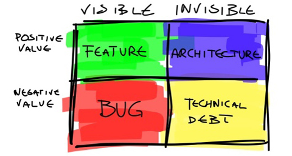

# Einleitung

**Autor:** Max Mustermann

Nach dem Lesen des Kapitels sollten Sie

* unterschiedliche _Arten_ von Software kennen
* verstehen, warum Software schwer zu entwickeln ist
* erklären können, warum Softwaretechnik notwendig ist
* verstehen, dass zur Softwareentwicklung mehr gehört als die reine Programmierung
* wissen, welchen Eigenschaften Software-Projekte besitzen
* erkennen, welche Kompetenzen ein Software-Ingenieur besitzen sollte

## Software

Software (manchmal auch als Programm, Programmcode, Source-Code oder Quellcode bezeichnet) 
besitzt etliche **Eigenschaften**. Weil man Software nicht wie Hardware anfassen kann, ist Software immateriell und kann beliebig geändert, erweitert und kopiert werden.
Wird Software programmiert, ist der Entwicklungsfortschritt nicht objektiv messbar und Fehler in der Software können nicht direkt erkannt werden.
Anders als materielle Produkte verschleißt Software nicht. 
Obwohl Software nicht verschleißt, altert Software jedoch, da 
die Umgebung, in der die Software eingesetzt wird, sich ständig ändert. 
Daher muss Software ausgetauscht, angepasst oder erneuert werden, wenn die Technologie 
veraltet ist oder es Änderungen im Einsatzgebiet gibt.

Software kann wie folgt klassifiziert werden:

* Standardsoftware (anpassbare und konfigurierbare Software, z.B. SAP)
* Individualsoftware
    * Speziell für einen Kunden bzw. Auftraggeber entwickelte Software
    * Exakt auf die Bedürfnisse des Kunden zugeschneidertes Produkt
    * Relativ zeitaufwändig und teure Entwicklung
    * Typisches Beispiel: Software zur Unterstützung spezieller Geschäftsprozesse

Folgende **Arten** von Software existieren:

* Systemsoftware (z.B. Betriebssystem, Treiber) als Schnittstelle zur Hardware
* Anwendungssoftware (z.B. Büroanwendungen, Office)
* Eingebettete Systemsoftware (Steuerungssoftware für Geräte wir Drucker oder Monitor)
* Echtzeitsysteme (z.B. Kraftwerksteuerung, Flugüberwachung oder Ampelanlagen)
* Informationssysteme (datenbankgestützte Verwaltung von Informationen, oft auch webbasiert)

Diese Arten von Software werden auf unterschiedlicher Hardware verteilt:

* Client
  * Mobile Endgeräte wie Smartphones oder Tablets
  * Desktop Computer
* Server
  * Cloud
  * Hosting 
* (Eingebettete) Kleinstcomputer 

Im Umfeld von Software gibt es verschiedene Beteiligte.
Software wird von *Benutzern* bedient. 
*Informatiker* (oft auch als Programmierer, Softwareentwickler, Entwickler
oder Software-Ingenieur bezeichnet) erstellen Software für einen
*Auftraggeber* (oft als Kunde bezeichnet). Daher
gibt es verschiedene **Sichten** auf Software, denn je nach Perspektive
der Beteiligten kann Software als *Softwaresystem* oder als *Softwareprodukt*
wahrgenommen werden.

* **Softwaresystem**:
  Die *innere* Sicht des Informatikers nimmt Software als Softwaresystem wahr.
* **Softwareprodukt**: Die *äußere* Sicht eines Auftraggeber nimmt ein Softwaresystem als Softwareprodukt wahr. 

Solange ein Softwaresystem ohne Probleme läuft, bleiben dem Auftraggeber und den Benutzern
interne Eigenschaften eines Softwaresystems verborgen.

Softwaresysteme bzw. Softwareprodukte umfassen mehr als nur Programmcode, der in einer
Programmiersprache geschrieben wird.
Zu Softwaresystemen bzw. Softwareprodukten
gehören unter anderem auch:

* Datenbankskripte
* Buildskripte
* Deploymentskripte
* Testcode
* Testdaten
* Softwareprototyp
* Dokumentation
  * Bedienungshandbücher
  * Technische Dokumentation
  * Projektdokumentation

> Software besteht aus Programmen, Daten und Dokumentationen, die es zusammen erlauben, mit Hilfe eines Computers Aufgaben zu erledigen.

## Software-Projekte

Software wird durch die Durchführung eines **Software-Projekts** erstellt. 
Ein Projekt ist ein Vorhaben, das durch die Einmaligkeit von bestimmten 
Bedingungen gekennzeichnet ist. Zu diesen Bedingungen gehören die 
Zielvorgabe sowie zeitliche, finanzielle und personelle Begrenzungen.

Die Aufgabenverteilung im Projekt wird durch ein
**Vorgehensmodell** festgelegt, in dem **Phasen** ausgeführt werden.
Einige Beispiele für mögliche Phasenmodelle in einem Softwareprojekt:

Diese Phasen werden von Personen ausgeführt, die in bestimmten **Rollen** agieren.
Eine Rolle 

  * beschreibt eine Menge von zusammengehörigen Aufgaben und
Befugnissen (oft auch notwendige Qualifikationen), die von Personen
wahrgenommen wird.
  * dient der Kooperation zwischen den beteiligten Personen durch Verständnis für die Aufgaben.
  * wird von einer oder mehreren Personen wahrgenommen, wobei eine Person mehrere Rollen einnehmen kann. 

In einem Softwareprojekt gibt es
unterschiedliche Beteiligte, die in folgenden typischen Rollen tätig werden:

| Rolle | Aufgabe |
|:------:|:----------:|
| **Auftraggeber** | Erteilt den Auftrag und bezahlt das Projekt |
| **Auftragnehmer** | Nimmt die Anforderungen an das Softwareprodukt entgegen|
| **Benutzer** | Benutzen die Software. Manchmal mit Auftraggeber identisch |
| **Projektleiter** | Treffen während des Projekts organisatorische Entscheidungen |
| **Berater** | Unterstützen den Kunden in der Definition der Anforderungen |
| **Informatiker** | Definieren und entwickeln Software mit unterschiedlichen Aufgaben (Analytiker, Softwarearchitekt, Entwickler, DevOps-Engineer, Sicherheitsexperte, Tester) |

Je nach Art und
Größe des Projekts sind nicht alle Rollen sinnvoll und notwendig.

**Projektkosten**

Die wichtigsten **Kostenarten** während eines Softwareprojekts sind:

* Personalkosten (in der Regel der größte Posten)
* Kosten für Hardware bzw. Clouddienste
* Lizenzkosten für zugekaufte Software (z.B. Bibliothek oder Werkzeuge)
* Kosten für Auslagerungen bzw. Zukauf von Entwicklungsleistungen

Die maßgeblichen **Kostenfaktoren** eines Softwareprojektes sind:

* Typ des zu entwickelnden Systems (Größe, Umfang, Komplexität -> Quantitätsanforderung)
* Qualitätsanforderung (z.B. Performance oder Systemzuverlässigkeit)
* Produktivität der Mitarbeiter

Die **Kostenverteilung** auf die einzelnen Phasen der Softwareentwicklung ist abhängig vom benutzten Vorgehensmodell.
Während der Entwicklungsphase ist der Aufwand (und damit die Kosten), für das Testen der Software fast so hoch wie die Entwicklungskosten für Design, Implementierung und Test.
Nach der inititalen Entwicklung wird die Software gewartet.
In die Wartung fließt der größte Teil des Aufwands, so dass die Wartung der Software deutlich teurer als die Entwicklung ist.
 

> Die Mehrzahl der Softwareentwickler ist mit der Wartung der Software beschäftigt.

Fehler sind ein wichtiger Kostenfaktor bei der Softwareentwicklung. 

Fehler entstehen aus oft in den frühen Phasen des Software-Lebenszyklus, also während der Analyse, des Entwurfs und der Implementierung. 
Die Fehlererkennung erfolgt zu einem großen Teil erst im hinteren Teil des Lebenszyklus, überwiegend während der Testphase oder auch erst in der Produktivumgebung.
Die Gefahr, einen Fehler lange während der Entwicklung mitzuschleppen und damit hohen Aufwand und hohe Kosten zu generieren, ist daher relativ groß.

Wie stark sich ein Fehler als zusätzlicher Aufwand bemerkbar macht, hängt maßgeblich davon ab, zu welchem Zeitpunkt er entdeckt und behoben wird.
Wird der Fehler früh erkannt, kann einfach die Spezifikation angepasst werden. Tritt er erst im Produktiveinsatz (=Feldeinsatz) auf oder wird erst dort bemerkt, stehen im schlimmsten Fall komplette Systeme still. Daher ist
es sinnvoll, einen Fehler zu früh wie möglich zu finden.

> Je später ein Fehler entdeckt wird, desto teurer ist die Beseitigung des Fehlers.

**Projekteigenschaften**

Große und kleine Softwareprojekte unterscheiden sich nicht nur in ihrem Umfang,
sondern auch in Ihrer Komplexität.
Die Herstellung großer Softwaresysteme mit Millionen von Zeilen Programmcode unterscheidet sich nicht nur quantitativ, sondern auch qualitativ von der Herstellung kleiner Softwaresysteme.

Während der Entwicklung von Software treten viele Probleme auf, insbesondere
dann, wenn bei der Entwicklung der Software mehrere Beteiligte involviert
sind und wenn die Software in mehreren Versionen vorliegt. Je größer
das Projekt, desto größer die Probleme.

Folgende Problematiken können beobachtet werden:

**Menschliche Aspekte:**
Viele Menschen können sich schlechter abstimmen als wenige. Wo bei einem "kleinen" Projekt meistens eine Person alle Rollen übernimmt, stehen bei einem "großen" Projekt viele verschiedene Interessen gegenüber. Die größten Probleme gibt es hier bei der Kommunikation. Je größer das Projekt, desto mehr Personen sind am Projekt beteiligt, so dass sich die Kommunikation unter vielen beteiligten Personen als schwierig gestaltet.

**Technische Aspekte:**
Bei großen Projekten liegt eine höhere Komplexität vor als bei kleinen Projekten. Die Wahrscheinlichkeit für die Korrektheit eines Systems von vielen Softwarebausteinen ist wesentlich kleiner als die Wahrscheinlichkeit für die Korrektheit einzelner Softwarebausteine. Die Komplexität großer Softwaresysteme übersteigt die von einem Entwickler zu einem Zeitpunkt zu beherrschende Komplexität, so dass von einzelnen Personen nicht die gesamte technische Sachlage, sondern nur einzelne Aspekte beurteilt werden kann. Neben der Komplexität ist auch die Langlebigkeit und Versionierung großer Softwaresysteme problematisch.

Was entscheidet über den Erfolg und Misserfolg eines Projektes?

**Ursachen für Misserfolge**

In Umfragen und Studien wird jährlich dokumentiert, dass die untersuchten
Softwareprojekte 

- zu ca. 20% ohne verwertbares Ergebnis abgebrochen werden
- zu ca. 50% mit Kosten- und/oder Zeitüberschreitung beendet werden
- zu ca. 30% erfolgreich abgewickelt werden

Die Gründe hierfür sind vielfältig. Beispielhaft 
werden einige Gründe aufgeführt:

* **Organisation und Methodik**
  * Unvollständige Anforderungen und deren häufige Änderung
  * Aufwändige Integration und Pflege von Software-Altsystemen
  * Qualitätsmängel bei extern vergebenen Aufgaben
  * Unvollständige oder schlecht definierte Anforderungen (unklare Zielvorstellung)
  * Unrealistische Zeit- und Kostenpläne 
  * Fehlendes oder schlechtes Projektmanagement
  * Fehlendes Management von Änderungen, Risiko, Finanzen
  * Zu wenig Ressourcen bzw. falsche Schätzung benötigter Ressourcen
  * Unklare Verantwortlichkeiten
  * Unrealistische oder unausgesprochene Projektziele
  * Kommerzieller Druck
  * Unvollständige Dokumentation
  * Projekt wird nicht mehr benötigt
  * Mangelnde Abstimmung mit Auftraggebern und Benutzern
  * Fehlende Kompetenzen der Teammitglieder
  * Nicht gemanagte Risiken
  * Unzureichende oder schlechte Kommunikation zwischen Kunden, Entwicklern und Benutzern
  * Anwender nicht involviert
  * Unfähigkeit, die Projekt- und Produktkomplexität in den Griff zu kriegen
  * Nachlässige Entwicklungspraktiken
  * "Politische" Gründe der Beteiligten
* **Technologie**
  * Verwendung unausgereifter Technologie
  * Vielzahl an anderen Dokumenten neben dem Source-Code
  * Schlechte oder fehlende Methoden und Werkzeuge
  * Schneller technologischer Wandel

Diese Probleme führen entweder zum Abbruch des Projektes oder zur "Rahmensprengung"
in den Bereichen Zeit, Qualität und Kosten. 

Software Engineering versucht, Lösungen für diese Problematiken zu finden.

## Software Engineering

Das Wissensgebiet *Software Engineering* ist ein Teilgebiet der "Praktischen Informatik" und ein Hilfsmittel, die soeben dargestellten Probleme bei der Softwareentwicklung nicht entstehen zu lassen, zu beseitigen oder zumindest abzumildern.

Softwaretechnik wird inbesondere unter diesen Voraussetzungen benötigt:

* mit der Entwicklung und Wartung des Softwaresystems ist mehr als eine Person beschäftigt 
* es existiert mehr als eine Version der Software

Software Engineering wendet ingenieurwissenschaftliche Prinzipien auf die Softwareentwicklung und versucht, die Gründe und Ursachen für Projekterfolge zu unterstützen.
Faktoren für den Erfolg eines Projektes sind.

* Anforderungen eindeutig analysieren
* Adäquate Kommunikation und Kollaboration der Beteiligten
* Kunden mit in das Projekt integrieren
* Realistische Erwartungen stellen und erreichbare Ziele vereinbaren 
* Kleinere und inkrementelle Meilensteine setzen
* Priorisieren: wenn alles wichtig ist, wird nichts geschafft
* Verantwortlichkeiten eindeutig verteilen
* Erst Fehler beheben, dann neue Features implementieren
* Softwarequalität durch (automatische) Tests erhöhen

Einige Definitionen für den Begriff *Software Engineering* lauten:

* "Software Engineering ist der strukturierte Einsatz von Methoden, Architekturen, Werkzeugen und Vorgehensmodellen zum Erstellen und Betreiben von Software mit dem Ziel, die Softwarekosten bei der Entwicklung, Wartung und Erweiterung von Softwaresystem zu senken und gleichzeitig eine hohe Qualität zu erreichen."
* "Unter Softwaretechnik (engl. Software Engineering) versteht man allgemein die (Ingenieur-) Wissenschaft, die die kosteneffiziente Entwicklung von qualitativ hochwertiger Software behandelt."
* "Softwaretechnik, Softwaretechnologie, Software-Engineering ist ein Teilgebiet der Informatik, das sich mit Methoden und Werkzeugen für das ingenieurmäßige Entwerfen, Herstellen und Implementieren von Software befasst." 
* "Zielorientierte Bereitstellung und systematische Verwendung von Prinzipien, Methoden und Werkzeugen für die arbeitsteilige, ingenieurmäßige Entwicklung und Anwendung von umfangreichen Softwaresystemen. Zielorientiert bedeutet die Berücksichtigung z. B. von Kosten, Zeit, Qualität."
* "Software Engineering ist die Anwendung eines systematischen und disziplinierten Ansatzes zur Entwicklung, zum Betrieb und zur Wartung von Software."
* "Softwaretechnik (Software engineering) ist die Ingenieursdisziplin, die sich 
mit der systematischen Erstellung und Wartung von Softwareprodukten 
unter ökonomischen Randbedingungen beschäftigt."

Die Blickwinkel dieser Definitionen liegen bei

* Wirtschaftlichkeit
  * Kosteneffizienz
* Qualität
* Langlebigkeit durch jahrelangen Einsatz und Wartung
* Softwareentwicklung als Ingenieursdisziplin
  * Entwicklung durch Teams mit Planung und Management von Projekten
  * Systematische und strukturierte Vorgehensweise
    * Analyse, Design, Implementierung, Test
  * Methoden und Werkzeuge zur zeiteffizienten Produktentwicklung 

Daraus folgt diese Definition:

> Software Engineering (auch Softwaretechnik oder Softwaretechnologie) ist die systematische Verwendung von Prinzipien, Methoden und Werkzeugen für die arbeitsteilige, ingenieurmäßige, strukturierte Entwicklung und kosten- und zeiteffiziente Bereitstellung und Betrieb von komplexen Softwaresystemen mit hoher Qualität.

Diese Definition umfasst folgende Aspekte:

* **Managementaspekt**: Kontrollierte Projektabwicklung (innerhalb der Aufwandsabschätzung und des Zeitplans)
* **Qualitätssicherungsaspekt**: Einhaltung der geforderten Qualitätsmerkmale hinsichtlich Stabilität, Performance, Verfügbarkeit etc.
* **Wartungsaspekt**: Sicherstellung der Wartbarkeit, Erweiterbarkeit, Wiederverwendbarkeit
* **Entwicklungsaspekt**: Schnelle und effiziente Entwicklung des Produkts (Produktivität der Mitarbeiter, geringe Fehlerquote)

Um die positiven Ziele zu erreichen, benutzt Software Engineering als Ingenieurdisziplin folgende Techniken:

* **Entwicklungsprozesse auf Basis von agilen Vorgehensmodellen:** Die Entwicklung basiert auf (agilen) Vorgehensmodellen, die einen allgemeinen Rahmen für den organisatorischen Prozess der Softwareerstellung definieren. Dadurch wird auf bewährte, systematische Vorgehensweisen zurückgegriffen. 
* **Werkzeuge:** Es werden Softwarewerkzeuge zur Automatisierung und Beherrschung der Komplexität eingesetzt. 
* **Methoden (Modellierungssprachen):** Die Qualität und die Sicherheit des zu entwickelnden Softwareprodukts wird in den Mittelpunkt gestellt, um Kundenzufriedenheit zu erzielen, die Sicherheit bei der Anwendung des Produktes zu gewährleisten und Stabilität/Verfügbarkeit zu erreichen.
* **Architekturen:** Durch die Verwendung von bewährten Mustern und Architekturen, wird die Wiederverwendung erleichtert, so dass die Softwareprodukte kosten- und zeiteffizient geliefert werden können.

Durch Software Engineering und die Verwendung von Methoden, Werkzeugen und Vorgehensmodellen werden die Kosten, die bei der Entwicklung, Wartung und Erweiterung anfallen, reduziert bei der Erhaltung von hoher Qualität.

Das folgende Diagramm stellt die Inhalte von Softwaretechnik dar. Die sichtbaren Elemente
stellt die Perspektive eines Benutzers dar, der ein Software-Produkt anwendet, während
die unsichtbaren Teile nur für einen Informatiker als Entwickler eines Software-Systems sichtbar sind.

* **Sichtbarer positiver Wert**: Funktionalität (Feature)
* **Sichtbarer negativer Wert**: Fehler (Bug) 
* **Unsichtbarer positiver Wert**: Wartbare Softwarearchitektur 
* **Unsichtbarer negativer Wert**: Technische Schulden. Ein Software-System, dessen Architektur erodiert ist, lässt sich nicht mehr gut warten und erweitern und enthält demnach hohe technische Schulden. 

## Software-Ingenieur

Neben der reinen Programmierung gehören zur Entwicklung anspruchsvoller und komplexer Software eine ganze Reihe begleitender Tätigkeiten, die zum Aufgabenbereich eines Software-Ingenieurs gehören.

Ein Software-Ingenieur 

* zeichnet sich durch einen strukturierten Prozess sowie systematisches Vorgehen aus.
* plant und entwirft Softwaresysteme (Erstellung von "Software-Baupläne" (Architektur))
* klärt im Detail die jeweiligen Anforderungen (das so genannte Requirements Engineering)
* stimmt Arbeitsaufgaben in Teams ab: größere Softwaresysteme werden vielen unterschiedlichen Personen bearbeitet, so dass viele Sachverhalte abgestimmt werden müssen.
* prüft und testet die entwickelte Software (z.B. hinsichtlich Sicherheit)
* berät Kunden als IT-Berater
* leitet (Teil)Projekte

Bei der Durchführung dieser Tätigkeiten arbeitet ein Software-Ingenieur 

* in einem Softwarehaus
* bei einem Beratungsunternehmen
* in der IT-Abteilung eines Unternehmens

und muss daher viel, oft auf Englisch, kommunizieren:

* mit Kunden, um zu verstehen, was genau umgesetzt werden muss.
* mit anderen Informatikern: Da praktisch jedes ernsthafte Projekt für einen einzigen Entwickler zu groß ist, müssen Informatiker auch untereinander kommunizieren.

Der ideale Software-Ingenieur besitzt folgende Eigenschaften:

**Kommunikationsfähigkeit:** Die Gabe, sich anderen mitzuteilen und zuhören zu können. Man muss sich mündlich und schriftlich verständlich machen können, in Gesprächen, Diskussionen und Vorträgen im Kreise von Kollegen und Kunden. Kommunikation läuft nicht nur auf einer sachlichen Ebene ab. 

**Teamgeist, Integrationsfähigkeit, Anpassungsfähigkeit:** braucht man, um mit Kollegen und Kunden zusammenzuarbeiten, ohne die eigene Persönlichkeit aufzugeben.

**Begeisterungsfähigkeit, Engagement, Loyalität, Offenheit und Kritikfähigkeit:** Positive Einstellung zur Arbeit, zu Projekten und Kunden und zum Unternehmen. Keine unterwürfige Duckmäuser, sondern offene und konstruktive Kritik ist nicht nur erlaubt, sondern erwünscht. Versuchen, aus Fehlern zu lernen.

**Kreativität sowie logisches und abstraktes Denkvermögen:** Neben logisch-strukturellem und abstraktem Denken muss man auch mal assoziativ, sprunghaft, „unlogisch“ denken, damit neue Ideen und Lösungen entstehen.

**Nützlichkeitsstreben, Kundenorientiertung und Qualitätsbewusstsein:** Der Software-Ingenieur will etwas mit hoher Qualität entwickeln, das ein Anwender wirklich braucht. Die tolle technische Lösung allein reicht nicht, denn Kosten und Nutzen müssen in einem vernünftigen Verhältnis stehen. 

**Neugier und permanentes Selbststudium in Eigeninitiative:** Erkenntnisse bzw. technische Grundlagen der Informatik entwickeln sich stetig weiter. Das bedeutet, dass Informatiker ständig mit ihrer eigenen Weiterbildung beschäftigt sind. Das macht ungeheuer viel Spaß - benötigt auf der anderen Seite aber auch eine gehörige Motivation. Wenn sich jemand weiterbilden will, muss er lesen. Bücher, Blogs, Videos, Zeitschriften, Fachliteratur aller Art.

Daraus folgen diese Kompetenz-Bereiche für Soft skills:

* Individualkompetenz
  * Zuverlässigkeit, Verantwortungsbewusstsein, Disziplin, Leistungsbereitschaft, Anpassungsfähigkeit, Ausdauer, Selbstbewusstsein, Umgangsformen
* Methodenkompetenz
  * Persönlicher Werkzeugkasten an Techniken: Informationen beschaffen, strukturieren, darstellen, Ergebnisse richtig interpretieren, geeignet präsentieren, Anwendung von Problemlösungstechniken, das eigene Zeitmanagement
* Soziale Kompetenz
  * Erforderlich für die Interaktionen mit Anderen: Kommunikations-, Team-, Konflikt-, und Kritikfähigkeit, Toleranz, Durchsetzungs- und Einfühlungsvermögen

## Zusammenfassung

* Software Engineering ist eine Ingenieur-Disziplin, die sich mit allen Aspekten der Softwareentwicklung und Softwarewartung beschäftigt.
* Der Ingenieur-Charakter äußert sich dabei in systematischem Vorgehen, Denken in Bausteinen, Wiederverwendungsbewusstsein, Prozessstrukturierung und prozessbegleitendem Qualitätsbewusstsein.
* Ziel des Software Engineerings ist die Erreichung einer _hohen Softwarequalität_ und die _Minimierung der Softwarekosten_.
* Software Engineering ist mehr als Technik und befasst sich mit _Konzepten, Methoden und Werkzeugen_ für die professionelle Softwareentwicklung
* Die dabei zu berücksichtigen Aspekte sind 'Entwicklung', 'Qualitätssicherung', 'Management' und 'Wartung'.
* Softwareprodukte bestehen aus _Programmen und der Dokumentation_
* Software Ingenieure arbeiten in _Teams_ in Software Projekten methodisch und strukturiert und _kommunizieren_ mit Kunden und Teammitgliedern
* Software Entwickler sind weder Künstler noch Einzelkämpfer.
* Software Ingenieure beherrschen die Technik und lassen sich nicht von der Technik beherrschen
* Die Mehrzahl der Softwareentwickler ist mit Wartungsarbeiten beschäftigt, so dass die Kosten für die Wartung der Software teurer ist als für die Entwicklung
* Kosten variieren je nach Art des zu entwickelnden Softwaresystems, sowie nach den Anforderungen an die Systemattribute, wie Performance und Systemzuverlässigkeit
* Die Verteilung der Kosten ist abhängig vom verwendeten Vorgehensmodell

**Wiederholungsfragen**

1. Software
   * Was ist Software?
   * Welche Eigenschaften besitzt Sofware?
   * Welche Arten von Software existieren? (Systemsoftware, Anwendungssoftware etc.)
   * Was ist Auftragssoftware?
   * Was ist der Unterschied zwischen einem Softwaresystem vs. Softwareprodukt?
2. Softwareprojekte
   * Was ist ein Softwareprojekt?
   * Welche Kostenarten existieren in einem Softwareprojekt?
   * Welche Beteiligte existieren in Softwareprojekten? (Informatiker, Benutzer, Kunde, etc.)
   * Welche Rollen existieren aus Informatiksicht? (Projektleiter, Programmierer, Architekt, etc.)
   * Welche Gründe existieren für das Scheitern von Projekten?
   * Welche Gründe gibt es für den Erfolg von Projekten?
3. Software Engineering
   * Was ist Software Engineering? (Definitionen)
   * Was sind die Inhalte und Ziel des Software Engineerings? (Vorgehensmodelle, Methoden, Werkzeuge und Architekturen)
4. Software-Ingenieur
   * Was ist ein Software-Ingenieur?
   * Welche Eigenschaften besitzt ein idealer Software-Ingenieur (Kommunikationsfähigkeit, Neugier, etc.)

