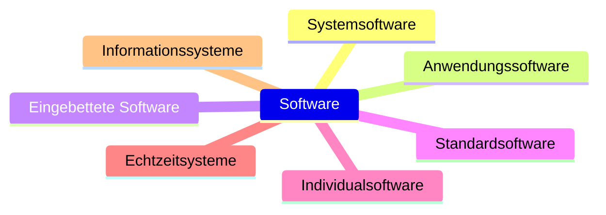
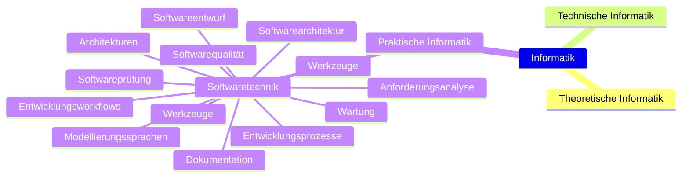

# Einleitung

**Autor:** Max Mustermann

Folgende Mindmaps zeigen die Inhalte des ersten Kapitels.

## Arten von Software

```mermaid
mindmap
  Software
    Systemsoftware
    Anwendungssoftware
    Eingebettete Software
    Standardsoftware
    Individualsoftware
    Echtzeitsysteme
    Informationssysteme
```

## Themengebiete der Softwaretechnik

```mermaid
mindmap
  Informatik
    Theoretische Informatik
    Technische Informatik
    Praktische Informatik
      Softwaretechnik
        Modellierungssprachen
        Entwicklungsprozesse
        Werkzeuge
        Architekturen
        Softwarequalität
        Wartung
        Anforderungsanalyse
        Softwareentwurf
        Softwarearchitektur
        Softwareprüfung
        Dokumentation
        Entwicklungsworkflows
        Werkzeuge
```
