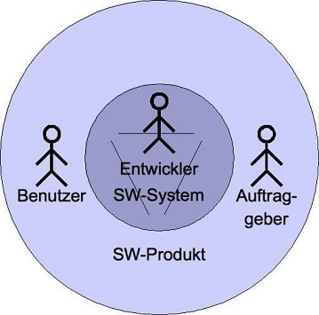

class: center, middle

## [Software Engineering](../../praesentationen.html)

#### Kapitel 1

# Einleitung

Max Mustermann

---
### Inhalte und Lernziele der Lehrveranstaltung

* Die Relevanz der Softwaretechnik kennen
* Die Kernthemen der Phasen im Softwareentwicklungszyklus beherrschen
* Architekturmuster und Entwurfsmuster anwenden können
* Workflows der DevOps-basierten Softwareentwicklung beherrschen
* Verfahren der Softwareprüfung und Sicherheit kennen
* Verteilte Softwaresysteme entwerfen können
* Unterschiedliche Vorgehensmodelle (insbesondere agile) und deren Phasen beschreiben und anwenden
* UML-Diagrammtypen modellieren können
* Qualitätsmerkmale von Software kennen und beschreiben können

---
### Lernziele des ersten Kapitels

* Verstehen, warum Software schwer zu entwickeln ist
* Erklären können, warum Softwaretechnik notwendig ist
* Verstehen, was Software ist
* Unterschiedliche Arten von Software kennen
* Notwendige Kompetenzen von Software-Ingenieuren kennen
* Verstehen, dass zur Softwareentwicklung mehr gehört als die reine Programmierung

---
class: center, middle

## Software

---
### Was ist Software?

* Programme, zugehörige Daten und Dokumentationen, die es zusammengefasst erlauben, mit Hilfe eines Computers Aufgaben zu erledigen.
* Software ist demnach ein umfassenderer Begriff als "Programm" oder "Code", weil alle Elemente inbegriffen sind, die für den Betrieb notwendig sind. z.B. Datenbankskripte, Dokumentation, Betriebshandbücher, Build-Skripte, Deployment-Skripte etc.

---
### Softwaresystem vs. Softwareprodukt

* Ein *Softwaresystem* ist ein System, dessen Bestandteile und Elemente aus Software bestehen ("innere" Sicht des Softwareentwicklers)
* Ein *Softwareprodukt* ist ein für einen Auftraggeber erstelltes Softwaresystem ("äußere" Sicht)

---
## Arten von Software

* Systemsoftware
  * Betriebssystem
* Anwendungssoftware
  * Büroanwendungen (Textverarbeitung etc.)
* Spiele
  * Minecraft, Fortnite
* Eingebettete Systeme
  * Steuerungssoftware für Geräte
* Echtzeitsysteme
  * Flugüberwachung, Kraftwerkssteuerung, etc.
* Informationssysteme
  * Datenbankgestützte Verwaltung von Information; oft webbasiert

#### Herkunft / Herstellung

* Standardsoftware
  * Anpassbare Software (z.B. SAP) für vorher nicht bekannte Kunden
* Individualsoftware
  * Speziell auf die Bedürfnisse eines Kunden/Auftraggeber entwickelte Software (daher zeitaufwändig und teure Entwicklung) zur Unterstützung spezieller Geschäftsprozesse 

---
## Eigenschaften von Software

* Software wird in Teams hergestellt und in mehreren Versionen ausgeliefert
* Software kann man nicht anfassen: Software ist immateriell
* Entwicklungsfortschritt ist daher nicht objektiv messbar
* Anders als materielle Produkte verschleißt Software nicht, altert aber dennoch, denn sowohl Anforderungen an die Software als auch die Umgebung, in der Software eingesetzt wird, ändern sich
* Software muss an diese Änderungen angepasst werden

---
class: center, middle

## Software Projekte

---
### Probleme in Software-Projekten

* Unvollständige, schlechte definierte, oft geänderte Anforderungen
* Unrealistische, unklare oder unausgesprochene Zielvorstellungen
* Hohe Komplexität und lange Lebensdauer dere Software
* Verwendung unausgereifter Technologie
* Schlechtes Projektmanagement
* Zu wenig Ressourcen bzw. falsche Schätzung benötigter Ressourcen
* Unrealistische Zeit- und Kostenpläne und nicht gemanagte Risiken
* Fehlende Planung und unklare Verantwortlichkeiten
* Unfähigkeit, die Projektkomplexität in den Griff zu kriegen
* Schlechte Kommunikation zwischen Kunden, Entwicklern und Benutzern und nicht eingebundene  Anwender
* "Politische" Gründe der Beteiligten
* Kommerzieller und zeitlicher Druck
* Qualitätsmängel bei extern vergebenen Aufgaben
* Schlechte Softwarequalität durch nachlässige Entwicklungspraktiken
* Unvollständige Dokumentation
* Vielzahl an anderen Dokumenten neben dem Source-Code
* Pflege von Altsystemen ist schwierig
* Softwaresyteme werden mit mehr als einer Person entwickelt und existieren in mehreren Versionen

#### Software Engineering sucht nach Lösungen

---
class: center, middle

## Software Engineering

---
## Ziele des Software Engineerings

Software Engineering (auch Softwaretechnik oder Softwaretechnologie) ist die systematische Verwendung von Prinzipien, Methoden und Werkzeugen für die arbeitsteilige, ingenieurmäßige, strukturierte Entwicklung und kosten- und zeiteffiziente Bereitstellung und Betrieb von komplexen Softwaresystemen mit hoher Qualität

* **Entwicklungsaspekt**
  * Schnelle und effiziente Entwicklung des Softwareprodukts durch Verwendung von Softwarewerkzeugen zur Automatisierung von wiederkehrenden Aufgaben
* **Qualitätssicherungsaspekt**
  * Stellt die Qualität in den Mittelpunkt (Kundenzufriedenheit, Sicherheit) und fordert die Einhaltung der geforderten Qualitätsmerkmale
* **Managementaspekt**
  * Strukturierte und kontrollierte Projektabwicklung basierend auf (agilen) Vorgehensmodellen
* **Wartungsaspekt**
  * Sicherstellung der Wartbarkeit, Erweiterbarkeit, Wiederverwendbarkeit und der Beherrschung der Komplexität durch Verwendung von Entwurfsprinzipien

---
### Themengebiete des Software Engineerings

mindmap
  Informatik
    Theoretische Informatik
    Technische Informatik
    Praktische Informatik
      Softwaretechnik
        Modellierungssprachen
        Entwicklungsprozesse
        Werkzeuge
        Architekturen

---
class: center, middle

## Software Ingenieure

---
## Rahmenbedingungen

* Den Programmierer, der auf der Basis seines einmal erworbenen Wissens
Anforderungen als Einzelkämpfer umsetzt, gibt es nicht.
* Softwareentwicklung ist eine Teamanstrengung.
* Software entsteht im Dialog mit dem Kunden, den Anwendern, den Kollegen, den Vorgesetzten, den Teammitgliedern.

#### Software Ingenieure

* können mehr als nur programmieren und sind demnach keine reinen Entwickler oder Programmierer von Software
* arbeiten in Software Projekten methodisch und strukturiert mit anderen Beteiligten zusammen, um Softwareprodukte effizient in Teamarbeit zu erstellen
* arbeiten in der IT-Abteilung eines Unternehmens in der Software-Entwicklung oder in einem IT-Beratungsunternehmen oder als (Teil)-Projektleiter 

---
### Kompetenzen von Software Ingenieuren

**Hard skills**

ist spezielles Fachwissen (z.B. Programmierung), das durch Studium oder Ausbildung vermittelt und objektiv sichtbar gemacht werden kann

**Soft skills**

sind "weiche" Fähigkeiten, also außerfachliche bzw. fachübergreifende "Schlüssel"-Kompetenzen, die schwieriger zu erlernen und zu überprüfen sind, wie z.B.

* Kommunikationsfähigkeit (communication skills)
* Zwischenmenschliche Kompetenzen (interpersonal skills)
* Analytische Fähigkeiten (analytical and problem-solving skills)
* Teamfähigkeit (team player)
* Organisationskompetenz (organizational skills)
* Lernfahigkeit (fast learner)
* Selbstständigkeit (ability to work independently)
* Kreativität (innovative and creative)
* Flexibilität (open and adaptable to changes) 

---
### Der idealtypische Software-Ingenieur

* ist motiviert, fleißig, freundlich, hilfsbereit, eigeninitiativ, neugierig, eigenständig, respektvoll und teamfähig
* besitzt logisches und abstraktes Denkvermögen
* setzt sich kreativ für eine Sache ein und ist offen für Veränderungen und lernt gerne eigenverantwortlich Neues kennen
* beherrscht die deutsche Rechtschreibung
* ist kommunikationsfähig und kommunikationswillig und kann komplizierte Sachverhalte komprimiert und verständlich darstellen

**Hinweise:**

* Diese Kompetenzen sind erlernbar bzw. willentlich beeinflussbar
* Niemand erwartet, dass Sie alles wissen oder perfekt beherrschen, denn Sie sind ja gerade hier, um dazu lernen.
* Haben Sie keine Angst, Fehler zu machen.
* Schauen Sie nicht so sehr auf die Noten, sondern versuchen Sie, die Sachverhalte zu verstehen und entwickeln Sie sich persönlich, menschlich, methodisch und organisatorisch weiter
* Lernen Sie keine Technologien, sondern Konzepte
* Finden Sie Ihr eigenes Tempo, indem Sie Sie auf Ihre eigene Fähigkeiten achten und nicht auf die Fähigkeiten Anderen
* In der IT-Branche ist ein lebenslanges Lernen erforderlich
* Studieren bedeutet: Lernen zu lernen.

---
## Zusammenfassung

* Softwareprodukte bestehen aus Programmen, Dokumentation und weiteren Artefakten
* Software Engineering ist eine Ingenieur-Disziplin, die sich mit allen Aspekten der Softwareentwicklung und Softwarewartung beschäftigt
* Ziel des Software Engineerings ist die Erreichung einer hohen Softwarequalität und die Minimierung der Kosten
* Software Engineering geht über die reine Programmierung hinaus und befasst sich mit Konzepten, Methoden und Werkzeugen für die professionelle Entwicklung von wartbarer Software
* Software Ingenieure arbeiten in Teams in Software Projekten methodisch und strukturiert und kommunizieren mit Kunden und Teammitgliedern

