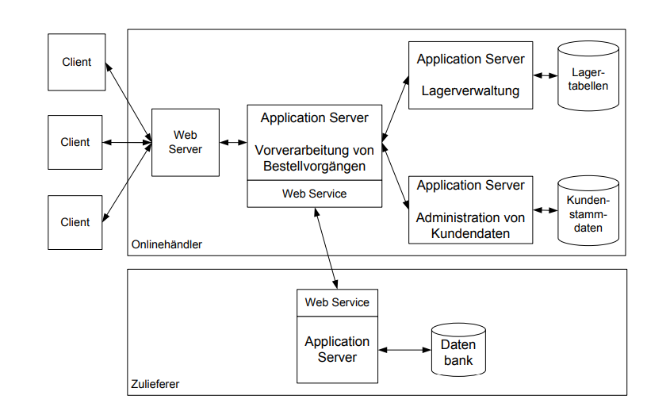
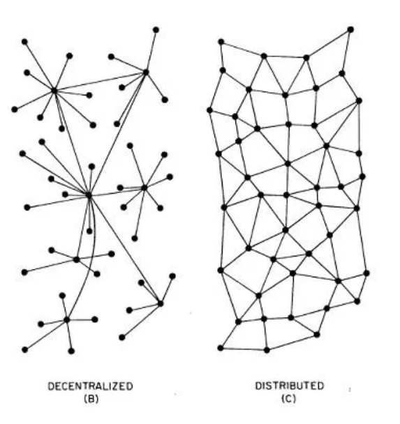
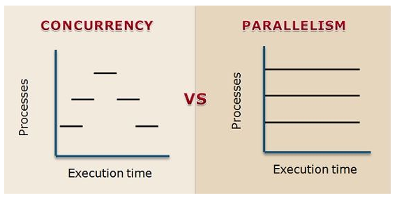

# Kapitel 2 (Verteilte Softwaresysteme, Systemarchitektur verteilter Softwaresysteme, Systemdesign)

**Autoren:** Bjarne Zaremba - Danny Meihöfer

# Lernziele für dieses Kapitel

Nach diesem Kapitel sollten Sie wissen, was...

- ...

# **Verteilte Softwaresysteme**

Abb. 1: Beispiel eines verteilten Systems im Überblick 

 **Beschreibung von Abb. 1:**

- Elektronische Handelsplattform steht dem Kunden als Webschnittstelle zur Verfügung
- Kunde führt Bestellungen, Recherche, etc. über das Internet durch
- Im Unternehmen werden diese Tätigkeiten über mehrere Server verteilt bearbeitet
- Webserver ist Zugangspunkt für den Kunden
- Webserver leitet Anfragen des Kunden an die geeigneten Application Server im Hintergrund weiter
- Auch die Kooperation mit anderen Unternehmen, z.B. eines Zulieferers, ist auch abgedeckt

## Verteilte Softwaresysteme
    
  >"Ein verteiltes System ist eine Sammlung aus Computerprogrammen, die Rechenressourcen über mehrere getrennte Rechenknoten hinweg nutzen, um ein gemeinsames Ziel zu erreichen. Es wird auch als verteiltes Computing oder verteilte Datenbanken bezeichnet und stützt sich auf separate Knoten, um über ein gemeinsames Netzwerk zu kommunizieren und zu synchronisieren. Diese Knoten sind typischerweise separate physische Hardwaregeräte, sie können aber auch separate Softwareprozesse oder andere rekursive gekapselte Systeme darstellen." (https://www.atlassian.com/de/microservices/microservices-architecture/distributed-architecture) [letzte Einsicht: 14. Oktober 2023]
    

## Eigenschaften

- Nutzung gemeinsamer Ressourcen
    - Ein verteiltes System kann Hardware, Software oder Daten gemeinsam nutzen
- Simultane Verarbeitung
    - Mehrere Rechner können dieselben Aufgaben parallel bearbeiten
- Skalierbarkeit
    - Ein verteiltes Softwaresystem kann beliebig in seiner Rechen- und Verarbeitungskapazität skaliert werden
    - Bei Bedarf kann ein verteiltes Softwaresystem sogar auf weitere Rechner ausgeweitet werden
- Transparenz
    - Ein Knoten kann auf andere Knoten im System zugreifen und mit diesen kommunizieren
    - Beispiel (s. Abb.1): Der Application Server des Unternehmens kann mit dem Application Servers des Zulieferers kommunizieren → Fehlende Materialien können einfach nachbestellt werden
- Heterogenität
    - Komponenten eines verteilten Systems können auf unterschiedlicher Hard- und Software laufen
        
        → Ermöglicht Integration verschiedener Technologien Plattformen (Beispiel: Nutzen von Linux und Windows möglich)
        

## Vorteile verteilter Softwaresysteme

- Verbesserung der Zuverlässigkeit und Leistung eines Systems
    - Engpässe und Zentrale Schwachstellen werden beseitigt
- Technologieoffenheit
    - Es können einfach mehrere Technologien und Betriebssysteme angebunden werden
- Redundanz
    - Wenn ein Knoten des Systems ausfällt, dann kann für diese Zeit ein anderer Knoten diese Aufgabe übernehmen
- Geografische Verteilung
    - Globale Verfügbarkeit und geringe Latenz durch Bereitstellung von Diensten in verschiedenen Regionen der Welt
- Bessere Skalierbarkeit
    - Ein verteiltes Softwaresystem kann problemlos an wachsende Anforderungen angepasst werden (indem z.B. mehr Server benutzt werden)
- Bessere Leistung
    - Die benötigte Rechenlast kann auf viele verschiedene Ressourcen aufgeteilt werden

## Nachteile verteilter Softwaresysteme

- Komplexität
    - Entwicklung und Wartung sind aufgrund der Verteilung deutlich komplexer
    - Bezug von Komponenten untereinander kann verloren gehen
- Einhaltung der Konsistenz von Daten
    - Die Aufrechterhaltung der Konsistenz von Daten in einem verteilten Softwaresystem kann sehr schwierig werden
    - Exkurs Konsistenz von Daten: “Als Konsistenz wird in Datenbanken die Korrektheit der dort gespeicherten Daten bezeichnet. Inkonsistente Datenbanken können zu schweren Fehlern führen, falls die darüberliegende Anwendungsschicht nicht damit rechnet” ([https://de.wikipedia.org/wiki/Konsistenz_(Datenspeicherung)](https://de.wikipedia.org/wiki/Konsistenz_(Datenspeicherung)) [letzte Einsicht: 13. Oktober 2023]
- Kommunikationsaufwand
    - Kommunikation zwischen den Komponenten über ein Netzwerk erzeugt Overhead (kann die Leistung beeinträchtigen
        
        → s. Abb1.: Jedes Mal, wenn ein Kunde nach einem Produkt sucht, muss die Anfrage über mehrere Server hinweg verarbeitet werden → Netzwerktraffic 
        

⇒ Die Vorteile überwiegen den Nachteilen

## Wieso benötigt man verteilte Softwaresysteme?

Viele Aufgaben lassen sich auf verteilten Softwaresystemen besser ausführen, als in zentralisierten Systemen. 

**Beispiel für ein verteiltes Softwaresystem: World Wide Web**

- Globale Skalierbarkeit
    - WWW hat Milliarden Benutzer
    - Es lassen sich einfach neue Server und Rechenzentren an verschiedenen globalen Standorten anschließen
- Ausfallsicherheit
    - Das WWW muss eine hohe Ausfallsicherheit bieten. Durch Verteilung wird dies ermöglicht.
- Lastenausgleich
    - Das WWW muss viele Millionen Anfragen parallel verarbeiten. Durch eine Verteilung auf viele verschiedenen Systeme wird die dort entstehende Last gut aufgeteilt

**Beispiel für ein zentralisiertes Softwaresystem: Kleines Büronetzwerk mit wenigen Benutzern**

- Einfachheit und Kosten
- Verwaltung und Wartung
- Geringe Komplexität

## Distributed vs. Decentralized

Abb. 2: Darstellung eines dezentralisierten- und verteilten Systems

### Decentralized (dt.: dezentralisiert):

- bestehen aus unabhängigen Knoten
- Knoten handeln autonom und erfordern keine zentrale Kontrolle
- Jeder Knoten ist gleichberechtigt
- Beispiel: Blockchain-Technologie

### Distributed (dt. verteilt):

- mehrere, miteinander verbundene Knoten, die untereinander kommunizieren, um eine bestimmte Aufgabe zu erfüllen
- Knoten können sich an verschiedene physischen Standorten befinden

### Unterschiede zwischen dezentralisierten- und verteilten Systemen

- Koordinierung
    - verteilte Systeme müssen zwischen einzelnen Knoten kommunizieren, während dezentralisierte Systeme dies in einem geringen Maß tun
- Unabhängigkeit
    - Bei dezentralisierten Systemen ist die Unabhängigkeit größer, während die Knoten in verteilten Systemen abhängig voneinander sind
- Skalierbarkeit
    - Beide Systeme sind skalierbar, aber die Art der Skalierbarkeit unterscheidet sich:
        - Verteilte Systeme können durch Hinzufügen weiterer Knoten erweitert werden
        - Dezentralisierte Systeme behalten die Autonomie der Knoten bei

---

## Concurrent vs. Parallel

Abb. 3: Unterschied zwischen Concurrency und Parallelism

### Concurrency(dt.: Gleichzeitigkeit):

- Fähigkeit eines Systems, mehrere Aufgaben gleichzeitig auszuführen
- Nur scheinbar gleichzeitig, denn das System wechselt eigentlich zwischen den Aufgaben

⇒ Aufgaben werden scheinbar gleichzeitig ausgeführt, der Prozessor wechselt aber zwischen den einzelnen Aufgaben und es scheint nur, als ob die Aufgaben gleichzeitig ausgeführt werden würden. 

### Parallelism (dt.: Parallelismus):

- Parallel bezieht sich auf die tatsächliche gleichzeitige Ausführung von Aufgaben in einem System
- In einem parallelen System arbeiten mehrere Aufgaben gleichzeitig und unabhängig voneinander
- erfordert bestimmte physische Ressourcen, wie mehrere Prozessoren oder Rechenkerne, die in der Lage sind mehrere Aufgaben gleichzeitig auszuführen
- Beispiel: Supercomputer, da diese aus einer großen Anzahl von Prozessoren bestehen, die Aufgaben gleichzeitig ausführen können

### Unterschied zwischen gleichzeitigen- und parallelen Systemen

- Ressourcen
    - Gleichzeitige Verarbeitung (concurrent) kann auf einem Prozessor betrieben werden, während parallele Verarbeitung (parallel) zwingend mehrere Prozessoren/Kerne benötigt
- Effizienz und Leistung
    - Parallel Verarbeitung bietet höhere Leistungen und Geschwindigkeiten, während gleichzeitige Verarbeitung effizienter für Anwendungen mit vielen Benutzern ist

## Referenzen

- [https://www.atlassian.com/de/microservices/microservices-architecture/distributed-architecture](https://www.atlassian.com/de/microservices/microservices-architecture/distributed-architecture) [letzte Einsicht: 13. Oktober 2023]
- Schill, A. und Springer, T. (2012) *Verteilte Systeme: Grundlagen und Basistechnologien*. 2. Auflage. Springer.
- [https://medium.com/delta-exchange/centralized-vs-decentralized-vs-distributed-41d92d463868](https://medium.com/delta-exchange/centralized-vs-decentralized-vs-distributed-41d92d463868) [letzte Einsicht: 14. Oktober 2023]
- [https://blog.iron.io/concurrent-vs-parallel-tasks-for-a-worker-system/](https://blog.iron.io/concurrent-vs-parallel-tasks-for-a-worker-system/) [letzte Einsicht: 14. Oktober 2023]

## Abbildungen

- Abb. 1: Schill, A. und Springer, T. (2012) *Verteilte Systeme: Grundlagen und Basistechnologien*. 2. Auflage. Springer
- Abb. 2: [https://medium.com/delta-exchange/centralized-vs-decentralized-vs-distributed-41d92d463868](https://medium.com/delta-exchange/centralized-vs-decentralized-vs-distributed-41d92d463868) [letzte Einsicht: 14. Oktober 2023]
- Abb. 3: [https://blog.iron.io/concurrent-vs-parallel-tasks-for-a-worker-system/](https://blog.iron.io/concurrent-vs-parallel-tasks-for-a-worker-system/) [letzte Einsicht: 14. Oktober 2023]
