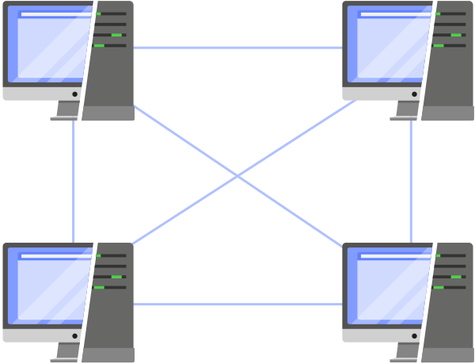
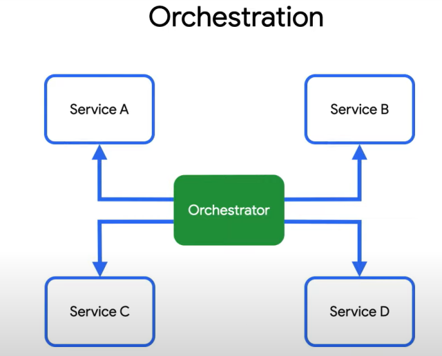
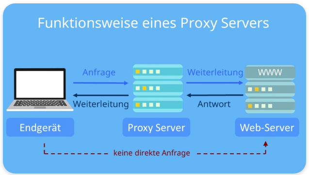

# Kapitel 2 (Verteilte Softwaresysteme, Systemarchitektur verteilter Softwaresysteme, Systemdesign)

**Autoren:** Bjarne Zaremba - Danny Meihöfer

# Lernziele für dieses Kapitel

Nach diesem Kapitel sollen folgende Aspekte klarer geworden sein:
 - Was ist ein verteiltes Softwaresystem?
 - Welche Formen von verteilten Systemen gibt es? 
 - Was ist ein Client-Server-Modell? 
 - Was ist eine Webanwendung?
 - Was ist eine eventgesteuerte Architektur?
 - Was bedeutet Modulare Architektur?
 - Was ist der unterschied zwischen einem Monolith und einem Microservice?
 - Wie können Services miteinander Kommunizieren?
 - Was ist Skalierungsmuster? 

# **Verteilte Softwaresysteme**

Abb. 1: Beispiel eines verteilten Systems im Überblick 

 **Beschreibung von Abb. 1:**

- Elektronische Handelsplattform steht dem Kunden als Webschnittstelle zur Verfügung
- Kunde führt Bestellungen, Recherche, etc. über das Internet durch
- Im Unternehmen werden diese Tätigkeiten über mehrere Server verteilt bearbeitet
- Webserver ist Zugangspunkt für den Kunden
- Webserver leitet Anfragen des Kunden an die geeigneten Application Server im Hintergrund weiter
- Auch die Kooperation mit anderen Unternehmen, z.B. eines Zulieferers, ist auch abgedeckt

## Verteilte Softwaresysteme
    
  >"Ein verteiltes System ist eine Sammlung aus Computerprogrammen, die Rechenressourcen über mehrere getrennte Rechenknoten hinweg nutzen, um ein gemeinsames Ziel zu erreichen. Es wird auch als verteiltes Computing oder verteilte Datenbanken bezeichnet und stützt sich auf separate Knoten, um über ein gemeinsames Netzwerk zu kommunizieren und zu synchronisieren. Diese Knoten sind typischerweise separate physische Hardwaregeräte, sie können aber auch separate Softwareprozesse oder andere rekursive gekapselte Systeme darstellen." (https://www.atlassian.com/de/microservices/microservices-architecture/distributed-architecture) [letzte Einsicht: 14. Oktober 2023]
    

## Eigenschaften

- Nutzung gemeinsamer Ressourcen
    - Ein verteiltes System kann Hardware, Software oder Daten gemeinsam nutzen
- Simultane Verarbeitung
    - Mehrere Rechner können dieselben Aufgaben parallel bearbeiten
- Skalierbarkeit
    - Ein verteiltes Softwaresystem kann beliebig in seiner Rechen- und Verarbeitungskapazität skaliert werden
    - Bei Bedarf kann ein verteiltes Softwaresystem sogar auf weitere Rechner ausgeweitet werden
- Transparenz
    - Ein Knoten kann auf andere Knoten im System zugreifen und mit diesen kommunizieren
    - Beispiel (s. Abb.1): Der Application Server des Unternehmens kann mit dem Application Servers des Zulieferers kommunizieren → Fehlende Materialien können einfach nachbestellt werden
- Heterogenität
    - Komponenten eines verteilten Systems können auf unterschiedlicher Hard- und Software laufen
        
        → Ermöglicht Integration verschiedener Technologien Plattformen (Beispiel: Nutzen von Linux und Windows möglich)
        

## Vorteile verteilter Softwaresysteme

- Verbesserung der Zuverlässigkeit und Leistung eines Systems
    - Engpässe und Zentrale Schwachstellen werden beseitigt
- Technologieoffenheit
    - Es können einfach mehrere Technologien und Betriebssysteme angebunden werden
- Redundanz
    - Wenn ein Knoten des Systems ausfällt, dann kann für diese Zeit ein anderer Knoten diese Aufgabe übernehmen
- Geografische Verteilung
    - Globale Verfügbarkeit und geringe Latenz durch Bereitstellung von Diensten in verschiedenen Regionen der Welt
- Bessere Skalierbarkeit
    - Ein verteiltes Softwaresystem kann problemlos an wachsende Anforderungen angepasst werden (indem z.B. mehr Server benutzt werden)
- Bessere Leistung
    - Die benötigte Rechenlast kann auf viele verschiedene Ressourcen aufgeteilt werden

## Nachteile verteilter Softwaresysteme

- Komplexität
    - Entwicklung und Wartung sind aufgrund der Verteilung deutlich komplexer
    - Bezug von Komponenten untereinander kann verloren gehen
- Einhaltung der Konsistenz von Daten
    - Die Aufrechterhaltung der Konsistenz von Daten in einem verteilten Softwaresystem kann sehr schwierig werden
    - Exkurs Konsistenz von Daten: “Als Konsistenz wird in Datenbanken die Korrektheit der dort gespeicherten Daten bezeichnet. Inkonsistente Datenbanken können zu schweren Fehlern führen, falls die darüberliegende Anwendungsschicht nicht damit rechnet” ([https://de.wikipedia.org/wiki/Konsistenz_(Datenspeicherung)](https://de.wikipedia.org/wiki/Konsistenz_(Datenspeicherung)) [letzte Einsicht: 13. Oktober 2023]
- Kommunikationsaufwand
    - Kommunikation zwischen den Komponenten über ein Netzwerk erzeugt Overhead (kann die Leistung beeinträchtigen
        
        → s. Abb1.: Jedes Mal, wenn ein Kunde nach einem Produkt sucht, muss die Anfrage über mehrere Server hinweg verarbeitet werden → Netzwerktraffic 
        

⇒ Die Vorteile überwiegen den Nachteilen

## Wieso benötigt man verteilte Softwaresysteme?

Viele Aufgaben lassen sich auf verteilten Softwaresystemen besser ausführen, als in zentralisierten Systemen. 

**Beispiel für ein verteiltes Softwaresystem: World Wide Web**

- Globale Skalierbarkeit
    - WWW hat Milliarden Benutzer
    - Es lassen sich einfach neue Server und Rechenzentren an verschiedenen globalen Standorten anschließen
- Ausfallsicherheit
    - Das WWW muss eine hohe Ausfallsicherheit bieten. Durch Verteilung wird dies ermöglicht.
- Lastenausgleich
    - Das WWW muss viele Millionen Anfragen parallel verarbeiten. Durch eine Verteilung auf viele verschiedenen Systeme wird die dort entstehende Last gut aufgeteilt

**Beispiel für ein zentralisiertes Softwaresystem: Kleines Büronetzwerk mit wenigen Benutzern**

- Einfachheit und Kosten
- Verwaltung und Wartung
- Geringe Komplexität

## Distributed vs. Decentralized

Abb. 2: Darstellung eines dezentralisierten- und verteilten Systems

### Decentralized (dt.: dezentralisiert):

- bestehen aus unabhängigen Knoten
- Knoten handeln autonom und erfordern keine zentrale Kontrolle
- Jeder Knoten ist gleichberechtigt
- Beispiel: Blockchain-Technologie

### Distributed (dt. verteilt):

- mehrere, miteinander verbundene Knoten, die untereinander kommunizieren, um eine bestimmte Aufgabe zu erfüllen
- Knoten können sich an verschiedene physischen Standorten befinden

### Unterschiede zwischen dezentralisierten- und verteilten Systemen

- Koordinierung
    - verteilte Systeme müssen zwischen einzelnen Knoten kommunizieren, während dezentralisierte Systeme dies in einem geringen Maß tun
- Unabhängigkeit
    - Bei dezentralisierten Systemen ist die Unabhängigkeit größer, während die Knoten in verteilten Systemen abhängig voneinander sind
- Skalierbarkeit
    - Beide Systeme sind skalierbar, aber die Art der Skalierbarkeit unterscheidet sich:
        - Verteilte Systeme können durch Hinzufügen weiterer Knoten erweitert werden
        - Dezentralisierte Systeme behalten die Autonomie der Knoten bei

---

## Concurrent vs. Parallel

Abb. 3: Unterschied zwischen Concurrency und Parallelism

### Concurrency(dt.: Gleichzeitigkeit):

- Fähigkeit eines Systems, mehrere Aufgaben gleichzeitig auszuführen
- Nur scheinbar gleichzeitig, denn das System wechselt eigentlich zwischen den Aufgaben

⇒ Aufgaben werden scheinbar gleichzeitig ausgeführt, der Prozessor wechselt aber zwischen den einzelnen Aufgaben und es scheint nur, als ob die Aufgaben gleichzeitig ausgeführt werden würden. 

### Parallelism (dt.: Parallelismus):

- Parallel bezieht sich auf die tatsächliche gleichzeitige Ausführung von Aufgaben in einem System
- In einem parallelen System arbeiten mehrere Aufgaben gleichzeitig und unabhängig voneinander
- erfordert bestimmte physische Ressourcen, wie mehrere Prozessoren oder Rechenkerne, die in der Lage sind mehrere Aufgaben gleichzeitig auszuführen
- Beispiel: Supercomputer, da diese aus einer großen Anzahl von Prozessoren bestehen, die Aufgaben gleichzeitig ausführen können

### Unterschied zwischen gleichzeitigen- und parallelen Systemen

- Ressourcen
    - Gleichzeitige Verarbeitung (concurrent) kann auf einem Prozessor betrieben werden, während parallele Verarbeitung (parallel) zwingend mehrere Prozessoren/Kerne benötigt
- Effizienz und Leistung
    - Parallel Verarbeitung bietet höhere Leistungen und Geschwindigkeiten, während gleichzeitige Verarbeitung effizienter für Anwendungen mit vielen Benutzern ist

## Systemarchitektur verteilter Softwaresysteme

Möchte man in einem System mehrere Geräte verbinden kann man das auf verschiedene Weisen machen. Je nach dem was man genau umsetzen möchte kann man eine unterschiedliche Softwarearchitektur wählen. Im Folgenden werden die wichtigsten Architekturen vorgestellt.

## Client Server 
 
Oft werden **verteilte Softwaresysteme** nach dem **Client-Server-Modell** aufgebaut. Das ist wichtig, wenn mehrere Geräte auf die Ressourcen eines Servers zugreifen wollen.

**Ein Client ist ein Endnutzergerät**, oder eine Anwendung, die mit einem Server kommunizieren kann. **Ein Server ist ein Gerät, das Anfragen von Clients entgegennimmt und diese beantwortet**.

Der, oder die Clients können von dem Server ***Daten*** anfordern, oder auch Daten an den Server senden. Der Vorteil ist hierbei, dass die Daten nicht auf dem Client gespeichert werden müssen, sondern ***zentral*** auf dem Server. Dadurch kann der Client auf die Daten zugreifen, ohne dass er diese selbst besitzen muss. Der Server kann die Daten auch besser verwalten und ***schützen***, da er die Kontrolle über diese hat.

Neben dem Datenaustausch kann der Server auch ***Dienste*** anbieten, die der Client nutzen kann. Dadurch lassen sich die Ressourcen des Servers nutzen, ohne dass der Client diese selbst besitzen muss (z.B. Rechenleistung, Speicherplatz, etc.) und der Server kann die Ressourcen effizienter nutzen, da diese nicht ungenutzt bleiben.

Steigen die Ressourcenanforderungen, weil Beispielsweise mehr Clients auf den Server zugreifen möchten, kann der Server einfach aufgerüstet werden, ohne dass die Clients davon etwas mitbekommen. Dadurch ist das System einfach ***skalierbar***.

Durch die zentrale Verwaltung der Ressourcen können diese auch ***effizienter*** genutzt werden, da der Server die Ressourcen auf die Clients verteilen kann, die diese gerade benötigen. Dadurch werden die Ressourcen nicht ungenutzt gelassen. Die bedeutet, dass die Ressourcen ***kosteneffizienter*** genutzt werden können.

**Problematisch** kann es in dem System werden, wenn der **Server ausfällt**. Ein Serverausfall würde bedeuten, dass alle Clients nicht mehr auf die Ressourcen zugreifen können, wodurch das ganze System nicht mehr ausfällt.

Ein Server fällt aus -> Das ganze System fällt aus  → **Single Point of Failure** Problem

### Typische Client-Server-Systeme

- **Webserver**
  - Webserver stellen Webseiten für Clients bereit. Die Webseite läuft also auf einem Server, ganz unabhängig vom Client. Der Client kann die Webseite dann über einen Browser aufrufen. Typischerweise wird hier das HTTP-Protokoll verwendet. In vielen Fällen wird ein Webserver über das Internet bereitgestellt, aber auch in lokalen Netzwerken können Webserver betrieben werden. Dienste wie z.B. Google, Facebook, etc. sind typische Beispiele für Webserver, die über das Internet bereitgestellt werden. 
  
- **Datenbanken**
  - Datenbanken sind Server, die Daten und Speicherplatz für Clients bereitstellen. Der Client kann dann über eine Anwendung auf die Datenbank zugreifen. Typischerweise wird hier das SQL-Protokoll verwendet. Oft wird eine Datenbank über das Internet bereitgestellt, Datenbankenserver und Webserver können also verbunden werden.
  Auch in lokalen Netzwerken können Datenbanken betrieben werden. Es gibt bereits Integrierte Datenbankenservices wie z.B. MySQL und PostgreSQL, die über das Internet bereitgestellt werden.
  
- **E-Mail-Server**
  - Ein Email-Sever Verwaltet für die Clients die E-Mail-Adressen und die E-Mails. Der Client kann dann über eine Anwendung auf die E-Mails zugreifen. Am weitesten verbreitet ist hierfür das SMTP-Protokoll. Bekannte E-Mail-Server sind z.B. Gmail, Outlook, GMX, etc.
  Der Server sorgt dafür, dass die Emails an die richtigen Empfänger gesendet werden und dass die E-Mails auch bei den Empfängern ankommen. Dadurch hilft er bei der Kommunikation zwischen den Clients.

## Webanwendungen

Eine Webanwendung ist eine Anwendung, die über einen Webbrowser aufgerufen werden kann. Die Anwendung läuft für gewöhnlich auf einem Server und der Client kann über den Internet, oder das Netzwerk auf die Anwendung zugreifen. Ein Vorteil davon ist, dass die Webanwendungen Platformunabhängig sind. Solange eine Verbindung zum Netzwerk, oder zum Internet besteht können sich die Clients mit der Anwendung verbinden. Das heißt für den Client auch, dass er nichts neues installieren muss um die Anwendungen zu benutzen. Zu den bekanntesten Webanwendungen gehören z.B. Google, Amazon, Facebook, Twitter, etc.

### Webarchitekturen

Es gibt verschiedene Webarchitekturen, die sich in der Art und Weise unterscheiden, wie die Anwendung aufgebaut ist. Die erste Webarchitektur ist die ***MPA - Multipage Application***. Eine MPA ist eine Webanwendung die aus mehreren einzelnen HTML-Seiten besteht. Für jede HTML-Seite kann es außerdem noch JS und CSS Code geben. Die verschiedenen Seiten werden hier über Links aufgerufen. Drückt der Benutzer also auf eine Schaltfläche, oder einen Link, wird eine **komplett neue Seite geladen**. MPA war die ursprüngliche Webarchitektur, aber auch heute wird sie noch oft benutzt beispielsweise von Diensten wie Amazon und Wikipedia. Wenn man bei diesen Webseiten auf eine Schaltfläche klickt lädt eine komplett neue Seite. Der Vorteil einer MPA ist, dass die Anwendung einfach aufgebaut ist und leicht zu debuggen ist, da man ohne Probleme jede Seite einzeln betrachten kann. Der Nachteil ist, dass die Anwendung langsamer reagiert, da die Seite immer neu geladen werden muss.

Die zweite Webarchitektur ist die ***SPA - Single Page Application***. Eine SPA ist eine Webanwendung, die nur aus einer einzigen HTML-Seite besteht. Die Inhalte der Seite werden dann **dynamisch über JS und CSS Code geladen**. Das bedeutet, dass neue Inhalte geladen werden können, ohne dass die ganze Seite neu geladen werden muss. Alle nötigen Daten werden bei dem ersten Aufruf der Seite geladen. Eine bekannte SPA ist Google Maps. Dort wird immer nur der Teil der Karte geladen, der gerade angezeigt wird, der Rest der Karte wird dynamisch geladen, wenn der Benutzer die Karte bewegt. Der Vorteil einer SPA ist, dass die Anwendung schneller reagiert, da die Seite nicht neu geladen werden muss, sondern immer nur der Teil der neu ist. Der Nachteil ist, dass die Anwendung komplexer ist, da die Seiten nicht mehr so getrennt betrachtet werden können. Das macht die Seite schwerer zu debuggen.

Die dritte Webarchitektur ist die ***PWA - Progressive Web Application***. Das besondere bei einer PWA ist, dass sie sich auf **verschiedenen Geräten und Betriebssystemen wie eine native Anwendung** verhällt. Eine PWA kann also beispielsweise auf dem Computer und gleichzeitig auf dem Smartphone laufen. Auf dem Smartphone verhällt sie sich wie eine für das Smartphone entwickelte Anwendung und kann Funktionen wie Push-Nachrichten, oder die Kamera des Smartphones nutzen. PWAs können außerdem auch offline laufen, da sie auf dem Gerät installiert werden können und auf dessen Hardware zugreifen können. PWAs sind also eine Mischung aus Webanwendungen und nativen Anwendungen. Eine bekannte PWA ist Twitter. Der Vorteil einer PWA ist, dass sie auf verschiedenen Geräten laufen kann und sich wie eine native Anwendung verhällt. Der Nachteil ist, dass die Entwicklung einer PWA besonders aufwendig ist. Außerdem ist die Performance einer PWA für gewöhnlich nicht so gut wie eine wirkliche native Anwendung, die für das Gerät optimiert ist.

## Peer to Peer (P2P)

Das Client Server Modell war ein zentrallisiertes Modell. Möchte man für sein System kein zentralles Gerät, über das die Ressourcen verteilt werden, kann man das ***Peer to Peer*** Modell benutzen. Jedes gerät, auch Host genannt, kann hier gleichzeitig ein Server und ein Client sein. Das bedeutet, dass jedes Gerät Ressourcen anbieten kann und gleichzeitig Ressourcen von anderen Geräten anfordern kann. Dadurch ist das System nicht mehr von einem zentralen Server abhängig. Das **Single Point of Failure Problem** gibt es hier also nicht mehr. Fällt ein Gerät aus, egal welches, schränkt es die anderen kaum ein. Das System ist also ***ausfallsicherer***. Während man beim Client Server Modell den Server aufrüsten muss, wenn die Anforderungen an den Server steigt, kann man ein Peer to Peer System aufrüsten indem man mehr Geräte hinzufügt, die ihre Ressourcen anbieten (**Skalierbar**). Auf der anderen Seite können die Ressourcen, aber auch nicht mehr so effizient verteilt werden, wie bei einem zentralen Server- System. Die einzelnen Geräte müssen selbst die Ressourden verteilen und die Kommunikation läuft nicht über einen zentralen Server, sondern über die einzelnen Geräte. Dadurch kann die Kommunikation zwischen den Geräten **langsamer** sein.

Bekannte Peer to Peer Systeme sind z.B. Filesharingsysteme, Skype, oder auch Bitcoin. Beim Filesharing werden Dateien direkt von einem Gerät zum anderen übertragen. Skype ist ein Peer to Peer System, das zum Austausch von Nachrichten und zum Telefonieren benutzt wird. Bitcoin ist ein Peer to Peer System, das zum Austausch von Geld benutzt wird.

## Event-driven Architecture

Event-driven, oder Event gesteuerte Architektur ist ein Architekturmuster bei dem die einzelnen Komponenten des Softwaresystems über ***Events kommunizieren***. Ein Event ist im Prinzib eine **Nachricht (Message)**, die gesendet wird, wenn sich ein Zustand ändert. Eine Komponente löst das Event aus und eine andere Komponente kann auf das Event reagieren. Der Vorteil davon ist, dass die Kommuikation zwischen den Komponenten ***entkoppelt*** ist. Die Komponenten müssen nicht wissen, welche anderen Komponenten es gibt und wie diese funktionieren. Sie müssen nur wissen, welche Events es gibt und wie sie auf diese reagieren können. Dadurch ist das System ***flexibler*** und ***erweiterbarer***. Es können einfach neue Komponenten hinzugefügt werden, ohne dass die anderen Komponenten davon etwas mitbekommen. Die Komponenten können auch einfach ausgetauscht werden, ohne dass die anderen Komponenten davon etwas mitbekommen.

## Message Broker

Oft werden für Events sogenannte Message Broker verwendet. Diese sind der Mittelpunkt zwischen den Komponenten und verwalten die Events. Eine Komponente löst also ein Event aus, der Message Broker empfängt das Event und leitet es an die Komponenten weiter, die auf das Event reagieren sollen. Dadurch ist die Kommunikation zwischen den Komponenten ***entkoppelt***.

Message Broker können nach dem **Publish Subscribe** Modell arbeiten. Das bedeutet, dass eine Komponente ein Event auslöst und der Message Broker das Event an alle Komponenten weiterleitet, die dieses Event "Subscribed" also Aboniert haben. Die Nachricht geht also vom Publisher zu allen Subscribern. Der Message Broker kann aber auch nach dem **Point to Point** Modell arbeiten. In diesem Modell sendet der Message Broker das Event nur ein eine einzige andere Komponente. Das Event geht also von einem Punkt zum anderen Punkt. Ein bekannter Message Broker ist z.B. RabbitMQ.

## Enterprise Service Bus - ESB

Ein ESB ist eine Softwarearchitektur, die die **Kommunikation zwischen den Komponenten** steuert. Man kann den ESB wie einen Message Broker verwenden. Der ESB kann aber auch noch mehr. Er ist nicht nur dafür verantwortlich die Nachrichten zu verteilen, sondern er kann die **Nachrichten zusätzlich überwachen, filtern und transformieren**. Die Nachricht kann also bevor sie verteilt wurde verändert werden, oder für Sicherheitszwecke überprüft werden. Wird zum Beispiel ein Event an die Falsche Komponente geschickt führt das durch den ESB nicht zu einem Fehler, da er nur die Events weiterleitet, die für eine Komponente bestimmt sind.

## Message Queue - MQ

Die sogenannte Message Queue ist eine **Warteschlange**, die die Events, die an eine Komponente gehen in einer typischen **Queuestruktur** speichert, bis sie von der Komponente verarbeitet werden. Das kann wichtig sein wenn **mehrere Events gleichzeitig an eine Komponente** gehen. Die Komponente kann die Events dann nacheinander verarbeiten. Dadurch kann die Komponente nicht überlastet werden. Die Message Queue kann auch dafür verwendet werden, um Events zu speichern, während die Komponente nicht verfügbar ist. Die Komponente kann die Events später verarbeiten, wenn sie wieder verfügbar ist. Die Events gehen also nicht verloren. Ohne Message Queue müsste entweder die Komponente, die das Event auslöst warten, bis die verarbeitende Komponente fertig ist, oder das Event würde verloren gehen. In diesem Fall wären die Komponenten nicht mehr von einander entkoppelt. Ein Beispiel für eine Message Queue ist z.B. RabbitMQ. 

### Verständnisbeispiel:

In einem Pizzaladen werden viele Bestellungen nacheinander aufgenommen. Die Bestellungen werden in einer Warteschlange gespeichert, bis sie nacheinander von der Küche verarbeitet werden. Dadurch wird die Küche nicht überlastet. Die Bestellungen gehen auch nicht verloren, wenn die Küche nicht verfügbar ist und der Kunde muss nicht mit dem Bestellen warten bis die vorherige Bestellung fertig ist. Die Bestellungen werden einfach gespeichert, bis die Küche wieder verfügbar ist.

## Modulare Architektur

Ein weiteres Architekturmuster für Softwaresysteme ist die Modulare Architektur. Dabei wird eine wird eine einzelne Anwendung in viele kleinere Module unterteilt. Jedes Modul für sich hat eine eigene und in der Regel einzelne Funktionalität, die unabhängig von den anderen Modulen Funktioniert. Über schnittstellen könnnen die Module miteinander interagieren und kommunizieren. Der große Vorteil davon ist, dass die Software sehr viel einfacher weiterentwickelt werden kann, da man die Funktionen der Module einzeln entwickelt werden kann, ohne dass man die gesamte Anwendung verändert. Jedes Modul kann unabhängig von den anderen gewartet, getestet und überarbeitet werden (**Skalierbarkeit**). Das System ist also besonders **Flexibel**. Man hat die Möglichkeit sie für eine andere Anwendung wieder zu verwenden wenn man die gleiche Funktionalität benötigt. Dadurch ist das System besonders **Wiederverwendbar**. Ein Nachteil ist, dass die Kommunikation zwischen den Modulen komplexer ist, da die Module miteinander kommunizieren müssen und es kann im ersten Moment unübersichtlich wirken, weil man nicht mehr die gesamte Anwendung betrachtet, sondern nur noch die einzelnen Module.

## Serviceorientierte Architektur - SOA

Die SOA funktioniert ähnlich wie die Modulare Architektur. Hier wird eine Anwendung allerdings nicht in mehrere Kleine Module unterteilt, sondern in mehrere **größere Services**. Ein Service ist so wie ein Modul unabhängig von anderen Services und besitzt eigene Funktionen, er ist allerdings umfangreicher und kann als eigene Anwendung betrachten, die für gewöhnlich dafür gemacht ist um **wiederverwendet** zu werden. Hat man z.B. viele Anwendungen bei denen man sich anmelden muss, kann man die Anmeldung als Service auslagern, so dass man nur noch einen wiederverwendbaren Anmeldeservice hat. Die Services können miteinander interagieren. Dieses Modell bietet ähnliche Vorteile wie die Modulare Architektur. Die Kommunikation zwischen den Services schränkt die Performance des Systems allerdings ein. Ein bekannter Service ist z.B. der Google Maps Service. Dieser Service kann in vielen Anwendungen verwendet werden, um eine Karte anzuzeigen.

## Service Discovery

Services können nur mit einander arbeiten und kommunizieren wenn sie sich gegenseitig finden können. Der erste gedanke wäre die Addresse eines Services einfach dort wo er benötigt wird hard zu coden. Das kann allerdings zu vielen Problemen führen wenn die URL sich z.B. ändert. Deshalb ist es von Vorteil wenn die **Services sich selbst finden** können. Die Service Discovery ist dieser Suchprozess durch den die Services sich automatisch gegenseitig finden. Ein Service registriert sich dafür bei der Service Discovery. Andere Services können dann bei dem Service Discovery Service dannach suchen und Zugriff auf den Service bekommen. Ob das Service Discovery System zentralisiert, oder verteilt ist, ist dabei egal. Ein bekannter Service Discovery Service ist z.B. Eureka.

## Microservices

Die Microservices ähneln der SOA. Die Services werden hier jedoch zu noch kleineren Services aufgeteilt. Die Microsevices sind zwar wiederverwendbar, aber sie werden nicht dafür gemacht. Sie sind so klein, dass sie nur für eine einzige Anwendung gemacht sind. Die Vorteile sind ähnlich wie bei der SOA. Die Kommunikation zwischen den Services schränkt die Performance des Systems allerdings noch weiter ein ein und es ist noch schwere den Überblick über die Anwendung zu behalten.

## Monolith vs Distributed Monolith

Das absolute gegenstück zu den Microservices ist der Monolith. Eine monolithische Anwendung besteht nur aus einer enizigen größeren Komponente. Performancetechnisch ist das von Vorteil, das Warten, oder Weiterentwickeln der Software wird bei größeren Anwendungen allerdings sehr schwierig. 

Bei einem ***Distributed Monolith*** zwar in mehrere einzelne komponenten verteilt, aber die Komponenten funktionieren ***nicht unabhängig voneinander***. Das kann es schwerer machen die Anwendung zu warten, oder weiter zu entwickeln, da die Komponenten miteinander kommunizieren müssen und eine Veränderung einer Komponente, die anderen Komponenten unbrauchbar machen kann. Die Performance ist schlechter als bei einem Monolith.

## Choreography Pattern vs Orchestration Pattern

**Wie können die Servises miteinander kommunizieren?**

Es gibt zwei Möglichkeiten wie die Services miteinander kommunizieren können. Die erste Möglichkeit ist das ***Choreography Pattern***. Hier kommunizieren die Services direkt miteinander. Das bedeutet, dass die Services sich gegenseitig finden müssen und die Kommunikation zwischen den Services nicht zentralisiert ist. Die Services müssen also wissen, welche Services es gibt und wie sie miteinander kommunizieren können. Sie müssen allerdings nicht genau wissen was der andere Service macht. Außerdem lassen sich einzelne Komponenten leicht warten. Der Nachteil ist allerdings da man die bestimmten Abläufe nicht mehr so einfach nachvollziehen kann. Hat ein Ablauf mehrere Schritte mit verschiedenen Services ist es schwierig nach zu vollziehen was genau und warum passiert, da man immer von Service zu Service springen muss.

Die zweite Möglichkeit ist das ***Orchestration Pattern***. Hier kommunizieren die Services nicht direkt miteinander, sondern über einen zentralen Service, der die Kommunikation zwischen den Services steuert. Der zentrale Service sendet und empfängt die Nachrichten. Die Services müssen also nicht wissen, welche Services es gibt und wie sie miteinander kommunizieren können, da das alles von dem zentralen Service gesteuert wird. Der große Vorteil ist hier, dass feste Abläufe und Workflows einfach nachvollzogen werden können, da der Ablauf durch den zentralen Service bestimmt wird. Problematisch ist, dass hier wieder das **Single Point of Failure** Problem auftreten kann

## Service Mesh

Ein Service Mesh ist auch eine Softwarearchitektur, die die Kommunikation zwischen den Services steuert. Das Service Mesh besteht aus einem Netzwerk von Proxies (auch Sidecar genannt), die zwischen den Services liegen. Jeder Service hat einen eigenen für ihn eingerichteten Proxie. Die Proxies sind für die Kommunikation zwischen den Services verantwortlich. Die Services selber senden nur Events an die Proxies und empfangen auch nur Events von den Proxies. Die Proxies können die Kommunikation zwischen den Services überwachen und steuern. Dadurch ist die Kommunikation zwischen den Services entkoppelt. Die Proxies können die Kommunikation auch verschlüsseln, oder überwachen. Es können also bestimmte Regeln festgelegt werden, nach denen die Proxies Nachrichten verändern, filtern, oder weitersenden. Ein bekanntes Service Mesh ist z.B. Istio.

# Systemdesign

## API Gateway vs. Proxy vs. Reverse Proxy vs. Load Balancer

### API Gateway

Abb. 4: Beispielhafte Darstellung eines API-Gateways

- Application-Programming-Interface (API)-Management-Tool
- zentraler Einstiegspunkt zwischen Anwendungsnutzer und Backend-Diensten
- hilft bei Konfiguration und Verwaltung von API Endpunkten
- schützt API-Endpunkte vor Angriffen
    - Pufferüberlauf
    - SQL-Einschleusung
    - Cross-Site-Skripting
    - Denial-of-Service
- Verbessert die API-Performance

### Proxy

Abb. 5: Funktionsweise eines Proxy Servers

Wie funktioniert ein Proxy?

- Agiert als Bindeglied zwischen einem Computer (vom Nutzer) und dem Internet
- vermittelt Informationen zwischen Computer und Internet
- die IP-Adresse und andere Informationen des Computers werden nicht an den Web-Server übermittelt, anstelle dessen treten die Informationen des Proxy-Servers

  ⇒ Mit einem Proxy-Server surft man sicherer im Internet, indem man keine eigenen Informationen zur Verfügung stellt. 

### Reverse-Proxy

Abb. 6: Funktionsweise eines Reverse-Proxy-Servers

Wie funktioniert ein Reverse-Proxy?

- sitzt zwischen dem Internet und vor einem oder mehreren Webservern
- bietet Schutz vor Angriffen
- Loadbalancing
- Caching

Unterschied zu normalem Proxy:

- Normaler Proxy sitzt vor dem Nutzer und sorgt dafür, dass kein Webserver jemals mit dem Nutzer direkt kommuniziert
- Ein Reverse-Proxy sitzt vor dem Webserver und sorgt dafür, dass kein Nutzer mit dem Webserver direkt kommunizieren kann

### Load-Balancer

- ein Load-Balancer (dt.: Lastenausgleicher) ist ein Netzwerkgerät, eine Softwareanwendung oder ein Dienst, der eingehenden Netzwerkverkehr auf verschiedene Server oder Rechenressourcen verteilt
    
    → Auslastung der Server soll optimiert werden
    
- werden in Rechenzentren und Netzwerken eingesetzt

Funktionen von Load-Balancern:

- Lastverteilung (Hauptzweck)
    - Netzwerkverkehr, z.B. Webanfragen gleichmäßig auf mehrere Server verteilen
- Verbesserte Verfügbarkeit
    - Loadbalancer können Server überwachen und den Netzwerkverkehr auf andere Server umleiten, falls ein bestimmter Server ausfällt
- Skalierbarkeit
    - Durch Loadbalancer ist es einfach möglich, Ressourcen zu entfernen, bzw. hinzuzufügen

## Skalierungsmuster

### Horizontale vs. vertikale Skalierung

Horizontale Skalierung (Scaling out): 

- Es werden zusätzliche Instanzen, z.B. Knoten, zu einem System hinzugefügt, um die Leistung des Systems zu erhöhen
- Einfach zu skalieren, da nur weitere Ressourcen hinzugefügt werden müssen
- Bietet natürliche Redundanz → Wenn ein Knoten ausfällt, kann ein anderer Knoten übernehmen

Vertikale Skalierung (Scaling up):

- Es werden die Ressourcen einer einzelnen Instanz erhöht, um mehr Leistung im gesamten System zu haben
    
    → durch Hinzufügen von CPU, RAM, Festplattenspeicher, etc.
    
- Komplexe Skalierbarkeit, da eventuell Hardware-Upgrades durchgeführt werden müssen
- Beschränkte Skalierbarkeit → es gibt eine natürliche Obergrenze, an der nicht mehr CPU, … hinzugefügt werden kann

### Replication

Es gibt verschiedene Skalierungsmuster in Bezug auf Replikation. Wichtig für uns ist die Anwendungsreplikation:

- In verteilten Anwendungen werden einzelne Anwendungsinstanzen repliziert werden, um Anforderungen an die Skalierbarkeit des Systems zu erfüllen.
- Loadbalancer werden verwendet, um die Last auf die replizierten Anwendungen zu verteilen

### Partitioning (dt.: Partitionierung)

Partioning im Bezug auf Systemdesign beschreibt die Aufteilung eines größeren Systems oder Anwendung in kleinere Teile oder Partitionen, die voneinander unabhängig sind.

Wichtige Aspekte des Partitionierens:

- Leistungssteigerung
    - Leistung kann gesteigert werden, da verschiedene Partitionen parallel arbeiten können
- Skalierbarkeit
    - Einzelne Teile des Systems können erweitert werden, es muss nicht gleich das ganze System vergrößert werden
- Wartbarkeit
    - kleine Partitionen sind einfacher zu warten, als ein großes System
- Kommunikation zwischen Partitionen
    - es müssen Werkzeuge erstellt werden, die eine Kommunikation unter den einzelnen Partitionen ermöglichen → z.B. durch API-Aufrufe

⇒ Partitionierung wird hauptsächlich bei sehr großen und komplexen Systemen angewendet. 

### (Datenbank-) Sharding

Beim Datenbank-Sharding geht es darum, eine große Datenbank auf meherere Knoten hinweg aufgeteilt und gespeichert wird. 

Herausforderung: Daten müssen konsistent bleiben und dürfen nicht verloren gehen. 

Vorteile von Datenbank-Sharding:

- Verbesserung der Reaktionszeit
    - das Abrufen von Daten geht bei mehreren “kleinen” Datenbanken schneller als bei einer großen Datenbank
- Skalierbarkeit
    - die Datenbank lässt sich Stück für Stück kostengünstig erweitertn
- Weniger Systemausfälle
    - Wenn ein Knoten der Datenbank ausfällt, dann fällt nicht gleich die ganze Anwendung aus, die diese Datenbank benutzt

### Load-Balancing

Technik, die in Netzwerken und Serverumgebungen eingesetzt wird, um eingehenden Datenverkehr auf mehrere Server zu verteilen. Dabei gibt es verschiedene Load-Balancing-Algorithmen:

- Round Robin
    - einfacher Algorithmus
    - Eingehende Anfragen werden einfach an den nächsten Server in der Reihe weitergeleitet
    - gleichmäßige Verteilung der Last
    - die tatsächliche Auslastung der einzelnen Server wird aber nicht berücksichtigt
- Least Connections (Least Connections First)
    - Anfragen werden an den Server weitergeleitet, der die aktuell geringste Anzahl an aktiven Verbindungen hat
    - Belastungen auf den einzelnen Servern werden ausgeglichen
- Weighted Round Robin
    - Erweiterung des Round-Robin-Algorithmus
    - den Servern werden Gewichtungen zugewiesen, Server mit einer höheren Gewichtung bekommen dementsprechend mehr Anfragen
- Weighted Least Connections
    - Erweiterung des Least-Connections-Algorithmus
    - Server bekommt Gewichtung
    - Anfragen werden an den Server mit der niedrigsten Anzahl an Verbindungen weitergeleitet, es wird aber auch die Gewichtung des Servers berücksichtigt
- IP-Hash
    - Es wird ein Hash-Wert der IP-Adresse der Anfrage gebildet
    - Verbindung wird an den Server mit dem ähnlichsten Hash-Wert weitergeleitet
    
      → Es wird sichergestellt, dass Anfragen von denselben Clients immer an denselben Server weitergeleitet werden
    
- Random
    - Zufällige Verteilung der Anfragen
- Least Bandwidth Used
    - Verbindungen werden an den Server, der die geringste Bandbreite nutzt, weitergeleitet
    - kann in Umgebungen wichtig sein, bei denen die Netzwerkbandbreite ein limitierender Faktor ist

### Caching (dt.: Zwischenspeichern)

Caching ist eine Technik, bei der Daten vorübergehend in einem schnelleren Speicherbereich gespeichert werden, um eine schnellere Verfügbarkeit zu gewährleisten.

Es gibt verschiedene Caching-Typen:

- Lokales Caching
    - Erfolgt auf Ebene des Benutzers
    - Zwischenspeichern von Daten auf dem Gerät oder innerhalb der Anwendung
    - Beispiel: Browsercache, Zwischenspeicherung in mobilen Apps
- Verteiltes Caching
    - Daten und Ressourcen werden in gemeinsam genutzten Cache-Speicherbereichen gespeichert → diese werden von mehreren Servern genutzt
    - Skalierbarkeit und Leistung werden verbessert, da häufig benötigte Daten nur einmal abgerufen werden müssen
    - Bekannte Caching-Frameworks: Redis, Memcached
- Hierarchisches Caching
    - Verwendung mehrerer Caches in einer hierarchischen Struktur
    - Zugriff auf Daten wird optimiert
    - wird oft in CDN’s eingesetzt
- Web-Caching
    - bezieht sich auf die Speicherung von HTML-Seiten, Bildern und CSS-Dateien
    - Speicherung mithilfe von Proxys, CDN’s und Webbrowsern
    - Ladezeit wird verkürzt und Serverlast verringert

### Skalierungswürfel (auch Cube Model for Scalability)

Der Skalierungswürfel wird in der Informatik benutzt, um verschiedene Arten der Skalierung von Systemen zu kategorisieren bzw. zu visualisieren.

Der Würfel hat drei Dimensionen:

- X-Achse: Horizontale Skalierung
    - es werden zusätzliche Instanzen hinzugefügt, um die Leistung eines Systems zu erhöhen
- Y-Achse: Vertikale Skalierung
    - es wird die Leistung eines Systems erhöht, indem mehr Ressourcen, wie z.B. CPU oder RAM hinzugefügt werden
- Z-Achse: Skalierung über verschiedene Dimensionen
    - Funktionale Zerlegung: Anwendung wird in verschiedene Dienste aufgeteilt, die unabhängig voneinander skaliert werden können

## Referenzen

- [https://www.atlassian.com/de/microservices/microservices-architecture/distributed-architecture](https://www.atlassian.com/de/microservices/microservices-architecture/distributed-architecture) [letzte Einsicht: 13. Oktober 2023]
- Schill, A. und Springer, T. (2012) *Verteilte Systeme: Grundlagen und Basistechnologien*. 2. Auflage. Springer.
- [https://medium.com/delta-exchange/centralized-vs-decentralized-vs-distributed-41d92d463868](https://medium.com/delta-exchange/centralized-vs-decentralized-vs-distributed-41d92d463868) [letzte Einsicht: 14. Oktober 2023]
- [https://blog.iron.io/concurrent-vs-parallel-tasks-for-a-worker-system/](https://blog.iron.io/concurrent-vs-parallel-tasks-for-a-worker-system/) [letzte Einsicht: 14. Oktober 2023]
- [https://www.softwareag.com/de_de/resources/api/article/api-gateway.html](https://www.softwareag.com/de_de/resources/api/article/api-gateway.html) [letzte Einsicht: 14. Oktober 2023]
- [https://docs.netscaler.com/de-de/citrix-application-delivery-management-service/api-gateway.html](https://docs.netscaler.com/de-de/citrix-application-delivery-management-service/api-gateway.html) [letzte Einsicht: 14. Oktober 2023]
- [https://studyflix.de/informatik/was-ist-ein-proxy-server-5962](https://studyflix.de/informatik/was-ist-ein-proxy-server-5962) [letzte Einsicht: 14. Oktober 2023]
- [https://www.cloudflare.com/de-de/learning/cdn/glossary/reverse-proxy/](https://www.cloudflare.com/de-de/learning/cdn/glossary/reverse-proxy/) [letzte Einsicht: 14. Oktober 2023]
- [https://aws.amazon.com/de/what-is/database-sharding/](https://aws.amazon.com/de/what-is/database-sharding/) [letzte Einsicht: 15. Oktober 2023]
- Es wurden Zusammenfassungen mit Chat-GPT-3.5 erstellt, um einen ersten Überblick über das Thema zu bekommen: https://chat.openai.com

## Abbildungen

- Abb. 1: Schill, A. und Springer, T. (2012) *Verteilte Systeme: Grundlagen und Basistechnologien*. 2. Auflage. Springer
- Abb. 2: [https://medium.com/delta-exchange/centralized-vs-decentralized-vs-distributed-41d92d463868](https://medium.com/delta-exchange/centralized-vs-decentralized-vs-distributed-41d92d463868) [letzte Einsicht: 14. Oktober 2023]
- Abb. 3: [https://blog.iron.io/concurrent-vs-parallel-tasks-for-a-worker-system/](https://blog.iron.io/concurrent-vs-parallel-tasks-for-a-worker-system/) [letzte Einsicht: 14. Oktober 2023]
- Abb. 4: [https://docs.netscaler.com/de-de/citrix-application-delivery-management-service/api-gateway.html](https://docs.netscaler.com/de-de/citrix-application-delivery-management-service/api-gateway.html) [letzte Einsicht: 14. Oktober 2023]
- Abb. 5: [https://studyflix.de/informatik/was-ist-ein-proxy-server-5962](https://studyflix.de/informatik/was-ist-ein-proxy-server-5962) [letzte Einsicht: 14. Oktober 2023]
- Abb. 6: [https://www.cloudflare.com/de-de/learning/cdn/glossary/reverse-proxy/](https://www.cloudflare.com/de-de/learning/cdn/glossary/reverse-proxy/) [letzte Einsicht: 14. Oktober 2023]
- Message Broker Bild https://medium.com/tech-sauce/introduction-to-message-queuing-4a7ab8968b59
- Mpa spa pwa https://www.linkedin.com/pulse/mpa-spa-pwa-whats-difference-how-does-work-together-marek-kubacak
- Choreography vs Orchestration Pattern https://temporal.io/blog/to-choreograph-or-orchestrate-your-saga-that-is-the-question
- https://www.linkedin.com/pulse/microservices-orchestration-vs-choreography-sachin-gupta