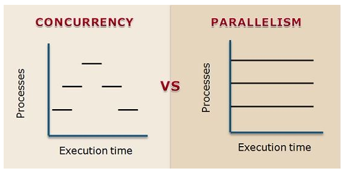

class: center, middle

## [Software Engineering](../../praesentationen.html)

#### Kapitel 2

# Verteilte Softwaresysteme - Systemarchitektur - Systemdesign

Bjarne Zaremba - Danny Meihöfer

---

1. Einführung Verteilte Softwaresysteme

2. Systemarchitektur verteilter Softwaresysteme

3. Systemdesign

4. Zusammenfassung

5. Quellen

---

# Lernziele für dieses Kapitel 

Nach diesem Kapitel sollen folgende Aspekte klarer geworden sein:
 - Was ist ein verteiltes Softwaresystem?
 - Welche Formen von verteilten Systemen gibt es?
 - Was ist ein Client-Server-Modell? 
 - Was ist eine Webanwendung?
 - Was ist eine eventgesteuerte Architektur?
 - Was bedeutet Modulare Architektur?
 - Was ist der unterschied zwischen einem Monolith und einem Microservice?
 - Wie können Services miteinander Kommunizieren?
 - Was ist Skalierungsmuster? 

---

# **Verteilte Softwaresysteme**

Abb. 1: Beispiel eines verteilten Systems im Überblick 

---

  
  ## **Verteilte Softwaresysteme**   
  > "Ein verteiltes System ist eine Sammlung aus Computerprogrammen, die Rechenressourcen über mehrere getrennte Rechenknoten hinweg nutzen, um ein gemeinsames Ziel zu erreichen. Es wird auch als verteiltes Computing oder verteilte Datenbanken bezeichnet und stützt sich auf separate Knoten, um über ein gemeinsames Netzwerk zu kommunizieren und zu synchronisieren. Diese Knoten sind typischerweise separate physische Hardwaregeräte, sie können aber auch separate Softwareprozesse oder andere rekursive gekapselte Systeme darstellen."   https://www.atlassian.com/de/microservices/microservices-architecture/distributed-architecture [letzte Einsicht: 14. Oktober 2023]

---

## Eigenschaften

- Nutzung gemeinsamer Ressourcen

- Simultane Verarbeitung

- Skalierbarkeit

- Transparenz

- Heterogenität
  
---

## Vorteile verteilter Softwaresysteme

- Verbesserung der Zuverlässigkeit und Leistung eines Systems
  
- Technologieoffenheit
    
- Redundanz
    
- Geografische Verteilung
   
- Bessere Skalierbarkeit
  
- Bessere Leistung
    

---

## Nachteile verteilter Softwaresysteme

- Komplexität

- Einhaltung der Konsistenz von Daten

- Kommunikationsaufwand

⇒ Die Vorteile überwiegen den Nachteilen

---

## Wieso benötigt man verteilte Softwaresysteme?

Viele Aufgaben lassen sich auf verteilten Softwaresystemen besser ausführen, als in zentralisierten Systemen. 

Beispiel für ein verteiltes Softwaresystem: World Wide Web

- Globale Skalierbarkeit

- Ausfallsicherheit

- Lastenausgleich

Beispiel für ein zentralisiertes Softwaresystem: Kleines Büronetzwerk mit wenigen Benutzern

- Einfachheit und Kosten

- Verwaltung und Wartung

- Geringe Komplexität

---

## Distributed vs. Decentralized

 

Abb. 2: Darstellung eines dezentralisierten- und verteilten Systems

---

## Unterschiede zwischen dezentralisierten- und verteilten Systemen

- Koordinierung

- Unabhängigkeit
    
- Skalierbarkeit
---

## Concurrent vs. Parallel

Abb. 3: Unterschied zwischen Concurrency und Parallelism

---

## Unterschied zwischen gleichzeitigen- und parallelen Systemen

- Ressourcen
    
- Effizienz und Leistung
    

---

# Systemarchitektur verteilter Softwaresysteme

Möchte man in einem System mehrere Geräte verbinden kann man dies auf verschiedene Arten tun.

Je nach Zielsetzung kann man eine unterschiedliche Systemarchitektur wählen.

---

# Client Server

Was ist ein Client?

- Ein Client ist ein Endnutzergerät, oder eine Anwendung, die auf die Dienste, Ressourcen oder Informationen zugreift, die von einem Server bereitsgestellt werden kommuniziert
- Oft bieten Clients eine grafische Benutzeroberfläche, die es dem Benutzer ermöglicht, mit dem Server zu interagieren

Was ist ein Server?

- Ein Server ist ein Computer, oder eine Anwendung die Dienste, Ressourcen oder Informationen für Clients bereitstellt
- Server können auch mit anderen Servern kommunizieren

  
---

# Client Server Anwendungsbeispiele

Webserver

- Ein Webserver ist ein Computer, der Webseiten und andere Dateien über das HTTP-Protokoll an Clients sendet
- Webserver sind in der Regel mit einem Webhosting-Service verbunden, der die Speicherung von Dateien auf dem Server ermöglicht
- Webserver können auch nur in lokalen Netzwerken verwendet werden

Email Server

- Email Server sind Computer, die für die Verwaltung und Zustellung von E-Milas zuständig sind
- Sie empfangen, speichern und versenden E-Mails

Datenbanken

- Viele Clients können auf eine Datenbank zugreifen, um Daten zentral zu speichern und abzurufen

---

# Webanwendungen

Webanwendungen sind Anwendungen, die über einen Webbrowser aufgerufen werden können

Oft Läuft die Anwendung auf einem Server und der Browser dient als Client

Für Webanwendungen werden verschiedene Webarchitekturen verwendet

---

class: center, middle

# Webarchitekturen

---

# Webarchitekturen - MPA

MPA - Multi-page Application

- **Eine MPA ist eine Webanwendung, die aus mehreren HTML-Seiten besteht**
- Jede Seite wird vom Server geladen, wenn der Benutzer sie anfordert
- Dadurch, dass die ganze Seite oft neu geladen werden muss, ist die Anwendung langsamer
- Die Amazone-Webseite ist ein Beispiel für eine MPA

---

# Webarchitekturen - SPA

SPA - Single-page Application

- **Eine SPA ist eine Webanwendung, die nur aus einer HTML-Seite besteht**
- Es gibt keine Neuladungen der Seite, wenn der Benutzer mit der Anwendung interagiert
- Beim ersten Aufruf der Seite wird die ganze Anwendung geladen
- Nur die upgedateten Daten werden vom Server geladen
- Dadurch ist die Anwendung schneller
- Aber die Anwendung ist komplexer zu entwickeln
- Google Maps ist ein Beispiel für eine SPA

---

# Webarchitekturen - PWA

PWA - Progressive Web Application

- **Eine PWA ist eine Webanwendung die sich wie eine native Anwendung verhält**
- Sie kann auf verschiedenen Geräten und Betriebssystemen verwendet werden
- So kann man z.B. eine PWA auf dem Smartphone installieren
- Sie kann offline verwendet werden (Meistens mit eingeschränkter Funktionalität)

- Die Performance einer PWA ist oft schlechter als die einer nativen Anwendung

- Twitter ist ein Beispiel für eine PWA

---

# Peer to Peer

Peer to Peer

- Peer to Peer ist ein dezentrales Kommunikationsmodell
- Jeder Host kann gleichzeitig Server und Client sein
- Ressourcen werden direkt von einem Host zum anderen übertragen

---

# Peer to Peer Anwendungsbeispiele

Filesharing

- Filesharing ist ein Prozess, bei dem Benutzer Dateien direkt von anderen Benutzern herunterladen können
- Filesharing ist ein Peer-to-Peer-Modell, da die Dateien direkt von einem Benutzer zum anderen übertragen werden

Videokonferenzen

- Videokonferenzen sind ein Peer-to-Peer-Modell, da die Daten direkt von einem Benutzer zum anderen übertragen werden
- Ein Beispiel ist Skype

---

# Event-driven Architecture

Eventgesteuerte Architektur

- **Eine eventgesteuerte Architektur ist ein Architekturmuster, bei dem die Kommunikation zwischen Komponenten durch Ereignisse / Events gesteuert wird**
- Eine Komponente sendet ein Event aus
  - Ein Event ist eine Nachricht, die angibt, dass etwas passiert ist
  - Ein Event kann Daten enthalten

- Eine andere Komponente empfängt das Event und reagiert darauf in Echzeit

---

# Event-driven Architecture - Vorteile

- **Skalierbarkeit und fleixibilität**
  - Die Komponenten können unabhängig voneinander skaliert und entwickelt werden
  - Die Komponenten müssen sich nicht gegenseitig kennen 
  - Die Komponenten können auf verschiedenen Servern laufen

---

# Message Broker

Message Broker sind Softwarekomponenten, die die Kommunikation zwischen Komponenten in einer eventgesteuerten Architektur verwalten

Sie sind für die Verteilung der Events verantwortlich

Der Vorteil ist, dass die Komponenten nicht direkt miteinander kommunizieren müssen

---

# Message Broker Modelle

Es gibt zwei typische Message Broker Modelle
1. Publish-Subscribe
2. Point-to-Point

Man kann vorgefertigte Message Broker verwenden, oder einen eigenen entwickeln

Vorgefertigte Message Broker sind z.B. RabbitMQ, Apache Kafka, Apache ActiveMQ

---

# ESB - Enterprise Service Bus

Ein ESB ist eine Softwarearchitektur, die die Kommunikation zwischen Komponenten in einer eventgesteuerten Architektur verwaltet

Middleware zwischen Anwendungen

Eine ESB ist ein Message Broker, der zusätzliche Funktionen bietet

Er kann Nachrichten transformieren, filtern und routen

---

# MQ - Message Queue

Eine Message Queue ist eine Warteschlange, die Nachrichten speichert, bis sie von einer Komponente abgerufen werden

Es können also mehrer Events in einer Warteschlange gespeichert werden, die nach und nach abgearbeitet werden

Beispiel: Ein Pizzaladen. Die Bestellungen werden in einer Warteschlange gespeichert und nach und nach abgearbeitet. Die Kunden müssen nicht warten, bis eine Bestellung fertig ist, um ihre Bestellung aufzugeben.

---

# Modulare Architektur

- Modulare Architektur ist ein Architekturmuster, bei dem eine Anwendung in unabhängige Module unterteilt wird

- Jedes Modul hat eine eigene Funktionalität

- Die Module interagieren über Schnittstellen miteinander

- Die Module können unabhängig voneinander entwickelt werden

**Eine Anwendung besteht aus mehreren Modulen, die zusammenarbeiten**

---

# Modulare Architektur - Vorteile

- **Weiterentwicklung**
  - Die Module können unabhängig voneinander gewartet werden
  - Die Module können unabhängig voneinander getestet werden
  - Die Module können unabhängig voneinander entwickelt werden (Skalierbarkeit)

- **Wiederverwendbarkeit**
  - Die Module können in anderen Anwendungen wiederverwendet werden

---

# SOA - Serviceorientierte Architektur

- **Eine serviceorientierte Architektur ist eine Architektur, bei der die Anwendung in unabhängige Services unterteilt wird**
- Jeder Service hat eine eigene Funktionalität und ist **unabhängig** von den anderen Services
- Die Services können miteinander interagieren
- Die Services können von anderen Anwendungen verwendet werden

**Eine Anwendung besteht aus mehreren Services, die zusammenarbeiten**
**Ein Service ist eine unabhängige Anwendung**

---

# SOA - Vorteile

- **Wiederverwendbarkeit**
  - Services können wiederverwendet werden
  - Services können in anderen Anwendungen verwendet werden

- **Kapselung**
  - Services sind unabhängig voneinander
  - Services können leichter entwickelt und getestet werden

- **Skalierbarkeit**
  - Services können unabhängig voneinander skaliert werden

- **Einfache Wartung**
  - Services können leichter gewartet werden

---

# SOA - Nachteile

- **Komplexität**
  - Die Architektur ist komplexer

- **Performance**
  - Die Kommunikation zwischen den Services kann zu Performanceproblemen führen

---

# Service Discovery

Dammit Services miteinander kommunizieren können, müssen sie sich finden
- Man könnte die URLs der Services hardcoden
- Die URLs können sich aber ändern
- Es ist also besser, wenn die Services sich selbst finden

Service Discovery ist ein Prozess, bei dem Services automatisch gefunden werden

Services können sich bei einem Service Discovery Service registrieren

Andere Services können die Services über den Service Discovery Service finden

Die Service Discovery können Client- oder Serverseitig sein

Es gibt vorgefertigte Service Discovery Services, z.B. Consul, Eureka, Zookeeper

---

# Microservices

Microservices ähneln SOA

Microservices sind eine Architektur, bei der die Anwendung in unabhängige Services unterteilt wird

Jeder Service hat eine eigene Funktionalität und ist **unabhängig** von den anderen Services

Aber Microservices sind kleiner als Services in SOA

Microservices sind nicht unbedingt dafür gedacht, von anderen Anwendungen verwendet zu werden

---

# Monolith vs Distributed Monolith

Eine Monolithische Anwendung ist eine Anwendung, die aus einer einzigen Komponente besteht

Eine verteilte Monolithische Anwendung ist wie bei Microservices in mehrere Komponenten unterteilt
- Die Komponenten sind aber nicht unabhängig voneinander
- Die Vorteile von Microservices sind nicht gegeben (Skalierbarkeit, Wiederverwendbarkeit, Kapselung)
- Es kann sogar schwieriger sein, eine verteilte Monolithische Anwendung zu entwickeln, als eine Monolithische Anwendung
- Und es kann zu Performanceproblemen kommen

---

# Choreography Pattern vs Orchestration Pattern

**Wie kommunizieren die Services miteinander?**

Choreography Pattern
- Ändert sich ein Zustand in einem Service, sendet er ein Event aus
- Andere Services empfangen das Event und reagieren darauf

---

# Choreography Pattern Vor- und Nachteile

Vorteile:
- Unabhängigkeit der Services
- Einfache Wartung
- Dezentrale Kommunikation

Nachteile:
- Komplexität
- Nachvollziehbarkeit
- Workflows sind schwer zu implementieren

---

# Orchestration Pattern

**Wie kommunizieren die Services miteinander?**

Orchestration Pattern
- Ein Service ist für die Kommunikation zwischen den Services verantwortlich
- Er sendet Nachrichten an die Services und empfängt Nachrichten von den Services
- Er kann z.B. einen Workflow definieren

---

# Orchestration Pattern Vor- und Nachteile

Vorteile:
- Einfache Kommunikation
- Centralisierte Kommunikation
- Nachvollziehbarkeit
- Workflows sind leicht zu implementieren

Nachteile:
- Abhängigkeit der Services
- Single Point of Failure

---

# Service Mesh

Ein Service Mesh lagert die Kommunikation zwischen den Services aus

Jede Art von Kommunikation zwischen den Servises muss über den Service Mesh laufen

Jeder Service hat einen Proxy, der die Kommunikation übernimmt

Über Proxys können Nachrichten gefiltert, transformiert und geroutet werden

---

# Systemdesign

## API Gateway vs. Proxy vs. Reverse Proxy vs. Load Balancer

---

### API Gateway

Abb. 4: Beispielhafte Darstellung eines API-Gateways

- Application-Programming-Interface (API)-Management-Tool
- zentraler Einstiegspunkt zwischen Anwendungsnutzer und Backend-Diensten
- hilft bei Konfiguration und Verwaltung von API Endpunkten
- schützt API-Endpunkte vor Angriffen
- Verbessert die API-Performance

---

### Proxy

Abb. 5: Funktionsweise eines Proxy Servers

⇒ Mit einem Proxy-Server surft man sicherer im Internet, indem man keine eigenen Informationen zur Verfügung stellt. 

---

### Reverse-Proxy

Abb. 6: Funktionsweise eines Reverse-Proxy-Servers

Unterschied zu normalem Proxy:

- Normaler Proxy sitzt vor dem Nutzer und sorgt dafür, dass kein Webserver jemals mit dem Nutzer direkt kommuniziert
- Ein Reverse-Proxy sitzt vor dem Webserver und sorgt dafür, dass kein Nutzer mit dem Webserver direkt kommunizieren kann

---

### Load-Balancer

Ein Load-Balancer (dt.: Lastenausgleicher) ist ein Netzwerkgerät, eine Softwareanwendung oder ein Dienst, der eingehenden Netzwerkverkehr auf verschiedene Server oder Rechenressourcen verteilt
    
    → Auslastung der Server soll optimiert werden

Funktionen von Load-Balancern:

- Lastverteilung (Hauptzweck)
    
- Verbesserte Verfügbarkeit
    
- Skalierbarkeit
    

---

## Skalierungsmuster

### Horizontale vs. vertikale Skalierung

Horizontale Skalierung (Scaling out): 

- Es werden zusätzliche Instanzen, z.B. Knoten, zu einem System hinzugefügt, um die Leistung des Systems zu erhöhen

Vertikale Skalierung (Scaling up):

- Es werden die Ressourcen einer einzelnen Instanz erhöht, um mehr Leistung im gesamten System zu haben
    
    → durch Hinzufügen von CPU, RAM, Festplattenspeicher, etc.
    

---

### Replication

Es gibt verschiedene Skalierungsmuster in Bezug auf Replikation. Wichtig für uns ist die Anwendungsreplikation:

- In verteilten Anwendungen werden einzelne Anwendungsinstanzen repliziert werden, um Anforderungen an die Skalierbarkeit des Systems zu erfüllen.
- Loadbalancer werden verwendet, um die Last auf die replizierten Anwendungen zu verteilen

---

### Partitioning (dt.: Partitionierung)

Partioning im Bezug auf Systemdesign beschreibt die Aufteilung eines größeren Systems oder Anwendung in kleinere Teile oder Partitionen, die voneinander unabhängig sind.

Wichtige Aspekte des Partitionierens:

- Leistungssteigerung
    
- Skalierbarkeit
    
- Wartbarkeit
    
- Kommunikation zwischen Partitionen
    

⇒ Partitionierung wird hauptsächlich bei sehr großen und komplexen Systemen angewendet. 

---

### (Datenbank-) Sharding

Beim Datenbank-Sharding geht es darum, eine große Datenbank auf meherere Knoten hinweg aufgeteilt und gespeichert wird. 

Herausforderung: Daten müssen konsistent bleiben und dürfen nicht verloren gehen. 

Vorteile von Datenbank-Sharding:

- Verbesserung der Reaktionszeit
    
- Skalierbarkeit
    
- Weniger Systemausfälle
    

---

### Load-Balancing

Technik, die in Netzwerken und Serverumgebungen eingesetzt wird, um eingehenden Datenverkehr auf mehrere Server zu verteilen. Dabei gibt es verschiedene Load-Balancing-Algorithmen:

- Round Robin
    
- Least Connections (Least Connections First)
  
- Weighted Round Robin

- Weighted Least Connections

- IP-Hash
    
- Random
    
- Least Bandwidth Used
    
---

### Caching (dt.: Zwischenspeichern)

Caching ist eine Technik, bei der Daten vorübergehend in einem schnelleren Speicherbereich gespeichert werden, um eine schnellere Verfügbarkeit zu gewährleisten.

Es gibt verschiedene Caching-Typen:

- Lokales Caching
   
- Verteiltes Caching
 
- Hierarchisches Caching
   
- Web-Caching
   

---

### Skalierungswürfel (auch Cube Model for Scalability)

Der Skalierungswürfel wird in der Informatik benutzt, um verschiedene Arten der Skalierung von Systemen zu kategorisieren bzw. zu visualisieren.

Der Würfel hat drei Dimensionen:

- X-Achse: Horizontale Skalierung
    
- Y-Achse: Vertikale Skalierung
    
- Z-Achse: Skalierung über verschiedene Dimensionen
    
---

# Verständnisfragen

1. Was sind verteilte Systeme?
2. Nenne einen Vorteil von verteilten Systemen
3. Nenne einen Nachteil von verteilten Systemen
4. Was bedeutet Distributed im Kontext von verteilten Systemen?
5. Was ist Concurrency im Kontext von verteilten Systemen?
6. Was ist ein Client?
7. Was ist ein Server?
8. Was ist eine Webanwendung?
9. Was für Webarchitekturen gibt es?
10. Was bedeutet Peer to Peer?
11. Was ist ein Event?
12. Was macht ein Message Broker?
13. Was ist ein ESB?
14. Was sind die Vorteile einer modularen Architektur?
15. Was sind die Unterschiede zwischen SOA und Microservices?
16. Was ist Service Discovery?
17. Was ist ein Monolith?
18. Was sind die Nachteile eines Distributed Monolith?
19. Was sind die Unterschiede zwischen Choreography Pattern und Orchestration Pattern?
20. Was ist ein Service Mesh?
---
# Verständnisfragen 2

21. Was ist der Unterschied zwischen einem Proxy und einem Reverse-Proxy?
22. Nenne ein Skalierungsmuster und beschreibe dieses.
23. Was ist der Cube of Sclability? Was macht man damit?

---

### Quellen

- [https://www.atlassian.com/de/microservices/microservices-architecture/distributed-architecture](https://www.atlassian.com/de/microservices/microservices-architecture/distributed-architecture) [letzte Einsicht: 13. Oktober 2023]

- Schill, A. und Springer, T. (2012) *Verteilte Systeme: Grundlagen und Basistechnologien*. 2. Auflage. Springer.

- [https://medium.com/delta-exchange/centralized-vs-decentralized-vs-distributed-41d92d463868](https://medium.com/delta-exchange/centralized-vs-decentralized-vs-distributed-41d92d463868) [letzte Einsicht: 14. Oktober 2023]

- [https://blog.iron.io/concurrent-vs-parallel-tasks-for-a-worker-system/](https://blog.iron.io/concurrent-vs-parallel-tasks-for-a-worker-system/) [letzte Einsicht: 14. Oktober 2023]

- [https://www.softwareag.com/de_de/resources/api/article/api-gateway.html](https://www.softwareag.com/de_de/resources/api/article/api-gateway.html) [letzte Einsicht: 14. Oktober 2023]

- [https://docs.netscaler.com/de-de/citrix-application-delivery-management-service/api-gateway.html](https://docs.netscaler.com/de-de/citrix-application-delivery-management-service/api-gateway.html) [letzte Einsicht: 14. Oktober 2023]

- [https://studyflix.de/informatik/was-ist-ein-proxy-server-5962](https://studyflix.de/informatik/was-ist-ein-proxy-server-5962) [letzte Einsicht: 14. Oktober 2023]

---

# Quellen 2

- [https://www.cloudflare.com/de-de/learning/cdn/glossary/reverse-proxy/](https://www.cloudflare.com/de-de/learning/cdn/glossary/reverse-proxy/) [letzte Einsicht: 14. Oktober 2023]

- [https://aws.amazon.com/de/what-is/database-sharding/](https://aws.amazon.com/de/what-is/database-sharding/) [letzte Einsicht: 15. Oktober 2023]

- Es wurden Zusammenfassungen mit Chat-GPT-3.5 erstellt, um einen ersten Überblick über das Thema zu bekommen: https://chat.openai.com
Systemarchitekturen

- <https://www.ionos.de/digitalguide/server/knowhow/client-server-modell/>

- https://www.tibco.com/reference-center/what-is-event-driven-architecture#:~:text=Event%2Ddriven%20architecture%20(EDA),
time%20or%20near%20real%20time.

Message Broker Bild
- https://medium.com/tech-sauce/introduction-to-message-queuing-4a7ab8968b59

---

# Quellen 3

- https://medium.com/must-know-computer-science/system-design-message-queues-245612428a22

Webarchitekturen
- https://www.linkedin.com/pulse/mpa-spa-pwa-whats-difference-how-does-work-together-marek-kubacak

Modulare Architektur
- https://triare.net/insights/modular-architecture-2/#:~:text=What%20is%20modular%20software%20architecture%3F,to%20explain%20in%20this%20example.

Serviceorientierte Architektur
- https://saipraveenblog.wordpress.com/2014/10/06/service-discovery-in-soamsa/

ServiceDiscovery
- https://www.youtube.com/watch?v=GboiMJm6WlA

---

# Quellen 4

Monolith vs Distributed Monolith vs Microservices
- https://scoutapm.com/blog/distributed-monoliths-vs-microservices#h_268859552881644344655113

Choreography Pattern vs Orchestration Pattern
- https://temporal.io/blog/to-choreograph-or-orchestrate-your-saga-that-is-the-question

- https://www.linkedin.com/pulse/microservices-orchestration-vs-choreography-sachin-gupta

---

### Abbildungsverzeichnis 

- Abb. 1: Schill, A. und Springer, T. (2012) *Verteilte Systeme: Grundlagen und Basistechnologien*. 2. Auflage. Springer

- Abb. 2: [https://medium.com/delta-exchange/centralized-vs-decentralized-vs-distributed-41d92d463868](https://medium.com/delta-exchange/centralized-vs-decentralized-vs-distributed-41d92d463868) [letzte Einsicht: 14. Oktober 2023]

- Abb. 3: [https://blog.iron.io/concurrent-vs-parallel-tasks-for-a-worker-system/](https://blog.iron.io/concurrent-vs-parallel-tasks-for-a-worker-system/) [letzte Einsicht: 14. Oktober 2023]

- Abb. 4: [https://docs.netscaler.com/de-de/citrix-application-delivery-management-service/api-gateway.html](https://docs.netscaler.com/de-de/citrix-application-delivery-management-service/api-gateway.html) [letzte Einsicht: 14. Oktober 2023]

- Abb. 5: [https://studyflix.de/informatik/was-ist-ein-proxy-server-5962](https://studyflix.de/informatik/was-ist-ein-proxy-server-5962) [letzte Einsicht: 14. Oktober 2023]

- Abb. 6: [https://www.cloudflare.com/de-de/learning/cdn/glossary/reverse-proxy/](https://www.cloudflare.com/de-de/learning/cdn/glossary/reverse-proxy/) [letzte Einsicht: 14. Oktober 2023]