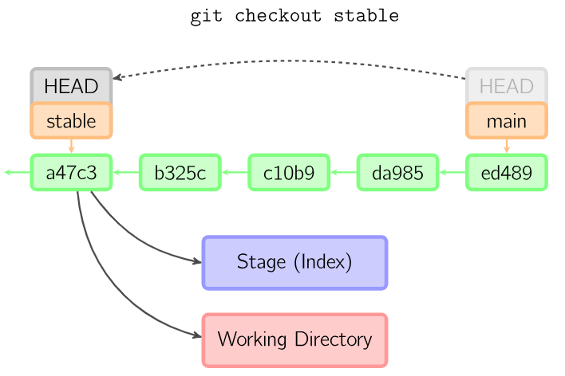

# Kapitel 3 Versionskontrollsysteme - AI-driven development - Code-Handling

**Autoren:** Bjarne Zaremba - Danny Meihöfer

# Lernziele für dieses Kapitel

Nach diesem Kapitel sollen folgende Aspekte klarer geworden sein:

- Was sind Versionsverwaltungssysteme?
- Was sind Remote Repositories?
- Wie benutze ich Git?
  - Was für Arbeitsabläufe gibt es?
- Was ist AI-Driven Development?
- Wie liest man Code richtig?
- Was sind Bug-Reports?
- Was hat es mit Debugging und Testing auf sich?
- Welche Tools kann ich zum Debugging benutzen?

## Versionsverwaltungssysteme

### Wofür braucht man Versionscontrollsysteme?

**Versionsverwaltungssysteme (VCS)** sind Softwaretools, die den Entwicklern helfen indem sie die **Änderungen an Dateien und Ordnern im Laufe der Zeit verfolgen**. Sie ermöglichen es den Entwicklern, auf **frühere Zustände** des Projekts, das sie entwickeln, zurückzugreifen. Entsteht also z.B. unabsichtlich ein Fehler im Projekt, der vorher nicht da war, kann man eine ältere Version laden und feststellen welche Änderungen den Fehler verursacht haben. Damit arbeiten die Entwickler **sicherer**, da es immer eine Kompilierbare Version des Projekts gibt und oft Sicherheitskopien der Dateien angelegt werden.

Ein weiterer Vorteil von VCS ist, dass sie es **mehreren Entwicklern** ermöglichen, gleichzeitig an einem Projekt zu arbeiten. Mehrere Entwickler können sich ein Projekt herunterladen, Änderungen vornehmen und dann ihre Änderungen hochladen. Das VCS kann dann die Änderungen zusammenführen und die Änderungen der Entwickler zusammenführen. Die **Kolaoboration** wird dadurch **effizienter** und **einfacher**

VCS **dokumentieren** automatisch wer, was und wann geändert hat. In der Regel wird jede Version und die Änderung die für diese Version von dem Entwickler mit einem "Kommentar" versehen, damit man später nachvollziehen kann, was in dieser Version passiert ist.

## Lokale Versionsverwaltung

Lokale Versionsverwaltung ist eine Methode, bei der die **Versionsverwaltung auf dem lokalen Rechner** des Entwicklers stattfindet. Dabei werden die Dateien und Änderungen in einer **Datenbank** gespeichert. Diese Datenbank enthält alle Änderungen und Dateien, die der Entwickler in seinem Projekt vorgenommen hat. Der Entwickler kann sich aussuchen welche Version er sehen und bearbeiten möchte. Die Datenbank wird von dem VCS verwaltet. Alle Daten sind trotzdem auf dem lokalen Rechner des Entwicklers gespeichert.
Das ist ein Nachteil was die Sicherheit angeht, da ein Hardwareausfall des Rechners zu einem Verlust der Daten führen kann. Diese Methode ist nur für **einen Entwickler** geeignet.


## Zentrale Versionsverwaltung

Bei der zentralen Versionsverwaltung wird die Versionsverwaltung auf einem **zentralen Server** durchgeführt. Die Entwickler können sich die Dateien und Änderungen von dem Server herunterladen und bearbeiten. Die Änderungen werden dann wieder auf den Server hochgeladen. Der Server verwaltet die Änderungen und Dateien. Die Entwickler können sich aussuchen welche Version sie sehen und bearbeiten möchten. Die Daten sind auf dem Server gespeichert. Diese Methode ist gut für **mehrere Entwickler** geeignet. Die Entwickler Laden sich den aktuellen Stand des Projekts herunter und können dann Änderungen vornehmen. Dannch laden sie die Änderungen wieder auf den Server hoch. Wenn mehrere Entwickler gleichzeitig an dem Projekt arbeiten, kann es zu **Konflikten** kommen, weil die gleichen Dateien bearbeitet wurden. Diese müssen dann von den Entwicklern gelöst werden.
Die Entwickler können sich aussuchen welche Version sie sehen und bearbeiten möchten. Die Daten sind auf dem Server gespeichert. Diese Methode ist gut für **mehrere Entwickler** geeignet.

Auf den Geräten der Entwickler sind nur die aktuell ausgecheckten Versionen.


## Verteilte Versionsverwaltung - Dezentrale Versionsverwaltung

Bei der verteilten Versionsverwaltung wird die Versionsverwaltung auf **mehreren Rechnern** durchgeführt. Jeder Entwickler hat eine eigene vollständige Kopie des Projekt auf seinem Rechner. Dazu gehört auch die vollständige Versionsgeschichte. Das System besteht also aus einem Remote Repository und einem lokalen Repository auf jeden Rechner der Entwickler. Man kann also auf seinem lokalen Rechner arbeiten und dann die Änderungen auf das Remote Repository hochladen. Die Änderungen werden dann mit dem Remote Repository zusammengeführt. Der Vorteil davon ist, dass die Entwickler keine Verbindung zum Server haben müssen um an ihrem Projekt weiter zu arbeiten. Diese Methode ist gut für **mehrere Entwickler** geeignet.


## GIT

GIT ist heutzutage eine sehr weit verbreitest Software für Dezentrale Versionsverwaltung. Ursprünglich wurde GIT für Software Entwicklung entwickelt, aber es kann auch für andere Projekte verwendet werden. GIT ist ein Open Source Projekt und wurde von Linus Torvalds, dem erfinder des Linux Kernels entwickelt. GIT ist sehr schnell und effizient. GIT ist sehr gut für die Zusammenarbeit von mehreren Entwicklern geeignet. Es gibt viele Online Dienste, die GIT als Versionsverwaltungssystem verwenden. Dazu gehören z.B. GitHub, GitLab und Bitbucket.

GIT kann über die Konsole bedient werden, aber es gibt auch viele grafische Benutzeroberflächen, die GIT unterstützen. Dazu gehören z.B. GitKraken, SourceTree und TortoiseGit.

Auf Linux Systemem ist GIT oft vorinstalliert. Auf Windows und Mac Systemen muss GIT erst installiert werden. Die Installation ist sehr einfach und kann über die [GIT Website](https://git-scm.com/downloads) heruntergeladen werden. Dabei ist für gewöhnlich eine Linux Konsole (bash). 

### Eine kurze Git-Historie

1991 wurde von Linus Torvalds der Linux Kernel entwickelt. In der nachfolgenden Zeit wurde der Kernel immer weiter entwickelt und es kamen immer mehr Entwickler dazu. Linux wurde als open source Software von einer riesigen Community weiterentwickelt. 2002 hat Linus Torvalds das damals kostenlose Versionsverwaltungssystem Bitkeeper verwendet. Ein paar Jahre später konnte man Bitkeeper jedoch nur noch kostenpflichtig verwenden, was zu einem Problem für die Entwickler des Linux Kernels wurde, weil Linux von so vielen Entwicklern weiterentwickelt wurde. Deshalb hat Linus Torvalds 2005 mit der Hilfe der Linux Community GIT entwickelt. Das Ziel war eine möglichst einfache und effiziente Arbeitsweise für die Entwickler zu ermöglichen. 

### GIT Grundlagen

#### Anlegen oder klonen eines GIT Repositories

Möchte man sein eigenes Projekt mit GIT Versionieren muss man nur in das Projektverzeichnis wechseln und folgenden Befehl ausführen:

```bash
git init
```

(Vorausgesetzt GIT ist installiert)

Will man ein anderes Repository klonen braucht man die URL des Repositorys und führt dann folgenden Befehl aus:

```bash
git clone <URL>
```

Das Repository wird in das aktuelle Verzeichnis geklont.

Eine weitere Funktion um ein Repository zu klonen ist der Befehl:

```bash
git fork <URL>
```

Dieser Befehl erstellt eine Kopie des Repositorys auf dem Server und klont es dann in das aktuelle Verzeichnis. Der Vorteil ist, dass man Änderungen im Repo hochladen kann, ohne das Ursprungs Repository zu verändern. Das ist z.B. bei Open Source Projekten sehr nützlich. Will ein Entwickler an einem Open Source Projekt mitarbeiten, kann er das Repository forken, seine Änderungen hochladen und dann einen Pull Request stellen. Er braucht selbser keine Rechte auf das Ursprungsrepo. Der Entwickler des Ursprungs Repositorys kann dann entscheiden, ob er die Änderungen übernehmen möchte.

#### git commit

Ein Commit ist ein Abbild von dem Zustand von allen Daten in einem Repo zu einem bestimmten Zustand. Viele Commits hintereinander ergeben die Versionsgeschichte. Ein Commit enthält einen Kommentar, der beschreibt was in diesem Commit geändert wurde. Ein Commit kann auch Änderungen an mehreren Dateien enthalten. Benutzt man den Befehl verschiebt GIT die Änderungen in das Lokale Repository. Jeder einzelne Commit bekommt automatisch eine einzigartige Commit ID mit der man den Commit identifizieren kann. Die Commit ID ist ein Hashcode. 


Der Befehl für einen Commit lautet:

```bash
git commit 
```

Mit diesem Befehl öffnet sich eine Datei in der man den Kommentar eingeben kann. Alternativ kann man den Kommentar direkt im Terminal eingeben:

```bash
git commit -m "Kommentar"
```

Für git commit und viele andere der GIT Befehle gibt es Argumente und Parameter die unterschiedliche Funktionen haben. Nachlesen kann man diese in der GIT Dokumentation https://git-scm.com/docs/git.

##### Die commit Nachricht

Für die Commit Nachricht gibt es einige Konventionen damit die Nachrichten einheitlich und sinnvoll sind. Die Konventionen sind nicht zwingend notwendig, aber es ist empfehlenswert sie zu verwenden. Die Konventionen sind:

Die erste Zeile der Nachricht sollte eine kurze Zusammenfassung der Änderungen sein. Die Zeile sollte nicht länger als 72 Zeichen sein. Darauf folgt eine Leerzeile. Im nächsten Teil kann der Entwickler die Änderung genauer beschreiben. Dabei kann er auch auf die Gründe für die Änderung eingehen. Wie die Änderung gemacht wurde ist für die Commit Nachricht nicht wichtig. Die Zeilen sollten nicht länger als 72 Zeichen sein. Alle Nachrichten sollten in der Gegenwartsform und im Imperativ geschrieben werden. Absätze werden mit Leerzeilen getrennt. Dieses Schema wird auch von den Commits befolgt, die von GIT selbst gemacht werden, wenn bestimmte Befehle selbst Commits erstellen.

Der Entickler sollte dabei daran denken, dass der Commit auch von anderen Entwicklern gelesen wird, die eventuell nicht den Kontext kennt. Der Code ist oft nicht selbsterklärend. Das wichtigste ist die Zusammenfassung in der ersten Zeile.

Die Guidlines sind hier genauer beschrieben: https://gist.github.com/robertpainsi/b632364184e70900af4ab688decf6f53

#### Lokaler Umgang mit Daten

Auf dem lokalen Rechner gibt es drei Bereiche in denen sich die Daten befinden. Das sind das Working Directory, das Staging Area und das Local Repository.

Das Working Directory ist ein Abbild der konkreten Version des Projektes, die der Entwickler geöffnet hat. Es ist also die Version, die der Entwickler sieht und bearbeitet.

In der Staging Area werden alle Änderungen gespeichert, die der Entwickler mit dem nächsten Commit in das Local Repository übertragen möchte. Die Staging Area ist also eine Art Zwischenspeicher für Änderungen.

Das Local Repository enthält die gnaze Versionshistorie. Das sind alle Commits die der Entwickler bis jetzt gemacht hat.

Auf der Abbildung sieht man die drei Bereiche und wie die Daten zwischen den Bereichen verschoben werden.


Der git add Befehl sorgt dafür, dass die Änderungen aus dem Working Directory in die Staging Area verschoben werden. Der git commit Befehl sorgt dafür, dass die Änderungen aus der Staging Area in das Local Repository verschoben werden. Das adden kann übersprungen werden mit git add -a. Dann werden die Änderungen direkt in das Local Repository verschoben. Mit checkout kann man beliebige Versionen aus dem Repository ins Working Directory laden.

#### Umgang mit Remote Repositories

Bei einem Remote Repository hat man noch einen Bereich mehr. Das Remote Repository funktioniert wie das lokale Repository, allerdings ist das Remote Repository auf dem Server. Das lokale Repository kann sich natürlich von dem Remote Repository unterscheiden. 

Will man die lokale Version zum Remote Repository verschieben braucht man den Befehl:

```bash
git push
```

Standartmäßig wird der Commit dann auf den Branch gepusht, auf dem man gerade arbeitet.

Die Daten von dem Remote Repository zum lokalen Repository zu verschieben geht mit dem Befehl:

```bash
git pull
```
Git pull verschiebt die Daten von dem Remote Repository in das lokale Repository und in das Working Directory.

```bash
git fetch
```

Git fetch verschiebt die Daten von dem Remote Repository nur in das lokale Repository. Das Working Directory wird also nicht verändert.

#### git Befehle

Es gibt viele verschiedene GIT Befehle. Hier werden die wichtigsten Befehle erklärt. Eine genauere Beschreibung der Befehle gibt es in der Dokumentation von GIT: https://git-scm.com/docs/git

#### git diff

Mit dem Befehl

```bash
git diff 
```

, oder
  
```bash
git diff <commit1> <commit2> 
```

kann man sich die Änderungen zwischen zwei Commits, oder zwischen dem Working Directory und der Stage Area anzeigen lassen. Möchte man Commits vergleichen kann man einfach die Hex-Codes angeben.


#### git checkout

Mit dem Befehl

```bash
git checkout <commit>
```

, oder 
  
  ```bash
  git checkout <branch>
  ```

kopiert man die Datein eines beliebigen Commits (egal von welchem Branch) in sein Working Directory



#### git reset

Mit den Befehlen

```bash
git reset <commit>
git reset --soft <commit>
git reset --mixed <commit>
git reset --hard <commit>
```

verschiebt man den Zeiger des aktuellen Branches auf einen anderen Commit. Die Commits die ursprünlich nach dem Commit waren, auf den der Zeiger verschoben wurde, werden unsichtbar. Im Hintergrund sind die Commits aber noch gespeichert.

Der --soft Parameter verschiebt den Zeiger aber behält alle Änderungen nach dem Commit im staging Bereich. Dadurch kann man zum Beispiel eine kleine Änderung in einem Commit korrigieren (Wie eine Datei hinzu zu fügen).

Mit --mixed ist das standard Verhalten von git reset. Dabei werden die Änderungen nach dem Commit aus dem staging Bereich entfernt. Die Änderungen sind also nicht mehr für den nächsten Commit vorgemerkt.

--hard entfernt die Änderungen nach dem Commit komplett. Die Änderungen sind also nicht einmal mehr im Working Directory.


#### git merge 

```bash
git merge <branch>
git merge <commit>
```

Durch git merge wird meistens ein neuer Commit erzeugt, der die Änderungen mehrerer Commits zusammenführt. Der neue Commit wird an den aktuellen Branch angehängt. Der neue Commit hat zwei Eltern Commits. Es kann dabei zu Merge Konflikten kommen, wenn in den beiden Commits die gleichen Daten verändert wurden, weil GIT nicht weiß, welche Änderungen übernommen werden sollen. Diese Konflikte müssen dann manuell gelöst werden.

Hier zwei Beispiele:


Es gibt verschiedene Merging Strategien, die in dem Abschnitt Merging Strategien erläutert werden.

#### git cherry pick

```bash
git cherry-pick <commit>
```

Der cherry pick Befehl kopiert die Änderungen eines spezifischen Commits. Er erzeugt einen neuen Commit mit den Änderungen an den aktuellen Branch


#### git rebase

```bash
git rebase <branch>
```

Dieser Befehl verschiebt einen ganzen Branch auf einen anderen Branch. Der aktuelle Branch wird auf den Branch den man angegeben hat verschoben. Auch hier können Merge Konflikte auftreten, die manuell gelöst werden müssen.


#### git branch

```bash
git branch <name>
```

Der branch Befehl erzeugt einen neuen Branch mit dem angegebenen Namen, der von dem aktuellen Branch abzweigt. Die Basis des neuen Branches ist der aktuelle Stand des aktuellen Branches. Der Vorteil von den Branches ist, das an vielen Branches parallel gearbeitet werden kann, ohne dass sie einander beeinflussen. Die Branches können dann später wieder über einen Merge, oder einen Rebase zusammengeführt werden.

Mit 

```bash
git branch
```

kann man sich alle Branches anzeigen lassen.

#### git switch

```bash
git switch <branch>
```

Mit dem Switch Befehl kann man zwischen den Branches wechseln. Der Befehl funktioniert ähnlich wie der checkout Befehl. Der Unterschied ist, dass der switch Befehl nur für Branches gedacht ist. Der checkout Befehl kann auch für Commits verwendet werden.

```bash
git switch -c <name>
```

Erstellt einen neuen Branch und wechselt dann zu dem neuen Branch.

### Multirepos vs. Monorepos

Zwei verschiedene Ansätze für die Verwaltung von Sourcecode


#### Multirepos

Verwaltet man sein Projekt über GIT bieten sich verschiedene Arbeitsweisen an. Beim Multirepo Ansatz besteht das Projekt aus mehreren einzelnen Repositories. Die einzelnen Repositories enthalten nur Teile des Gesamtprojekts. Im Extremfall hat jede einzelne Bibliothek und jeder einzelne Dienst sein eigenes Repository.


Der Vorteil von diesem System ist, dass die Repositories komplett unabhängig von den anderen Repositories weiter entwickelt werden können. Das heißt auch das jedes Teilprojekt einzelne Versionsstände öfter und eigenständig veröffentlichen kann. Außerdem ist es einfacher Zugriffsrechte für die Repositories an die entsprechenden Entwickler zu vergeben, so dass jeder Entwickler nur Zugriff auf die Repositories hat, die er braucht. Das ist besonders bei großen Projekten mit vielen Entwicklern wichtig.

Auf der anderen Seite werden manche Aspekte mit mehreren Repositories komplexer. Da die Repositories von den anderen abhängig sind muss immer wieder darauf geachtet werden, dass die Abhängigkeiten stimmen. Teilweise muss dafür extra Dokumentation erstellt werden. Außerdem ist mehr Absprache zwischen den Entwicklern nötig, damit die Repositories zusammenpassen. Das kann zu einem Mehraufwand führen.

Multirepos werden zum Beispiel von Amazon und Netflix verwendet.

#### Monorepos	

Bei einem Monorepo besteht einm ganzes Projekt nur aus einem einzelen Repository, in dem alle Teil projekte mit enthalten sind. 


Das kann von Vorteil sein, da man immer das ganze Projekt im Überblick hat. Außerdem können Abhängigkeiten leichter verwaltet werden. Tritt beim entwickeln ein Fehler im Code auf, kann man ihn einfach über das ganze Projekt nachverfolgen. Ein Team, dass mit diesem Ansatz arbeitet, kann sich leichter gegenseitig helfen, da jeder Entwickler das ganze Projekt kennt.

Das bedeutet aber auch, dass jeder Entwickler, egal wie klein, oder groß sein Teilprojekt ist, das ganze Projekt herunterladen muss. Das kann bei großen Projekten zu einem Problem werden, da die Downloadzeiten sehr lang werden können. Die Zugriffsrechte müssen auch für das ganze Projekt vergeben werden. Möchte man Teilprojekte veröffentlichen ist das ein Problem, da nicht einfach das Repository veröffentlicht werden kann, sondern nur ein Teil davon. Das kann auch zu einem Mehraufwand führen. Ist ein Teil des Projekts schlecht strukturiert kann es zu Problemen führen, da das ganze Projekt davon betroffen ist. 

Der Monorepo Anatz wird oft von großen Unternehmen verwendet, die viele Entwickler beschäftigen. Ein Beispiel dafür ist Google. Google hat ein Monorepo mit über 86.000 Commits und über 100 Millionen Codezeilen. Das Monorepo wird von über 25.000 Entwicklern verwendet.

### Submodules

Mit GIT kann man andere Repositories in sein eigenes Repository einbinden. Das eingebundende Modul ist dann ein Submodule und dessen Inhalte sind in einem Unterordner, des Hauptrepositories gespeichert. Der Vorteil ist, dass man die Daten des Submodules im Hauptrepositorie hat, aber die Repositories sind immernoch von einander getrennt. Commitet man eine Änderung in dem Submodule, entsteht kein neuer Commit für das Hauptrepositorie, obwohl das Submodule darin enthalten ist. So kann man beide Teile einfach aktuallisieren. Die Versionsgeschichte blebt auch getrennt. So kann man zum Beispiel Bibliotheken, Tools und andere Projekte in sein eigenes Projekt einbinden.

Der Befehl zum hinzufügen eines Submodules lautet:
  
  ```bash
  git submodule add <URL>
  ```

### Pull requests

Arbeitet man mit mehreren Entwicklern an einem Projekt möchte man in der Regel nicht, dass jeder einfach auf dem Hauptbranch Änderungen veröffentlichen kann, bevor die anderen Teammitglieder diese Änderungen abgesegnet haben. 

Dafür bieten Platformen wie GitHub das **Pull request** Feature. Hat ein Entwickler Änderungen gemacht, die er auf dem Hauptbranch veröffentlichen möchte, muss er vorher einen Pull request stellen. Dannach können sich andere Entwickler die Änderungen ansehen und entscheiden, ob sie die Änderungen übernehmen möchten, oder nicht. Die Änderungen werden nur übernommen, wenn sie von den Teammitgliedern angenommen werden.

### Branching-Strategien

Man kann sein Git Projekt auf verschiedene Arten strukturieren. Hier werden ein paar der wichtigsten Branching Strategien erklärt.

#### Trunk Based Development

Bei dieser Methode gibt es nur einen Hauptbranch, auf dem alle Entwickler gleichzeitig arbeiten. Deshalbt gibt es auf dem Branch sehr viele Commits von all den Entwicklern. Kleinere Branches für bestimmte Features werden nur selten gemacht und dann auch kurz gehalten, damit der Hauptbranch nicht zu sehr auseinander driftet. Die Branches werden dann wieder in den Hauptbranch gemerged. Diese Methode ist gut für kleine Teams geeignet, weil sie in kleinem Rahmen sehr einfach durchzuführen und zu verstehen ist. Da öfter Commitet wird sind Merge Konflikte für gewöhnlich nicht so groß und umständlich zu lösen. Außerdem ist es einfacher den Überblick zu behalten, da es nur einen Branch gibt.

Das Problem dabei ist, dass Features kaum von dem Hauptbranch getrennt werden. Wenn ein Feature nicht funktioniert, oder nicht fertig ist, kann das also das ganze Projekt beeinflussen. 

#### Long Lived Branches

Alternativ kann man auch für jedes Feature einen Featurebranch erstellen. An diesen Branches wird das Feature weiterentwickelt, bis es fertig ist. Anschließend wird der Featurebranch wieder in den Mainbranch gemerged. Dadurch können mehere Features gleichzeitig entwickelt werden, ohne dass es den Mainbranch beeinträchtigt. Beim Mergen können hier große Merge Konflikte entstehen. Umso länger ein Feature entwickelt wurde umso größer ist die Chance Merge Konflikte zu erzeugen. Es kann sehr aufwendig werden diese zu lösen. Außerdem kann es bei vielen Features unübersichtlich werden, da es viele Branches gibt. Das Team muss sich gut absprechen, weil keiner genau weiß, was in den anderen Branches passiert. Viele oft genutze Branchin-Strategien basieren auf dieser Methode.

#### Git Flow

Eine weit verbreitete Branching-Strategie ist der Git Flow. Er basiert auf den Long Lived Branches.

Das Projekt besteht hier aus fünf verschiedenen Brancharten. Es gibt wie bei anderen Strategien einen Hauptbranch (Oft Master, oder Main genannt). Von dem Hauptbranch zweigt der Develop branch ab. Auf diesem Branch wird das Projekt zwischen den Releases weiter entwickelt. Dafür können abzweigende Feature Branches erstellt werden, die wenn das Feature fertig ist, wieder in den Develop Branch gemerged werden. Ist der Projektstand auf dem Developer Branch so gut wie releasefertig wird vom Developer Branch abzweigend ein Release Branch erstellt. Auf diesem werden noch feinheiten für den Release optimiert. Ist der Release fertig wird er wieder in den Hauptbranch und in den Developer Branch gemerged. Auf dem Hauptbranch befinden sich also nur Releasefertige Versionen. Wenn ein Bug in einer Release Version gefunden wird, wird ein Hotfix Branch, von dem Hauptbranch ausgehend, erstellt. Auf diesem Branch wird der Bug behoben und dann wieder in den Hauptbranch und in den Developer Branch gemerged, damit der Bug auch auf dem Developer Branch behoben ist.

Am besten kann man den Git Flow mit einem Diagramm erklären:


#### GitHub Flow

Die nächste Strategie ist der Github Flow. Er besitzt weniger Branches und ist besonders für kleinere Teams gut geeignet, da er weniger Aufwand benötigt. Hier gibt es einen Hauptbranch von dem die Feature Branches direkt abzweigen und in den die Feature Branches direkt wieder gemerged werden. Developer und Release Branches gibt es also nicht. Ist eine Version auf dem Hauptbranch Releasefertig wird sie einfach mit einem Tag versehen und Released. Der Hotfix Branch wird auch direkt vom Hauptbranch abgezweigt und wieder in den Hauptbranch gemerged.


### Merging Strategien

Möchte man mehrere Branches, oder Commits zusammenführen muss man sie Mergen. Das kann man auf verschiedene Arten machen. Hier werden die wichtigsten Merging Strategien erklärt.

#### Fast Forward Merge

Ein Fast Forward passiert, wenn zwischen den zwei Commits die man Mergen möchte ein linearer verlauf vorliegt. Ist das der Fall kann einfach der Zeiger des aktuellen Branches auf den Commit verschoben werden, auf den der andere Branch zeigt. Es wird also kein neuer Commit erzeugt. Das ist die Standart Merge Strategie von GIT wenn das möglich ist.

Vorher | Nachher
:-------------------------:|:-------------------------:
 | 

#### Merge Commit

Mit dem Befehl

```bash
git merge <branch>
```

Wird ein neuer Commit erzeugt, der die Änderungen des aktuellen und des ausgewählten Commits zusammenführt. Der neue Commit hat zwei Eltern Commits. Es kann dabei zu Merge Konflikten kommen, wenn in den beiden Commits die gleichen Daten verändert wurden, weil GIT nicht weiß, welche Änderungen übernommen werden sollen. Diese Konflikte müssen dann manuell gelöst werden. Die Historie der beiden Branches bleibt unverändert.

Vorher | Nachher
:-------------------------:|:-------------------------:
 | 

#### Squash Merge

Mit dem Befehl

```bash
git merge --squash <branch>
```

kann man genau wie beim normalen Merge zwei Branches zusammenführen. Die Commits des zu mergenden Branches (In der Regel der Feature Branch) werden hier aber zusammengeführt. Somit ist der Feature Branch im Nachhinein nur noch als ein einziger Commit zu sehen. Das macht das Projekt zwar übersichtlicher, aber die genaue Commithistorie des Feature Branches geht verloren.


#### Rebase und Merge

Mit dem Befehl

```bash
git rebase <branch>
```

kann man alle Commits eines Branches auf einen anderen Branch verschieben. Der Vorteil davon ist, dass ein linearer Verlauf im Projek entsteht, der besonders übersichtlich ist. Benutzt man normale Merges mit vielen einzelnen Branches kann das Repository überwältigend aussehen.


Ist der Projektverlauf eine gerade Linie kann man genau nachvollziehen was wann passiert ist. Der Befehl nimmt immer den aktuellen Branch und verschiebt ihn auf den im Befehl genannten Branch. Üblicherweise würde man also mit switch, oder checkout auf den Feature Branch wechseln und dann 
git rebase master verwenden. Optional kann man bei diesem Befehl auch das squash Argument nutzen, damit der Feature Branch zu einem einzelnen Commit zusammengefasst wird.

Mit normalem Merge | Mit Rebase und Merge
:-------------------------:|:-------------------------:
 | 

### AI-driven Development

Was ist AI-driven Development?

Künstliche Intelligenz (KI/AI) ist ein Teilgebiet der Informatik, das sich mit der Automatisierung intelligenten Verhaltens und dem mschinellen Lernen befasst. AI-driven development befasst sich damit KI für die Softwareentwicklung zu nutzen. Dabei kann KI in verschiedenen Bereichen der Softwareentwicklung eingesetzt werden. Zum Beispiel kann KI genutzt werden um Code zu generieren, oder um Code zu analysieren. KI ist gut darin Muster zu erkennen und kann deshalb gut für die Softwareentwicklung eingesetzt werden.

Neben der Code generation kann AI auch Fehler im Code finden, den Code optimieren, testen, in andere Programmiersprachen übersetzen, oder sogar eine Dokumentation für den Code erstellen.

Um eine AI zu erstellen muss man ihr viele Daten zur Verfügung stellen. Das können zum Beispiel Codebeispiele sein. Die AI lernt dann aus den Daten und kann dann selbstständig Code generieren. Sie lernt eine sehr große Anzahl von Mustern und kann diese dann auf neue Situationen anwenden.
Es gibt verschiedene Typen von AIs.

#### Conversational AI vs. Generative AI

Eine **Conversational AI** ist dafür da menschliche Interaktionen und menschliche Kommunikation nach zu ahmen. Chatbots und Sprachassistenten wie Alexa und Siri sind Beispiele für Conversational AIs. Sie können mit Menschen kommunizieren und mit ihnen interagieren. Um eine Conversational AI zu erstellen gibt man ihr Daten über menschliche Interaktionen. Texte und Sprachaufnahmen sind Beispiele für solche Daten. Die AI lernt dann aus den Daten und kann dann selbstständig mit Menschen kommunizieren.

Eine **Generative AI** ist dafür da selber Inhalte zu erstellen. Dazu gehören zum Beispiel Texte, oder Bilder. Das Ziel ist, dass die AI originelle und kreative Inhalte erzeugen kann. Die AI braucht immer die Art von Daten zum lernen, die sie auch erstellen soll. Eine Bildgenerierungsai muss also mit Bildern gefüttert werdem. Ein Beispiel dafür ist Deepfake.

#### Prompt Engineering

Wenn man von einer AI qualitative Ergebnisse haben möchte, muss man ihr auch qualitativen Input geben. Ein Prompt ist ein Input für ein AI-Tool. Er kann also beispielsweise ein Text sein, wenn es um Textgenerierung geht. Für andere Anwendungszwecke könnte es eine Frage, ein Bild sein, oder eine Kombination aus meheren Sachen sein. Stellt man eine Frage sollte die Frage gut formuliert und strukturiert sein, dammit man ein korrektes Ergebniss bekommt. Deshalb ist es manchmal nötig eine Aufgabe für eine AI erneut zu stellen, mit einer veränderten Prompt. Der Job von Prompt Engineers ist es gute Prompts für AI-Tools zu erstellen.

#### AI-Tools für die Softwareentwicklung

Es gibt viele verschiedene AI-Tools die einem Entwickler bei seiner Arbeit helfen können. Zwei der bekanntesten Tools sind Chat GPT und GitHub Copilot. Während beide Tool Text und Code generieren können, werden sie trotzdem für verschiedene Zwecke verwendet.

##### GitHub Copilot

Der Copilot ist ein AI-Tool, welches von Github entwickelt wurde. Es basiert auf OpenAI Codex. Der Copilot ist ein perfektes Beispiel für eine Generative AI. Er kann direkt in die IDE der Entwickler integriert werden und hilft dort den Entwicklern. Er kann Code generieren, der an den Code den der Entwickler gerade schreibt angepasst ist, weil er die Muster im Code des Entwicklers nach ahmt. Neben Code können auch andere Formen von Texten vorgeschlagen werden. Dazu gehören zum Beispiel Kommentare. 

Der Copilot wurde mit Prompts trainiert die von GitHub und OpenAI erstellt wurden. Dafür wurden Daten aus dem Internet verwendet und unter anderem auch Daten aus öffentlichen GitHub Repositories. Da es so viele Repositories gibt kann einem oft Code aus anderen Repositories vorgeschlagen werden.


##### Chat GPT

Chat GPT wurde direkt von OpenAI entwickelt und es ist gleichzeitig eine Generative und eine Conversational AI. Man kann mit Chat GPT kommunizieren und man kann Chat GPT dannach fragen einem Code, oder andere Arten von Texten zu generieren. Man kann sich auch mit Chat GPT über den Code unterhalten und hat sozusagen einen Mitarbeiter. Wichtig ist aber, dass man daran denkt, dass die Ergebnisse von AIs nicht immer richtig sind. Deshalb sollte man immer nochmal überprüfen, ob das Ergebniss stimmt.

Chat GPT wurde mit Daten aus dem Internet trainiert. Weil es im Internet soviele Daten gibt kann man auch zu fast jedem Thema mit Chat GPT kommunizieren. Die Firma hinter Chat GPT bietet auch APIs an mit denen man die AI in verschiedenen Programmen enbinden kann. Die Entwickler können dann auch benutzerdefinierte Prompts erstellen.


#### Best Pracitces for googling

Als Entwickler muss man ständig Probleme lösen bei denen man nicht direkt weiß wie. Deshalb muss man sich oft Hilfe im Internet suchen. Google hilft einem dabei als Suchmaschine. Dort kann man Dokumentationen nach lesen, oder gucken was andere Leute dazu sagen. Manchmal kann man schneller nach einer Lösung suchen, als sie selber zu finden. Es gibt ein paar Best Practices, die einem dabei helfen können schneller eine bessere Lösung zu finden, den auch hier sind die Suchergebnisse nur so gut, wie die Suchanfrage.


Worauf sollte man achten?

Gute Suchanfragen sind simpel und präzise gestellt. Informationen die nicht wichtig für die Suchanfrage sind sollten gar nicht genannt werden. Es ist auch nicht erforderlich gnaze Sätze, oder Fragen zu schreiben. Stattdessen sollte man nach Stichworten suchen. Sucht man nach mehreren Informationen ist es oft besser die Suche aufzuteilen. Erst die eine dann die nächste. Wenn Google einem automatisch eine passende Vervollständigung für die Suche vorschlägt, sollte man diese auch nutzen. Die Vorschläge sind oft sehr hilfreich.


Nicht vergessen:

- Jedes Wort in der Suchanfrage ist wichtig
  - Die Reihenfolge der Wörter ist wichtig
  - Ein einziges Wort kann den Unterschied machen
- Unwichtig sind Dinge wie
  - Rechtschreibung
  - Groß- und Kleinschreibung
  - Satzzeichen
- **Denke kritisch**
  - Ist die Quelle vertrauenswürdig?
  - Ist die Quelle aktuell?
  - Ist die Quelle relevant?
  - Jeder kann im Internet schreiben was er will
  - Nutze mehrere Quellen und denke immer selbst mit

##### Search Operators

Für die Google-Suche gibt es auch bestimmte Suchoperatoren mit denen man seine Suche noch genauer machen kann. Steht ein Wort zum Beispiel zwischen Anführungszeichen "" werden nur Ergebnisse, die dieses bestimmte Wort enthalten angezeigt. Mit dem Minus - vor einem Wort kann man angeben, dass nur Ergebnisse ohne dieses Wort angezeigt werden sollten. Das Sternchen * ist Platzhalter für irgendwelche passenden Wörter. Möchte man zu diesen Operatoren mehr Informationen haben, kann man sie hier nachlesen: https://blog.hubspot.de/marketing/google-suchoperatoren.

## Code-Reading

### Wieso ist Code-Reading wichtig?

- Arbeiten im Team
    - In vielen Teams sind Projekte oft schon sehr groß. Um sich gut in solchen Projekten zurecht zu finden, ist das Lesen von Code ein wichtiger Skill
- Geben von Code-Reviews
    - Code-Reviews sind wichtig, um die Qualität und Sicherheit des Codes zu gewährleisten
    - Gute Code-Reviews können nur erstellt werden, wenn man selbst den Code verstanden hat
- Effizienz
    - Die Fähigkeit, sich in fremden Code zurechtzufinden, spart eine Menge Zeit


### Wie liest man Code?

- Verstehen des Kontexts
    - In welchem Kontext arbeitet der Code?
    - In welchem Zusammenhang mit dem Gesamtprojekt steht der Teil des Codes
- Variablen und Funktionen
    - Namen der Variablen und Funktionen deuten auf die Aufgabe dieser hin
- Kommentare
    - Kommentare geben Hinweise auf die Funktionsweise des Codes
    - können veraltet sein
- Abhängigkeiten von externen Modulen und Bibliotheken
    - geben Aufschluss über die Funktionsweise des Codes
- Tests
    - Tests geben Aufschluss darüber, wie der Code normalerweise funktionieren soll
- Debugging
    - Durch Ausführen des Codes (Schritt-für-Schritt) wird es einfacher, die Abläufe im Code zu verstehen
- Tools
    - Moderne IDE’s bieten Möglichkeiten der Syntaxhervorhebung
- Diskussion mit Kollegen
    - Reden und Fragen über den Code hilft, den Code besser zu verstehen


## Schreiben von Bug-Reports

### Was ist ein Bug-Report?

Dokument, dass Fehler, Probleme oder Mängel in einer Softwareanwendung oder einem System beschreibt.

### Wie schreibe ich einen guten Bug-Report?

Ein Bug-Report sollte folgenden Inhalt haben:

- Titel
    - Wichtigster Teil des Bug-Reports
    - Sollte enthalten: Was? Wo? Unter welchen Voraussetzungen?
- Priorität
    - Wie schnell muss der Fehler behoben werden? Wie kritisch ist der Fehler für die Anwendung?
- Beschreibung des Fehlers
    - führt den Titel fort
    - Beschreibung des Problems ohne irgendwelche Beschränkungen
    - z.B. : Wie oft tritt der Fehler auf? Umstände, die den Fehler hervorrufen könnten
- Umgebung
    - Gerät und Modelnummer
    - Betriebssystem (inkl. Version)
    - Version der Anwendung
    - Netzwerkverbindung
    - Browser
- Reproduktionsschritte
    - sollte die Schritte beinhalten, um den Fehler zu reproduzieren
- Erwartetes Ergebnis
- Aktuelles Ergebnis
- Anhänge
    - Screenshots
    - Videos
    - Log-Files


## Debugging

Debugging beinhaltet das Identifizieren und Beheben von Fehlern (Bugs) in einem Programm. 

### Ursachenanalyse (Root-Cause-Analysis, kurz: RCA)

Fehlerbehebungsmethode, mit der die Ursache von Bugs identifiziert und behoben werden kann, anstatt nur Symptome zu behandeln.

Eine Ursachenanalyse hat meistens folgende Schritte:

1. Problem definieren und Warnungen einrichten
    1. Problem definieren und genau verstehen
2. Sammeln und Analysieren der Daten
    1. um Ursache zu ermitteln
    2. Überprüfung von Log-Dateien, Kundenfeedback und anderen Datenquellen
    3. Erstellen einer Liste von potenziellen Ursachen, die das Problem hervorrufen können
3. Ursachen ermitteln
    1. Methode der Ursachenanalyse anwenden, um tatsächliche Ursache zu identifizieren
    2. Ableitung von Korrekturmaßnahmen
4. Lösungen implementieren und Aktionen dokumentieren
    1. Lösung zur Behebung des Problems implementieren 
    2. Alle Maßnahmen zur Behebung des Problems müssen dokumentiert werden


### Debugging vs. Testen

Die Hauptunterschiede zwischen Debugging und Testen sind:

- Ziel
    - Beim **Testen** geht es um das Identifizieren von Fehlern in der Software
    - Das **Debugging** befasst sich mit dem Beheben der Fehler, die beim Testen entdeckt wurden
- Reihenfolge
    - Das **Testen** wird vor dem **Debugging** erledigt, während das **Debugging** nach dem **Testen** stattfindet
- Ansatz:
    - Beim **Testen** wird die Software mit Testfällen getestet
    - Beim **Debugging** geht es um die Analyse und Behebung der Ursachen, die zu Fehlern führen
- Tools und Techniken
    - Zum Testen benutzt man automatische oder manuelle Testwerkzeuge
    - Debugging wird z.B. mit Logging oder Code-Review gemacht


### Rubber-Duck-Debugging(dt.: Gummienten-Debugging)

- Einfache Methode, um Fehler in einer Software zu finden

Wie funktioniert das?

1. Besorge dir eine Gummiente
2. Stelle die Gummiente auf deinen Tisch und informiere sie darüber, dass du gerne mit ihr ein bisschen Code angucken möchtest.
3. Erkläre der Ente was dein Code machen soll und erkläre ihn ihr detailliert.
4. Irgendwann stellst du fest, dass dein Code einen Fehler oder Sonstiges hat.


### Time-Travel-Debugging (TTD) (dt.: Zeitreisen-Debugging)

- fortgeschrittene Methode des Debuggings
- Code wird Schritt-für-Schritt in umgekehrter Reihenfolge durchlaufen, um genauen Zeitpunkt des Auftretens des Fehlers zu finden

Einige Vorteile von TTD:

- Effizienz
    - Durch TTD wird der Debugging-Prozess effizienter
- Rückwärtsausführung
    - TDD ermöglicht es, den Code rückwärts auszuführen

Einige Nachteile von TDD:

- Overhead
    - TDD von großen Softwareprojekten kann viel Leistung erfordern
- Nicht immer anwendbar
- Komplexität
    - Es sind spezielle Tools nötig, um TDD zu betreiben
    - Bedienung dieser Tools erfordern viel Erfahrung und Schulungen


### Logging / Tracing


### Logging

- Aufzeichnen von Ereignissen in einer Softwareanwendung
- soll Informationen über Ausführung und Verhalten protokollieren
- Log-Nachrichten
    - können Informationen zu Status, Fehlern oder Warnungen beinhalten
- Log-Level
    - Logmeldungen werden häufig nach ihrem Schweregrad klassifiziert: INFO, WARN, ERROR oder DEBUG


### Tracing

- erweiterte Form des Loggings
- Detaillierte Informationen über den Verlauf von Anfragen
- Gesamter Lebenszyklus einer Anfrage kann verfolgt werden


### Warum sind Logging und Tracing wichtig?

- Fehlerdiagnose
    - helfen bei der fehlerdiagnose
- Peformance-Optimierung
    - durch Analyse von Logdaten können Leistungsprobleme identifiziert und behoben werden
- Sicherheitsüberwachung


### Beispiel eines Debugging-Zyklus

Das folgende Beispiel wurde mit Chat-GPT-3.5 erstellt:

```jsx
def add_numbers(a, b):
    result = a + b
    return result

num1 = 5
num2 = 7
result = add_numbers(num1, num2)
print("Das Ergebnis der Addition ist:", result)
```

Nehmen wir an, Sie haben jedoch festgestellt, dass das Programm nicht das erwartete Ergebnis liefert, und Sie möchten das Problem mit Hilfe des Debuggings identifizieren und beheben. Hier ist der Debugging-Prozess in Python:

1. **Setzen von Breakpoints:** Öffnen Sie Ihre Entwicklungsumgebung (z. B. PyCharm oder Visual Studio Code) und setzen Sie einen Breakpoint in der Zeile, in der das Problem auftreten könnte. In diesem Fall setzen Sie einen Breakpoint in der Zeile **`result = a + b`**.
2. **Starten des Debugging-Modus:** Führen Sie das Programm im Debugging-Modus aus. Ihr Debugger wird anhalten, wenn er den Breakpoint erreicht.
3. **Überprüfen von Variablen:** Während das Programm pausiert, können Sie die Werte der Variablen überprüfen. In diesem Fall können Sie die Werte von **`a`**, **`b`** und **`result`** überprüfen, um festzustellen, ob sie korrekt sind.
4. **Schritt-für-Schritt-Ausführung:** Verwenden Sie den Debugger, um Schritt für Schritt durch den Code zu gehen. Dadurch können Sie den Programmfluss und die Werte der Variablen in jedem Schritt überwachen.
5. **Identifizieren des Problems:** Wenn Sie den Code schrittweise durchlaufen, können Sie feststellen, dass **`a`** oder **`b`** unerwartete Werte haben. Dies könnte auf einen Eingabefehler oder eine falsche Berechnung hinweisen.
6. **Beheben des Problems:** Nachdem Sie das Problem identifiziert haben, können Sie den Code entsprechend anpassen, um das Problem zu beheben.

In diesem Fall könnten Sie feststellen, dass **`a`** oder **`b`** nicht die erwarteten Werte haben, und das Problem liegt wahrscheinlich bei der Eingabe oder Zuweisung der Werte. Nachdem Sie das Problem identifiziert haben, können Sie es beheben, um sicherzustellen, dass das Programm die gewünschten Ergebnisse liefert.


### Debugging-Werkzeuge

Sprachenspezifische Debugging-Tools:

- Java: Eclipse Debugger, IntelliJ Debugger
- Python: pdb (in Python eingebautes Debugging-Tool)
- C/C++: GNU Debugger, Visual Studio Debugger

Allgemeine Debugging-Tools:

- Visual Studio Code
- PyCharm
- IntelliJ IDEA


## Agile Testing Workflows

Effiziente Testworkflows sind von entscheidender Bedeutung, wenn es um eine schnelle Entwicklung einer Software geht, diese aber trotzdem eine hohe Qualität haben soll.

Es gibt verschiedene Ansätze zur Softwaretestentwicklung:


### Test-Driven-Development (TDD)

- es werden zuerst Tests entwickelt
    - definieren erwartetes Verhalten der Software
- dann Implementierung des Codes, der den Test besteht
- Motivation:
    - soll sicherstellen, dass Software funktioniert, indem Tests von Anfang an geschrieben werden
- Ablauf:
    - Es wird zuerst ein Test geschrieben, danach so viel implementiert, dass der Test bestanden wird
    - Prozess wiederholt sich
- Frameworks
    - Java: JUnit
    - .NET: NUnit
    - Python: PyTest
    - Allgemein: Cucumber


### Behavior-Driven-Development (BDD)

- Erweiterung von TDD
- Fokus liegt auf dem Verhalten der Software
- Tests werden in einer natürlichen Sprache verfasst
- Motivation:
    - betont Bedeutung des Verhaltens der Software
    - verbessert Kommunikation zwischen Testern, Entwicklern und Stakeholdern, da Tests in natürlicher Sprache geschrieben
- Ablauf:
    - Tests werden in menschenlesbarere Sprache verfasst (z.B. Gherkin)
    - Implementierung folgt den Tests
- Frameworks:
    - Cucumber


### Acceptance-Test-Driven-Development (ATDD)

- Tests werden basierend auf den Akteptanzkriterien des Benutzers geschrieben
- Motivation:
    - Erfüllung der Anforderungen des Benutzers
    - klare Definition für erfolgreiches Verhalten der Software
- Ablauf:
    - Entwickler, Tester und Stakeholder schreiben gemeinsam die Tests
    - Implementierung soll Akzeptanztests bestehen
- Frameworks:
    - Cucumber


### Test Doubles

- sollen bestimmte Abhängigkeiten beim Testen ersetzen oder simulieren
- Mocks:
    - werden verwendet, um das Verhalten einer Komponente zu simulieren
    - häufig anstelle von externen Schnittstellen
- Fakes:
    - Einfache Implementierungen von Abhängigkeiten, die anstelle der richtigen Implementierung verwendet werden
    - z.B. zum Simulieren von Datenbankzugriffen
- Stubs:
    - minimal implementierte Komponenten, die den Code während des Testens isolieren
    - geben vorgefertigte Antwort auf Methodenaufrufe, etc. zurück
- Spy:
    - Testdoubles, die bestimmte Interaktionen mit ihnen aufzeichnen
    - werden verwendet, um zu prüfen, ob bestimmte Methoden aufgerufen werden
- Frameworks:
    - Java: Mockito
    - Python: unittest.mock
    - .NET: Moq


## Pair-Programming

### Ablauf

- 2 Programmierer arbeiten zusammen an der selben Aufgabe

Klare Rollenverteilung:

- Driver
    - Person, die den Code schreibt
    - kümmert sich um das reine Code schreiben und das Bedienen der IDE
- Navigator
    - Person, die Feedback und Ideen zum Code gibt
    - denkt über die Funktionen des Codes nach
- Rollen wechseln alle paar Minuten


### Best Practices

- Klare Verteilung der Rollen
- Rollen alle paar Minuten tauschen
- Kommunikation
    - Beide Entwickler sollten aktiv ihre Gedanken, Fragen und Anmerkungen untereinander kommunizieren
- Respekt und Empathie
    - Beide Entwickler sollten die Ideen und Anmerkungen des Gegenübers ernst nehmen und mit Respekt behandeln.
- Pausen
    - Pair-Programming kann mental sehr anspruchsvoll sein
- Ziele
    - Die Entwickler sollten sich vor der Pair-Programming-Session ein Ziel setzen, das sie in der Sitzung erreichen wollen


### Tools für Pair-Programming

- Live Share (VS Code): Extension für VS Code ermöglicht den Entwicklern in Echtzeit zusammen zu entwickeln
- Replit: Online-Tool, welches ohne Installation zum Zusammenarbeiten genutzt werden kann


## Code-Reviews

In Code-Reviews überprüfen Entwickler den geschriebenen Code ihrer Kollegen. Hiermit soll die Qualität und Zuverlässigkeit des Codes sichergestellt werden.

### Conventional Comments

- Methode, um in Code-Reviews klare Rückmeldungen zu geben
- können in Form von Kommentaren im Code oder in einem Code-Review-Tool (z.B. GitHub) verwendet werden

**Konvention:**

Aufbau: <label> [decorations]: <subject>

- Label: Welche Art von Kommentar?
    - Einige Labels: suggestion, issue, todo, question, thought, chore, note
- Decorations (Optional): Ergänzend zum Label: non-blocking, blocking, if minor
- Subject: Hauptnachricht des Kommentares
- Weiterführende Infos: [https://conventionalcomments.org/](https://conventionalcomments.org/) [letzte Einsicht: 17. Oktober 2023]


### Best-Practices

- Begrenzte Anzahl der Reviewer
    - Effizienter, wenn nur eine begrenzte Anzahl an Leuten den Code überprüfen
- Konstruktive Kommentare
    - siehe Conventional Comments
- Versionskontrolle
    - Mit einem Versionskontrollsystem kann man die Kommunikation und Dokumentation der Entwickler vereinfachen


## Refactoring

- Umstrukturierung von Code, ohne die ursprüngliche Funktionalität zu verändern

### Ziel des Refactorings

- Code soll verbessert werden
    - Design, Struktur, Komplexität, Lesbarkeit
- Code soll effizienter werden
- Fehler können leichter gefunden und behoben werden


### Reflection-Patterns

- Extract-Methode
    - Extrahieren von Teilen des bestehenden Codes in eigene Methoden → Lesbarkeit des Codes wird erhöht
- Variablen umbennen
    - Variablen sollten nach ihrer Funktionalität benannt werden, damit der Code verständlicher wird.
- Move-Methode
    - Verschieben einer Methode von einer Klasse in eine andere Klasse → Verantwortlichkeiten werden besser verteilt
- Extract Class
    - Aufteilen einer Klasse in mehrere kleine Klassen → Verständlichkeit wird verbessert
- Factory-Pattern einführen
    - Erstellung von Objekten wird zentralisiert und vereinfacht
- Entfernung von doppeltem Code
    - Doppelte Code-Schnipsel werden in eigene Methoden ausgelagert
- Integration bewährter Design-Pattern
    - Singleton, Observer, Factory


## Werkzeuge

- Werkzeuge sollen Entwicklungsprozesse in der Softwareentwicklung optimieren
- Qualität der Software wird durch Einsatz von Werkzeugen verbessert


### Testing/Build-Werkzeuge

- GitHub Actions
    - Automatisierungstool
    - In GitHub integriert
    - Erstellen von Workflow-Automatisierungen bei bestimmten Ereignissen (z.B. Erstellen eines neues Branches, Einreichen eines Pull-Requests)
    - CI und CD kann automatisiert werden
- Jenkins
    - Open-Source-Automatisierungsserver
    - CI und CD kann betrieben werden
    - Build-Jobs und Tests können realisiert werden


### Bug- und Worktracking

- Jira
    - Issue- und Projektmanagementsoftware
    - Verfolgen von Aufgaben, Fehlern und Verbesserungsvorschlägen
- Trello
    - Visuelles Projektmanagement-Tool
    - Eignet sich für kleine Teams und einfache Projekte
- YouTrack
    - Issue- und Projektmanagementsoftware von JetBrains
- Bugzilla
    - Open-Source-Tool zur Fehlerverfolgung
    - einfache Möglichkeiten zum Verfolgen von Fehlern


## Abbildungen

Mono- vs Multirepos
https://kinsta.com/de/blog/monorepo-vs-multi-repo/

Gitbefehle
https://marklodato.github.io/visual-git-guide/index-en.html

Gitflow
https://lucamezzalira.com/2014/03/10/git-flow-vs-github-flow/

Githubflow
https://www.abtasty.com/blog/git-branching-strategies/#github-flow

Merges
https://www.atlassian.com/de/git/tutorials/using-branches/git-merge

Mergesquash
https://lukemerrett.com/different-merge-types-in-git/

Rebase
https://hackernoon.com/git-merge-vs-rebase-whats-the-diff-76413c117333

Copilot 
https://github.com/features/copilot

Google
https://www.google.de/?hl=de

## Referenzen

https://blog.hubspot.de/marketing/google-suchoperatoren

https://git-scm.com/docs/git

https://gist.github.com/robertpainsi/b632364184e70900af4ab688decf6f53

https://git-scm.com/downloads

https://builtin.com/software-engineering-perspectives/reading-code [letzte Einsicht: 16. Oktober 2023]

https://orangesoft.co/blog/how-to-write-a-bug-report [letzte Einsicht: 16. Oktober 2023]

https://www.elastic.co/de/what-is/root-cause-analysis [letzte Einsicht: 16. Oktober 2023]

https://www.geeksforgeeks.org/differences-between-testing-and-debugging/ [letzte Einsicht: 16. Oktober 2023]

https://rubberduckdebugging.com/ [letzte Einsicht: 16. Oktober 2023]

https://www.ip-insider.de/was-ist-logging-event-log-management-a-efd311ecd8621b98baa59d2405d870ad/ [letzte Einsicht: 16. Oktober 2023]

https://de.ryte.com/wiki/Test_Driven_Development#:~:text=Test%20Driven%20Development%20 [letzte Einsicht: 16. Oktober 2023]

https://www.softwaretestingmagazine.com/knowledge/unit-testing-fakes-mocks-and-stubs/ [letzte Einsicht: 16. Oktober 2023]

https://dev.to/documatic/pair-programming-best-practices-and-tools-154j#best-practices-for-pair-programming [letzte Einsicht: 17. Oktober 2023]

https://conventionalcomments.org/ [letzte Einsicht: 17. Oktober 2023]

https://www.computerweekly.com/de/definition/Refactoring [letzte Einsicht: 19. Oktober 2023]

https://dzone.com/refcardz/refactoring-patterns [letzte Einsicht: 19. Oktober 2023]

