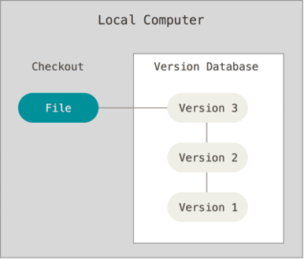
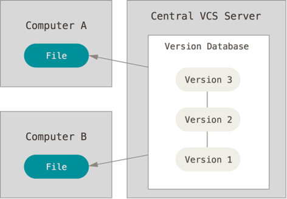
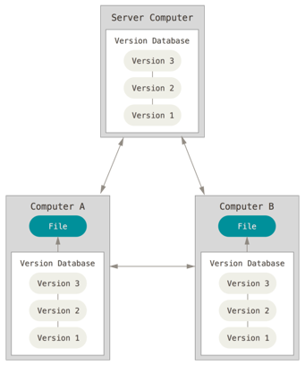
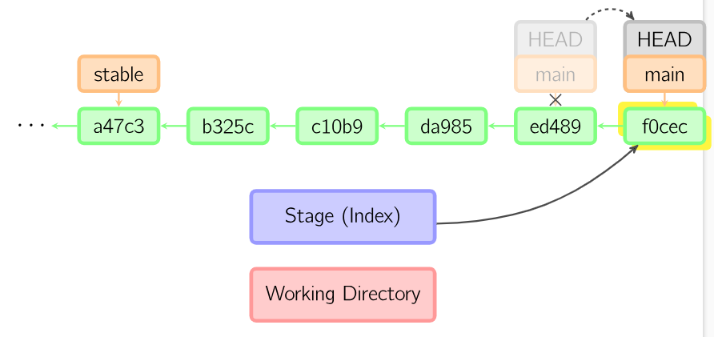
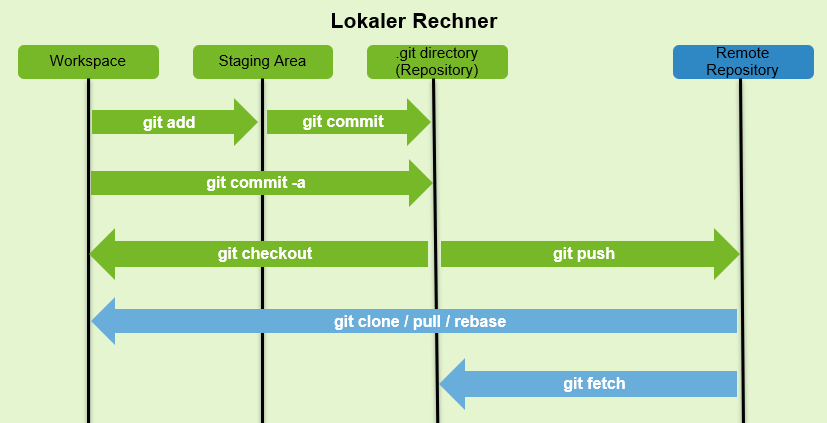
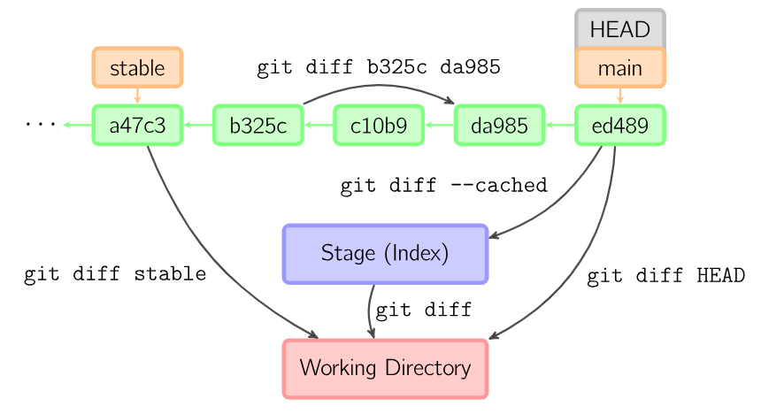
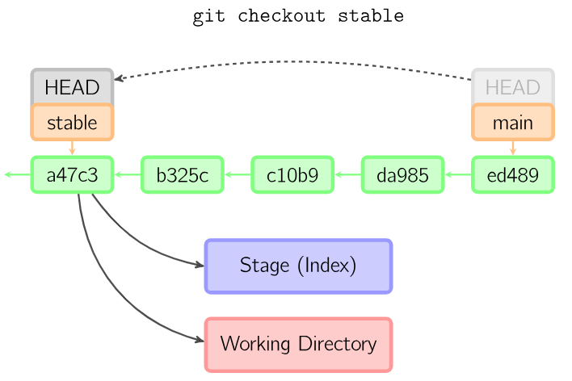

class: center, middle

## [Software Engineering](../../praesentationen.html)

#### Kapitel x

# Kapitelüberschrift

Max Mustermann

---
# Inhalt
***

1. Einführung

1. Standards

1. Softwaremessung

1. Zusammenfassung

1. Quellen

---
# Einführung

Softwaresysteme sollen "**_fit for purpose_**" sein.

- **Effizient**
- *Zuverlässig*
- Fertigstellung innerhalb eines Zeit- und Kostenrahmens

Die Techniken des Softwarequalitätsmanagements kommen ursprünglich aus der Fertigungsindustrie.

**Qualitätssicherung** ist die Definition von Prozessen und Standards, die zu qualitativ hochwertigen Produkten führen, und die Einführung dieser Qualitätsprozesse in den Fertigungsprozess.

**Qualitätslenkung** ist die Anwendung dieser Qualitätsprozesse, um Produkte auszusieben, die dem geforderten Qualitätsniveau nicht entsprechen.

---
# Einführung

Um die Prozesse in der Softwareentwicklung umzusetzen, stellen die Teams sicher, dass die zuvor festgelegten Standards und Ziele des Unternehmens mit dem Produkt übereinstimmen.


---
# Standards

Softwarestandards spielen eine wichtige Rolle im Qualitätsmanagement.

1. Standards kapseln Erfahrungen, die für das Unternehmen von großem Wert sind.

2. Standards bieten einen Rahmen für die Definition, was "Qualität" innerhalb des Softwareentwicklungsprojektes bedeutet.

3. Standards tragen zur Kontinuität bei, sodass alle Entwickler nach denselben Verfahren arbeiten.

---

# Standards

Standards müssen sich immer positiv auf die Produktqualität auswirken.

**Produktstandards** sollten dabei so entworfen werden, dass sie kosteneffizient angewendet und geprüft werden können.

**Prozessstandards** sollten die Prozesse definieren, die prüfen, dass die Produktstandards eingehalten werden.  

| Rolle | Aufgabe |
|:------:|:----------:|
| **Auftraggeber** | Erteilt den Auftrag und bezahlt das Projekt |
| **Auftragnehmer** | Nimmt die Anforderungen an das Softwareprodukt entgegen|
| **Benutzer** | Benutzen die Software. Manchmal mit Auftraggeber identisch |
| **Manager** | Treffen während des Projekts organisatorische Entscheidungen |
| **Berater** | Unterstützen den Kunden in der Definition der Anforderungen |
| **Informatiker** | Definieren und entwickeln Software in verschiedenen Rollen mit unterschiedlichen Aufgaben aufgeteilt|

---
# Softwareentwicklung

Entwicklungsmethoden:

- _Prüfen von Code, bevor er eingefügt wird:_  
  Entwickler prüfen den Code ihrer Teammitglieder, bevor der Code in die aktuelle Version eingebracht wird.

- _Probleme beheben, sobald sie auftreten:_  
  Probleme sollten sofort behoben werden, wenn sie entdeckt werden, auch wenn der Code von anderen Entwicklern stammt.

---
# Softwaremessung

Bei der Softwaremessung geht es darum, Merkmale eines Softwaresystems zu quantifizieren.

Code block:

```javascript
function add(a, b)
  return a + b
end
```

---
# Markdown

## Paragraph

Paragraph mit **strong**, *italic*, `code`.

Links so [github](https://github.com/) oder so https://github.com/ .

## Tabelle

|ID|Name|Value|
|--|----|-----|
| 1|foo |   10|
| 2|bar |   20|


---
# Aufzählung

1. Nummer 1
    - bullet 1
    - bullet 2
2. Nummer 2
    1. child 1
    2. child 2
3. Nummer 3

## Enumeration 

* A
* B

---
# Zusammenfassung

- Folien werden mit `---` voneinander abgetrennt (Achtung: kein Leerzeichen am Ende)
- Bilder, Diagramme etc. im `media`-Unterverzeichnis speichern
- Wird die Datei `remark-latest.min.js` heruntergeladen, können die Folien offline bearbeitet werden. Pfad im `script`-Tag anpassen.
- [Remark.js](https://remarkjs.com/)

---
class: center, middle

# Fragen?

---
# Quellen
***

- Kitchenham, B. (1990). Software Development Cost Models. 487-517.

- Chidamber, S., and C. Kemerer. (1994). A Metrics Suite for Object-Oriented Design. 476-493.

---
class: center, middle

## Version control systems 

---

### Wofür braucht man Versionverwaltung?

Kollaboration
  - Teilen von Sourcecode + gemeinsames arbeiten am Sourcecode

Dokumentation
  - Protokollieren von Änderungen in Dateien/Verzeichnissen
  - Wer hat was wann geändert?

Sicherheit
  - immer eine Kompilierbare Version
  - Es existieren Sicherungskopieren
  - Wiederherstellen alter Versionen möglich

---

### Local Version Control Systems - Lokale Versionsverwaltung

- Dokumentation

- Sicherheit (mit Einschränkungen)



---

### Centralized Version Control Systems - Zentrale Versionsverwaltung

- Dokumentation

- Kollaboration

- Unterschiedliche Versionsstände nur auf zentralem Server (Repository)

- Verbindung zum Server notwendig



---

### Distributed Version Control Systems - Dezentrale Versionsverwaltung

- Dokumentation

- Kollaboration

- Sicherheit
  - Lokaler Klon
  - Keine Verbindung zum Server (Remote Repository) notwendig
  - Komplette Historie



---

## GIT

- Software für Dezentrale Versionsverwaltung

- Freie Softwaresammlung (Open Source)

- Konsolenanwendung 
  - Grafische Benutzeroberfläche (GUI) verfügbar

- Linux 
  - in der Regel integriert

- Windows/Max
  - GIT SCM -> Linux Konsole enthalten


---

## Git

### Eine kurze Git-Historie

- Entwicklung des Linux-Kernels
  - 1991-2002: Änderugen am Kernel wurden als Patches  verteilt
  - 2002: Einsatz von BitKeeper
  - 2005: Beziehung zwischen der Linux Community und dem kommerziellen Unternehmen, welches Bitkeeper entwickelte zerbrac. Bitkeeper war nicht mehr kostenlos
  - Linus Torvalds und die Linux Community entwickeln ein eigenes besseres BitKeeper -> Git
    - Einfache und effiziente Arbeitsweise nach dem ***KISS-Prinzip***
    - Kein zentraler Server benötigt
    - Unterstützung vieler Übertragungsprotokolle
    - Absicherung
    - Umfangreiche Arbeiten ohne Internetzugang möglich


---

### Git Grundlagen

#### Anlegen eines Repositories

1. Repository erstellen mit               $ git init "verzeichniss"

2. Bestehendes Git-Repository klonen mit  $ git clone "repo"

---

#### git commit

- Commits sind Schappschüsse von allen getrackten Daten
- Bei jedem Commit wird ein Abbild von allen Dateien erstellt
- Mit git commit erstellt man einen neuen Commit, also ein neues Abbild, das zur nächsten Version nach dem Vorherigen Commit wird.
- Jeder Commit bekommt eine einzigartige Commit ID 



#### Lokaler Umgang mit Daten

- Working Directory
  - Abbild einer konkreten Version des Projektes an der man arbeiten kann

- Staging Area
  - Enthält die Informationen über Änderungen für den nächsten Commit

- Local Repository
  - Komprimierte Datenbank mit Historie
  - Metadaten (Wer, was, etc.)
  - Commited
    - Alles was Commited ist, ist sicher in der Datenbank gespeichert 

 

---

### Git Grundlagen

#### Umgang mit Remote Repository

Wichtige Befehle


---

### Git Grundlagen 

#### git diff

- Der diff Befehl zeigt Änderungen zwischen commits und zwischen dem Working Directory und der Staging area

- Es können zum Beispiel die codes der zu vergleichenen commits als Argumente mit gegeben werden



---

### Git Grundlagen

#### git checkout

- Mit dem Checkout-Befehl kopiert man die Dateien eines beliebigen Commits in den eigenen Workspace.
- Man kann auch zu Commits von anderen Branches wechseln
- Als Befehlsargumente kann man entweder die Namen der Tags oder Branches angeben, oder die ID des Commits
- Außerdem können bestimmte Dateien eines Commits geladen werden, wenn man die Dateinamen angibt



---

### Git Grundlagen

#### git reset

- git reset verschiebt den Zeiger des aktuellen Branches auf einen anderen Commit
- 
