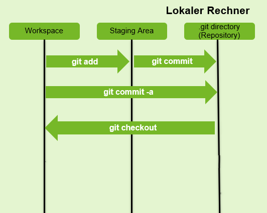
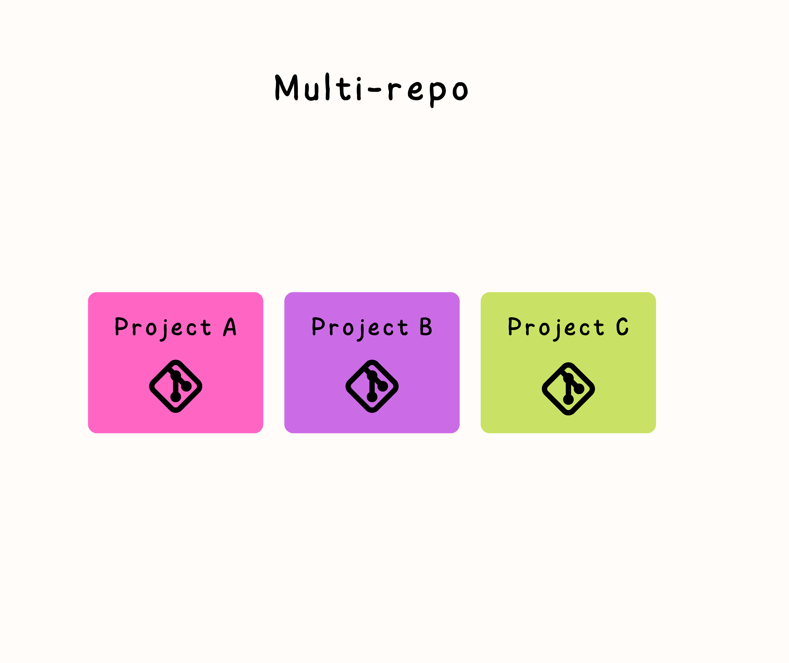
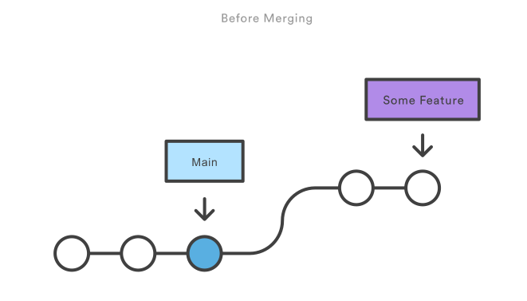
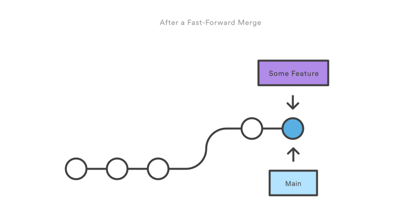
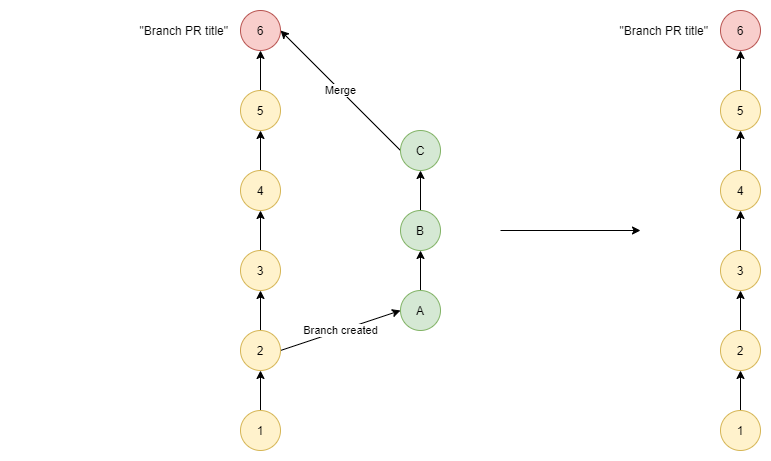
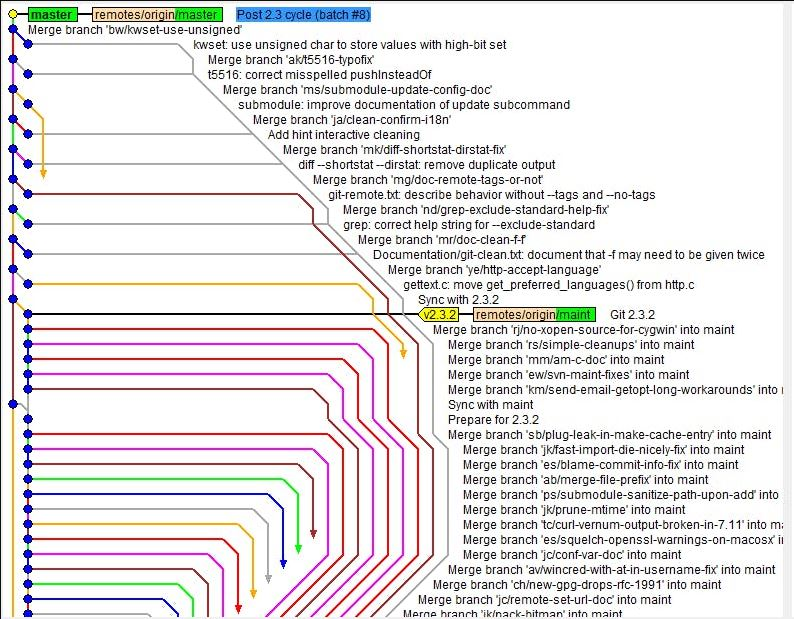
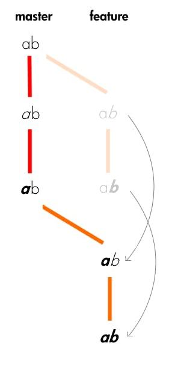

class: center, middle

## [Software Engineering](../../praesentationen.html)

#### Kapitel 3

# Versionskontrollsysteme - AI-driven development - Code-Handling

Bjarne Zaremba - Danny Meihöfer

---
# Inhalt
***

1. Versions control systems

---
class: center, middle

## Lernziele für dieses Kapitel
- Was sind Versionsverwaltungssysteme?
- Was sind Remote Repositories?
- Wie benutze ich Git?
  - Was für Arbeitsabläufe gibt es?
- Was ist AI-Driven Development?

## Version control systems

---

### Wofür braucht man Versionverwaltung?

Kollaboration
  - Teilen von Sourcecode + gemeinsames arbeiten am Sourcecode

Dokumentation
  - Protokollieren von Änderungen in Dateien/Verzeichnissen
  - Wer hat was wann geändert?

Sicherheit
  - immer eine Kompilierbare Version
  - Es existieren Sicherungskopieren
  - Wiederherstellen alter Versionen möglich

---

### Local Version Control Systems - Lokale Versionsverwaltung

- Dokumentation

- Sicherheit (mit Einschränkungen)

---

### Centralized Version Control Systems - Zentrale Versionsverwaltung

- Dokumentation

- Kollaboration

- Unterschiedliche Versionsstände nur auf zentralem Server (Repository)

- Verbindung zum Server notwendig

---

### Distributed Version Control Systems - Dezentrale Versionsverwaltung

- Dokumentation

- Kollaboration

- Sicherheit
  - Lokaler Klon
  - Keine Verbindung zum Server (Remote Repository) notwendig
  - Komplette Historie

---

## GIT

- Software für Dezentrale Versionsverwaltung

- Freie Softwaresammlung (Open Source)

- Konsolenanwendung 
  - Grafische Benutzeroberfläche (GUI) verfügbar
  - Die meisten Funktionen werden über die Konsole ausgeführt

- Linux 
  - in der Regel integriert

- Windows/Mac
  - GIT SCM -> Linux Konsole enthalten

---

## Git

### Eine kurze Git-Historie

- Entwicklung des Linux-Kernels
  - 1991-2002: Änderugen am Kernel wurden als Patches  verteilt
  - 2002: Einsatz von BitKeeper
  - 2005: Beziehung zwischen der Linux Community und dem kommerziellen Unternehmen, welches Bitkeeper entwickelte zerbrac. Bitkeeper war nicht mehr kostenlos
  - Linus Torvalds und die Linux Community entwickeln ein eigenes besseres BitKeeper -> Git
    - Einfache und effiziente Arbeitsweise nach dem ***KISS-Prinzip***
    - Kein zentraler Server benötigt
    - Unterstützung vieler Übertragungsprotokolle
    - Absicherung
    - Umfangreiche Arbeiten ohne Internetzugang möglich

---

### Git Grundlagen

#### Anlegen eines Repositories

1. Repository erstellen mit               $ git init "verzeichniss"

2. Bestehendes Git-Repository klonen mit  $ git clone "repo"

---

### Git Grundlagen

#### git commit

- Commits sind Schappschüsse von allen getrackten Daten
- Bei jedem Commit wird ein Abbild von allen Dateien erstellt
- git commit verschiebt die Änderungen vom Staging Bereich in das lokale Repository
- Jeder Commit bekommt eine einzigartige Commit ID 
- git commit -m "Nachricht" erstellt einen neuen Commit mit der Commitnachricht

---

### Git Grundlagen

#### git commit - Die commit Nachricht

Jeder Commit bekommt eine Commit Nachricht, die die Änderungen beschreibt

- Mit git commit -m ***"Nachricht"*** erstellt man einen neuen Commit mit der Commitnachricht
- Wird nicht direkt eine Nachricht angegeben, öffnet sich ein Editor in dem die Nachricht eingegeben werden kann

---

### Git Grundlagen

#### git commit - Die commit Nachricht

Für die Commit Nachricht gibt es generelle Konventionen:

- Die erste Zeile sollte eine kurze Zusammenfassung sein (max. 72 Zeichen pro Zeile)
- Nach der ersten Zeile sollte eine Leerzeile folgen
- Danach kann eine ausführlichere Beschreibung folgen (max. 72 Zeichen)
  - Die Beschreibung sollte erklären welche und warum die Änderungen gemacht wurden (nicht wie)
- Die Commit Nachricht sollte in der Gegenwartsform und im Imperativ geschrieben werden
  - "Add feature" statt "Added feature"
  - "Fix bug" statt "Fixed bug"
- Die Commits die von Git selbt erstellt werden sehen folgen diesem Schema
- Stichpunkte sind auch möglich (mit "- Info")

---
### Git Grundlagen

#### git commit - Die commit Nachricht

Welche Infos gehören in die Commit Nachricht?
- Was wurde geändert?
- Warum wurde es geändert?
- Was für Auswirkungen hat die Änderung?

Woran muss man denken?
- Der Reviewer muss die Änderungen verstehen können
- Der Reviewer kennt den Kontext nicht
- Der Code ist nicht selbsterklärend
- Die Zusammenfassung in der ersten Zeile ist am wichtigsten

Man kann die allgemeinen Guidelines hier genauer nachlesen: https://gist.github.com/robertpainsi/b632364184e70900af4ab688decf6f53

---

### Git Grundlagen

#### Lokaler Umgang mit Daten

- Working Directory
  - Abbild einer konkreten Version des Projektes an der man arbeiten kann

- Staging Area
  - Enthält die Informationen über Änderungen für den nächsten Commit

- Local Repository
  - Komprimierte Datenbank mit Historie
  - Metadaten (Wer, was, etc.)
  - Commited
    - Alles was Commited ist, ist sicher in der Datenbank gespeichert 

---

### Git Grundlagen

#### Lokaler Umgang mit Daten

 

---

### Git Grundlagen

#### Umgang mit Remote Repository

---

### Git Grundlagen

#### Umgang mit Remote Repository

git add "file" | git add . 

- Mit git add werden ungetrackte Dateien dem Staging Bereich hinzugefügt

git push "remote" "branch" | git push

- Mit git push werden die Änderungen vom lokalen Repository auf das Remote Repository übertragen

git pull "remote" "branch" | git pull

- Mit git pull werden die Änderungen vom Remote Repository auf das lokale Repository übertragen

git fetch "remote" "branch" | git fetch

- Mit git fetch werden die Änderungen vom Remote Repository auf das lokale Repository übertragen

---

### Git Grundlagen 

#### git diff

- git diff "commit1" "commit2" | git diff "commit" | git diff

- Der diff Befehl zeigt Änderungen zwischen commits und zwischen dem Working Directory und der Staging area

- Es können zum Beispiel die codes der zu vergleichenen commits als Argumente mit gegeben werden

---

### Git Grundlagen

#### git checkout

- git checkout "commit" | git checkout "branch"
- Mit dem Checkout-Befehl kopiert man die Dateien eines beliebigen Commits in den eigenen Workspace.
- Man kann auch zu Commits von anderen Branches wechseln
- Als Befehlsargumente kann man entweder die Namen der Tags, der Branches, oder die ID des Commits angeben
- Außerdem können bestimmte Dateien eines Commits geladen werden, wenn man die Dateinamen angibt

---

### Git Grundlagen

#### git reset

- git reset "commit" | git reset --soft "commit" | git reset --mixed "commit" | git reset --hard "commit"
- git reset verschiebt den Zeiger des aktuellen Branches auf einen anderen Commit
- Es gibt drei verschiedene Modi
  - --soft
    - Der Zeiger wird verschoben, aber die Änderungen bleiben im Staging Bereich
  - --mixed
    - Der Zeiger wird verschoben und die Änderungen werden aus dem Staging Bereich entfernt
  - --hard
    - Der Zeiger wird verschoben und die Änderungen werden aus dem Staging Bereich entfernt und aus dem Workspace gelöscht

---

### Git Grundlagen

#### git reset

---

### Git Grundlagen

#### git merge

- git merge "branch" | git merge "commit"
- git merge erzeugt einen neuen Commit, der die Änderungen mehrerer Commits zusammenführt
- Merge-Konflikte entstehen wenn zwei Commits die gleiche Datei verändern
- Merge-Konflikte werden versucht automatisch zu lösen, wenn das nicht möglich ist, muss der Nutzer die Konflikte manuell lösen

- Es gibt zwei verschiedene Modi
  - Fast-Forward
    - Die Commits werden einfach hintereinander gehängt
    - Nur möglich wenn ein linearer Commit-Verlauf vorliegt
  - 3-Way-Merge
    - Es wird ein neuer Commit erzeugt, der die Änderungen der beiden zu mergenden Commits zusammenführt

---

### Git Grundlagen

#### git merge

Ein Branch

Zwei Branches

---

### Git Grundlagen

#### git Cherry pick

- git cherry-pick "commit"
- git cherry-pick erzeugt einen neuen Commit, der die Änderungen eines anderen Commits übernimmt
- Damit kann man einzelne Commits aus anderen Branches übernehmen

---

### Git Grundlagen

#### git rebase

- git rebase "branch"
- git rebase verschiebt die Commits eines Branches auf einen anderen Branch
- Alternative zu git merge 
- Erzeugt einen linearen Commit-Verlauf

---

### Git Grundlagen

#### git branch

git branch "name" | git branch

Arbeiten mehrere Entwickler an einem Projekt, ist es sinnvoll, dass für jeden Entwickler, oder für jedes Feature ein eigener Branch erstellt wird.

Jeder Branch hat eine eigene Historie und beeinträchtigt die anderen nicht

- git branch "name" erstellt einen neuen Branch mit dem gewünchten Namen
- git branch zeigt alle Branches an

---

### Git Grundlagen

#### git branch

---

### Git Grundlagen

#### git switch

- git switch "branch"
- git switch wechselt den aktuellen Branch
- git switch -c "branch" erstellt einen neuen Branch und wechselt zu diesem

Switch ist eine neuere Version von checkout

---
class: center, middle

## Multirepos vs. Monorepos
Zwei verschiedene Ansätze zur Verwaltung von Sourcecode

---

### Multirepos

- Ein Projekt besteht aus mehreren Repositories
- Ein Repository enthält nur einen Teil des Projektes
- Im Extremfall haben alle Bibliotheken und Dienste ein eigenes Repository
- Das Projekt wir in mehrere Projekte aufgeteilt

---

### Multirepos

#### Vorteile

- Jedes Repository kann unabhängig und isoliert von den anderen Repositories entwickelt werden
- Versionen können unabhängig voneinander veröffentlicht werden
- Zugriffsrechte können für jedes Repository einzeln vergeben werden

#### Nachteile

- Abhängigkeiten zwischen den Repositories müssen verwaltet werden
- Die Abhängigkeiten müssen in den Repositories dokumentiert werden
- Die Teams sind getrennt und müssen sich absprechen

---

### Monorepos

- Ein Projekt besteht aus einem Repository
- Alle Teile des Projektes werden in einem Repository verwaltet
- Im Extremfall ist das gesamte Projekt in einem Repository

---

### Monorepos 

#### Vorteile

- Alle Teile des Projektes sind in einem Repository
- Über ein Repository hat man Zugriff auf das gesamte Projekt und alle Abhängigkeiten
- Einsicht in das gesamte Projekt
- Issues können über das gesamte Projekt hinweg verfolgt werden
- Teams können sich besser absprechen

#### Nachteile

- Langsamere Entwicklungszyklen
  - Einzelne Teile des Projektes können nicht unabhängig voneinander veröffentlicht werden
- Zugriffsrechte können nur für das gesamte Projekt vergeben werden
- Erfordert eine gute Strukturierung des Projektes
- Erfordert den Download des gesamten Projektes

---

### Submodules

- Submodules sind Repositories, die in einem anderen Repository eingebunden sind
- Der Inhalt des Submodules wird in einem Unterordner des Hauptrepositories gespeichert
- Der Vorteil ist die Trennung der Repositories
  - Zwei Repositories funktionieren miteinander
  - Wird ein Commit in einem Repository gemacht, wird das andere Repository nicht automatisch aktualisiert
  - Getrennte Versionsgeschichte
  - Einfaches aktuallisieren des Submodules
  - Vorteil für das Einbinden von Tools und Bibliotheken

- Wie füge ich ein Submodule hinzu?
  - git submodule add "url"

---

### Pull requests

- Pull requests sind Features von Git-Hosting-Plattformen wie z.B. GitHub oder GitLab
- Arbeitet man an einem Projekt mit mehreren Entwicklern, auf verschiedenen Branches ist es sinnvoll, dass die Änderungen von anderen Entwicklern vor dem Zusammenführen geprüft werden

Prozess:
1. Entwickler erstellt einen neuen Branch
2. Entwickler arbeitet an dem Branch
3. Entwickler erstellt einen Pull Request
4. Der Entwickler und andere Entwickler prüfen den Pull Request
5. Der Pull Request wird akzeptiert und der Branch wird in den Master gemerged, oder der Pull Request wird abgelehnt und der Branch wird nicht gemerged

---

class: center, middle

## Branching Strategien
Bekannte Branching Strategien für die Entwicklung mit Git im Überblick

---

## Branching Strategien

### Trunk Based Development

- Es gibt nur einen Branch
- Alle Entwickler arbeiten auf dem Branch
- Es gibt keine, oder maximal sehr kleine extra Branches für Features
- Es gibt keine Branches für Releases
- Es wird häufig commited und gepusht

---

## Branching Strategien

### Trunk Based Development

#### Vorteile

- Einfach zu verstehen
- Nicht so große Konflikte beim Zusammenführen von Branches, da öfter zusammengeführt wird
- Kleine Änderungen können schnell veröffentlicht werden

#### Nachteile

- Keine, oder wenig Isolation von Features
  - Komplexe Features können nicht unabhängig voneinander entwickelt werden
- Keine, oder wenig Isolation von Releases
- Wenig experimentieren
  - Neue Features können nicht einfach ausprobiert werden

---

## Branching Strategien

### Long Lived Branches

- Es gibt einen Master Branch
- Von dem Master Branch werden für jedes Feature Branches abgezweigt
- Die Features werden wenn sie fertig sind in den Master Branch gemerged
- Mehrere Features können gleichzeitig entwickelt werden
- Viele Branching Strategien basieren auf dieser Strategie

---

## Branching Strategien

### Long Lived Branches

#### Vorteile

- Isolation von Features
  - Features können unabhängig voneinander entwickelt werden
- Isolation von Releases
- Große Änderungen können in einem Branch entwickelt werden, ohne den Master Branch zu beeinträchtigen

#### Nachteile

- "Merge Hell" Große Konflikte beim Zusammenführen von Branches
- Lange Entwicklungszyklen
  - Features können erst veröffentlicht werden, wenn sie fertig sind
- Kommunikation zwischen den Entwicklern ist wichtig
  - Es kann passieren, dass zwei Entwickler an dem gleichen Feature arbeiten, oder andere Missverständnisse entstehen
- Unübersichtlich wenn viele Branches existieren

---

## Branching Strategien

### Git Flow

- Git Flow ist eine Branching Strategie, die auf Long Lived Branches basiert
- Zusammenspiel aus: 
  - Feature Branches
  - Release Branches
  - Hotfix Branches
  - Master Branch
  - Develop Branch

**Wie sieht das aus?**

---

## Branching Strategien

### Git Flow

---

## Branching Strategien

### Github Flow

- Github Flow ist eine Simplere alternative zum Git Flow
- Er wird oft für kleinere Teams und Projekte verwendet
- Nur Master Branch + Feature Branches
- Feature Branches werden direkt in den Master Branch gemerged
- Releases werden direkt vom Master Branch abgezweigt und mit einem Tag versehen
- Hotfixes werden direkt in den Master Branch gemerged

Wie sieht das aus?
---

## Branching Strategien

### Github Flow

---
class: center, middle

## Merging Strategien
Um die Zusammenführung von Branches zu vereinfachen, gibt es verschiedene Merging Strategien

---

## Merging Strategien

### Merge Commit

git merge "branch" | git merge "commit"

Der Merge Commit ist die Standard Merge Strategie von Git
- Es wird ein neuer Commit erzeugt, der die Änderungen der beiden zu mergenden Branches zusammenführt
- Merge-Konflikte werden versucht automatisch zu lösen, wenn das nicht möglich ist, muss der Nutzer die Konflikte manuell lösen
- Die Historie beider Branches bleibt erhalten

Before | After 
--- | ---
 | 

---

## Merging Strategien

### Fast Forward

- Fast Forward bedeutet, dass die Commits eines Branches einfach hintereinander gehängt werden
- Ist nur möglich wenn ein linearer Commit-Verlauf vorliegt

Before | After 
--- | ---
 | 

---

## Merging Strategien

### Squash and Merge

git merge --squash "branch" | git merge --squash "commit"

- Squash and Merge ist eine Merge Strategie von GitHub
- Es wird ein neuer Commit erzeugt, der die Änderungen der beiden zu mergenden Branches zusammenführt
- **Alle Commits des zu mergenden Branches werden zu einem Commit zusammengefasst**
  - Nicht wie beim Rebase
  - Historie geht verloren

---

## Merging Strategien

### Squash and Merge

---

## Merging Strategien

### Rebase und Merge

- Wenn man viele Branches hat, kann es passieren, dass die Historie sehr unübersichtlich wird

---

## Merging Strategien

### Rebase und Merge

git rebase "branch" | git rebase "commit" 

- git rebase master verschiebt die Commits auf dem aktuellen Branch auf den Master Branch
- Üblicherweise sowas wie git checkout feature; git rebase master

- Rebase und Merge ist eine Merge Strategie von GitHub

- Die Historie wird linearisiert (Eine Linie)

- Alle Commits des zu mergenden Branches werden an den anderen Branch angehängt

- Optional mit Squash and Merge kombinierbar

---

## Merging Strategien

### Rebase und Merge

Mit normalem Merge | Mit Rebase und Merge
--- | ---
 | 

---
class: center, middle

## AI-driven development

---

## AI-driven development

### Was ist AI-driven development?

Künstliche Intelligenz (KI) ist ein Teilgebiet der Informatik, welches sich mit der Automatisierung intelligenten Verhaltens und dem maschinellen Lernen befasst

AI-driven development ist die Anwendung von KI in der Softwareentwicklung

Was können die AI-Tools?
- Code generieren
- Code analysieren
  - Fehler finden
  - Code verbessern
  - Code dokumentieren
  - Code optimieren
- Code testen
- Code übersetzen (z.B. von Java nach C#)

---

## AI-driven development

### Conversational AI vs. Generative AI

Aspekt | Conversational AI | Generative AI
--- | --- | ---
Focus | Menschliche Interaktion und Kommunikation | Generieren von kreativen und originellen Inhalten
Anwendungen | Chatbots, Sprachassistenten, etc. | Textgenerierung, Bildgenerierung, etc.
Input | Versteht menschliche Sprache | Lernt Mustern aus Daten und generiert neue Daten
Output | Antwort auf eine Nachricht mit Kontext | Generiert neue Daten, basierend auf den gelernten Mustern
Beispiele | Siri, Alexa, Google Assistant | Deepfakes, Textgenerierung, Bildgenerierung

---

## AI-driven development

### Prompt Engineering

Die Qualität der generierten Daten hängt von der Qualität des Inputs ab

Ein Prompt ist ein Input für ein AI-Tool
- Ein Prompt kann ein Text, ein Bild, oder ein Code sein
- Ein Prompt kann eine Frage, oder eine Anweisung sein
- Ein Prompt kann eine Beschreibung sein, oder ein Beispiel
- Ein Prompt kann eine Kombination aus allem sein

Anhand der Prompts lernt das AI-Tool Muster und generiert neue Daten

Prompt Engineers erstellen Prompts für AI-Tools
- Prompts müssen gut formuliert sein
- Prompts müssen gut strukturiert sein

Oft müssen Prompts mehrmals angepasst werden, bis das AI-Tool die gewünschten Ergebnisse liefert

---

## AI-driven development

### AI-Tools für Softwareentwicklung

Es gibt viele AI-Tools für die Softwareentwicklung

Zwei der bekanntesten sind:
- GitHub Copilot
- Chat GPT

Beide Tools können Text und Code generieren
- Die Anwendungsfälle sind aber unterschiedlich

---

## AI-driven development

### AI-Tools für Softwareentwicklung

#### GitHub Copilot

Github Copilot ist ein AI-Tool, welches von GitHub entwickelt wurde
- Es basiert auf OpenAI Codex
- Generative AI

Der Copilot schlägt Entwicklern Code in der IDE vor
- Der Entwickler kann den Code dann übernehmen, oder nicht
- Der Copilot lernt aus dem Code des Entwicklers und schlägt immer besseren Code vor
- Der Copilot kann auch Code aus anderen Repositories vorschlagen
- Der Copilot erkennt Muster im eigenen Code und schlägt Code vor, der diese Muster verwendet

Neben Code kann der Copilot auch Kommentare und Dokumentation vorschlagen

---

## AI-driven development

### AI-Tools für Softwareentwicklung

#### GitHub Copilot

- Der Copilot wurde mit Prompts trainiert, die von GitHub und OpenAI erstellt wurden
- Die Daten basieren unter anderem auf öffentlichen GitHub Repositories
  - Neben Code können auch viele anderen Informationen aus den Repositories gelernt werden

---

## AI-driven development

### AI-Tools für die Softwareentwicklung

#### Chat GPT

Chat GPT ist ein AI-Tool, welches von OpenAI entwickelt wurde

- Generative AI und Conversational AI

Chat GPT kann Text generieren

- Der Nutzer gibt einen Text vor und Chat GPT generiert einen neuen Text
- Man kann Chat GPT auch Fragen stellen, oder sich mit ihm unterhalten

---

## AI-driven development

### AI-Tools für die Softwareentwicklung

#### Chat GPT

Die Daten basieren vorallem aus dem Internet

- Durch die große Menge an Daten kann Chat GPT sehr gut lernen
- Vielseitigkeit der Daten = Vielseitigkeit von Chat GPT

Es gibt ChatGpt Api's für verschiedene Programmiersprachen

- Mit den Api's können Entwickler Chat GPT in ihre Programme einbinden
- Benutzerdefinierte Prompts können erstellt werden
- Daten können automatisch analysiert und generiert werden

---

## Best Practices for googling

Das nachgucken von Dokumentation ist ein wichtiger Teil der Softwareentwicklung

Google ist dafür das perfekte Mittel

- Oft muss man nach einer Lösung für ein Problem suchen
- Manchmal ist es schneller nach einer Lösung zu googlen, als sie selbst zu entwickeln
- Manchmal ist es schneller nach einer Lösung zu googlen, als die Dokumentation zu lesen

Die Qualität der Suchergebnisse hängt von der Suchanfrage ab

- Eine undeutliche Suchanfrage liefert schlechte Ergebnisse

---

## Best Practices for googling

**Wie google ich richtig?**

- Eine gute Suchanfrage ist simpel und präzise
- Vermeide wiederholte und unwichtige Wörter
- Manchmal ist es besser die Suche auf zu teilen
- Eine gute Suchanfrage enthält nur die wichtigsten Informationen
- Automatische Vervollständigung ist hilfreich

**Remember!**

- Jedes Wort in der Suchanfrage ist wichtig
  - Die Reihenfolge der Wörter ist wichtig
  - Ein einziges Wort kann den Unterschied zwischen guten und schlechten Ergebnissen machen
- Unwichtig sind Dinge wie:
  - Rechtschreibung
  - Groß- und Kleinschreibung
  - Satzzeichen
  Solange es nicht zu Missverständnissen führt
- Denke kritisch
  - Nicht alles was im Internet steht ist wahr, aktuell, oder gut
  - Nutze die Möglichkeit mehrere Quellen zu vergleichen

---

## Best Practices for googling

### Search Operators

Es gibt viele Suchoperatoren, die die Suche verbessern können

Beispiele für Suchoperatoren:

- Anführungszeichen ""
  - "Suche nach einem bestimmten Wort"
- Minus -
  - Bestimmte Wörter in der Suche ausschließen
- Sternchen *
  - Platzhalter für ein Wort

Eine Liste mit vielen weiteren Suchoperatoren gibt es hier: https://blog.hubspot.de/marketing/google-suchoperatoren

---

## Verständnisfragen

1. Was ist ein Versionsverwaltungssystem?
2. Was ist der Unterschied zwischen einem zentralen und einem dezentralen Versionsverwaltungssystem?
3. Wer hat Git entwickelt?
4. Wie kann man Git steuern?
5. Wie kann man eine Änderung auf das Remote Repository übertragen?
6. Wie macht man einen Commit und was sollte in der Commit Nachricht stehen?
7. Wie erstellt man Branches und wechselt zwischen ihnen?
8. Was ist der Unterschied zwischen einem Merge und einem Rebase?
9. Was ist der Unterschied zwischen einem Monorepo und einem Multirepo?
10. Warum sind pull requests sinnvoll?
11. Was ist eine Branching Strategie?
12. Was ist der Unterschied zwischen Git Flow und Github Flow?
13. Worauf muss man achten, wenn man AI Tools benutzt?
14. Wie sollte eine Google Suchanfrage aussehen?

## Quellen

Mono- vs Multirepos
https://kinsta.com/de/blog/monorepo-vs-multi-repo/

Gitbefehle
https://marklodato.github.io/visual-git-guide/index-en.html

Gitflow
https://lucamezzalira.com/2014/03/10/git-flow-vs-github-flow/

Githubflow
https://www.abtasty.com/blog/git-branching-strategies/#github-flow

Merges
https://www.atlassian.com/de/git/tutorials/using-branches/git-merge

Mergesquash
https://lukemerrett.com/different-merge-types-in-git/

Rebase
https://hackernoon.com/git-merge-vs-rebase-whats-the-diff-76413c117333

Conversational vs Generative AI 
https://www.datasciencecentral.com/a-complete-guide-conversational-ai-vs-generative-ai/#:~:text=Conversational%20AI%20is%20characterized%20by,art%2C%20music%2C%20and%20texts.

Copilot 
https://github.com/features/copilot

Google
https://www.google.de/?hl=de