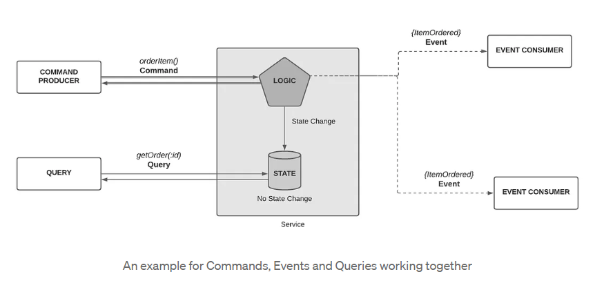
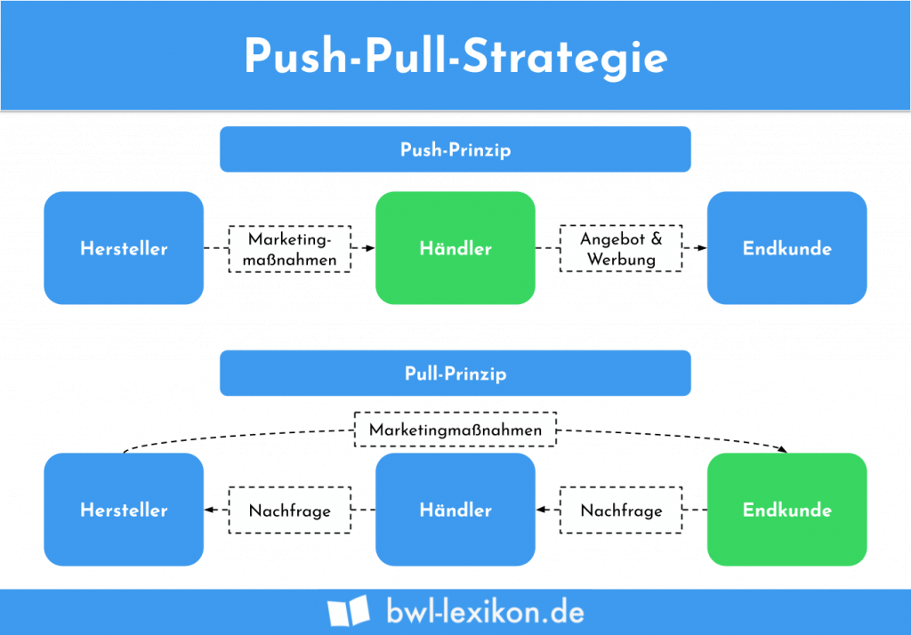
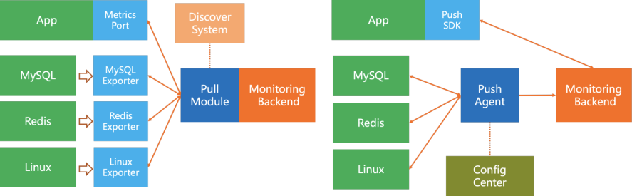

# Kapitel 4 (Softwaresystemintegration - Softwaresystemschnittstellen)

**Autoren:** Danny Meihöefer - Bjarne Zaremba

## Lernziele für dieses Kapitel

Nach diesem Kapitel sollen folgende Aspekte klarer geworden sein:

- Was ist der Unterschied zwischen Command und Query?
- Was ist der Unterschied zwischen synchroner und asynchroner Kommunikation?
- Was für Protokolle gibt es für die Kommunikation zwischen Systemen?
- Was ist Serialisierung?
- Was gibt es für verschiedene Software System Interfaces?
- Was ist eine API?
- 

## Software system integration

## Kommunikation

Verschiedene Teile eines verteilten Softwaresystems müssen häufig miteinander kommunizieren, um Daten zwischeneinander auszutauschen. Dazu gibt es verschiedene Möglichkeiten, die sich in ihrer Komplexität und ihren Eigenschaften unterscheiden. Systeme müssen entweder Anfragen an andere senden, oder auf Anfragen reagieren.

### Command

Kommandos sind Aufforderungen, die ein System an ein anderes sendet, damit dieses eine Aktion ausführt. Das System, das das Kommando empfängt, ist für die Ausführung verantwortlich. Oft, aber nicht immer erwartet der Sender eine Antwort. In dem Kommando sind können Daten enthalten sein, die für die Ausführung der Aktion benötigt werden.

### Query

Bei einem Query handelt es sich nicht um die Aufforderung etwas zu tun, sondern um eine Anfrage nach Daten. Ein Sender der Query möchte von dem Empfänger bestimmte Daten erhalten. Der Empfänger hat, oder ist in der Regel ein Datenspeicher, der die Daten bereitstellt. In der Query kann der Sender genau angeben was für Daten er benötigt. Man muss aber nicht genau bestimmen welche Datei man genau möchte. Man kann auch nach Eigenschaften suchen. Ein Beispiel für eine Query ist also eine Suche nach einem Blauen Auto. Der Empfänger der Query sucht dann in seinem Datenspeicher nach allen Autos, die Blau sind und sendet diese zurück. 

Sehr verbreitete Abfragesprachen sind SQL und GraphQL. SQL ist eine Abfragesprache für relationale Datenbanken. GraphQL ist eine Abfragesprache für beliebige Datenspeicher. Sie bieten Funktionen um Daten zu filtern, zu sortieren und zu gruppieren.

### Event

Ein Event unterscheidet sich von einem Kommando dadurch, dass es nicht an ein bestimmtes System gesendet wird, sondern an alle Systeme, die sich dafür interessieren. Ein Event ist eine Nachricht, die über ein Ereignis informiert. Das Ereigniss kann ein Zustandswechsel sein, oder eine Aktion, die ausgeführt wurde. Ein System, das ein Event empfängt, kann dann selbst entscheiden, ob udn wie es darauf reagiert oder nicht. Der Sender vom Event erwartet im Gegensatz zu einem Kommando weder eine Antwort noch eine Reaktion. In einem Event können auch Informationen enthalten sein, die für die Reaktion auf das Ereignis benötigt werden.



### Synchrone Kommunikation

Bei synchroner Kommunikation wartet der Sender einer Nachricht auf eine Antwort vom Empfänger. Der Sender kann erst weiterarbeiten, wenn er die Antwort erhalten hat. Der Empfänger sollte die Nachricht also sofort verarbeiten und eine Antwort senden, denn wenn der Empfänger nicht antwortet, oder die Antwort verloren geht, ist der Sender blockiert. Will man, dass trotzdem weitergearbeitet wird muss man mehrere Threads verwenden. Das ist aber besonders anspruchsvoll für das System.

Ein RPC - Remote Procedure Call ist ein Beispiel für synchrone Kommunikation. Bei einem RPC wird eine Funktion auf einem anderen System aufgerufen. Der Aufrufer wartet dann auf die Antwort. Der Aufrufer kann erst weiterarbeiten, wenn er die Antwort erhalten hat. Wenn die Funktion sehr lange dauert, muss der Aufrufer sehr lange warten, bevor er weiterarbeiten kann. 


### Asynchrone Kommunikation

Im Gegenstaz zur synchronen Kommunikation wartet der Sender einer Nachricht bei asynchroner Kommunikation nicht auf eine Antwort vom Empfänger. Der Sender kann also sofort weiterarbeiten, nachdem er die Nachricht gesendet hat. Es ist also kein Problem, wenn der Empfänger die Nachricht erst später verarbeitet. Selbst wenn der Empfänger die Nachricht nie verarbeitet, bekommt der Sender davon nichts mit. Oft wird diese Art der Kommunikation über sogenannt Message Broker durchgeführt. Diese sind dafür verantwortlich, die Nachrichten zu empfangen und richtig zu verteilen.

## Patterns

Da es verschiedene Ansätze für die Kommunikation zwischen Systemen gibt, gibt es auch konkrete Muster, die diese genauer beschreiben.

### Publish-Subscribe

Das Publish-Subscribe Pattern ist besonders wichtige für eventgesteuerte Kommunikation. Die Veröffentlichung des Events ist der Publish-Teil. Jeder, der sich für das Event interessiert, kann sich dafür registrieren. Das ist der Subscribe-Teil. Wenn das Event dann veröffentlicht wird, wird es an alle Subscriber verteilt. Die Subscriber können dann selbst entscheiden, ob und wie sie auf das Event reagieren. Das ganze System ist also sehr lose gekoppelt. Der Publisher muss nicht wissen, wer sich für das Event interessiert. Die Subscriber müssen nicht wissen, wer das Event veröffentlicht. Das ist asynchrone Kommunikation und dieses Model wird in der Regel auch über einen Message / Event Broker umgesetzt.


### Message Queueing

Sendet man mehrere Nachrichten, oder Events an einen Empfänger ist es von Vorteil, wenn er diese empfangen und speichern kann, selbst wenn er gerade eine vorherige Nachricht verarbeitet. Deshalb werden Nachrichten in einer Art Warteschlange gespeichert. Der Empfänger kann also die Nachrichten hintereinander abarbeiten. Die Reihenfolge der Nachrichten wird auch gespeichert. Selbst wenn der Empfänger überhaupt nicht verfügbar ist bleiben die Nachrichten einfach in der Queue gespeichert, bis er sie abarbeiten kann.

  

### Request-Response Model

Das Request-Response Model ist ein sehr einfaches Model für synchrone Kommunikation. Der Sender sendet eine Anfrage an den Empfänger. Der Empfänger verarbeitet die Anfrage und sendet eine Antwort zurück. Der Sender wartet auf die Antwort und kann erst weiterarbeiten, wenn er die Antwort erhalten hat. Der Empfänger kann erst weiterarbeiten, wenn er die Anfrage erhalten hat. Das Model ist also sehr einfach, aber auch sehr unflexibel. Der Sender muss genau wissen, an wen er die Anfrage senden muss. Der Empfänger muss genau wissen, wer die Anfrage gesendet hat. Das Model ist also sehr stark gekoppelt.

Dieses System wird aber trotzdem häufig verwendet, weil es sehr einfach zu implementieren ist. Es ist also ein Kompromiss zwischen Flexibilität und Einfachheit.


### Push-Pull Model

Will ein System Daten an ein anderes System senden gibt es zwei Möglichkeiten. Das System kann die Daten aktiv an das andere System senden. Das ist das Push Model. Andererseits kann das andere System die Daten aber auch aktiv vom ersten System anfordern. Das ist das Pull Model. Beide Modelle haben ihre Vor- und Nachteile. Das Push Model ist sehr einfach zu implementieren. Das Pull Model ist flexibler. Man kann sich das leicht vorstellen wenn man an die Beziehung zwischen einem Hersteller, einem Händler und einem Kunden denkt. Der Hersteller kann über sein Marketing den Händler dazu bringen, seine Produkte zu kaufen. Dieser macht dann ein Angebot und Werbung für die Kunden. Hersteller und Händler senden also aktiv die Informationen nach außen (Push Modell). Es kann aber auch anders herum laufen. Der Kunde kann beim Händler nachfragen, ob er ein bestimmtes Produkt hat. Dieser Fragt dann wiederum den Hersteller an, ob er das Produkt liefern kann. In diesem Fall wollten der Kunde und der Händler Informationen erhalten und hat aktiv nachgefragt (Pull Modell).



In der nächsten Abbildung kann man sehen, wie das in einem Softwarebeispiel aussehen würde.



### Webhooks

Webhooks benutzen das Push Model. Eine Anwendung kann eine HTTP Anfrage an eine bestimmte URL senden. Die Anfrage ist im Prinzip ein Event. Diese URL wird von einer anderen (der Empfänger) Anwendung bereitgestellt. Der Sender muss dabei nicht wissen wer seine Nachricht empfängt. Der Name kommt davon, dass der Empfänger über die URL die er bereitstellt im übertragenden Sinne die Nachricht abfängt (Haken).

## Protokolle

Um die Kommunikation zwischen Systemen zu vereinfachen, gibt es verschiedene Protokolle. Diese beschreiben, wie die Nachrichten aufgebaut sein sollen und wie sie übertragen werden. Es gibt Protokolle für synchrone und asynchrone Kommunikation. Jedes Protokolle hat dabei eigene Regeln. 

### gRPC

gRPC ist eine Art von RPC. Dieses Protokoll wurde ursprünglich von Google entwickelt und basiert HTTP/2. Dadurch ist besonders performant. HTTP/2 ist besonders gut darin, mehrere Anfragen gleichzeitig zu bearbeiten. Es ist ein offenes RPC-Framework. Viele Programmiersprachen unterstützen gRPC und bekannte Services wie Netflix verwenden dieses Protokoll. 

### HTTP/s

HTTP/s steht für Hypertext Transfer Protocol Secure. Das normale HTTP ist ein Protokoll, dass verwendet wird damit Webbroser und Webserver mit einander kommunizieren können. Wenn man also eine Internetseite laden möchte sendet der Browser eine HTTP Anfrage an den Webserver. Dieser antwortet dann mit der Internetseite. HTTP/s ist eine verschlüsselte Version von HTTP. Das bedeutet, dass die Nachrichten nicht von Dritten mitgelesen werden können. Die Verschlüsselung wird mit TLS (Transport Layer Security) durchgeführt. TLS ist ein Protokoll, dass die Verbindung zwischen zwei Systemen verschlüsselt.
Heutzutage ist es Standard, dass alle Internetseiten über HTTPS erreichbar sind. Es gibt zwar auch Interneseiten, die nur über HTTP erreichbar sind, das ist aber nicht mehr zeitgemäß und diese Seiten werden in der Regel vom Browser als unsicher markiert. Durch die Verschlüsselung haben Dritte, wie zum Beispiel Hacker es sehr viel schwerer wenn sie versuchen Nachrichten abzufangen.

#### Continuous Connection

Continuous Connection ermöglicht es eine Verbindung zwischen einem Client und einem Server aufrecht zu erhalten. Die Verbindung wird also nicht nach jeder einzelnen Anfrage geschlossen. Das heißt der Client kann mehrere Anfragen senden, die der Server nacheinander abarbeiten kann. Das ist sehr wichtig wenn man zum Beispiel Webseiten laden möchte. Da eine Webseite aus vielen Komponenten, wie Bildern und Texten besteht muss der Browser viele verschiedene Anfragen an den Server senden. Wenn die Verbindung nach jeder Anfrage geschlossen werden würde, müsste der Browser jedes Mal eine neue Verbindung aufbauen. Das würde sehr viel Zeit kosten. Deshalb wird die Verbindung aufrecht erhalten. Der Server kann dann die Anfragen nacheinander abarbeiten und die Verbindung muss nicht immer neu aufgebaut werden. Wollen allerdings viele Clients gleichzeitig eine Verbindung aufrecht erhalten, kann das zu Problemen führen. Der Server muss dann nämlich für jeden Client eine Verbindung aufrecht erhalten. Das kann zu einer hohen Last auf dem Server führen. Deshalb wird Continuous Connection nur für Anwendungen verwendet, bei denen es nicht so viele Clients gibt, oder bei denen es nicht so schlimm ist, wenn die Verbindung nicht aufrecht erhalten wird.

#### Polling vs Long-Polling vs. SSE

Polling bedeutet, dass ein Client immer wieder, in relativ kurzen abständen,Anfragen an den Server sendet, wenn er Daten vom Server laden möchte. Das Ziel ist also, dass der Server direkt antwortet und die angefragten Daten schickt. Es kann auch sein das der Server die angefragten Daten nicht hat und deshalb eine leere Antowrt sendet. Das ist aber für den Client kein Problem. Er wird in kurzer Zeit die nächste Anfrage senden. Das ist zwar sehr ineffizient, weil der Server immer wieder die gleichen Anfragen beantworten muss aber es ist auch ein sehr einfaches Model, das sehr einfach zu implementieren ist.

Beim Long Polling wartet der Client auf den Server. Hat der Server also gerade keine Antwort muss der Client nicht extra immer wieder eine Anfrage senden. Sobald der Server die Antwort hat sendet er sie zum wartenden Client. Das ist also effizienter als Polling, weil der Server nicht immer wieder die gleichen Anfragen beantworten muss. Allerdings muss der Server die Verbindung zum Client aufrecht erhalten.

SSE steht für Server-Sent Events. Das ist eine Technik, die es ermöglicht, dass auch der Server Nachrichten an den Client sendet. Der Client muss also nicht immer wieder Anfragen senden, weil der Server von selbst eine Nachricht schickt ganz ohne Clientseitige Anfrage. Das ist noch effizienter als Long Polling. Allerdings muss der Server auch hier die Verbindung zum Client aufrecht erhalten und nicht alle Browser unterstützen SSE. Der Internet Explorer unterstützt zum Beispiel kein SSE.

### WebSockets

WebSockets sind eine Technologie, die es ermöglicht, eine bidirektionale Verbindung zwischen einem Client und einem Server aufzubauen. Im Gegensatz zu HTTP, das eine unidirektionale Verbindung ist, können WebSockets Daten in beide Richtungen senden und empfangen. Das bedeutet, dass der Server Daten an den Client senden kann, ohne dass der Client zuerst eine Anfrage senden muss.

WebSockets sind besonders nützlich für Anwendungen, die eine Echtzeitkommunikation erfordern, wie z.B. Chat-Anwendungen oder Multiplayer-Spiele. Sie sind auch effizienter als Polling oder Long Polling, da sie eine dauerhafte Verbindung zwischen Client und Server aufrechterhalten und somit den Overhead reduzieren, der durch das ständige Senden von Anfragen entsteht.

Leider werden WebSockets nicht von jedem Browser unterstützt, aber die gängigsten Browser unterstützen sie. Es gibt auch Bibliotheken, die es über Umwege ermöglichen, WebSockets in Browsern zu verwenden, die sie nicht unterstützen. Außerdem ist es komplizierter, WebSockets zu implementieren, als HTTP-Anfragen zu senden.

### Serialisierung

Serialisierung ist der Prozess, bei dem ein Objekt in ein Format umgewandelt wird, das für die Übertragung geeignet ist. 
Üblicherweise wird das gemacht um Objekte über ein Netzwerk von einem System zu einem anderen zu senden, oder um Daten langfristig zu speichern. Ist ein Objekt einmal serialisiert kann es auch wieder deserialisiert werden. Das bedeutet, dass aus dem Format wieder ein Objekt erstellt wird. Typische Formate für die serialisierung sind JSON und XML. 


#### JSON

JSON steht für JavaScript Object Notation. Es it ein Format für die Serialisierung von Objekten. Es ist sehr weit verbreitet und wird von vielen Programmiersprachen unterstützt. Die Objekte werden in Textform gespeichert. Als Mensch kann man JSON Dateien sehr einfach zu lesen und schreiben. Es ist also sehr gut geeignet, um Daten zwischen Systemen auszutauschen. Besondere Vorteile vom JSON Format ist, dass es sehr leichtgewichtig ist. Das Problem ist aber das man an die Einfachheit des Formats gebunden ist. Manchmal sind komplexe Datenstrukturen zu kompliziert um sie in JSON darzustellen und manche Datentypen werden nicht unterstützt. Will man eine bestimmte Struktur für die Datensammlung haben ist JSON auch nicht gut geeignet.

Im JSON Format werden Daten im Schlüssel-Wert Format gespeichert und so kann ein kleines typisches JSON-Objekt aussehen:

```json
{
  "name": "Max Mustermann",
  "age": 42,
  "hobbies": ["Programming", "Reading", "Sports"]
}
```

#### XML

XML - Extensible Markup Language ähnelt JSON in der Funktion. Wie JSON ist es ein eigenes Format für die Übertragung und Speicherung von Daten. Da XML auch ein Textformat ist können Menschen XML Objekte leicht lesen, verstehen und schreiben. Genau so wie JSON wird XML von vielen bekannten Programmiersprachen unterstüzt und es wird ständig benutzt. Es ist nicht ganz so leichtgewichtig wie JSON, aber der Vorteil von XML ist, das komplexe Datenstrukturen sehr einfach abbgebildet können. Die Struktur einer XML Datei ähnelt der einer HTML Datei, was Dinge wie Tags angeht.

Ein typisches XML Objekt könnte so aussehen:

```xml
<person>
  <name>Max Mustermann</name>
  <age>42</age>
  <hobbies>
    <hobby>Programming</hobby>
    <hobby>Reading</hobby>
  </hobbies>
</person>
```

#### Protocol Buffers

Protocol Buffers werden auch Protobuf genannt. Protobuf ist auch ein Format für die Übertragung von Daten. Es unterscheidet sich aber von JSON und XML da die Daten nicht in Textform gespeichert werden. Stattdessen werden die Daten in einem Binärformat gespeichert. Das bedeutet, dass Menschen Protobuf Objekte ohne weiteres lesen. oder schreiben können. Dafür ist Protobuf aber besonders effizient und somit schnell. Im Vergleich zu JSON und XML kann man in Protobuf auch noch mehr Datentypen abbilden. Protobuf wurde von Google entwickelt. Der Nachteil von Protobuf ist, dass es komplizierte ist es zu implementieren. Man muss extra Schemen erstellen, die beschreiben, wie die Daten und deren Struktur aussehen sollen. Das Schema braucht man sowohl für das Serialisieren, als auch für das Deserialisieren.

## Data Managment Patterns

Data Managment Patterns sind Muster, die benutzt werden um Dateien in Softwareanwendungen zu verwalten. Sie ermöglichen es den Entwicklern die Dateien effizient zu organisieren. Ein bekanntes Muster ist das CRUD Muster.

### CRUD

CRUD ist ein Akronym für die Begriffe:

Create - Erstellen
Read   - Lesen
Update - Aktualisieren
Delete - Löschen

Das sind die Basisfunktionen, die man braucht um Dateien zu verwalten. Ein CRUD-Interface braucht alle diese Methoden. 

### CQRS

CQRS steht für Command Query Responsibility Segregation. Bei diesem Muster werden die Verantwortlichkeiten für Queries und Commands von einander getrennt. Das bedeutet, dass es zwei verschiedene Interfaces gibt. Eines für Queries und eines für Commands. Das ist sinnvoll, weil Queries und Commands unterschiedliche Anforderungen haben. Queries sind in der Regel sehr einfach und schnell. Sie sollen also möglichst effizient sein. Bei komplexen Dateisystemen ist es oft so, dass Lese- und Schreiboperationen unterschiedlich wichtig sind, weil zum Beispiel viel öfter gelesen wird als geschrieben. In dem Fall würde man dann über CQRS die Leseoperationen optimieren.


## Softare system interfaces

Software system interfaces sind Schnittstellen, die die Kommunikation zwischen zwei Systemen, oder einem System und einem Benutzer ermöglichen. Es gibt verschiedene Arten von Schnittstellen. Eine Art von Schnittstelle ist die GUI

### GUI

GUIs sind Graphical User Interfaces, also grafische Oberflächen, über die der User mit einem Programm interagieren kann. GUIs sind sehr wichtig, wenn man eine Anwendung, hat die von Menschen viel benutzt werden soll. GUIs können zum Beispiel auf dem Computermonitor angezeigt werden. Typischerweise besteht eine GUI aus vielen verschiedenen Elementen. Elemente sind in dem Fall zum Beispiel Knöpfe, Textfelder, Menüs, und Bilder. Das ermöglicht dem Benutzer auch mit dem Programm im Hintergrund über zum Beispiel Knöpfe direkt zu interagieren. Viele Programmiersprachen bieten Bibliotheken an, die es ermöglichen, GUIs zu erstellen. Beispiele dafür sind JavaFX für Java und WPF für C#.

### Voice UIs

Voice UIs sind Vocie User Interfaces. Wie der Name schon sagt ist eine Voice UI ein Benutzerinterface, das mit dem Benutzer über Spracheingaben interagiert (Voice). Sprachassistenten wie Siri, Alexa und der Google Assistant sind bekannte Vocie UIs. Die Spracheingaben des Benutzers werden vom Computer in einen Text umgewandelt mit dem er arbeiten kann.


### CLI

CLI steht für Command Line Interface. Ein CLI ist die einfachste Form von Benutzerschnittstelle. Hier wird nur über die Konsole mit der Anwendung interagiert. Die Anwendung kann aus der Konsole Nachrichten auslesen, die der Benutzder geschrieben hat, oder selbst Nachrichten in die Konsole schreiben. Das ist für Entwickler sehr einfach zu implementieren. Es verhält sich wie ein Textchat zwischen dem Computer und dem Benutzer. Ein Beispiel für ein CLI ist die Kommandozeile von Windows, oder die Bash von Linux. Git ist ein Beispiel für eine Anwendung, die über ein CLI bedient wird (Auch wenn es mittlerweile auch eine GUI gibt).

### API (Application Programming Interface)

- Schnittstelle oder Satz von Regeln und Protokollen, die es verschiedenen Softwareanwendungen ermöglichen, miteinander zu kommunizieren und Daten auszutauschen
- legen erlaubten Zugriff auf Systeme und Daten fest
- Verschiedene Formen von APIs:
    - Web-APIs
    - Bibliotheks-APIs
    - Betriebssystem-APIs
    - Datenbank-APIs
    - Hardware-APIs
- APIs sorgen vor allem für die Interoperabilität zwischen verschiedenen Softwareanwendungen
- Entwickler müssen nicht den inneren Aufbau einer Anwendung kennen, um Daten aus ihr herauszulesen
- APIs spielen große Rolle beim Vernetzen und Automatisieren von Anwendungen


#### API vs. SDK (Application Programming Interface vs. Software Development Kit)

SDK:

- Satz von Werkzeugen, Bibliotheken und Dokumentationen, der Entwicklern bereitgestellt wird, um Software für eine bestimmte Plattform, Betriebssystem oder API zu entwickeln
- können Codebeispiele, Entwicklungsumgebungen, Debugger, etc. enthalten
- werden oft von Unternehmen erstellt, um Entwicklern die Integration in ihre Produkte zu vereinfachen

Unterschied API vs. SDK:

- API ist Schnittstelle, die den Zugriff auf Funktionen oder Daten ermöglicht
- SDK ist ein Entwicklungsset von Werkzeugen, die Entwicklern hilft, Anwendungen für eine bestimmte Anwendung, etc. zu entwickeln


### API-Styles

#### Resource Style

- auch REST-Style genannt
- Ressourcen werden als eindeutige URLs dargestellt
- Operationen werden mithilfe von HTTP-Methoden (HTTP-GET & HTTPS-POST) auf Ressourcen angewendet
- klare Struktur durch REST-Standard
- HATEOAS (Hypertext as the Engine of Application State) wichtiges Konzept
    - Ermöglicht API-Interaktionen durch das Folgen von Hyperlinks


#### Hypermedia Style

- baut auf REST-Prinzip auf
    - legt Wert auf die Verwendung von Hyperlinks zur Navigation zwischen Ressourcen
- Anstelle von festgelegten URLs wird die Darstellung und Navigation durch Hyperlinks realisiert
- API stellt Hypermedia-Dokumente bereit, die Hyperlinks enthalten


#### Query-Style:

- Daten werden durch das Senden von Abfragen extrahiert und manipuliert
    - Abfragen sind in URL oder Anfragekörper definiert
- Beispiel für Query-Style: GraphQL
    - Clients erstellen Abfragen für genau die Daten, die sie benötigen
    - es gibt keine vordefinierten Endpunkte mit vorgefertigten Daten
- hohe Flexibilität und Effizienz
    - Clients fordern nur die Informationen an, die sie benötigen


#### Tunnel-Style:

- Aktionen an die API werden alle an den selben Endpunkt gesendet
    - Art der Anfrage wird in Anfragekörper und andere Parameter spezialisiert
- Hilfreich, wenn Anzahl der Endpunkte minimiert werden soll


#### Event-based-Style:

- Übertragung von Daten zwischen Anwendungen und Systemen
- Anwendungen registrieren bei der API
    - bekommen Benachrichtigungen, wenn bestimmte Ereignisse auftreten
- Echtzeitreaktionen auf Änderungen


### API Implementation Standards

- Ansätze und Prinzipien, die bei der Entwicklung von APIs befolgt werden
- Gängigste Implementierungsstandards: RESTful, GraphQL

### RESTful

#### Motivation

- RESTful sollte ein einfaches und konsistentes Modell für die Kommunikation zwischen Systemen über das HTTP-Protokoll darstellen
- Basiert auf bewährten Prinzipien, wie Verwendung von HTTP und URL

#### Vorteile:

- Einfachheit
    - RESTful APIs sind leicht verständlich
    - brachen keine speziellen Tools
- Skalierbarkeit
    - Gut skalierbar und einfach anpassbar auf verschiedene Anwendungen
- Unabhängigkeit von der Programmiersprache
- Sicherheit
    - Können mit gängigen Sicherheitsmechanismen wie OAuth geschützt werden

#### Nachteile:

- Over-Fetching und Under-Fetching
    - Clients können mehr oder weniger Daten abrufen, als sie brauchen
- Mangelnde Flexibilität
    - die Struktur der Daten ist für jeden Endpunkt vordefiniert
- Versionierung
    - Verwaltung von API-Version kann problematisch sein


#### HATEOS (Hypertext as the Engine of Application State)

- Interaktion und Navigation soll durch Hyperlinks gesteuert werden
- Clients können die API dynamisch erkunden, indem sie den Hyperlinks folgen
    - Entkopplung zwischen Client und Server
- “Der Server sagt dem Client, was als nächstes zu tun ist”.

Beispiel (Erstellt durch Chat-GPT-3.5):

```json
{
"name": "Produkt A",
"price": 100.00,
"links": [
{
"rel": "self",
"href": "/products/1"
},
{
"rel": "buy",
"href": "/checkout?product=1"
}
]
}
```

- Die Antwort des Servers enthält Hyperlinks, die dem Client sagen, dass es eine Aktion “buy” gibt, die zum Checkout führt


#### Best Practices für RESTful-APIs

- Benennung von REST-API-Endpoints
    - Konsistente und aussagekräftige Namen
    - Pluralformen, z.B. /products anstatt von /product
    - Keine Sonderzeichen und Umlaute in URLs
- Error Handling
    - Verwenden von HTTP-Statuscodes, um den Status einer Anfrage zu kennzeichnen
    - Klare und aussagekräftige Fehlermeldungen im JSON-Format
    - Fehlermeldungen sollten keine sensiblen Daten enthalten
- Security
    - Sichern der API mit Authentifizierung und Autorisierung → OAuth2.0 und API-Schlüssel
    - Verwenden von HTTPS


### GraphQL

#### Motivation

- von Facebook entwickelt, um Anforderungen der App-Entwicklung zu erfüllen
- Clients können genau die Daten abrufen, die sie benötigen
- flexible Schnittstelle


#### Vorteile:

- Flexibilität
    - Clients können genau die Daten abrufen, die sie brauchen → Reduktion der Datenübertragung, Verbesserung der Leistung
- Einziger Endpunkt
    - GraphQL benötigt nur eine Endschnittstelle → Versionierung vereinfacht
- Schnelle Entwicklung
    - Client-Anwendungen können leichter entwickelt werden, da sie direkt die passenden Daten abrufen können


#### Nachteile:

- Komplexität
    - Implementierung von GraphQL-Servern komplexer als von RESTful-APIs
- Potenzieller Overhead
    - Anfragen können sehr komplex sein


#### Schema

- Schema ist zentrales Element
- Schema definiert, welche Daten in der API verfügbar sind und wie sie in Beziehung zueinander stehen
- Enthält zwei Haupttypen:
    - Objekttypen: Komplexe Datenstrukturen
    - Skalarwerte: Einfache Werte, z.B. Zahlenfolgen, Boolesche Werte
- In spezieller Abfragesprache definiert → weist klare Struktur auf


#### Abfragen (Query)

- Clients können Abfragen senden, um genau die Daten zu bekommen, die sie benötigen
- sendet Anfrage an den Server, die beschreibt, welche Daten er haben möchte
- Abfragen ähneln der Struktur, die der Server zurück liefert

Beispiel einer Abfrage:

```graphql
{
  user(id: 123) {
    name
    email
  }
}
```


#### Resolver

- Funktionen, die dem Server sagen, wie Daten für jeweilige Anfrage tatsächlich abgerufen werden
    - z.B. Datenbankabfrage
- jedes Feld in einem GraphQL-Schema wird ein Resolver zugeteilt

Beispiel eomes GraphQL-Resolvers:

```jsx
const resolvers = {
  Query: {
    user: (parent, args, context, info) => {
      // Hier wird die Logik für die Abfrage des Benutzers implementiert
    }
  }
};
```

#### Mutationen

- Mutationen dienen dazu, Daten zu ändern und zu aktualisieren
- Clients können Daten erstellen, ändern oder löschen

Beispiel einer Mutation:

```graphql
mutation {
  updateUser(id: 123, input: { name: "Neuer Name", email: "neue@email.com" }) {
    id
    name
    email
  }
}
```


### Backend-for-Frontend

- Architekturmuster, das dazu dient, die Kommunikation zwischen Frontend und verschiedenen Backends zu optimieren
- oft in Anwendungen mit mehreren Plattformen eingesetzt

#### Hauptmerkmale:

- Spezifische Backend-Instanzen
    - Statt eines allgemeinen Backends gibt es mehrere Backend-Instanzen für unterschiedliche Plattformen
- Angepasste APIs
    - Jeder BFF bietet eigene APIs
- Aggregation und Transformation
    - BFF kann Daten aus verschiedenen Backends aggregieren
- Leistungsoptimierung


### API-Design

- Design ist wesentlicher Prozess bei der Entwicklung von APIs

### Code First vs. Design First

#### Code First

- Implementierung der API steht im Vordergrund
    
    → Erst nach der Entwicklung wird eine Dokumentation erstellt 
    
- wird verwendet, wenn bereits existierender Code in eine API umgewandelt werden soll
    - auch bei Erstellung eines MVP


#### Merkmale von Code-First

Merkmale von Code-First:

- Direkter Start
    - Entwickler beginnen sofort die API zu entwickeln
- Nachträgliche Spezifikation
    - API-Spezifikation und Dokumentation werden erst nach dem Entwickeln der API erstellt
- Flexibilität
    - Hohe Flexibilität, da es keine Vorlage gibt, an die sich der Entwickler halten muss
- MVP
    - es kann direkt angefangen werden zu coden, ohne dass erst Zeit zum Erstellen einer Dokumentation “verschwendet” werden muss


#### Design First

- Erstellung einer formalen API-Spezifikation und Dokumentation steht im Vordergrund
- Implementierung der API beginnt erst nach Erstellung der Dokumentation


#### Merkmale von Design-First

- Klare Spezifikation
    - Definition aller Endpunkte, Datenmodelle und Anfragen liegt vor Beginn der Entwicklung der API vor
- Spezifikationssprachen
    - Ansatz wird oft in Verbindung mit Spezifikationssprachen für z.B. RESTful APIs oder GraphQL-APIs verwendet, um die Dokumentation zu vereinfachen
- Zusammenarbeit
    - Fördert Zusammenarbeit im Entwicklerteam
- Flexibilität
    - Änderungen können im Voraus geplant werden


### API Versionierung

#### URL-Versionierung

- API-Version wird direkt in der URL angegeben
    - Beispiel: **`https://api.example.com/v1/resource`** (Version in der URL) → **`https://api.example.com/v2/resource`** (neuere Version in der URL)

#### Vorteile:

- Einfach zu implementieren
    - Die Version ist offensichtlich in der URL
- Cache-Kontrolle
    - Reverse-Proxies können verschiedene Versionen der API konfliktfrei speichern

#### Nachteile:

- Unübersichtliche URL
    - bei vielen Versionen und Endpunkten können die URLs schnell unübersichtlich werden
- Schwierige Umleitung
    - Clients von alter auf neue Version umzustellen kann kompliziert sein


 

#### Header-Versionierung

- API-Version wird in einem speziellen HTTP-Header angegeben
- Clients müssen Header in ihre Anfrage schreiben:
    
    ```bash
    GET /resource
    Accept-Version: v1
    ```
    

#### Vorteile:

- Saubere URLs
    - URL bleibt gleich, auch wenn sich die Version ändert
- Client-Steuerung
    - Clients können selber über die angeforderte Version entscheiden

#### Nachteile

- Client ist verantwortlich
    - Client muss die Versionen selber “managen” und seine Anfrage dementsprechend gestalten


#### Media-Type-Versionierung

- API-Version wird in den Mediatypen der Anfrage festgelegt
    - im Content-Type oder Accept-Header

#### Vorteile:

- Klare Identifikation
    - API-Version wird in Header gespeichert → URL bleibt sauber
- Flexibilität
    - verschiedene Mediatypen für verschiedene Versionen

#### Nachteile:

- Aufwand
    - Festlegen von Mediatypen kann mehr Aufwand erfordern
- Zusätzlicher Header
    - Zusätzlicher Header muss für die Angabe der API-Version verwendet werden


### Testing

- wichtig, um zu garantieren, dass die API einwandfrei funktioniert

Es gibt verschiedene Arten von API-Tests:

- Einheitstests
    - Test von Funktionen und Methoden im Code
    - Funktionen sollen erwartetes Ergebnis liefern
- Integrationstests
    - Sollen sicherstellen, dass verschiedene Teile der API gut zusammen arbeiten können
    - Interaktionen zwischen einzelnen Endpunkten der API werden überprüft
- End-to-End-Tests
    - Umfassende Tests, die die API als Ganzes prüfen sollen
    - Simulieren Anfragen
- Last- und Leistungstests
    - Leistungsfähigkeit der API soll getestet werden
    - Hohe Belastung (viele Anfragen gleichzeitig)
    - Engpässe und Leistungsprobleme können ermittelt werden
- Sicherheitstests
    - Identifizierung von Sicherheitslücken


### Spezifikation/Dokumentation

- OpenAPI und JSON Schema sind zwei bekannte Werkzeuge, die für die Dokumentation und Spezifikation von APIs verwendet werden

#### OpenAPI

- Offene Spezifikation, die RESTful-APIs beschreiben und dokumentieren kann
- Struktur, Endpunkte, Parameter, Antwortformate können einheitlich beschrieben werden

---

#### Hauptmerkmale von OpenAPI

- Formale Spezifikation
    - Verwendung von JSON oder YAML, um die API-Struktur zu definieren
- Interaktive Dokumentation
    - OpenAPI verwendet interaktive Dokumentationen → z.B. API-Anfragen in der Dokumentation, Beispiel, etc.
- Codegenerierung
    - OpenAPI-Spezifikationen können zur Generierung von Client-Bibliotheken genutzt werden
- Standardisierung
    - weltweiter Standard
    - große Entwicklergemeinschaft
- Link zur Organisation: [https://www.openapis.org/](https://www.openapis.org/)


Beispiel (Erstellt von Chat-GPT-3.5):

```yaml
openapi: 3.0.0
info:
  title: Beispiel-API
  description: Eine einfache Beispiel-API
  version: 1.0.0
servers:
  - url: https://api.example.com
paths:
  /users:
    get:
      summary: Liste der Benutzer abrufen
      responses:
        '200':
          description: Erfolgreiche Anfrage
          content:
            application/json:
              schema:
                type: array
                items:
                  type: object
                  properties:
                    id:
                      type: integer
                    name:
                      type: string
                    email:
                      type: string
      parameters:
        - name: page
          in: query
          description: Die angeforderte Seite
          required: false
          schema:
            type: integer
            default: 1
```


#### JSON-Schema

- Spezifikation für die Validierung von JSON-Datenstrukturen
- kann zur Spezifikation von Daten einer API genutzt werden

#### Hauptaspekte

- Validierung von JSON
    - JSON-Daten werden gegen eine formale Spezifikation validiert → Format- und Datentypenanforderungen entsprechend
- Datenbeschreibung
    - Dokumentation der Struktur der Daten in einer API
    - Welche Felder werden erwartet? Welche Datenformate sind erlaubt?
- Beispielverwendung
    - JSON-Schema kann in OpenAPI-Spezifikation verwendet werden, um Anforderungen für Anfragen zu definieren


Beispiel (Erstellt von Chat-GPT-3.5):

```json
{
  "$schema": "http://json-schema.org/draft-07/schema#",
  "type": "object",
  "properties": {
    "id": {
      "type": "integer"
    },
    "name": {
      "type": "string"
    },
    "email": {
      "type": "string",
      "format": "email"
    }
  },
  "required": ["id", "name", "email"]
}
```

## Quellen


Commands vs. Query vs. Event
https://medium.com/event-driven-utopia/using-commands-events-and-queries-in-microservices-communication-3573f1fcfafe

Synchron vs. Asynchron
https://learn.microsoft.com/en-us/dotnet/architecture/microservices/architect-microservice-container-applications/asynchronous-message-based-communication

Publish-Subscribe
https://learn.microsoft.com/en-us/azure/architecture/patterns/_images/publish-subscribe.png

RequestResponse
https://medium.com/@rohitpatil97/http-request-http-response-context-and-headers-part-iii-5c37bd4cb06b

PushPull
https://www.bwl-lexikon.de/wiki/push-pull-strategie/

https://www.alibabacloud.com/blog/pull-or-push-how-to-select-monitoring-systems_599007

Protokolle
https://medium.com/deliveryherotechhub/what-is-server-sent-events-sse-and-how-to-implement-it-904938bffd73

WebSockets
https://www.bigdata-insider.de/was-ist-websocket-a-1042523/#:~:text=Mit%20WebSocket%20lassen%20sich%20bidirektionale,Informationsaustausch%20wird%20effizienter%20und%20schneller.

Serialisierung
https://www.mikrocontroller.net/articles/Serialisierung

Protobuf
https://www.educba.com/protobuf-vs-json/

Crud
https://www.crowdstrike.de/cybersecurity-101/observability/crud/

voice ui
https://www.futureofvoice.com/blog/voicebots/voice-user-interface-vui-was-ist-das

alexa
https://s3.amazonaws.com/www-inside-design/uploads/2018/08/voice-uis-square.jpg

https://www.redhat.com/de/topics/api/what-are-application-programming-interfaces [letzte Einsicht: 25. Oktober 2023]

https://aws.amazon.com/de/compare/the-difference-between-sdk-and-api/ [letzte Einsicht: 25. Oktober 2023]

https://blog.axway.com/learning-center/apis/api-trends/hypermedia-apis [letzte Einsicht: 26. Oktober]

https://medium.com/event-driven-utopia/event-driven-apis-understanding-the-principles-c3208308d4b2 [letzte Einsicht: 26. Oktober 2023]

https://graphql.org/ [letzte Einsicht: 26. Oktober 2023]

https://www.ionos.de/digitalguide/websites/web-entwicklung/hateoas-alle-informationen-zu-der-rest-eigenschaft/ [letzte Einsicht: 26. Oktober 2023]

https://stackoverflow.blog/2020/03/02/best-practices-for-rest-api-design/ [letzte Einsicht: 26. Oktober 2023]

https://blog.bitsrc.io/bff-pattern-backend-for-frontend-an-introduction-e4fa965128bf [letzte Einsicht: 26. Oktober 2023]

https://www.visual-paradigm.com/guide/development/code-first-vs-design-first/ [letzte Einsicht: 27. Oktober 2023]

https://restfulapi.net/versioning/ [letzte Einsicht: 27. Oktober 2023]

https://www.torocloud.com/blog/api-versioning-url-vs-header-vs-media-type-versioning [letzte Einsicht: 27. Oktober 2023]

https://www.lucidchart.com/blog/de/api-tests-grundlagen-und-best-prectices#:~:text=Was%20sind%20API%2DTests%3F,mangelhaftes%20oder%20unsicheres%20Produkt%20erhalten [letzte Einsicht: 27. Oktober 2023]

https://www.ionos.de/digitalguide/websites/web-entwicklung/was-ist-openapi/ [letzte Einsicht: 27. Oktober 2023]

https://json-schema.org/ [letzte Einsicht: 27. Oktober 2023]

https://www.tutorialspoint.com/json/json_schema.htm [letzte Einsicht: 27. Oktober 2023]