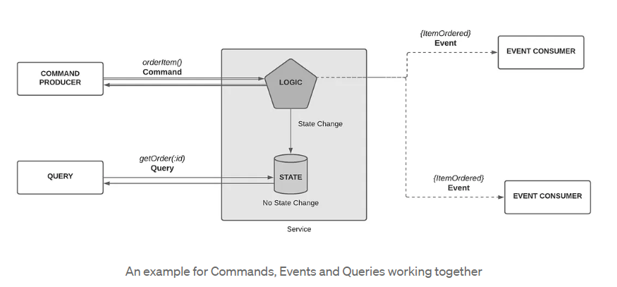
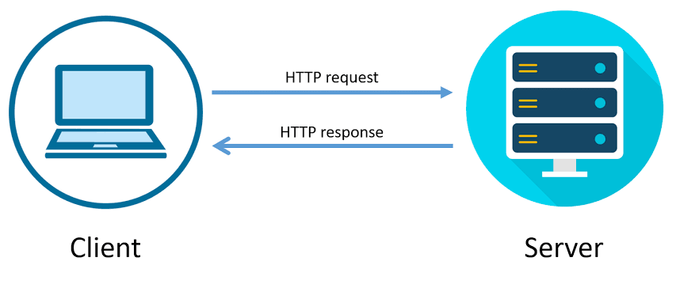
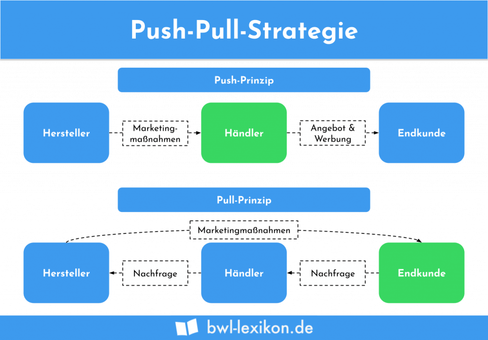
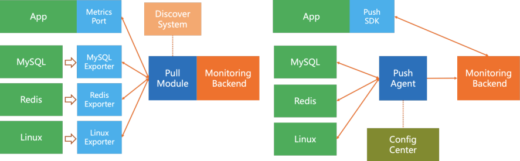
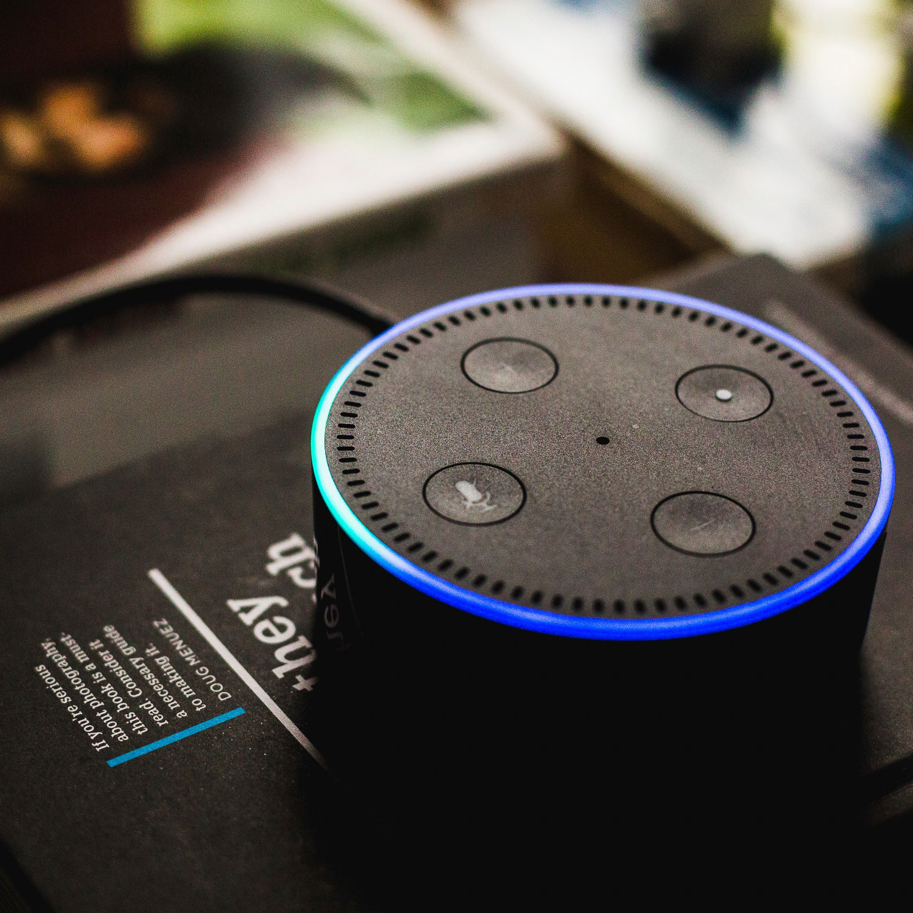

class: center, middle

## [Software Engineering](../../praesentationen.html)

#### Kapitel 4

# Softwaresystemintegration - Softwaresystemschnittstellen

Bjarne Zaremba - Danny Meihoefer

---
## Inhalt
***

1. Kommunikation

2. Patterns

3. Protokolle

4. Serialisierung

5. Software system interfaces

6. APIs

7. API Implementation Standards

8. API Design

9. API Testing

---

class: center, middle

# Software system integration

---

class: center, middle

## Kommunikation

Für die Kommunikation in verteilten Systemen gibt es verschiedene Strukturen

---

### Command

Eine Aufforderung eine bestimmte Funktion auszuführen

- Der Nachrichtenproduzent erwartet, dass der Nachrichtenkonsument etwas tut
- Eventuell erwartet der Produzent eine Antwort von dem Konsumenten
- In der Aufforderung sind alle nötigen Informationen enthalten

---

### Query

Eine Anfrage um Daten von einem Speicher abzurufen

- Queries können mit Parametern ausgestattet werden 
  - Filterung wie z.B. eine Suche nach "Auto blau"
- Abfragesprachen SQL, QBE und XQuery


---

### Event

Eine Nachricht über etwas, das passiert ist

- Der Nachrichtenproduzent erwartet keine Reaktion auf seine Nachricht (Auch keine Antwort)
- Andere Services können dieses Event wahrnemen und darauf reagieren
- Das Event kann mehrere Informationen enthalten
- Events sind nur eine Benachrichtigung für andere
  - Wie andere darauf reagieren ist ihre Sache

- Häufiges Kommunikationsmuster: Publish-Subscribe

---

### Command vs. Query vs. Event

Command | Query | Event
--- | --- | ---
Aufforderung etwas zu tun | Anfrage nach Daten | Benachrichtigung über etwas, das passiert ist
Erwartet eine Antwort | Erwartet eine Antwort | Erwartet keine Antwort
Typischerweise ein Empfänger | Typischerweise ein Empfänger | Typischerweise mehrere Empfänger
Commands für die Zukunft | Queries für die Gegenwart | Events für die Vergangenheit



---

### Synchron (RPC)

RPC - Remote Procedure Call

- RPC ist ein Protokoll, das es einem Programm ermöglicht, eine Funktion auf einem anderen Computer auszuführen (Nach dem Client-Server-Modell)
- Synchrone Operation: Der Client wartet auf die Antwort des Servers
- Threads werden blockiert, bis die Antwort des Servers eintrifft
- (Es gibt auch asynchrone RPCs)


---

### Asynchron 

- Asynchrone Operation: Der Client wartet nicht auf die Antwort des Servers
- Threads werden nicht blockiert, bis die Antwort des Servers eintrifft
- Der Client kann weiterarbeiten, während der Server die Anfrage bearbeitet
- Der Client kann die Antwort des Servers abrufen, wenn er sie benötigt
- Es kann sein, dass keine Antwort vom Server kommt

Üblicherweise mit Message Broker

Events sind asynchrone Nachrichten


---

class: center, middle

## Patterns

Es gibt verschiedene Patterns, die bei der Kommunikation in verteilten Systemen helfen

---

### Publish-Subscribe

- Eine Nachricht wird nach außen hin veröffentlicht (publish)
- Andere Services können sich für diese Nachricht registrieren (subscribe)
- Wenn die Nachricht veröffentlicht wird, erhalten alle registrierten Services eine Kopie der Nachricht
- Die Services können dann auf die Nachricht reagieren
- In der Regel wird ein Message Broker verwendet
  - Dieser nimmt die Nachrichten entgegen und verteilt sie an die registrierten Services


---

### Message Queueing

Senden von Nachrichten an eine Warteschlange
- Warum? 
  - Entkopplung von Sender und Empfänger
  - Blockieren des Senders, wenn der Empfänger nicht verfügbar ist
    - Weil der Sender auf eine Bestätigung wartet
  - Pufferung von Nachrichten, wenn der Empfänger nicht verfügbar ist
  - Empfänger kann Nachrichten nach einander abarbeiten

  

---

### Request-Response Model

Synchrones Kommunikationsmuster

Ein Client sendet eine Anfrage an einen Server und wartet auf eine Antwort vom Server

Webseiten laden normalerweise nach diesem Prinzip

- Oft wird die Antwort im HTTP-Format zurückgegeben
- Das Request-Response Modell ist in HTTP implementiert



---

### Push- und Pull-Modell

Push und Pull sind zwei verschiedene Methoden, um Daten zwischen zwei Systemen zu übertragen

Push | Pull
--- | ---
Das System, das die Daten sendet, ist für die Übertragung verantwortlich | Das System, das die Daten empfängt, ist für die Übertragung verantwortlich
Das System, das die Daten sendet, muss wissen, wohin und wann es die Daten senden soll | Das System, das die Daten empfängt, muss wissen, wo und wann es die Daten abrufen soll

---

### Push- und Pull-Modell

Verständnisbeispiel



---

### Push- und Pull-Modell

Softwarebeispiel



---

### Webhooks

Push-Modell

Webhooks sind eine Form der Event-basierten Kommunikation

Eine Anwendung schickt schickt eine HTTP Anfrage an eine URL, die von einer anderen Anwendung bereitgestellt wird

- Die Anfrage ist im Prinzip ein Event

Der Empfänger fängt sozusagen die Anfrage mit seiner URL ab und kann darauf reagieren

---

class: center,middle

## Protokolle

Protokolle sind Regeln, die die Kommunikation zwischen zwei Systemen definieren

---

### gRPC

gRPC - Remote Procedure Call

Hochperformantes, offenes RPC-Framework

- Ursprünglich von Google entwickelt
- Basierend auf HTTP/2
- Unterstützt viele Programmiersprachen
- Wird z.B. von Netflix verwendet

Der Vorteil von gRPC gegenüber anderen Protokollen ist die Geschwindigkeit und die Effizienz

- Diese wird durch die Verwendung von HTTP/2 erreicht
- Http/2 ist besonders schnell und kann **mehrere Anfragen gleichzeitig** bearbeiten

---

### HTTP/s

HTTP/s - Hypertext Transfer Protocol Secure

HTTP ist ein Protokoll, das die Kommunikation zwischen einem Webbrowser und einem Webserver ermöglicht

- Ein besonderes Transportprotokoll (TLS/SSL) macht HTTP/s besonders sicher
  - Nachrichten werden so verschlüsselt, dass sie nur vom Sender und Empfänger gelesen werden können
  - Hacker haben es so schwerer, die Nachrichten abzufangen und zu lesen
- HTTP/s ist heute das am häufigsten verwendete Protokoll für die Kommunikation zwischen Webbrowsern und Webservern
- Benutzt eine Seite nicht HTTPS, wird sie als unsicher markiert

---

#### Continuous Connection

Continuous Connection ermöglicht es eine Verbindung zwischen einem Client und einem Server aufrecht zu erhalten

- Sie wird nicht nach jeder Anfrage geschlossen
- Der Server kann so mehrere Anfragen von einem Client bearbeiten

Das ist wichtig wenn man zum Beispiel eine Webseite lädt:

- Viele Bilder und Dateien müssen vom Server geladen werden
- Der Server kann so alle Anfragen des Clients bearbeiten, ohne dass der Client jedes Mal eine neue Verbindung aufbauen muss
- Sont müsste der Client für jede Datei eine neue Verbindung aufbauen
- Niedrigere Latenzzeit

Der Nachteil ist aber, dass der Server mehrere Verbindungen gleichzeitig offen halten muss

- Das kann zu einer hohen Serverlast führen

---

#### Polling vs Long-Polling vs. SSE

Polling | Long-Polling | Server-Sent Events
--- | --- | ---
Der Client fragt den Server regelmäßig nach neuen Daten | Der Client fragt den Server nach neuen Daten und wartet auf den Server| Der Server sendet selbst dem Client neue Daten, wenn er welche hat (Event)
Hat der Server keine neuen Daten, sendet er eine leere Antwort | Die Verbindung bleibt offen bis der Server die Daten hat | Der Client kann auf die Antwort des Servers reagieren

Nicht jeder Browser unterstützt SSE

- Internet Explorer kann nicht auf die Events reagieren

---

### WebSockets

WebSockets sind eine Technologie, die eine bidirektionale Verbindung zwischen einem Client und einem Server ermöglichen

Basiert auf TCP

Bidirektionale Verbindung bedeutet, dass beide Seiten gleichzeitig Daten senden und empfangen können

Die grundlegende Verbindung bleibt bestehen

- Der Server kann Daten an den Client senden
- Der Client kann Daten an den Server senden
- Keine Anfrage-Antwort-Struktur
- Informationsaustausch besonders schnell und effizient

Die meisten gängigen Browser und Programmiersprachen unterstützen WebSockets

---

### Serialisierung

Serialisierung ist der Prozess, bei dem ein Objekt in ein Format umgewandelt wird, das für die Übertragung geeignet ist

- Das Objekt wird in Bytes umgewandelt
- Die Bytes können dann übertragen werden
- Der Empfänger kann die Bytes wieder in ein Objekt umwandeln
- Typischerweise werden Objekte in JSON oder XML serialisiert
- Netzwerkprotokolle übertragen typischerweise Bytes
- Deserialisierung ist der umgekehrte Prozess (Bytes -> Objekt)

Serialisierung ist auch wichtig um Objekte in einer Datenbank zu speichern

---

#### JSON

JSON - JavaScript Object Notation

- JSON ist ein Format, das für die Übertragung von Daten verwendet wird
- Es ist ein Textformat
- Es ist einfach zu lesen und zu schreiben
- Unterstützt viele Programmiersprachen und Datenbanken
- JSON ist sehr leichtgewichtig
- JSON kann schlecht komplexe Datenstrukturen abbilden
- JSON kann nicht alle Datentypen abbilden

JSON ist ein Schlüssel-Wert-Format

Ein typisches JSON-Objekt sieht so aus:

```json
{
  "name": "Max Mustermann",
  "age": 42,
  "hobbies": ["Programming", "Reading"]
}
```

---

#### XML

XML - Extensible Markup Language

- XML ist ein Format, das für die Übertragung von Daten verwendet wird
- Es ist ein Textformat
- Es ist einfach zu lesen und zu schreiben
- Unterstützt viele Programmiersprachen und Datenbanken
- Mit XML kann man besonders gut komplexe Datenstrukturen abbilden
  - Das ist ein Vorteil gegenüber JSON

XML hat eine ähnliche Struktur wie HTML

Ein typisches XML-Objekt sieht so aus:

```xml
<person>
  <name>Max Mustermann</name>
  <age>42</age>
  <hobbies>
    <hobby>Programming</hobby>
    <hobby>Reading</hobby>
  </hobbies>
</person>
```

---

#### Protocol Buffers

Protocol Buffers - Protobuf

- Protobuf ist ein Format, das für die Übertragung von Daten verwendet wird
- Entwickelt von Google
- **Es ist ein Binärformat**
- **Es ist nicht einfach zu lesen und zu schreiben**
- Im Vergleich zu JSON und XML ist es sehr schnell und effizient
- Protobuf kann mehr Datentypen abbilden als JSON und XML
- Protobuf ist aufwändiger zu implementieren als JSON und XML
  - Aber auch sicherer und besser für komplexe Datenstrukturen geeignet
  - Man muss bestimmte Schema-Dateien erstellen, die die Datenstruktur definieren
  - Ohne Schema kann man keine Daten serialisieren oder deserialisieren

---

class: center, middle

## Data Management Patterns

Bewährte Muster für die Verwaltung von Daten

---

### CRUD

Die Grundlegenden Operationen für die Verwaltung von Daten

Alle Funktionen sind zusammengefasst in einem CRUD-Interface

CRUD - Create, Read, Update, Delete

- Create: Erstellen von Daten
- Read: Lesen von Daten
- Update: Aktualisieren von Daten
- Delete: Löschen von Daten

---

### CQRS

CQRS - Command Query Responsibility Segregation

Ein Muster, das die Verantwortung für die Lese- und Schreiboperationen in Datenspeichern trennt (Command und Query)

- Command: Schreiboperationen
- Query: Leseoperationen

Dadurch können die einzelnen Operationen optimiert werden

- Höhere leistung

CQRS ist nur für komplexe Systeme sinnvoll

Implementation ist aufwändig

CQRS und CRUD sind nicht gegensätzlich und können kombiniert werden

---

### CQRS


---

class: center, middle

## Software system interfaces

Software system interfaces sind Schnittstellen, die die Kommunikation zwischen zwei Systemen ermöglichen

---

### GUIs

GUI - Graphical User Interface

Eine Gui ist eine Schnittstelle, die es einem Benutzer ermöglicht, mit einem Computer zu interagieren

Die Gui ist ein grafisches Element, das auf einem Medium angezeigt wird

- Eine Gui besteht aus verschiedenen Elementen
  - Buttons, Textfelder, Dropdown-Menüs, etc.

- Eine Gui kann auf verschiedene Arten implementiert werden
  - Desktop-Anwendung
  - Web-Anwendung
  - Mobile-Anwendung 

Guis können mit verschiedenen Programmiersprachen implementiert werden

- Java, C#, Python, JavaScript, etc.

---

### Voice UIs

Voice UI - Voice User Interface

Benutzerschnittstelle, die es einem Benutzer ermöglicht, mit einem Computer über Sprache zu interagieren

Sprachassistenten wie Siri, Alexa und Google Assistant sind Voice UIs

Die Spracheingabe wird in Text umgewandelt mit dem der Computer arbeiten kann



---

### CLI

CLI - Command Line Interface

Ein Cli ist die einfachste Form einer Benutzerschnittstelle

- Der Benutzer interagiert mit dem Computer über die Kommandozeile
- Befehle werden in Textform eingegeben 
- Die Software kann im Terminal schreiben und lesen
- Es verhält sich wie Chat zwischen Benutzer und Computer

Ein Beispiel für ein CLI ist die Windows Powershell

- Git Bash ist auch ein CLI und Git ist eine Software, die über die Kommandozeile bedient wird

---

### API (Application Programming Interface)

- Schnittstelle oder Satz von Regeln und Protokollen, die es verschiedenen Softwareanwendungen ermöglichen, miteinander zu kommunizieren und Daten auszutauschen
- legen erlaubten Zugriff auf Systeme und Daten fest
- Verschiedene Formen von APIs:
    - Web-APIs
    - Bibliotheks-APIs
    - Betriebssystem-APIs
    - Datenbank-APIs
    - Hardware-APIs
- APIs sorgen vor allem für die Interoperabilität zwischen verschiedenen Softwareanwendungen
- Entwickler müssen nicht den inneren Aufbau einer Anwendung kennen, um Daten aus ihr herauszulesen
- APIs spielen große Rolle beim Vernetzen und Automatisieren von Anwendungen

---

#### API vs. SDK (Application Programming Interface vs. Software Development Kit)

SDK:

- Satz von Werkzeugen, Bibliotheken und Dokumentationen, der Entwicklern bereitgestellt wird, um Software für eine bestimmte Plattform, Betriebssystem oder API zu entwickeln
- können Codebeispiele, Entwicklungsumgebungen, Debugger, etc. enthalten
- werden oft von Unternehmen erstellt, um Entwicklern die Integration in ihre Produkte zu vereinfachen

Unterschied API vs. SDK:

- API ist Schnittstelle, die den Zugriff auf Funktionen oder Daten ermöglicht
- SDK ist ein Entwicklungsset von Werkzeugen, die Entwicklern hilft, Anwendungen für eine bestimmte Anwendung, etc. zu entwickeln

---

### API-Styles

#### Resource Style

- auch REST-Style genannt
- Ressourcen werden als eindeutige URLs dargestellt
- Operationen werden mithilfe von HTTP-Methoden (HTTP-GET & HTTPS-POST) auf Ressourcen angewendet
- klare Struktur durch REST-Standard
- HATEOAS (Hypertext as the Engine of Application State) wichtiges Konzept


#### Hypermedia Style

- baut auf REST-Prinzip auf
- Anstelle von festgelegten URLs wird die Darstellung und Navigation durch Hyperlinks realisiert
- API stellt Hypermedia-Dokumente bereit, die Hyperlinks enthalten

---

#### Query-Style:

- Daten werden durch das Senden von Abfragen extrahiert und manipuliert
- Beispiel für Query-Style: GraphQL
- hohe Flexibilität und Effizienz


#### Tunnel-Style:

- Aktionen an die API werden alle an den selben Endpunkt gesendet
- Hilfreich, wenn Anzahl der Endpunkte minimiert werden soll


#### Event-based-Style:

- Übertragung von Daten zwischen Anwendungen und Systemen
- Anwendungen registrieren bei der API
- Echtzeitreaktionen auf Änderungen

---

### API Implementation Standards

- Ansätze und Prinzipien, die bei der Entwicklung von APIs befolgt werden
- Gängigste Implementierungsstandards: RESTful, GraphQL

---

### RESTful

#### Motivation

- RESTful sollte ein einfaches und konsistentes Modell für die Kommunikation zwischen Systemen über das HTTP-Protokoll darstellen
- Basiert auf bewährten Prinzipien, wie Verwendung von HTTP und URL

#### Vorteile:

- Einfachheit
- Skalierbarkeit
- Unabhängigkeit von der Programmiersprache
- Sicherheit

#### Nachteile:

- Over-Fetching und Under-Fetching
- Mangelnde Flexibilität
- Versionierung

---

#### HATEOS (Hypertext as the Engine of Application State)

- Interaktion und Navigation soll durch Hyperlinks gesteuert werden
- Clients können die API dynamisch erkunden, indem sie den Hyperlinks folgen
- “Der Server sagt dem Client, was als nächstes zu tun ist”.

Beispiel (Erstellt durch Chat-GPT-3.5):

```json
{
"name": "Produkt A",
"price": 100.00,
"links": [
{
"rel": "self",
"href": "/products/1"
},
{
"rel": "buy",
"href": "/checkout?product=1"
}
]
}
```

- Die Antwort des Servers enthält Hyperlinks, die dem Client sagen, dass es eine Aktion “buy” gibt, die zum Checkout führt

---

#### Best Practices für RESTful-APIs

- Benennung von REST-API-Endpoints
- Error Handling
- Security

---

### GraphQL

#### Motivation

- von Facebook entwickelt, um Anforderungen der App-Entwicklung zu erfüllen
- Clients können genau die Daten abrufen, die sie benötigen
- flexible Schnittstelle

#### Vorteile:

- Flexibilität
- Einziger Endpunkt
- Schnelle Entwicklung

#### Nachteile:

- Komplexität
- Potenzieller Overhead

---

#### Schema

- Schema ist zentrales Element
- Schema definiert, welche Daten in der API verfügbar sind und wie sie in Beziehung zueinander stehen
- Enthält zwei Haupttypen:
- In spezieller Abfragesprache definiert → weist klare Struktur auf

---

#### Abfragen (Query)

- Clients können Abfragen senden, um genau die Daten zu bekommen, die sie benötigen
- sendet Anfrage an den Server, die beschreibt, welche Daten er haben möchte
- Abfragen ähneln der Struktur, die der Server zurück liefert

Beispiel einer Abfrage:

```graphql
{
  user(id: 123) {
    name
    email
  }
}
```

---

#### Resolver

- Funktionen, die dem Server sagen, wie Daten für jeweilige Anfrage tatsächlich abgerufen werden
- jedes Feld in einem GraphQL-Schema wird ein Resolver zugeteilt

Beispiel eomes GraphQL-Resolvers:

```jsx
const resolvers = {
  Query: {
    user: (parent, args, context, info) => {
      // Hier wird die Logik für die Abfrage des Benutzers implementiert
    }
  }
};
```

---

#### Mutationen

- Mutationen dienen dazu, Daten zu ändern und zu aktualisieren
- Clients können Daten erstellen, ändern oder löschen

Beispiel einer Mutation:

```graphql
mutation {
  updateUser(id: 123, input: { name: "Neuer Name", email: "neue@email.com" }) {
    id
    name
    email
  }
}
```

---

### Backend-for-Frontend

- Architekturmuster, das dazu dient, die Kommunikation zwischen Frontend und verschiedenen Backends zu optimieren
- oft in Anwendungen mit mehreren Plattformen eingesetzt

#### Hauptmerkmale:

- Spezifische Backend-Instanzen
- Angepasste APIs
- Aggregation und Transformation
- Leistungsoptimierung

---
class: center, middle
### API-Design


---
### Code First vs. Design First

#### Code First

- Implementierung der API steht im Vordergrund
- wird verwendet, wenn bereits existierender Code in eine API umgewandelt werden soll

#### Merkmale von Code-First

Merkmale von Code-First:

- Direkter Start
- Nachträgliche Spezifikation
- Flexibilität
- MVP

---

#### Design First

- Erstellung einer formalen API-Spezifikation und Dokumentation steht im Vordergrund
- Implementierung der API beginnt erst nach Erstellung der Dokumentation

#### Merkmale von Design-First

- Klare Spezifikation
- Spezifikationssprachen
- Zusammenarbeit
- Flexibilität

---
class: center, middle
### API Versionierung
---
#### URL-Versionierung

- API-Version wird direkt in der URL angegeben

#### Vorteile:

- Einfach zu implementieren
- Cache-Kontrolle

#### Nachteile:

- Unübersichtliche URL
- Schwierige Umleitung

---

 

#### Header-Versionierung

- API-Version wird in einem speziellen HTTP-Header angegeben
- Clients müssen Header in ihre Anfrage schreiben:
    
    ```bash
    GET /resource
    Accept-Version: v1
    ```
    

#### Vorteile:

- Saubere URLs
- Client-Steuerung

#### Nachteile

- Client ist verantwortlich
---

#### Media-Type-Versionierung

- API-Version wird in den Mediatypen der Anfrage festgelegt

#### Vorteile:

- Klare Identifikation
- Flexibilität

#### Nachteile:

- Aufwand
- Zusätzlicher Header

---

### Testing

- wichtig, um zu garantieren, dass die API einwandfrei funktioniert

Es gibt verschiedene Arten von API-Tests:

- Einheitstests
- Integrationstests
- End-to-End-Tests
- Last- und Leistungstests
- Sicherheitstests

---

### Spezifikation/Dokumentation

- OpenAPI und JSON Schema sind zwei bekannte Werkzeuge, die für die Dokumentation und Spezifikation von APIs verwendet werden

#### OpenAPI

- Offene Spezifikation, die RESTful-APIs beschreiben und dokumentieren kann
- Struktur, Endpunkte, Parameter, Antwortformate können einheitlich beschrieben werden

---

#### Hauptmerkmale von OpenAPI

- Formale Spezifikation
- Interaktive Dokumentation
- Codegenerierung
- Standardisierung
- Link zur Organisation: [https://www.openapis.org/](https://www.openapis.org/)

---

#### JSON-Schema

- Spezifikation für die Validierung von JSON-Datenstrukturen
- kann zur Spezifikation von Daten einer API genutzt werden

#### Hauptaspekte:

- Validierung von JSON
- Datenbeschreibung
- Beispielverwendung

---

Beispiel (Erstellt von Chat-GPT-3.5):

```json
{
  "$schema": "http://json-schema.org/draft-07/schema#",
  "type": "object",
  "properties": {
    "id": {
      "type": "integer"
    },
    "name": {
      "type": "string"
    },
    "email": {
      "type": "string",
      "format": "email"
    }
  },
  "required": ["id", "name", "email"]
}
```
---

## Verständnissfragen 

1. Was ist der Unterschied zwischen einem Command, einem Query und einem Event?
2. Was ist der Unterschied zwischen einem synchronen und einem asynchronen Kommunikationsmuster?
3. Wann braucht man ein Publish-Subscribe Muster?
4. Was für Protocolle gibt es für die Kommunikation zwischen zwei Systemen?
5. Wie können Clients und Server Daten austauschen?
6. Was ist Serialisierung?
7. Was ist der Unterschied zwischen JSON, XML und Protobuf?
8. Was ist der Unterschied zwischen einem GUI und einem CLI?
9. Was ist eine API?
10. Was ist der Unterschied zwischen einer API und einem SDK?
11. Nenne und beschreibe einen API-Style!
12. Was ist das RESTful-Modell?
13. Was ist GraphQL?
14. Was sind Resolver?
15. Nenne ein API-Design und beschreibe es!
16. Wie kann man APIs versionieren?
17. Wie werden APIs getestet?

---

# Quellen
***

Commands vs. Query vs. Event
https://medium.com/event-driven-utopia/using-commands-events-and-queries-in-microservices-communication-3573f1fcfafe

Synchron vs. Asynchron
https://learn.microsoft.com/en-us/dotnet/architecture/microservices/architect-microservice-container-applications/asynchronous-message-based-communication

Publish-Subscribe
https://learn.microsoft.com/en-us/azure/architecture/patterns/_images/publish-subscribe.png

RequestResponse
https://medium.com/@rohitpatil97/http-request-http-response-context-and-headers-part-iii-5c37bd4cb06b

PushPull
https://www.bwl-lexikon.de/wiki/push-pull-strategie/

https://www.alibabacloud.com/blog/pull-or-push-how-to-select-monitoring-systems_599007

Protokolle
https://medium.com/deliveryherotechhub/what-is-server-sent-events-sse-and-how-to-implement-it-904938bffd73

---

# Quellen

WebSockets
https://www.bigdata-insider.de/was-ist-websocket-a-1042523/#:~:text=Mit%20WebSocket%20lassen%20sich%20bidirektionale,Informationsaustausch%20wird%20effizienter%20und%20schneller.

Serialisierung
https://www.mikrocontroller.net/articles/Serialisierung

Protobuf
https://www.educba.com/protobuf-vs-json/

Crud
https://www.crowdstrike.de/cybersecurity-101/observability/crud/

voice ui
https://www.futureofvoice.com/blog/voicebots/voice-user-interface-vui-was-ist-das

alexa
https://s3.amazonaws.com/www-inside-design/uploads/2018/08/voice-uis-square.jpg

https://www.redhat.com/de/topics/api/what-are-application-programming-interfaces [letzte Einsicht: 25. Oktober 2023]

https://aws.amazon.com/de/compare/the-difference-between-sdk-and-api/ [letzte Einsicht: 25. Oktober 2023]

https://blog.axway.com/learning-center/apis/api-trends/hypermedia-apis [letzte Einsicht: 26. Oktober]

---
# Quellen

https://medium.com/event-driven-utopia/event-driven-apis-understanding-the-principles-c3208308d4b2 [letzte Einsicht: 26. Oktober 2023]

https://graphql.org/ [letzte Einsicht: 26. Oktober 2023]

https://www.ionos.de/digitalguide/websites/web-entwicklung/hateoas-alle-informationen-zu-der-rest-eigenschaft/ [letzte Einsicht: 26. Oktober 2023]

https://stackoverflow.blog/2020/03/02/best-practices-for-rest-api-design/ [letzte Einsicht: 26. Oktober 2023]

https://blog.bitsrc.io/bff-pattern-backend-for-frontend-an-introduction-e4fa965128bf [letzte Einsicht: 26. Oktober 2023]

https://www.visual-paradigm.com/guide/development/code-first-vs-design-first/ [letzte Einsicht: 27. Oktober 2023]

https://restfulapi.net/versioning/ [letzte Einsicht: 27. Oktober 2023]

https://www.torocloud.com/blog/api-versioning-url-vs-header-vs-media-type-versioning [letzte Einsicht: 27. Oktober 2023]

---
# Quellen

https://www.lucidchart.com/blog/de/api-tests-grundlagen-und-best-prectices#:~:text=Was%20sind%20API%2DTests%3F,mangelhaftes%20oder%20unsicheres%20Produkt%20erhalten [letzte Einsicht: 27. Oktober 2023]

https://www.ionos.de/digitalguide/websites/web-entwicklung/was-ist-openapi/ [letzte Einsicht: 27. Oktober 2023]

https://json-schema.org/ [letzte Einsicht: 27. Oktober 2023]

https://www.tutorialspoint.com/json/json_schema.htm [letzte Einsicht: 27. Oktober 2023]