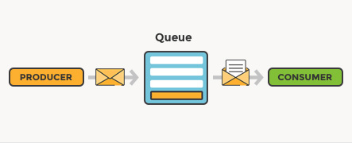

class: center, middle

## [Software Engineering](../../praesentationen.html)

#### Kapitel 4

# Kapitelüberschrift

Max Mustermann

---
## Inhalt
***

1. Kommunikation

2. Patterns

3. Protokolle

4. Serialisierung

5. Software system interfaces

---

class: center, middle

# Software system integration

---

class: center, middle

## Kommunikation

Für die Kommunikation in verteilten Systemen gibt es verschiedene Strukturen

---

### Command

Eine Aufforderung eine bestimmte Funktion auszuführen

- Der Nachrichtenproduzent erwartet, dass der Nachrichtenkonsument etwas tut
- Eventuell erwartet der Produzent eine Antwort von dem Konsumenten
- In der Aufforderung sind alle nötigen Informationen enthalten

---

### Query

Eine Anfrage um Daten von einem Speicher abzurufen

- Queries können mit Parametern ausgestattet werden 
  - Filterung wie z.B. eine Suche nach "Auto blau"
- Abfragesprachen SQL, QBE und XQuery


---

### Event

Eine Nachricht über etwas, das passiert ist

- Der Nachrichtenproduzent erwartet keine Reaktion auf seine Nachricht (Auch keine Antwort)
- Andere Services können dieses Event wahrnemen und darauf reagieren
- Das Event kann mehrere Informationen enthalten
- Events sind nur eine Benachrichtigung für andere
  - Wie andere darauf reagieren ist ihre Sache

- Häufiges Kommunikationsmuster: Publish-Subscribe

---

### Command vs. Query vs. Event

Command | Query | Event
--- | --- | ---
Aufforderung etwas zu tun | Anfrage nach Daten | Benachrichtigung über etwas, das passiert ist
Erwartet eine Antwort | Erwartet eine Antwort | Erwartet keine Antwort
Typischerweise ein Empfänger | Typischerweise ein Empfänger | Typischerweise mehrere Empfänger
Commands für die Zukunft | Queries für die Gegenwart | Events für die Vergangenheit


---

### Synchron (RPC)

RPC - Remote Procedure Call

- RPC ist ein Protokoll, das es einem Programm ermöglicht, eine Funktion auf einem anderen Computer auszuführen (Nach dem Client-Server-Modell)
- Synchrone Operation: Der Client wartet auf die Antwort des Servers
- Threads werden blockiert, bis die Antwort des Servers eintrifft
- (Es gibt auch asynchrone RPCs)


---

### Asynchron 

- Asynchrone Operation: Der Client wartet nicht auf die Antwort des Servers
- Threads werden nicht blockiert, bis die Antwort des Servers eintrifft
- Der Client kann weiterarbeiten, während der Server die Anfrage bearbeitet
- Der Client kann die Antwort des Servers abrufen, wenn er sie benötigt
- Es kann sein, dass keine Antwort vom Server kommt

Üblicherweise mit Message Broker

Events sind asynchrone Nachrichten


---

class: center, middle

## Patterns

Es gibt verschiedene Patterns, die bei der Kommunikation in verteilten Systemen helfen

---

### Publish-Subscribe

- Eine Nachricht wird nach außen hin veröffentlicht (publish)
- Andere Services können sich für diese Nachricht registrieren (subscribe)
- Wenn die Nachricht veröffentlicht wird, erhalten alle registrierten Services eine Kopie der Nachricht
- Die Services können dann auf die Nachricht reagieren
- In der Regel wird ein Message Broker verwendet
  - Dieser nimmt die Nachrichten entgegen und verteilt sie an die registrierten Services


---

### Message Queueing

Senden von Nachrichten an eine Warteschlange
- Warum? 
  - Entkopplung von Sender und Empfänger
  - Blockieren des Senders, wenn der Empfänger nicht verfügbar ist
    - Weil der Sender auf eine Bestätigung wartet
  - Pufferung von Nachrichten, wenn der Empfänger nicht verfügbar ist
  - Empfänger kann Nachrichten nach einander abarbeiten

  

---

### Request-Response Model

Synchrones Kommunikationsmuster

Ein Client sendet eine Anfrage an einen Server und wartet auf eine Antwort vom Server

Webseiten laden normalerweise nach diesem Prinzip

- Oft wird die Antwort im HTTP-Format zurückgegeben
- Das Request-Response Modell ist in HTTP implementiert


---

### Push- und Pull-Modell

Push und Pull sind zwei verschiedene Methoden, um Daten zwischen zwei Systemen zu übertragen

Push | Pull
--- | ---
Das System, das die Daten sendet, ist für die Übertragung verantwortlich | Das System, das die Daten empfängt, ist für die Übertragung verantwortlich
Das System, das die Daten sendet, muss wissen, wohin und wann es die Daten senden soll | Das System, das die Daten empfängt, muss wissen, wo und wann es die Daten abrufen soll

---

### Push- und Pull-Modell

Verständnisbeispiel


---

### Push- und Pull-Modell

Softwarebeispiel


---

### Webhooks

Push-Modell

Webhooks sind eine Form der Event-basierten Kommunikation

Eine Anwendung schickt schickt eine HTTP Anfrage an eine URL, die von einer anderen Anwendung bereitgestellt wird

- Die Anfrage ist im Prinzip ein Event

Der Empfänger fängt sozusagen die Anfrage mit seiner URL ab und kann darauf reagieren

---

class: center,middle

## Protokolle

Protokolle sind Regeln, die die Kommunikation zwischen zwei Systemen definieren

---

### gRPC

gRPC - Remote Procedure Call

Hochperformantes, offenes RPC-Framework

- Ursprünglich von Google entwickelt
- Basierend auf HTTP/2
- Unterstützt viele Programmiersprachen
- Wird z.B. von Netflix verwendet

Der Vorteil von gRPC gegenüber anderen Protokollen ist die Geschwindigkeit und die Effizienz

- Diese wird durch die Verwendung von HTTP/2 erreicht
- Http/2 ist besonders schnell und kann **mehrere Anfragen gleichzeitig** bearbeiten

---

### HTTP/s

HTTP/s - Hypertext Transfer Protocol Secure

HTTP ist ein Protokoll, das die Kommunikation zwischen einem Webbrowser und einem Webserver ermöglicht

- Ein besonderes Transportprotokoll (TLS/SSL) macht HTTP/s besonders sicher
  - Nachrichten werden so verschlüsselt, dass sie nur vom Sender und Empfänger gelesen werden können
  - Hacker haben es so schwerer, die Nachrichten abzufangen und zu lesen
- HTTP/s ist heute das am häufigsten verwendete Protokoll für die Kommunikation zwischen Webbrowsern und Webservern
- Benutzt eine Seite nicht HTTPS, wird sie als unsicher markiert

---

#### Continuous Connection

Continuous Connection ermöglicht es eine Verbindung zwischen einem Client und einem Server aufrecht zu erhalten

- Sie wird nicht nach jeder Anfrage geschlossen
- Der Server kann so mehrere Anfragen von einem Client bearbeiten

Das ist wichtig wenn man zum Beispiel eine Webseite lädt:

- Viele Bilder und Dateien müssen vom Server geladen werden
- Der Server kann so alle Anfragen des Clients bearbeiten, ohne dass der Client jedes Mal eine neue Verbindung aufbauen muss
- Sont müsste der Client für jede Datei eine neue Verbindung aufbauen
- Niedrigere Latenzzeit

Der Nachteil ist aber, dass der Server mehrere Verbindungen gleichzeitig offen halten muss

- Das kann zu einer hohen Serverlast führen

---

#### Polling vs Long-Polling vs. SSE

Polling | Long-Polling | Server-Sent Events
--- | --- | ---
Der Client fragt den Server regelmäßig nach neuen Daten | Der Client fragt den Server nach neuen Daten und wartet auf den Server| Der Server sendet selbst dem Client neue Daten, wenn er welche hat (Event)
Hat der Server keine neuen Daten, sendet er eine leere Antwort | Die Verbindung bleibt offen bis der Server die Daten hat | Der Client kann auf die Antwort des Servers reagieren

Nicht jeder Browser unterstützt SSE

- Internet Explorer kann nicht auf die Events reagieren

---

### WebSockets

WebSockets sind eine Technologie, die eine bidirektionale Verbindung zwischen einem Client und einem Server ermöglichen

Basiert auf TCP

Bidirektionale Verbindung bedeutet, dass beide Seiten gleichzeitig Daten senden und empfangen können

Die grundlegende Verbindung bleibt bestehen

- Der Server kann Daten an den Client senden
- Der Client kann Daten an den Server senden
- Keine Anfrage-Antwort-Struktur
- Informationsaustausch besonders schnell und effizient

Die meisten gängigen Browser und Programmiersprachen unterstützen WebSockets

---

### Serialisierung

Serialisierung ist der Prozess, bei dem ein Objekt in ein Format umgewandelt wird, das für die Übertragung geeignet ist

- Das Objekt wird in Bytes umgewandelt
- Die Bytes können dann übertragen werden
- Der Empfänger kann die Bytes wieder in ein Objekt umwandeln
- Typischerweise werden Objekte in JSON oder XML serialisiert
- Netzwerkprotokolle übertragen typischerweise Bytes
- Deserialisierung ist der umgekehrte Prozess (Bytes -> Objekt)

Serialisierung ist auch wichtig um Objekte in einer Datenbank zu speichern

---

#### JSON

JSON - JavaScript Object Notation

- JSON ist ein Format, das für die Übertragung von Daten verwendet wird
- Es ist ein Textformat
- Es ist einfach zu lesen und zu schreiben
- Unterstützt viele Programmiersprachen und Datenbanken
- JSON ist sehr leichtgewichtig
- JSON kann schlecht komplexe Datenstrukturen abbilden
- JSON kann nicht alle Datentypen abbilden

JSON ist ein Schlüssel-Wert-Format

Ein typisches JSON-Objekt sieht so aus:

```json
{
  "name": "Max Mustermann",
  "age": 42,
  "hobbies": ["Programming", "Reading"]
}
```

---

#### XML

XML - Extensible Markup Language

- XML ist ein Format, das für die Übertragung von Daten verwendet wird
- Es ist ein Textformat
- Es ist einfach zu lesen und zu schreiben
- Unterstützt viele Programmiersprachen und Datenbanken
- Mit XML kann man besonders gut komplexe Datenstrukturen abbilden
  - Das ist ein Vorteil gegenüber JSON

XML hat eine ähnliche Struktur wie HTML

Ein typisches XML-Objekt sieht so aus:

```xml
<person>
  <name>Max Mustermann</name>
  <age>42</age>
  <hobbies>
    <hobby>Programming</hobby>
    <hobby>Reading</hobby>
  </hobbies>
</person>
```

---

#### Protocol Buffers

Protocol Buffers - Protobuf

- Protobuf ist ein Format, das für die Übertragung von Daten verwendet wird
- Entwickelt von Google
- **Es ist ein Binärformat**
- **Es ist nicht einfach zu lesen und zu schreiben**
- Im Vergleich zu JSON und XML ist es sehr schnell und effizient
- Protobuf kann mehr Datentypen abbilden als JSON und XML
- Protobuf ist aufwändiger zu implementieren als JSON und XML
  - Aber auch sicherer und besser für komplexe Datenstrukturen geeignet
  - Man muss bestimmte Schema-Dateien erstellen, die die Datenstruktur definieren
  - Ohne Schema kann man keine Daten serialisieren oder deserialisieren

---

class: center, middle

## Data Management Patterns

Bewährte Muster für die Verwaltung von Daten

---

### CRUD

Die Grundlegenden Operationen für die Verwaltung von Daten

Alle Funktionen sind zusammengefasst in einem CRUD-Interface

CRUD - Create, Read, Update, Delete

- Create: Erstellen von Daten
- Read: Lesen von Daten
- Update: Aktualisieren von Daten
- Delete: Löschen von Daten

---

### CQRS

CQRS - Command Query Responsibility Segregation

Ein Muster, das die Verantwortung für die Lese- und Schreiboperationen in Datenspeichern trennt (Command und Query)

- Command: Schreiboperationen
- Query: Leseoperationen

Dadurch können die einzelnen Operationen optimiert werden

- Höhere leistung

CQRS ist nur für komplexe Systeme sinnvoll

Implementation ist aufwändig

CQRS und CRUD sind nicht gegensätzlich und können kombiniert werden

---

### CQRS


---

class: center, middle

## Software system interfaces

Software system interfaces sind Schnittstellen, die die Kommunikation zwischen zwei Systemen ermöglichen

---

### GUIs

GUI - Graphical User Interface

Eine Gui ist eine Schnittstelle, die es einem Benutzer ermöglicht, mit einem Computer zu interagieren

Die Gui ist ein grafisches Element, das auf einem Medium angezeigt wird

- Eine Gui besteht aus verschiedenen Elementen
  - Buttons, Textfelder, Dropdown-Menüs, etc.

- Eine Gui kann auf verschiedene Arten implementiert werden
  - Desktop-Anwendung
  - Web-Anwendung
  - Mobile-Anwendung 

Guis können mit verschiedenen Programmiersprachen implementiert werden

- Java, C#, Python, JavaScript, etc.

---

### Voice UIs

Voice UI - Voice User Interface

Benutzerschnittstelle, die es einem Benutzer ermöglicht, mit einem Computer über Sprache zu interagieren

Sprachassistenten wie Siri, Alexa und Google Assistant sind Voice UIs

Die Spracheingabe wird in Text umgewandelt mit dem der Computer arbeiten kann


---

### CLI

CLI - Command Line Interface

Ein Cli ist die einfachste Form einer Benutzerschnittstelle

- Der Benutzer interagiert mit dem Computer über die Kommandozeile
- Befehle werden in Textform eingegeben 
- Die Software kann im Terminal schreiben und lesen
- Es verhält sich wie Chat zwischen Benutzer und Computer

Ein Beispiel für ein CLI ist die Windows Powershell

- Git Bash ist auch ein CLI und Git ist eine Software, die über die Kommandozeile bedient wird

---

## Verständnissfragen 

1. Was ist der Unterschied zwischen einem Command, einem Query und einem Event?
2. Was ist der Unterschied zwischen einem synchronen und einem asynchronen Kommunikationsmuster?
3. Wann braucht man ein Publish-Subscribe Muster?
4. Was für Protocolle gibt es für die Kommunikation zwischen zwei Systemen?
5. Wie können Clients und Server Daten austauschen?
6. Was ist Serialisierung?
7. Was ist der Unterschied zwischen JSON, XML und Protobuf?
8. Was ist der Unterschied zwischen einem GUI und einem CLI?

---

# Quellen
***

Commands vs. Query vs. Event
https://medium.com/event-driven-utopia/using-commands-events-and-queries-in-microservices-communication-3573f1fcfafe

Synchron vs. Asynchron
https://learn.microsoft.com/en-us/dotnet/architecture/microservices/architect-microservice-container-applications/asynchronous-message-based-communication

Publish-Subscribe
https://learn.microsoft.com/en-us/azure/architecture/patterns/_images/publish-subscribe.png

RequestResponse
https://medium.com/@rohitpatil97/http-request-http-response-context-and-headers-part-iii-5c37bd4cb06b

PushPull
https://www.bwl-lexikon.de/wiki/push-pull-strategie/

https://www.alibabacloud.com/blog/pull-or-push-how-to-select-monitoring-systems_599007

Protokolle
https://medium.com/deliveryherotechhub/what-is-server-sent-events-sse-and-how-to-implement-it-904938bffd73

---

# Quellen

WebSockets
https://www.bigdata-insider.de/was-ist-websocket-a-1042523/#:~:text=Mit%20WebSocket%20lassen%20sich%20bidirektionale,Informationsaustausch%20wird%20effizienter%20und%20schneller.

Serialisierung
https://www.mikrocontroller.net/articles/Serialisierung

Protobuf
https://www.educba.com/protobuf-vs-json/

Crud
https://www.crowdstrike.de/cybersecurity-101/observability/crud/

voice ui
https://www.futureofvoice.com/blog/voicebots/voice-user-interface-vui-was-ist-das

alexa
https://s3.amazonaws.com/www-inside-design/uploads/2018/08/voice-uis-square.jpg