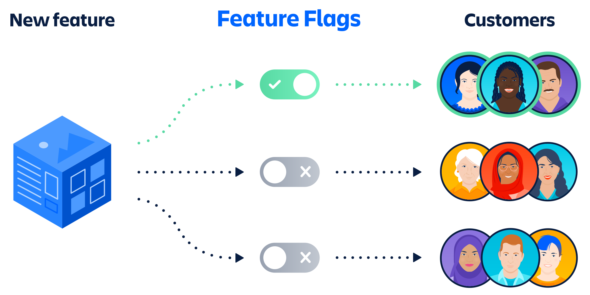

# Kapitel 5 DevOPs

**Autoren:** Danny Meihöfer - Bjarne Zaremba

## Lernziele für dieses Kapitel

Nach diesem Kapitel sollen folgende Aspekte klarer geworden sein:

- Was ist DevOps (Ziele, Kultur, Best Practices, Tools)
- Continuous Integration / Continuous Delivery / Continuous Deployment
- Deployment strategies
- CI/CD Tools

## Was ist DevOps?

DevOps ist eine Kombination aus den Begriffen Development und Operations. Das bedeutet, dass es sich um eine enge Zusammenarbeit zwischen den Bereichen Entwicklung und Betrieb handelt. DevOps ist allerdings kein bestimmtes Tool, sondern eine Art Kultur, oder Philosophie. Teams und Unternehmen können sich dazu entscheiden DevOps zu nutzen, um die Softwareentwicklung und die Softwareauslieferung zu beschleunigen. Um die Softwareentwicklung und die Softwareauslieferung zu beschleunigen, gibt es einige Praktiken und Tools die DevOps-Teams nutzen. Das Ziel ist dabei, so viele Aspekte wie möglich zu automatisieren.

Neben der Automation von Prozessen geht es in der DevOps-Kultur auch um Kommunikation, gemeinsame Verantwortung, ende Zusammenarbeit und Transparenz. 

Das wichtigste für ein DevOps-Team ist, dass es aus Mitarbeitern aus verschiedenen Bereichen und mit verschiedenen Fähigkeiten besteht. So kann der Entwickler direkt mit dem Betreiber zusammenarbeiten. Das wird auch Cross-Funktionales Team genannt. Außerdem sollten DevOps-Teams Automatisierungsexperten haben, die sich darum kümmern die Prozesse zu automatisieren. Oft gibt es auch noch Site Reliability Engineers, die sich um die Verfügbarkeit und Zuverlässigkeit der Software kümmern. Zu dem Team gehört auch eine Führungskraft die sich um die Organisation kümmert. Alle Teammitglieder streben eine kontinuirliche Verbesserung an.

DevOps Praktiken können sich je nach Team und Unternehmen unterscheiden. Es gibt allerdings einige Praktiken die in den meisten DevOps-Teams genutzt werden. Dazu gehören: Einbeziehung der Entwickler in den Betrieb und andersherum, Automatisierung von so vielen Prozessen wie möglich, kontinuierliche Integration und kontinuierliche Auslieferung, Monitoring und Logging, Versionskontrolle, und einheitliche Tools und Platformen.

Das bietet neben einer gesteigerten Teameffizienz auch einige andere Vorteile. Das Risko bei Änderungen veringert sich und die Qualität der Produkte wird besser. Die Veröffentlichungskosten werden geringer und gleichzeitig kann öfter, schneller und einfacher veröffentlicht werden. DevOps Teams habe eine verbesserte Zusammenarbeit und Kommunikation. Außerdem ist die Teamzufriedenheit höher.

## DevOps - Pipeline

Ein wichtiger Bestandteil von DevOps ist die DevOps Pipeline. Die DevOps Pipeline ist eine Reihe von Prozessen, die in automatisiert und in bestimmter Reihenfolge ablaufen. Man kann eine DevOps Pipeline mit einer Fließbandproduktion vergleichen in der die Software entwickelt, getestet und ausgeliefert wird. Die DevOps Pipeline besteht aus mehreren Phasen. Die Phasen können zwar je nach Team und Unternehmen unterschiedlich sein, aber es gibt für gewöhnlich einige Phasen die in den meisten DevOps Pipelines vorkommen. In der Abbildung sieht man den typischen Ablauf einer DevOps Pipeline.

## DevOps - Continuous Integration (CI)

Continuous Integration - Kontinuierliche Integration bedeutet, dass Veränderungen am Sourcecode automatisch und direkt ins Hauptprojekt integriert werden. Das bedeutet, dass die Entwickler ihre Änderungen direkt in das Hauptprojekt einpflegen können. Die Änderungen werden dann automatisch getestet und wenn die Tests erfolgreich sind, wird der Code in das Hauptprojekt integriert. Das Ziel von Continuous Integration ist es, dass die Entwickler ihre Änderungen so schnell wie möglich in das Hauptprojekt einpflegen können. Fehler werden so früher erkannt und die Software kann schneller ausgeliefert werden. 

## DevOps - Continuous Delivery (CD)

Continuous Delivery - Kontinuirliche Auslieferung bedeutet, dass die Software jederzeit ausgeliefert werden kann. Die Software ist also immer in einer Version vorhanden, die ausgeliefert werden kann. Wann die Software ausgeliefert wird, kann manuell entschieden werden. Eine schnellere Auslieferung von Software bietet Vorteile, weil man öfter und schneller auf Kundenwünsche reagieren kann.

## DevOps - Continuous Deployment (CD)

Continuous Deployment - Kontinuirliche Bereitstellung sorgt dafür, dass Updates öfter auf die Produktionsumgebung ausgeliefert werden. Das bedeutet, dass die Software zum Beispiel automatisch auf die Produktionsumgebung ausgeliefert wird, wenn die Tests erfolgreich sind. Ein Release ist die veröffentlichung der Software für den Endbenutzer. Beim Deploying wird die Software nur in eine bestimmte Umgebung, wie zum Beispiel die Produktionsumgebung, ausgeliefert. Diese neue Umgebung muss nicht für den Endbenutzer zugänglich sein.

In der Abbildung sieht man an welchem Punkt sich Continuous Delivery und Continuous Deployment unterscheiden.

## Semantic Versioning

Will man seine Softwareversion nummerieren kann man sich die Frage stellen, was für eine Versionsnummer gebe ich ihr, damit andere Entwickler verstehen können was es für Änderungen in dieser Version gab. Semantic Versioning ist eine System zur Versionsnummerierung, das es ermöglicht einheitliche und Sinnvolle Versionsnummern zu vergeben.

Jede Versionsnummer besteht hier aus drei Teilen / Nummern. Die Major, Minor und die Patch Nummer. Die erste ist die Major Nummer. Diese wird erhöht, wenn es in der neuen Version zu großen Änderungen kommt, die nicht mit der vorherigen Version kompatibel sind. Die Versionsnummer könnte beispielsweise von 1.0.0 auf 2.0.0 erhöht werden.

Die Minor Nummer wird erhöht, wenn es kleinere Änderungen, wie neue Features, oder Verbesserungen gibt, die aber mit der vorherigen Version kompatibel sind. Das könnte so aussehen: 1.0.0 -> 1.1.0

Die Patch Nummer wird nur erhöht, wenn es Fehlerbehebungen gibt, die mit der vorherigen Version kompatibel sind. Dazu können Bugfixes oder auch Sicherheitslücken gehören. Ein Beispiel dafür iste 1.0.0 -> 1.0.1

## Deployment strategies

Möchte man seine Software ausliefern gibt es verschiedene Wege dies zu tun. Dabei sollte man darauf achten, dass die Software vorher ausgiebig getestet wurde. Lädt man eine neue Version einer Software hoch, die bereits benutzt wird, muss man darauf achten, dass die Kunden möglichst wenig Ausfallzeiten während dem Updaten haben.

### Blue-Green Deployment

Eine Deployment Strategy ist das Blue-Green Deployment. Das Ziel davon ist die Minimierung der Ausfallzeiten einer Software, wenn Updates hoch geladen werden. Dafür gibt es zwei einzelne Umgebungen. Auf der einen läuft die alte Softwareversion und auf der anderen bereits die neue. Diese Umgebungen sind die Blue und die Green Umgebung. Die Blue Umgebung ist die aktuelle Version der Software und die Green Umgebung ist die neue Version. Wenn die Software auf der Green Umgebung läuft wird sie getestet, bis sie bereits ist für den Kunden. Ist das der Fall, kann die neue Version benutzt werden. Mit Hilfe eines Load Balancers wird der Traffic auf die Green Umgebung umgeleitet. Die Blue Umgebung wird dann zur Green Umgebung und die Green Umgebung zur Blue Umgebung. Die Umgebung mit der alten Software wird auf inaktiv gesetzt. Sie kann in der Zukunft entweder als Backup genutzt werden, oder als Umgebung für die nächste Version der Software.

### Canary 

Canary Deployment ist eine Strategie um die Auswirkungen von Updates zu testen, bevor man sie für alle veröffentlicht. Der Begriff kommt hier davon, dass früher in Minen Kanarienvögel eingesetzt wurden um die Luftqualität zu testen. Man stellte sie in einem Käfig in die Mine und wartete. Starben die Kanarienvögel wusste man, dass die Luftqualität zu schlecht ist und man ging nicht in die Mine. Für die Softwareentwicklung bedeutet das, dass die Software zunächst an einen kleinen Teil der Benutzer (auch Canary User genannt) ausgeliefert wird. Diese testen die Software und können dann aus der Perspektive der Benutzer ein Feedback geben.

### Feature Flags

Feature Flags ermöglichen es den Entwicklern bestimmte Features ihrer Software über eine Konfiguration zu aktivieren, oder zu deaktivieren. So können sie zum Beispiel ein Feature zunächst nur für bestimmte Benutzer aktivieren. Das kann man beispielsweise für Canary Deployment nutzen, um kontrollierte Tests durch zu führen. 

## CI/CD Tools

CI/CD Tools sind wichtig für DevOps Teams um die Prozesse in der Pipeline zu automatisieren. Sie ermöglichen das erstellen von komplexen Workflows, die den Entwicklern und Betreibern viel Arbeit abnehmen. Es gibt ein paar sehr bekannte CI/CD Tools wie Jenkins, GitLab CI, CircleCI, Travis CI und GitHub Actions. Diese Tools sind alle Open Source und können kostenlos genutzt werden. Sie bieten alle ähnliche Funktionen und sind für die meisten DevOps Teams ausreichend.

### CI Server Jenkins

Ein gängiges Tool ist Jenkins. Jenkins ist ein serverbasiertes System, dass sich von verschiedenen Quellen Daten herunterladen kann um damit einen Workflow zu erstellen. Mit Jenkins kann man Build automatisieren, Tests automatisieren, Deployments automatisieren und vieles mehr. Jenkins ist ein sehr mächtiges Tool, das den Entwicklern und Betreibern viel Arbeit abnehmen kann, da die automatisierten Prozzese nicht mehr von Hand erledigt werden müssen. Es ist sehr flexibel und kann mit vielen anderen Tools und Systemen genutzt werden. Jenkins ist Open Source und kann kostenlos genutzt werden. Man kann Jenkins zum Beispiel so einstellen, dass es erkennt wenn eine Änderung an einem Git Repository gemacht wurde und dann automatisch einen Build mit den Änderungen startet. 

Die Workflows können aber sehr viel mehr Schritte haben und komplexer sein. Hier ein Beispiel für einen Workflow mit Jenkins:

## Secrets Management

Secrets Management ist ein wichtiger Bestandteil von DevOps. Secrets sind sensible Daten, die nicht öffentlich zugänglich sein sollten. Dazu gehören zum Beispiel Passwörter, API Keys, oder Tokens. Diese Daten sollten nicht in der Software gespeichert werden, da Hacker dort sehr einfachen Zugriff darauf hätten. Deshalb ist eine extra sichere Umgebung für die Secrets nötig. Secrets Management Tools ermöglichen es, diese Daten sicher zu speichern und zu verwalten. Die Daten werden verschlüsselt und können nur von autorisierten Personen eingesehen werden. Die Tools bieten auch die Möglichkeit, die Daten automatisch in die Software einzufügen. So können die Entwickler die Daten nicht sehen und müssen sie nicht manuell einfügen. Möchte ein Programm zum Beispiel eine Verbindung zu einer Datenbank herstellen, braucht dafür allerdings ein Passwort, würde es zunächst eine Anfrage an den zentralen Secrets Managment Service stellen, der dann ein temporäres Passwort generiert und an das Programm zurückgibt. Das Programm kann dann die Verbindung herstellen. Das Passwort wird dann nach einer bestimmten Zeit automatisch gelöscht. So können die Entwickler das Passwort nicht sehen und es wird auch nicht in der Software gespeichert.

# Quellen
***

https://www.tibco.com/de/reference-center/what-is-devops

https://jfrog.com/de/devops-tools/what-is-devops/

https://www.abtasty.com/de/blog/blue-green-deployments/

https://semaphoreci.com/blog/what-is-canary-deployment

https://www.jenkins.io/