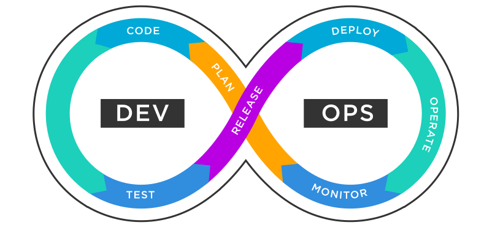

class: center, middle

## [Software Engineering](../../praesentationen.html)

#### Kapitel 5 - DevOps

# DevOps

Danny Meihöefer - Bjarne Zaremba

---
# Inhalt
***

1. Was ist DevOps (Ziele, Kultur, Best Practices, Tools)
2. Continuous Integration / Continuous Delivery / Continuous Deployment
3. Deployment strategies
4. CI/CD Tools
5. Secrets managment

---

class: center, middle

## DevOps

---

### Was ist DevOps?

DevOps ist eine Kombination aus den Begriffen Development und Operations

Darunter versteht man eine enge Zusammenarbeit zwischen den Bereichen Entwicklung und Betrieb

DevOps ist allerdings kein bestimmtes Tool, sondern eine Art Kultur

Es ist eine Kombination aus Entwicklung und Betrieb
- Mischung aus Praktiken, Tools und Philosophien

Beschleunigt die Softwareentwicklung und die Softwareauslieferung

DevOps basiert auf den Prinzipien:

- Kultur
- Best Practices
- Tools

---

## DevOps

---

### DevOps - Kultur

In der DevOps-Kultur geht es um:

- Automatisierung
- Kommunikation
- Gemeinsame Verantwortung
- Enge Zusammenarbeit
- Transparenz

Das wird erreicht indem die Entwicklung und der Betrieb als ein Team arbeiten

Wichtig ist dafür ein sicheres Umfeld zu schaffen, in dem Fehler erlaubt sind (Trial and Error)

Kontinuirlicher Lernprozess

---

### DevOps - Teams

DevOps Teams sind wichtig um die Vorteile von DevOps zu erreichen

Cross-Funktionale Teams

- Mitglieder mit unterschiedlichen Fähigkeiten
- Entwickler, Betreiber, Tester, ...

Automatisierungsexperten

- Automatisierung von Prozessen
- Beschleunigung der Entwicklungs- und Bereitstellungsprozesse

Site Reliability Engineers

- Verantwortlich für die Verfügbarkeit und Zuverlässigkeit der Software

Eine Führungskraft

- Verantwortlich für die Koordination der Teams

---

### DevOps - Best Practices

Die DevOps Praktiken unterscheiden sich von Unternehmen zu Unternehmen

Auch einzelne Teams können unterschiedliche Praktiken haben

Die Praktiken sind aber immer auf die Ziele von DevOps ausgerichtet

Wichtige Praktiken sind:

- Einbeziehung der Entwickler in den Betrieb
- Einbeziehung der Betreiber in die Entwicklung
- Versionskontrolle
- Agilität durch eine gute Infrastruktur
- Möglichst viel Automatisierung
- Continuous Integration / Continuous Delivery / Continuous Deployment
- Einheitliche Tools und Platformen

---

### DevOps - Vorteile

DevOps bietet für verschiedene Bereiche Vorteile:

- Geringes Risiko bei Änderungen
- Bessere Qualität der Produkte
- Geringere Veröffentlichungskosten
- Schneller auf dem Markt
- Weniger Zeitverlust durch Fehler
  - Mehr Zeit für die eigentliche Arbeit
- Höhere Einnahmen
- Stabile Infrastruktur
- Mitarbeiterzufriedenheit
-

---

### DevOps - Ziele

Die Ziele von DevOps sind:

- Schnellere Bereitstellung von Software
- Höhere Zuverlässigkeit von Software-Releases
- Bessere Zusammenarbeit zwischen Teams
    - Besonders zwischen Entwicklung und Betrieb
- Automatisierung von Prozessen
- Bessere Skalierbarkeit
- Höhere Qualität
- Kosteneffizienz
- Kontinuierliche Verbesserung

---

### DevOps - Pipelines

DevOps Pipelines sind ein wichtiger Bestandteil von DevOps

Eine Pipeline ist eine Reihe von Schritten, die automatisiert werden

Vergleichbar mit einer Fließbandproduktion

Es gibt typische Komponenten in einer Pipeline:

---

### DevOps - Continuous Integration (CI) / Continuous Deployment (CD)

Continuous Integration - Kontinuierliche Integration

Veränderungen am Code werden automatisch und regelmäßig in das Hauptprojekt integriert

- Integrations ins Hauptrepository

Continuous Deployment - Kontinuierliche Bereitstellung

- Softwareupdates werden automatisch und regelmäßig bereitgestellt
- Häufigere Updates verbessert die Feedbackschleife
  - Feedback kann öfter und schneller eingearbeitet werden

---

### DevOps - Continuous Delivery (CD)

Continuous Delivery - Kontinuierliche Auslieferung

- Softwareupdates werden nicht automatisch bereitgestellt
- Sie werden aber automatisch vorbereitet

Das beduetet, dass die Software jederzeit ausgeliefert werden könnte

---

### Releasing vs Deploying

Release bedeutet die Software wird für den Endbenutzer veröffentlicht

Beim Deploying wird die Software nur in eine bestimmte Umgebung ausgeliefert

- Diese muss nicht für den Endbenutzer zugänglich sein
- Ein Beispiel dafür kann eine Testumgebung sein

---

### Semantic Versioning

Semantic Versioning ist ein System zur Versionsnummerierung

- Wie sollen Versionsnummern vergeben werden?

Eine Versionsnummer besteht aus drei Teilen:

- Major, Minor, Patch
- Major: Große grundlegende Änderungen
  - Nicht kompatibel mit vorherigen Versionen
  - 2.1.5 -> 3.0.0
- Minor: Neue Funktionen und Verbesserungen
  - Kompatibel mit vorherigen Versionen
  - 2.1.5 -> 2.2.0
- Patch: Fehlerbehebungen
  - Kompatibel mit vorherigen Versionen
  - Behebung von Bugs und Sicherheitslücken
  - 2.1.5 -> 2.1.6

---

class: center, middle

## Deployment strategies

Es gibt verschiedene Strategien für die Auslieferung von Software

---

### Blue-Green Deployment

Strateegie um die Ausfallzeit bei Updates zu minimieren

- Es gibt zwei Umgebungen
  - Blue und Green

1. Die aktuelle Version läuft in der Blue-Umgebung
2. Die neue Version wird in der Green-Umgebung bereitgestellt
3. Die Green-Umgebung wird getestet
4. Die Green-Umgebung wird zur aktuellen Version
  
  - Mit Hilfe eines Load Balancers wird der Traffic auf die Green-Umgebung umgeleitet

5. Die Blue-Umgebung wird inaktiv gesetzt und kann für das nächste Update verwendet werden

---

### Blue-Green Deployment

---
### Canary 

Canary Deployment ist eine Strategie um die Auswirkungen von Updates zu testen

- Früher wurden Kanarienvögel im Vorfeld von Bergleuten in Minen eingesetzt um die Luftqualität zu testen (Starben sie war die Luftqualität schlecht)

Software wird zuerst nur an einen kleinen Teil der Benutzer (Canary User) ausgeliefert

- Die kleine Gruppe kann die Software testen und Feedback geben

---

### Feature Flags

Feature Flags ermöglichen es bestimmte Features zu aktivieren oder zu deaktivieren

Einzelne Gruppen von Benutzern können bestimmte Features testen

- Kontrolliertes testen

Über eine einzelne Konfigurationsdatei können Features aktiviert oder deaktiviert werden

---

class: center, middle

## CI/CD Tools

CI/CD Tools sind wichtig für die Automatisierung von Prozessen

Workflowautomatisierung

Beispiele für CI/CD Tools: Jenkins, GitLab CI, CircleCI, Travis CI, ...

---

### CI Server

Eins der gängigsten CI Tools ist Jenkins

Jenkins ermöglicht:

- Automatisierung von Builds
- Automatisierung von Tests
- Automatisierung von Deployments
- Automatisierung von anderen Prozessen
- Überwachung von Prozessen

Jenkins kann zum Beispiel Veränderungen in einem Git Repository erkennen und automatisch einen Build starten

---

### CI Server

---

## Secrets managment

Secrets sind sensible Daten, die nicht öffentlich zugänglich sein sollten

- Passwörter, API Keys, ...

Diese sollten nicht Hardcoded in den Quellcode geschrieben werden

Secrets Management Tools ermöglichen, dass diese Daten sicher verwaltet werden ohne die Workflowautomatisierung zu beeinträchtigen

Alle Secrets werden über ein zentrales Tool verwaltet

- Eine Anfrage an das Tool liefert z.B. das Passwort für eine Datenbank

---

## Verständnisfragen

1. Was ist DevOps?
2. Was sind die Ziele von DevOps?
3. Was sind DevOps Pipelines?
4. Was bedeutet Continuous Integration, Continuous Delivery und Continuous Deployment?
5. Wie geht semantic versioning?
6. Was ist ein Blue-Green Deployment?
7. Was sind CI/CD Tools?
8. Was ist Secrets Management?

---

# Quellen
***

https://www.tibco.com/de/reference-center/what-is-devops

https://jfrog.com/de/devops-tools/what-is-devops/

https://www.abtasty.com/de/blog/blue-green-deployments/

https://semaphoreci.com/blog/what-is-canary-deployment

https://www.jenkins.io/