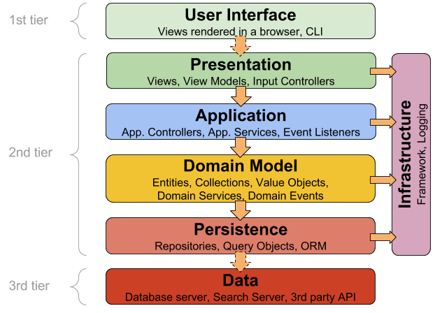

# Softwarelogik und Softwarearchitektur

**Autoren:** Bjarnne Zaremba - Danny Meihöfer

# Lernziele für dieses Kapitel

Nach diesem Kapitel sollen folgende Aspekte klarer geworden sein:

- Was ist Softwarelogik?
- Welche Arten von Softwarelogik gibt es?
- Was ist eine Softwarearchitektur?
- Was sind zyklische Abhängigkeiten und warum sind sie "schlecht"?
- Was ist die Schichtenarchitektur?

# Arten von Softwarelogik

Eine Softwareanwendung, oder ein Softwaresystem, besteht für gewöhnlich aus mehreren Teilen und aus verschiedenen einzelnen Funktionen, die alle unterschiedliche Zwecke erfüllen. Diese Teile der Software kann man in verschiedene Kategorien einteilen. Jeden Teil kann man auch als eine eigene Logik bezeichnen. Dabei muss man bedenken, dass die Teile sich oft gegenseitig beeinflussen und voneinander abhängig sind. Manchmal kann man sie sogar nur schwer voneinander trennen unterscheiden.

## Domänenlogik

Eine dieser Logiken ist die Domänenlogik auch Domain Logic genannt. Diese Logik ist wie der Name schon sagt der Teil der Software der sich mit den Regeln der Domäne beschäftigt.

Eine Domäne ist der Bereich in dem sich die Software bewegt. Das bedeutet, wenn man mit einer Software ein Problem lösen will, dann ist die Domäne das Problem, das die Software lösen soll. Ein Beispiel für eine Domäne im Gesundheitswesen wäre die Patientenverwaltung, oder die Terminplanung. Die Domänenlogik beinhaltet dann die Algorithmen, die zur Berechnung von Werten benötigt werden, die in der Domäne benötigt werden. Ein Beispiel dafür wäre die Berechnung des Body Mass Index (BMI) eines Patienten. Im Internet nennt man die Adresse einer Website auch eine Domain. Zum Beispiel ist die Domain von Google `www.google.de`.

## Geschäftslogik

Die Geschäftslogik ist eng mit der Domänenlogik verbunden. Manchmal werden die Begriffe sogar synonym verwendet. Oft kann men Teile der Software der Geschäfts- und der Domänenlogik zuordnen. Prinzipiell ist die Geschäftslogik der Teil der Software der dafür sorgt, dass die Software mit den Daten so umgeht, wie es den Anforderungen und Regeln um Unternehmen entspricht. Diese Anforderungen werden auch Geschäftsregeln genannt und definieren für gewöhnlich eine Art Workflow, den die Software abbilden soll. Wenn man beispielsweise einen Onlineverkauf mit einem Warenkorb hat, können Geschäftsregeln wie folgt lauten.

1. Der Kunden kann verfügbare Artikel in den Warenkorb legen.
2. Der Kunde kann Artikel aus dem Warenkorb entfernen.
3. Der Kunde kann die Anzahl der Artikel im Warenkorb ändern.
4. Der Preis im Warenkorb wird automatisch berechnet.
5. Bestellt der Kunde, bekommt das Unternehmen eine Bestellung.

Hier sorgen die Geschäftsregeln dafür, dass die Benutzung des Warenkorbs einem bestimmten Workflow entspricht. Die Geschäftslogik ist der Teil der Software, der für diesen Ablauf sorgt. Wichtig ist, dass zum einen der Ablauf für den Kunden gesteuert wird und zum anderen wird gesteuert was für Daten das Unternehmen bekommt. Dieses will natürlich nur  die Daten haben, die Relevant für die Bestellung sind.

## Präsentationslogik

Die Präsentationslogik ist der Teil der Software, der sich mit der Darstellung und der Benutzerinteraktion beschäftigt. Darstellung bedeutet hier die Darstellung der Daten, die die Software verarbeitet. Dazu erstellt man zum Beispiel eine UI (Benutzer Schnittstelle). Dabei achtet man auf die Benutzerfreundlichkeit und darauf, dass die Daten korrekt dargestellt werden.

## Steuerungslogik

Die Steuerungslogik ist für die Steuerung der Software verantwortlich. Dafür ist sie oft eng mit der Präsentationslogik verbunden, da diese sich mit der Benutzerinteraktion beschäftigt. Es ist wichtig zu sagen, dass zur Steuerung aber nicht nur die Benutzerinteraktion gehört, sondern auch die Steuerung der Software selbst. Das bedeutet, dass die Steuerungslogik auch dafür verantwortlich ist, dass die Software die Daten richtig verarbeitet und die richtigen Daten an die richtigen Stellen weitergibt. Dazu gehören auch automatische Prozesse, die die Software von selbst ausführt.

Drückt ein Benutzer beispielsweise auf einen Speicher-Button, wird im Hintergrund die Steuerungslogik ausgeführt, die dafür sorgt, dass die Daten gespeichert werden. Sie ist nicht selbst dafür verantwortlich, wie die Daten gespeichert werden, sondern sie sorgt nur dafür, dass die Daten gespeichert werden.

## Validierungslogik

Bei Softwareanwendungen kommt es häufig vor, dass Daten wie zum Beispiel Eingaben darauf überprüft werden müssen, ob sie korrekt sind. Gibt man zum Beispiel in seinem Formular Daten über seine Person an überprüft eine Software ob die eingegebenen Daten dem erforderlichen Format entsprechen. Hat eine angegebene E-Mail-Addresse eine @ Zeichen? Dieser überprüfende Teil der Software ist die Validierungslogik. Natürlich muss sie nicht nur Benutzereingaben überprüfen, sondern kann auch andere Daten überprüfen. Zum Beispiel kann sie überprüfen, ob die Daten, die von einer anderen Software kommen, korrekt sind.

## Infrastrukturlogik

Heutzutage besteht eine Software aus immer mehr Komponenten. Besonders moderne Cloud-Anwendungen bestehen aus vielen verschiedenen Komponenten, die alle miteinander kommunizieren. Diese Komponenten können zum Beispiel Daten austauschen oder sich gegenseitig steuern. Diese Komponenten und die Verbindungen zwischen ihnen ergeben die Infrastuktur einer Software. Die Infrastrukturlogik ist dafür verantwortlich, dass die Kommunikation zwischen den Komponenten funktioniert. Sie sorgt dafür, dass die Komponenten miteinander kommunizieren können und dass die Kommunikation sicher ist. Sie sorgt für die Verbindung zwischen den Komponenten. Das sind beispielsweise Verbindungen zwischen verschiedenen Servern oder zwischen Servern und Datenbanken. Die Infrastrukturlogik regelt außerdem die Verteilung von Ressourcen, die die einzelnen Komponenten benötigen. Das können zum Beispiel Rechenleistung oder Speicherplatz sein. Ohne eine geeignete Infrastruktur kann eine Software nicht funktionieren und ist die Infrastuktur schlecht, ist es sehr schwer eine Software zu skalieren.

Die Infrastructurlogik wird auch oft als Infrastructure as Code beschrieben und mit IaC abgekürzt.

### Persistenz 

Die Persistenz ist ein Teil der Infrastrukturlogik. Die Persistenz IaC ist nur dafür verantwortlich Ressourcen die auf Dauer verfügbar sein müssen zu verwalten. Oft ist beispielsweise eine dauerhafte Verbindung zu bestimmten Datenbanken nötig. Die Persistenz IaC sorgt dafür, dass diese Verbindung dauerhaft besteht. Sie sorgt dafür, dass die Datenbanken immer verfügbar sind und dass die Datenbanken immer die richtigen Daten enthalten.

### Cache

Die Cache Infrastrukturlogik kümmert sich fast um das genaue Gegenteil. Sie kümmert sich nicht um dauerhafte Ressourcen, oder Daten. Sie kümmert sich um temporäre Daten, die immer nur kurzfristig zur verfügen gestellt werden müssen. Der Cache ist ein Speicher, der Daten speichert, die oft und vorallem schnell benötigt werden. Für dauerhafte Speicherung ist er nicht gedacht. Die Cache Infrastrukturlogik sorgt dafür, dass der Cache immer die richtigen Daten enthält und dass die Daten schnell abgerufen werden können. Sie muss außerdem dafür sorgen, dass der Cache so effizient und optimal wie möglich verwendet wird. Ein paar einzelne Aufgaben der Cache Infrastrukturlogik sind:

- - Welche Daten werden gecached
- Wie lange werden die Daten gecached
- Welche Daten müssen aus dem Cache gelöscht werden
- Verteiltes Caching
- Fehlerbehandlung im Cache
- Überwachung und Optimierung
- Sicherheit

### Transaktion

Eine ganz eigene Infrastruktur brauchen Anwendungen wenn sie Transaktionen durchführen möchten. Hier muss besonders darauf geachten, dass die Transaktionen korrekt durchgeführt werden, da sonst große Probleme entstehen können. Das ist die Aufgabe der Infrastrukturlogik. 

Sie muss drauf achten, dass Transaktionen dem ACID Prinzip folgen. Jeder Buchstabe steht hier für einen bestimmten Aspekt.

A - Atomicity (Atomarität) bedeutet, dass eine Transaktion immer vollständig druchgeführt werden muss. Egal was für ein kleiner Aspekt der Transaktion eventuell nicht richtig ist, wenn die Transaktion nicht vollständig durchgeführt wird, dann wird sie gar nicht durchgeführt.

C - Consistency (Konsistenz) bedeutet, dass die Daten vor und nach der Transaktion immer konsistent sein müssen. Bei einer Transaktion werden im Hintergrund oft Daten in Datenbanken verändert. Diese müssen sowohl vor als auch nach der Transaktion konsistent sein. Das bedeutet, dass sie immer den Regeln entsprechen müssen, die für die Datenbank gelten.

I - Isolation heißt hier, dass eine Transaktion nie von einer anderen Transaktion beeinflusst werden sollte. Jede einzelne Transaktion ist isoliert und unabhängig von allen anderen Transaktionen.

D - Durability (Dauerhaftigkeit) bedeutet, dass eine Transaktion immer dauerhaft sein muss. Nach dem Abschluss einer Transaktion darf sich nichts, was sich auf die Transaktion bezieht, mehr ändern.

## Softwarearchitekturen

Wie bereits erwähnt besteht eine Software für gewöhnlich aus vielen einzelnen Komponenten. Dabei stellt sich die Frage "Wie baut man seine Software am besten auf?".

Es gibt verschiedene Ziele, die man mit einer bestimmten Softwarearchitektur erreichen möchte, wie zum Beispiel die Skalierbarkeit, der Software, oder die Unabhängigkeit der einzelnen Komponenten.

Die Architektur ist allerdings kein detailierter Entwurf der Software, sondern eine grobe Übersicht, die nur darstelle wie die einzelnen Komponenten und die Verbindungen zwischen ihnen aussehen.

## Schichtenarchitektur - Layered Architecture

Eine der Softwarearchitekturen die gängig ist, ist die Schichtenarchitektur. Dabei teilt man die Anwendung in mehrere Schichten auf und jede Schicht hat bestimmte Aufgaben. Dabei kann man die Software gut in die einzelnen Logikbestandteile aufteilen. Üblich ist eine Aufteilung in wenigstens drei Schichten. 

- Client - Präsentationsschicht - UI
- Server - Logik
- Datenbank/Infrastruktur - Persistenz

Natürlich kann es von Vorteil mehr Schichten zu haben und man kann auch Unterschichten haben, die einer Überschicht untergeordnet sind.

Auf der Abbildung kann man gut erkennen wie eine Software in mehrere Schichten aufgeteilt werden kann und man erkennt gut die einzelnen Logiken.

### Vor- und Nachteile

Dieser Ansatz bietet einige Vor- und Nachteile. Zu den Vorteilen gehört, dass der Ansatz leicht zu verstehen ist, da der Aufbau relativ natürlich ist. Einzelne Funktionsgruppen bekommen ihre eigene Schicht. Durch die leichte Verständlichkeit ist es auch verhältnissmäßig unkompliziert so eine geschichtete Anwendung zu erstellen. Ein theoretischer Vorteil ist, dass man einzelne Schichten Verändern kann ohne, die anderen verändern zu müssen. 

Der Nachteil ist eine verschlechterte Performance, da die Schichten mit einander kommunizieren müssen, kann es sein, das Daten immer wieder zwischen vielen Schichten übertragen werden müssen. Das kostet natürlich Zeit und Rechenleistung. Außerdem ist es nicht immer möglich die Schichten unabhängig voneinander zu verändern. Oft ist es so, dass eine Änderung in einer Schicht auch Änderungen in anderen Schichten erfordert. Das kommt sehr darauf an wie abhängig man die Schichten vorher von einander gemacht hat. Es kann Teile geben, die man ohne probleme einzeln verändern kann, aber auch Teile, die Änderungen an anderen Schichten erfordern.

### Azyklische Abhängigkeiten

Möchte man einzelne Komponenten, wie die Schichten bearbeiten, ist es von Vorteil, wenn sie azyklisch sind. Was bedeutet das?

Die Komponenten sollten möglichst nicht von einander abhängig sein. Das heißt die Komponenten sollten so erstellt worden sein, dass wenn man eine Änderung an einer Komponente erstellt, sollte man die andere nicht verändern müssen. Ist das nicht der Fall nennt man die Abhängigkeit zyklisch. Generell versucht man in der Softwareentwicklung zyklische Abhängigkeiten zu vermeiden. Manchmal werden sie sogar als Fehler angesehen. 

Allerdings ist es nicht immer zu 100% möglich zyklische Abhängigkeiten zu vermeiden.

Das führt dazu, dass Komponenten nicht unabhängig von einander weiterentwickeln können. Die Entwickler müssen wenn sie eine bestimmte Funktion ändern möchten auch die anderen Funktionen anpassen. Das kann je nach Projekt zu einem sehr großen Mehraufwand führen.

## Abbildungen

Schichtenarchitektur:
https://herbertograca.com/2017/08/03/layered-architecture/
