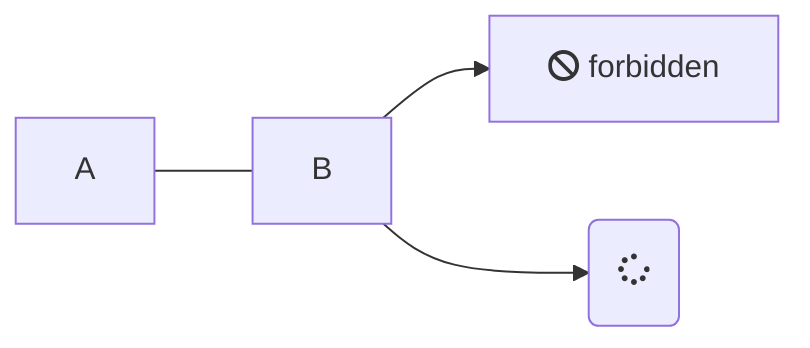
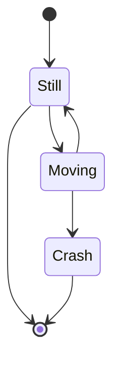

# Kapitelüberschrift

**Autor:** Max Mustermann

# Headings

* Überschrift H1: `# Überschrift`

# Überschrift

* Überschrift H2: `## Überschrift`

## Überschrift

*  Überschrift H3: `### Überschrift`

### Überschrift

*  Überschrift H4: `#### Überschrift`

#### Überschrift

* Überschrift H5: `##### Überschrift`

##### Überschrift

*  Überschrift H6: `###### Überschrift`

###### Überschrift

# Paragraphs

* Paragraphen werden durch eine oder mehrere leere Zeilen von einander getrennt:

Lorem ipsum dolor sit amet, consetetur sadipscing elitr, sed diam nonumy eirmod tempor invidunt ut labore et dolore magna aliquyam erat, sed diam voluptua. At vero eos et accusam et justo duo dolores et ea rebum. Stet clita kasd gubergren, no sea takimata sanctus est Lorem ipsum dolor sit amet. Lorem ipsum dolor sit amet, consetetur sadipscing elitr, sed diam nonumy eirmod tempor invidunt ut labore et dolore magna aliquyam erat, sed diam voluptua. At vero eos et accusam et justo duo dolores et ea rebum. Stet clita kasd gubergren, no sea takimata sanctus est Lorem ipsum dolor sit amet.

Lorem ipsum dolor sit amet, consetetur sadipscing elitr, sed diam nonumy eirmod tempor invidunt ut labore et dolore magna aliquyam erat, sed diam voluptua. At vero eos et accusam et justo duo dolores et ea rebum. Stet clita kasd gubergren, no sea takimata sanctus est Lorem ipsum dolor sit amet. Lorem ipsum dolor sit amet, consetetur sadipscing elitr, sed diam nonumy eirmod tempor invidunt ut labore et dolore magna aliquyam erat, sed diam voluptua. At vero eos et accusam et justo duo dolores et ea rebum. Stet clita kasd gubergren, no sea takimata sanctus est Lorem ipsum dolor sit amet.

# Emphasis

* kursiv: `_dieser Text wird kursiv_`

_dieser Text wird kursiv_

* fett: `**dieser Text wird fett**`

**dieser Text wird fett**

* durchgestrichen: `~~dieser Text wird durchgestrichen~~`

~~dieser Text wird durchgestrichen~~

# Listen

* ungeordnete Liste: `* Element 1 und nächste Zeile Tab * untergeordnetes Element 2`

* Element 1
  * untergeordnetes Element 2

-- geordnete Liste: `1. Element, 2. Element ...`

1. Element
2. Element

## Unterkapitel

* **Softwaresystem**:
  Die *innere* Sicht des Informatikers nimmt Software als Softwaresystem wahr.
* **Softwareprodukt**: Die *äußere* Sicht eines Auftraggeber nimmt ein Softwaresystem als Softwareprodukt wahr. 

### Tabelle

| A          |     B       |           C               | 
|:----------:|:-----------:|:-------------------------:|
| Eins | Zwei | Drei |
| Vier | Fünf | Sechs |

## Links

[Markdown] ist eine Sprache, die nach HTML konvertiert werden kann. 

[Markdown]: http://daringfireball.net/projects/markdown/

## Aufzählung

Es unterteilt sich in:

* A
  * A1
* B
  * B1
  * B2
* C


# Überschrift

"...the **go to** statement should be abolished..." [1].

Dieser Link führt intern zu einem anderen [Thema](qualitaet/README)

Dieser Link führt extern zu [Youtube](https://www.youtube.com/)

> Dieser Text ist völlig sinnlos, aber steht trotzdem hier. Dieser Text geht über mehrere Zeilen, wenn der Text lang genug ist, um über mehrere Zeilen zu passen.

## Unterüberschrift

* Eins
  * eins.eins
  * eins.zwei
* Zwei
  * Zwei.zwei
* Drei

### Code

```javascript
public class A {
  Integer a;
  public A() {
    this.a = 1
  }
}
```

Syntax Highlighting für Javascript. Weitere Sprachen müssen in 'index.html' konfiguriert werden.

### Mermaid





### Bilder


## Referenzen

[1]: Dijkstra, E. W. (1968). Go to statement considered harmful. 
Communications of the ACM, 11(3), 147-148.
