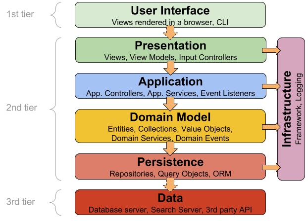

class: center, middle

## [Software Engineering](../../praesentationen.html)

#### Kapitel 6

# Softwarelogik und Softwarearchitektur

Danny Meihöfer - Bjarne Zaremba

---
# Inhalt
***

1. Arten von Softwarelogik
2. Softwarearchitekturen

---

class: center, middle

# Arten von Softwarelogik

Software besteht aus verschiedenen Arten von Logik

Bestimmte Teile der Software haben verschieden Anforderungen und Aufgaben

Viele der Teile sind voneinander abhängig

---

## Domänenlogik

Die Domänen Logik (Domain Logic) ist der Teil der Software, der sich mit den Regeln in einer Domäne beschäftigt

Was ist eine Domäne?

-Eine Domäne ist ein Bereich in dem sich die Software bewegt

-Die Domäne representiert das Problem, das die Software lösen soll

Das sind Beispiele für mögliche Domänen im Gesundheitswesen:

- Patientenverwaltung, Terminplanung, Rechnungsverwaltung, etc..

Zur Domänenlogik gehören z.B. Algorithmen zur Berechnung von Werten, die in der Domäne benötigt werden

- Berechnung des Body Mass Index (BMI) eines Patienten

Im Internet ist eine Domain auch eine Adresse wie `www.google.de`

---

## Geschäftslogik

Geschäftslogik (business Logic) ist der Teil der Software, der bestimmt wie eine Software mit den Daten umgeht

Die Geschäftslogik folgt den Geschäftsregeln, um dem Workflow die das Unternehmen erwartet zu entsprechen

Geschäftsregeln Warenkorb:

- Der Kunde kann verfügbare Artikel in den Warenkorb legen
- Der Kunde kann die Anzahl der Artikel im Warenkorb ändern
- Der Kunde kann Artikel aus dem Warenkorb entfernen
- Der Preis des Warenkorbs wird automatisch berechnet
- Bestellt der Kunde, bekommt das Unternehmen eine Bestellung

In diesem Beispiel steuert die Geschäftslogik den Workflow des Warenkorbs

- Wie kann der Kunde den Warenkorb benutzen
- Welche Daten bekommt das Unternehmen bei einer Bestellung

Die Begriffe Geschäfts- und Domänenlogik werden oft synonym verwendet

---

## Präsentationslogik

Die Präsentationslogik ist der Teil der Software, der sich mit der Darstellung und Benutzerinteraktion beschäftigt

Dazu gehört zum Beispiel das erstellen einer korrekten UI

- Benutzerfreundlichkeit
- Datenanzeige/ Formatierung
- Benutzerinteraktion usw. 

---

## Steuerungslogik

Die Steuerungslogik arbeitet eng mit der Präsentationslogik zusammen

Die Algorithmen der Steuerungslogik reagieren auf Benutzerinteraktionen

Sie können aber auch automatisch ausgeführt werden

Drückt der Benutzer zum Beipiel auf einen Speichern-Button, wird die Steuerungslogik ausgeführt, die die Daten speichert

---

## Validierungslogik

Die Validierungslogik ist der Teil der Software der die Daten auf Korrektheit überprüft

Dazu gehören auch die Validierung von Benutzereingaben

Ein Beispiel könnte eine Funktion sein, die überprüft ob eine E-Mail Adresse gültig ist, indem sie das Format der E-Mail Adresse überprüft (z.B. @ Zeichen)

---

## Infrastrukturlogik

Die Infrastrukturlogik ist der Teil der Software, der sich mit der Verwaltung der Infrastruktur beschäftigt

Ressourcen der Infrastruktur sind z.B. Datenbanken, Dateisysteme, Netzwerke und Server

Diese werden über Code verwaltet (Auch Infrastructure as Code genannt (IaC))

Besonders in modernen Cloud Anwendungen ist die Infrastrukturlogik sehr wichtig

Beispielaufgaben der Infrastrukturlogik:

- Infrastukrurressourcen bereitstellen
- Skalierung
- Verbindungen zu anderen Systemen herstellen

---

### Persistenz

Persistant IaC ist eine Art der Infrastrukturlogik

Sie kümmert sich um die Verwaltung von Ressourcen, die Dauerhaft verfügbar sein müssen

Datenbanken müssen beispielsweise oft dauerhaft verfügbar sein

---

### Cache 

Die Cache Infrastrukturlogik kümmert sich um die Verwaltung von Ressourcen, die nicht dauerhaft verfügbar sein müssen

Der Cache ist eine temporäre Speicherung von Daten, die oft benötigt werden

Die Infrastrukturlogik muss dafür sorgen, dass dieser möglichst effizient genutzt wird

Beispiele für Aufgaben der Cache Infrastrukturlogik:

- Welche Daten werden gecached
- Wie lange werden die Daten gecached
- Welche Daten müssen aus dem Cache gelöscht werden
- Verteiltes Caching
- Fehlerbehandlung im Cache
- Überwachung und Optimierung
- Sicherheit

---

### Transaktion

Um Transaktionen durchzuführen benötigt eine Anwendung eine ganz eigene Infrastruktur für die Transaktionen.

Die Infrastrukturlogik muss dafür sorgen, dass die Transaktionen korrekt durchgeführt werden

Transaktionen müssen den ACID Prinzipien folgen

- Atomicity (Atomarität)
  - Vollständig, oder gar nicht
- Consistency (Konsistenz)
  - Daten müssen nach der Transaktion konsistent sein
- Isolation (Isolation)
  - Transaktionen dürfen sich nicht gegenseitig beeinflussen
- Durability (Dauerhaftigkeit)
  - Transaktionen müssen dauerhaft sein

---
class: center, middle

## Softwarearchitekturen

Die Architektur einer Software beschreibt die Struktur der Software

Sie ist kein detailierter Entwurf, sondern eine grobe Übersicht über die Komponenten und die Verbindungen zwischen ihnen

---

## Schichtenarchitektur - Layered Architecture

Eine Anwendung wird in mehrere Schichten aufgeteilt

Jede Schicht hat eine bestimmte Aufgabe

Die meisten Schichtenarchitekturen haben drei Schichten

- Client - Präsentationsschicht - UI
- Server - Logik
- Datenbank/Infrastruktur - Persistenz

Es gibt auch Architekturen mit mehr als drei Schichten

An diesem Modell erkennt man gut wie unterschiedliche Arten von Logik in einer Software zusammenarbeiten

---

## Schichtenarchitektur - Layered Architecture

---

### Schichtenarchitektur - Vor- und Nachteile

Vorteile:

- Leicht zu verstehen
- Leicht umzusetzen
- Man kann einzelne Schichten verändern

Nachteile:

- Schlechte Performance
  - Daten müssen zwischen den Schichten übertragen werden
- Schwierige Erweiterbarkeit
- Begrenzte Skalierbarkeit

---

### Azyklische Abhängigkeiten

Möchte man Komponenten unabängig voneinander entwickeln, müssen sie azyklisch sein

Das bedeutet, dass keine Komponente von einer anderen abhängig sein darf

Eine Änderung an einer Komponente darf keine Änderungen an einer anderen Komponente erfordern

Einige Abhängigkeiten sind aber unvermeidbar

Zyklische Abhängigkeiten können zu Problemen führen

- Komponenten können nicht unabhängig voneinander entwickelt werden
- Extreme erhöhung des Aufwands bei Änderungen

---

## Verständnissfragen

1. Was ist eine Domäne?
2. Wofür sorgen Domänen und Geschäftslogik?
3. Was hat der Benutzer mit der Präsentationslogik zu tun?
4. Was ist die Aufgabe der Steuerungslogik?
5. Warum ist die Infrastrukturlogik in modernen Cloud Anwendungen so wichtig?
6. Was ist das Schichtenmodell?

---

# Quellen
***

https://medium.com/@mani_c/domain-logic-data-gateways-and-mapping-relationships-e7260a072c47

https://www.easytechjunkie.com/what-is-control-logic.htm?utm_content=cmp-true

https://resource.flexrule.com/knowledge-base/validation-logic/

https://www.techtarget.com/searchitoperations/definition/Infrastructure-as-Code-IAC#:~:text=Examples%20of%20infrastructure%2Das%2Dcode,Puppet%2C%20SaltStack%20and%20HashiCorp%20Terraform.

https://www.softselect.de/business-software-glossar/schichtenarchitektur#:~:text=Eine%20Schichtenarchitektur%20oder%20mehrschichtige%20Applikation,Schichten%20des%20Ganzen%20zu%20fungieren.

https://entwickler.de/software-architektur/weg-vom-schichtenmodell

https://herbertograca.com/2017/08/03/layered-architecture/

https://www.heise.de/blog/Zyklische-Abhaengigkeiten-eine-Architektur-Todsuende-4061803.html