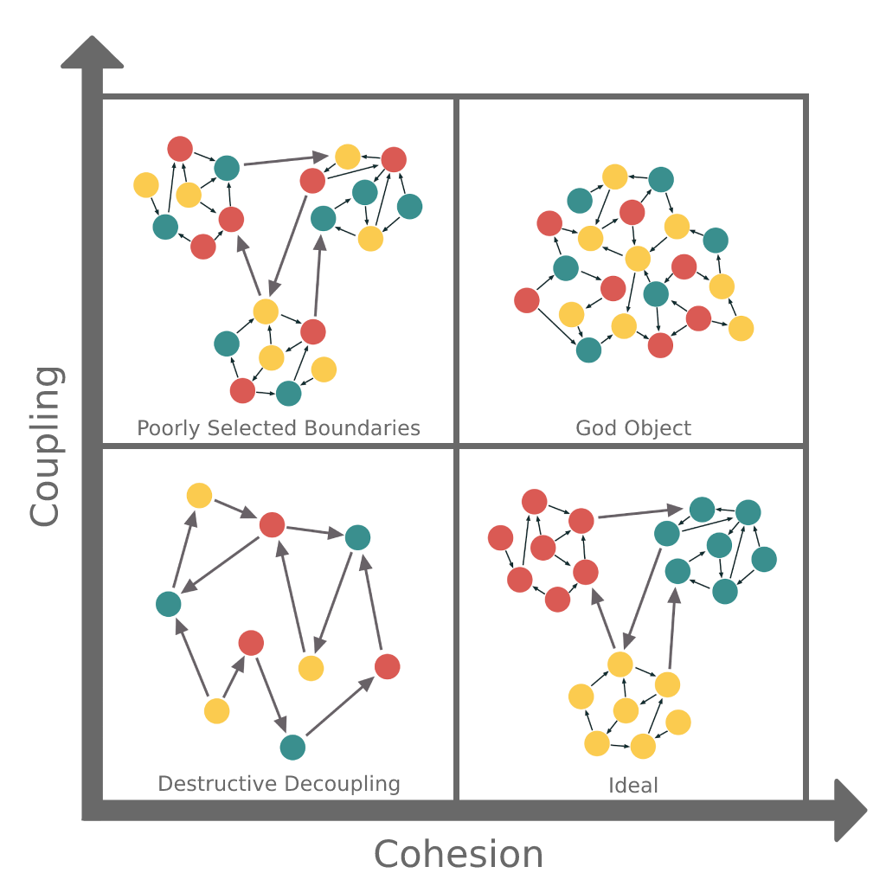

# Softwareentwurf

**Autoren:** Danny Meihöfer - Bjarne Zaremba

## Lernziele für dieses Kapitel

Nach diesem Kapitel sollen folgende Aspekte klarer geworden sein:

- Was ist ein Softwareentwurf?
- Was sind die Ziele eines Softwareentwurfs?
- Was für Entwurfsprinzipien gibt es?
- Was sind die SOLID-Prinzipien?

## Softwareentwurf

Die IEEE1990 definiert den Begriff Softwareentwurf wie folgt: "Der Softwareentwurf ist der Prozess der Definition der Architektur, Komponenten, Schnittstellen und anderer charakteristischer Merkmale eines Systems oder einer Komponente." 

Man kann den Softwraeentwurf also als Bauplan für die Entwicklung einer Software sehen. Der Entwurf ist dabei die Grundlage für die Implementierung.

Die Entwicklung einer Software besteht aus vielen Schritten. Die Erstellung eines Softwareentwurfs ist einer der ersten Schritte.


### Tätigkeiten im Softwareentwurf

Der Softwareentwurf besteht aus mehreren Tätigkeiten, die man in das Top-Level-Design und das Detailed-Design unterteilen kann.

Das Top-Level-Design beschreibt die Architektur der Software. Es wird festgelegt, welche Komponenten es gibt und wie diese zusammenarbeiten. Das Top-Level-Design ist die Grundlage für das Detailed-Design. Folgende Aspekte gehören zu dem Top-Level-Design:

- Architektur
- Organisation
- Komponenten
- Schnittstellen
- Persistenz
- Verteilung
- Alles auf hohem Abstraktionsniveau

Beim Detailed Design geht es um genauere und detailliertere Aspekte der Software. Folgende Aspekte gehören zum Detailed Design:

- Klassen
- Methoden
- Attribute
- Komponenten detailiert
- Datenstrukturen
- Algorithmen
- Alles auf niedrigem Abstraktionsniveau

Es geht nicht um konkrete Implementierungen, sondern um die Struktur der Software und eine Beschreibung der Komponenten.

### Entwurfsprinzipien

Das Hauptziel des Softwareentwurfs ist es, dass man als Team eine gemeinsame Basis für die nächsten Schritte der Entwicklung hat. Um mit der Umsetzung der Pläne anzufangen.

Die wichtigsten Aspekte auf die dabei klar werden müssen sind die Orthogonalität, die Kohäsion und die Kopplung.

#### Orthogonalität

Den Begriff Orthogonalität kennt man vielleicht aus der Mathematik. Dort bedeutet er, dass zwei Vektoren orthogonal zueinander sind, wenn sie senkrecht aufeinander stehen. In der Softwareentwicklung geht es nicht um Vektoren, sondern um Komponenten eines Softwaresystems. Diese Komponenten sind orthogonal zueinander, wenn sie unabhängig voneinander sind. Das bedeutet, dass eine Änderung an einer Komponente keine Auswirkungen auf eine andere Komponente hat. Das bedeutet auch, dass Komponenten keine doppelten Aufgaben haben und keine Nebeneffekte erzeugen. 

- Klassen sollten sich nicht auf die Implementierung anderer Klasen verlassen müssen
- Globale Daten sollen vermieden werden
- Verändert man eine Klasse hat das keine Auswirkungen auf andere Klassen
- Einzelne Komponenten sind unabhängig voneinander und haben jeweils nur eine Aufgabe

#### Niedrige Kopplung

Eine niedrige Kopplung ist immer wichtig für eine gute Software. Niedrige Kopplung bedeutet, dass die einzelnen Komponenten einer Software so unabhängig voneinander isnd wie möglich. Es gibt wenig Abhängigkeiten und eine Änderung an einer einzlnen Komponente hat keine Auswirkungen auf andere Komponenten. Wird dieses Ziel nicht verfolgt und haben Komponnten starke abhängigkeiten führt das im Laufe der Entwicklung und vorallem in der Wartung eines Systems zu Problemen. Starke Abhängigkeiten führen zum Beispiel dazu, dass man für eine kleine Änderung viele einzelne Komponenten anpassen muss. Das ist aufwendig und fehleranfällig.


Es gibt verschiedene Programmierstile, die mit der Kopplung unterschiedlich umgehen. 

Besonders bekannt ist die Objektorientierung. Hier werden Daten und Funktionen zusammen in Objekte zusammengefasst. Dieses System lehnt sich daran an wie in der realen Welt Objekte miteinander interagieren. Die Aufgaben, oder Probleme, die eine Software lösen soll wird hier durch Interaktionen zwischen den Objekten gelöst. Da dieser Stil sich an der realen Welt orientiert ist er sehr intuitiv und leicht zu verstehen. Es gibt aber auch Nachteile. Die Objekte sind oft relativ stark miteinander verbunden. Eine Änderung an einem Objekt kann Auswirkungen auf andere Objekte haben. Das kann zu Problemen führen. Bestimmte Programmiersprachen eignen sich besonders gut für diesen Stil. Dazu gehören beispielsweise Java, Python und C++.

Auf der anderen Seite gibt es die prozedurale Programmierung. Hier werden Daten und Funktionen nicht zusammengefasst. Sie sind getrennt und es gibt keine Objekte. Hier werden die Probleme in einzelne Schritte zerlegt. Diese Schritte werden dann in Funktionen zusammengefasst. Die Funktionen können dann in anderen Funktionen aufgerufen werden. Programmiersprachen die sich besonders gut für diesen Stil eigenen sind beispielsweise C und Pascal.

#### Hohe Kohäsion

Hohe Kohäsion ist eine weitere wichtige Eigenschaften einer guten Software. Während mehrere Komponenten eine möglichst niedrige Kopplung haben sollten, sollten die Komponenten in sich selbst eine hohe Kohäsion haben. Das bedeutet wenn eine Komponente aus mehreren Teilen besteht, sollten diese Teile möglichst eng zusammenarbeiten und eine gemeinsame Aufgabe erfüllen. Es gehören keine Teile zu einer Komponente, die nicht für die übergeordnete Aufgabe benötigt werden.



### Entwurfsprinzipien

Bei dem Erstellen eines Softwareentwurfs sollte aus viele Aspekte geachtet werden. Im folgenden werden ein paar der wichtigen Aspekte vorgestellt.

#### Abstraktion 

Das erste Prinzip ist die Abstraktion. Ein Entwurf soll durch Vereinfachung verständlich gemacht werden. Das ermöglicht allen Beteiligten eine schnelle Übersicht über das System zu bekommen. Die Details werden dabei so weit es geht weg gelassen.

Dabei sollen Beispielsweise die systematischen Zusammenhänge zwischen den Komponenten dargestellt werden. Eine bekannte Form der Abstraktion sind zum Beispiel UML-Diagramme. Diese Diagramme zeigen die Zusammenhänge zwischen den Komponenten und deren Beziehungen und die groben Aspekte einzelner Komponenten.

So kann ein UML-Diagramm für eine Klasse aussehen:


#### Modularisierung

Bei der Modularisierung handelt es sich um eine der Hauptaufgaben eines Softwareentwurfs. Dabei geht es hauptsächlich um die Aufteilung der Software in einzelne Komponenten. Jeder einzelne abgegrenzte Teil eines Systems ist ein Modul. Für gute Module gibt es einige Kriterien, die erfüllt sein sollten. Ein gutes Modul ist in sich selbst geschlossen. Das bedeutet, dass es keine, oder möglichst wenige Abhängigkeiten zu anderen Modulen gibt. Außerdem sollte ein Modul von anderen benutztwerden können, ohne dass sie die konkrete implementierung vorher wissen müssen. Da Module oft miteinander kommunizieren müssen ist es wichtig, dass die Schnittstellen zwischen den Modulen klar definiert sind. Selbstverständlich muss jedes Modul korrekt funktionieren und absolut zuverlässig sein. Die Kohäsion sollte hoch sein und die Kopplung niedrig.


#### Law of Demeter

Das Gesetz von Demeter wurde aufgestellt um festzulegen, was guter Codestil ist. Es wurde von Ian Holland und Karl Liebherr aufgestellt. Genauer genommen ist es eine Liste von Regeln die beschreiben wie verschiedene Programmteile miteinander interagieren und kommunizieren sollen.


**Regel 1:** Eine Methode einer Klasse sollte nur auf andere Methoden der eigenen Klasse zugreifen. 

```java
class Greetings {
    
    String generalGreeting() {
        return "Welcome" + world();
    }
    String world() {
        return "Hello World";
    }
}
```

**Regel 2:** Eine Methode einer Klasse K soll nur Methoden von Objekten verwenden, die von der Klasse K erzeugt wurden

```java
String getHelloBrazil() {
    HelloCountries helloCountries = new HelloCountries();
    return helloCountries.helloBrazil();
}
```

**Regel 3:** Die Methode M sollte nur Methoden von Objekten verwenden, die als Parameter an M übergeben wurden

```java
String getHelloIndia(HelloCountries helloCountries) {
    return helloCountries.helloIndia();
}
```

**Regel 4:** Die Methode der Klasse K soll nur Methoden von Objekten verwenden, die als Instanzvariablen in K gespeichert sind

```java
HelloCountries helloCountries = new HelloCountries();
  
String getHelloJapan() {
    return helloCountries.helloJapan();
}
```

**Regel 5:** Die Methode einer Klasse K darf Methoden von Objekten verwenden, die statisch und in K definiert sind

```java
static HelloCountries helloCountriesStatic = new HelloCountries();
    
String getHellStaticWorld() {
    return helloCountriesStatic.helloStaticWorld();
}
```

Diese Regeln sollen sicherstellen, dass die einzelnen Komponenten einer Software möglichst unabhängig voneinander sind. Das ist wichtig, damit eine Änderung an einer Komponente keine Auswirkungen auf andere Komponenten hat.

#### Dependency Injection - Inversion of Control

Dependency Injection ist auch eine Vorgehensweise mit der die Abhängigkeiten zwischen mehreren Komponenten veringert werden soll. Dabei werden die Abhängigkeiten einer Komponente nicht von der Komponente selbst fest gelegt, sondern von einer anderen Komponente. Der Vorteil davon ist, dass die Komponente selbst, dann nichtmehr von der Implementierung der anderen Kmponente abhängt. Inversion of Control ist eng damit verbunden. Das bedeutet hier auch einfach, dass die Kontrolle über die Abhängigkeiten nach außen verlagert werden.

Die Abhängigkeit kann zum Beipsiel über den Konstruktor weiter gegeben werden. Das sieht dann so aus:

```java
class Greetings {
    
    HelloCountries helloCountries;
    
    Greetings(HelloCountries helloCountries) {
        this.helloCountries = helloCountries;
    }
    
    String generalGreeting() {
        return "Welcome" + helloCountries.world();
    }
}
```

Alternativ kann die Abhängigkeit auch über eine Setter-Methode gesetzt werden oder über Interfaces bestimmt werden.

#### Seperation of Concerns

Seperation of Concerns bedeutet "Trennung von Belangen". Die Essenz dieser Aussage ist, dass jeder einzelne Teil in einem System nur eine einzelne Aufgabe haben soll und zu einer Komponente gehören auch nur Teile die zu der Lösung dieser Aufgabe beitragen. Ein Beispiel dafür ist die Aufteilung eines Systems in Business Logic und UI Logic (Präsentationslogik). Jeder Teil ist nur für eine Aufgabe verantwortlich. Diese Aufteilung ist auch wieder wichtig damit nicht zu viele Abhängigkeiten entstehen. Ist eine Komponente für mehrere Aufgaben zuständig, oder sogar mehrere Komponenten für die gleiche Aufgaben entstehen viele unnötige Abhängigkeiten. Außerdem ist ein Modul leichter zu verstehen wenn es nur einen Zweck erfüllt.

#### Keep It Simple and Stupid (KISS)

Das KISS Prinzip sagt aus, dass Code so simpel und verständlich wie möglich sein sollte. Die höchste priorität ist, das andere den Code verstehen können, weil man immer davon ausgehen muss, dass andere an seinem Code weiter arbeiten und ihn verstehen müssen. Komplexer code kann nur schwer von anderen verstanden und gewartet werden. Manchmal ist es schwer den Code so einfach zu halten wie man es sich vorstellt, aber es ist wichtig, darauf zu achten. Man kann sich die erhöhen des Aufwands exponentiell vorstellen. Je komplexer der Code ist, desto mehr Aufwand ist nötig um ihn zu verstehen und zu warten und unverständlicher Code erweitert wird, wird er meistens nur unverständlicher.

#### You Ain't Gonna Need It (YAGNI)

In Kombination mit dem KISS Prinzip wird oft das YAGNI Prinzip verwendet. Laut diesem Prinzip soll auch darauf geachtet werden, dass nur der Code implementiert wird, den man auch wirklich braucht. Funktionen, die man nicht braucht werden weder implementiert noch erweitert, da das nur zu Aufwand führt. Beschränkt man sich beim Code auf das nötigste bleibt der Code auch kompakter und verständlicher.

#### Don't Repeat Yourself (DRY)

Zu KISS und YAGNI kommt nocht das DRY Prinzip. Funktionen, oder noch genereller, Code sollte nie wiederholt werden. Wiederholter Code führt zu unnötigem Aufwand und macht den Code unübersichtlich. Wird der Code an einer Stelle geändert, muss er an allen anderen Stellen auch geändert werden. Das ist fehleranfällig und aufwendig. Das Warten wird schwerer, das erweitern wird schwierig, das testen wird schwierig und der Code wird schwerer zu verstehen.

#### Composition over Inheritance

Eine der wichtigsten Grundlagen der Programmierung ist die Vererbung. Klassen können Eigenschaften von anderen Klassen erben, wie zum Beispiel Methoden, oder Attribute. Diese Möglichkeit ist sehr mächtig, aber wenn man sie zu oft benutzt macht auch sie den Code unübersichtlicher und birgt noch andere Risiken. Die Vererbung ist eine starke Kopplung. Die Klassen sind also voneinander Abhängig. Außerdem ist ein System aus Vererbungen schwerer zu verstehen, da man einen Überblick über viele Klassen braucht, der manchmal kaum möglich ist. Es gibt aber andere Möglichkeiten die Funktionen anderer Klassen zu nutzen ohne sie zu erben.

Vererbung sieht so aus:

```java
class Bird extends Animal {
    // Bird-specific code
}
```

Mit schlauer Komposition sieht das so aus:

```java
class Bird {
    private Animal animal;

    public Bird(Animal animal) {
        this.animal = animal;
    }

    // Bird-specific code using delegation to Animal object
}
```

Die Funktion der anderen Klasse wird einfach übergeben, indem ein Objekt im Konstruktor mit gegeben wird.

### Clean Code Solid Prinzipien

Die SOLID-Prinzipien sind eine Sammlung von Prinzipien, die von Robert C. Martin aufgestellt wurden. Sie sollen dabei helfen, dass der Code leichter zu verstehen, zu erweitern und zu warten ist. SOLID ist ein Akronym für die einzelnen Prinzipien. Sauberer Code ist Code, der leicht zu verstehen ist und leicht erweitert werden kann. Das erste Princip ist das Single Responsibility Principle.

#### Single Responsibility Principle

Eine Klasse hat nur eine Aufgabe. Dieses Prinzip ähnelt dem Seperation of Concerns Prinzip. Eine Klasse sollte nur eine Aufgabe haben und eine Änderung an einer Klasse sollte auch nur diese eine Klasse verändern. Andernfalls kann es passieren, dass man an einer Klasse arbeitet und plötzlich eine andere Klasse nichtmehr funktioniert. Das Fehlerrisiko wird viel höher. Deshalb ist es für gewöhnlich besser viele kleine Klassen zu machen mit jeweils einer Aufgabe, als eine große Klasse mit vielen Aufgaben. Wenn man eine Klasse aus vielen Gründen verändern muss, weiß man, dass sie zu viele Funktionen hat.

#### Open Closed Principle

Das Open Closed Prinzip sagt aus, dass eine Klasse offen für Erweiterung, aber geschlossen für Änderungen sein sollte. Eine Klasse soll also so erstellt werden, dass sie von anderen leicht erweitert werden kann. Der bereits bestehende Code soll aber nicht verändert werden, da es immer sein kann, dass eine andere Komponente sich auf einen Teil des Codes verlässt, der durch die Änderung nicht mehr funktioniert. Erweiterungen können gut über Vererbung und Interfaces umgesetzt werden.

#### Liskov Substitution Principle

Laut diesem Prinzip muss sich eine abgeleitete Klasse immer wie die Basisklasse verhalten. Man sollte Objekte der verschiedenen Klassen also immer miteinander ersetzen können (Substitution = Ersetzen). Zum gleichen Verhalten gehört zum Beispiel, dass wenn eine Basisklasse keine Exception wirft, wirft die abgeleitet Klasse auch keine Exception. 

#### Interface Segregation Principle

Dieses Prinzip ähnelt dem Single Responsibility Principle. Es sagt aus, dass Interfaces nicht zu viele Funktionen haben sollten. Ein Interface sollte nur eine Aufgabe haben. Das ist wichtig, damit eine Klasse nicht gezwungen ist, Funktionen zu implementieren, die sie nicht braucht. Das Interface sollte also nur die Funktionen enthalten, die die Klasse braucht. Genau wie beim Single Responsibility Principle ist es besser viele kleine Interfaces zu haben, als ein großes Interface mit vielen Funktionen.

#### Dependency Inversion Principle

Eine Klasse auf hohem Abstraktionsniveau sollte von Klassen abhängen, die ein niedriges Abstraktionsniveau haben. Das ist wichtig, weil sonst eine extrem enge Kopplung entsteht.


An einem Beispiel kann man besonders gut sehen was das Problem ist wenn man nicht auf dieses Prinzip achtet.

Ohne Dependency Inversion:

```java
public class EmailService{


	public void sendEmail() {
		// logic to send email
		System.out.println("Sending result through Email");
	}
}


public class SMSService {


	public void sendSMS() {
		// logic to send email
		System.out.println("Sending result through SMS");
	}
}

public class ResultPublisher {


	private SMSService smsService = new SMSService();
	private EmailService emailService = new EmailService();


	public void publishResult() {
		// need to publish result through email and sms both


		smsService.sendSMS();
		emailService.sendEmail();
	}


}
```

In dem obigen Beispiel sind die Klassen sehr Abhängig von einander. Man kann keine der oberen Klassen verändern, ohne dass man auch die anderen Klassen verändern muss.

Besser mit zwischenschicht - Dependency Inversion:

```java
public interface MessageService {

	public void sendMessage();
}

public class EmailServiceImpl implements MessageService {
	public void sendMessage() {
		// logic to send email
		System.out.println("Sending result through Email");
	}
}

public class SMSServiceImpl implements MessageService {


	public void sendMessage() {
		// logic to send SMS
		System.out.println("sending result through sms");
	}
}
```

Hier kann der Result Publisher einfach mehrere MessageServices verwenden, ohne dass er von der Implementierung abhängig ist.

```java


### Abbildungen

- https://www.microconsult.de/blog/2019/05/fl_solid-prinzipien/

- https://www.tedinski.com/2018/12/18/the-law-of-demeter.html

- https://feature-sliced.design/docs/reference/isolation/coupling-cohesion

- https://www.freecodecamp.org/news/orthogonality-in-software-engineering/.

- https://smits-net.de/images/posts/uml_beispiel.png

## Referenzen