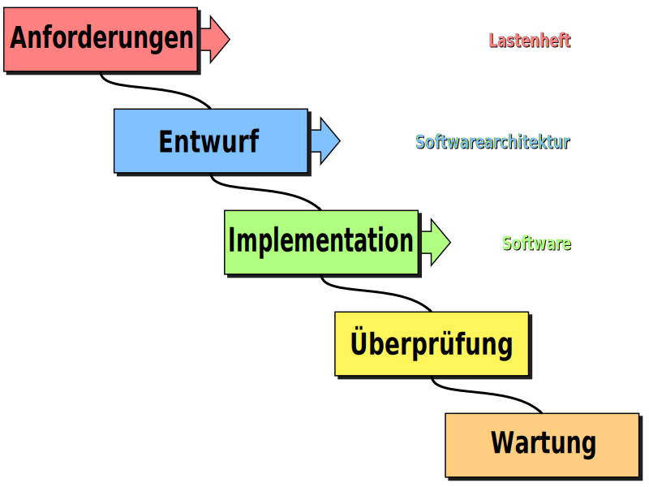

class: center, middle

## [Software Engineering](../../praesentationen.html)

#### Kapitel 7

# Softwareentwurf

Danny Meihöfer - Bjarne Zaremba

---
# Inhalt
***

1. Was ist ein Softwareentwurf?
2. Die Ziele des Softwareentwurfs
3. Entwurfsprinzipien
4. SOLID-Prinzipien

---

class: center, middle

# Softwareentwurf

Laut IEEE1990: "Der Softwareentwurf ist der Prozess der Definition der Architektur, Komponenten, Schnittstellen und anderer Merkmale eines Softwaresystems"

Der Softwareentwurf ist der Bauplan für die Entwicklung einer Software

---

## Prozess



---

## Tätigkeiten im Softwareentwurf

Es gibt das Top-Level-Design und das Detailed-Design

- Top-Level-Design
  - Architektur
  - Organisation
  - Komponenten
  - Schnittstellen
  - Persistenz
  - Verteilung
  - Alles auf hohem Abstraktionsniveau

- Detailed-Design
  - Klassen
  - Methoden
  - Attribute
  - Komponenten detailiert
  - Datenstrukturen
  - Algorithmen
  - Alles auf niedrigem Abstraktionsniveau

---

## Tätigkeiten im Softwareentwurf

Für die Entwicklung eines Softwareentwurfs muss man bestimmte Fragen beantworten:

- Welche Verteilung des Systems wird benötigt?
- Welche Komponenten werden benötigt?
  - Welche Hardware wird eingesetzt?
- Welcher Persistenzmechanismus wird eingesetzt?
- Welche Schnittstellen werden benötigt?
- Welche Betriebssysteme werden unterstützt?
- Welche Programmiersprachen werden eingesetzt?
- Welche Datenstrukturen werden eingesetzt?
- Welche Algorithmen werden eingesetzt?

---

## Entwurfsziele

Das Ziel ist eine gemeinsame Basis für die Entwicklung zu schaffen

Die wichtigen technischen Zusammenhänge und Grundlagen

- Orthogonalität
- Niedrige Kopplung
- Hohe Kohäsion

---

### Orthogonalität

Orthogonalität ist ein Entwurfsprinzip

Die freie Kombinierbarkeit von Komponenten

Ändert man einen Komponenten beeinflusst das nicht die anderen Komponenten

Keine Nebeneffekte

Niedrige Kopplung - Starke Kohäsion

- Klassen verlassen sich nicht auf die Implementierung anderer Klassen
- Es werden keine globalen Daten geteilt
- Verändert man eine Klasse, so hat das keine Auswirkungen auf andere Klassen
- Einzelne Komponenten sind unabhängig und haben nur eine Aufgabe


---

### Niedrige Kopplung

Niedrige Kopplung bei Software bedeutet, dass die einzelnen Komponenten unabhängig voneinander sind

- Zwischen den Komponenten gibt es nur wenige Abhängigkeiten

Gibt es starke Abhängigkeiten kann es sein, dass man das System anders aufteilen sollte

Fokus auf die Verbindung zwischen den Komponenten

Module und Klassen wissen wenig von einander

Prozedural und Objektorientiert

---

### Niedrige Kopplung


---

### Niedrige Kopplung

Prozedurale und Objekt-orientierte Programmierung sind zwei Programmierstile

Wie werden die Daten und Funktionen organisiert?

Bestimmte Programmiersprachen sind prozedural, objektorientiert, oder beides

Objektorientiert: 

- Daten und Funktionen werden in Objekten zusammengefasst
- Probleme werden durch Interaktion von Objekten gelöst
- Abstraktion von Daten und Funktionen zu Objekten
- Bezug zur realen Welt
- Typische Programmiersprachen: Java, C++, C#, Python

Prozedural:

- Daten und Funktionen werden getrennt voneinander organisiert
- Probleme werden über eine Abfolge von Anweisungen gelöst
- Typische Programmiersprachen: C, Pascal, Fortran

---

### Hohe Kohäsion

Innerhalb einer Komponente sollten die einzelnen Teile eng zusammenhängen

Nicht der Gegensatz zu niedriger Kopplung

- Eine starke Kohäsion kann auch mit einer niedrigen Kopplung einhergehen

Die Komponenten arbeiten eng zusammen um eine Aufgabe zu erfüllen

- Zu einer Komponente gehören nur die Teile, die für die Aufgabe notwendig sind

---

### Hohe Kohäsion


---

class: center, middle

# Entwurfsprinzipien

---

## Abstraktion 

Abstraktion ist ein Entwurfsprinzip

Verstehen durch systematische Vereinfachung

- Gewinnung von Übersicht, weglassen von Details
- Übersicht über systematische Zusammenhänge

Eine Form der Abstraktion ist z.B. ein UML-Diagramm


---

## Modularität

Die Modularisierung ist eine der Hauptaufgaben des Softwareentwurfs

- Modul = Abgegrenzter Teil eines Systems

Eigenschaften guter Module:

- In sich geschlossen
- Ohne Kenntnis der Implementierung nutzbar
- Kommunikation über Schnittstellen
- Leicht veränderbar
- Korrekt, vollständig, eindeutig, konsistent
- Erlaubt Komposition und Dekomposition
- Kohäsion hoch, Kopplung niedrig

---

## Modularität


---

## Law of Demeter

Das Gesetz von Demeter soll (bei vorallem objektorientierung) beschreiben was guter Codestil ist

Erfunden von Ian Holland und Karl Lieberherr

Es gibt eine Liste von Regeln, die sich darauf beziehen wie Objekte miteinander kommunizieren sollen


---

## Law of Demeter

### Regel 1

Die Methode einer Klasse soll nur auf die Methoden der eigenen Klasse zugreifen

```java
class Greetings {
    
    String generalGreeting() {
        return "Welcome" + world();
    }
    String world() {
        return "Hello World";
    }
}
```

---

## Law of Demeter

### Regel 2

Die Methode einer Klasse K soll nur Methoden von Objekten verwenden, die von der Klasse K erzeugt wurden

```java
String getHelloBrazil() {
    HelloCountries helloCountries = new HelloCountries();
    return helloCountries.helloBrazil();
}
```

---

## Law of Demeter

### Regel 3

Die Methode M sollte nur Methoden von Objekten verwenden, die als Parameter an M übergeben wurden

```java
String getHelloIndia(HelloCountries helloCountries) {
    return helloCountries.helloIndia();
}
```

---

## Law of Demeter

### Regel 4

Die Methode der Klasse K soll nur Methoden von Objekten verwenden, die als Instanzvariablen in K gespeichert sind

```java
HelloCountries helloCountries = new HelloCountries();
  
String getHelloJapan() {
    return helloCountries.helloJapan();
}
```

---

## Law of Demeter

### Regel 5

Die Methode einer Klasse K darf Methoden von Objekten verwenden, die statisch und in K definiert sind

```java
static HelloCountries helloCountriesStatic = new HelloCountries();
    
String getHellStaticWorld() {
    return helloCountriesStatic.helloStaticWorld();
}
```

---

## Dependency Injection - Inversion of Control

Mit Dependency Injection wird die Abhängigkeit zwischen zwei Komponenten aufgelöst

Abhängigkeiten werden nicht mehr in der Klasse selbst erzeugt, sondern von außen übergeben

Der Vorteil ist, dass die Klasse nicht mehr von der Implementierung der Abhängigkeit abhängt

Inversion of Control ist eng mit Dependency Injection verbunden

- Die Kontrolle über die Abhängigkeiten wird nach außen verlagert

---

## Dependency Injection - Inversion of Control

```java
class Greetings {
    
    HelloCountries helloCountries;
    
    Greetings(HelloCountries helloCountries) {
        this.helloCountries = helloCountries;
    }
    
    String generalGreeting() {
        return "Welcome" + helloCountries.world();
    }
}
```

Übergabe über Konstruktor, Setter, oder Interface

---

## Seperation of Concerns

Seperation of Concerns - Trennung von Belangen

Ein System wird in verschiedene Teile aufgeteilt

Jeder Teil hat eine eigene Aufgabe

Ein Beispiel ist die Aufteilung eines Systems in Business-Logic und UI

---

## Keep It Simple and Stupid

KISS Prinzip

Dinge sollten so simpel wie möglich gehalten werden

Code sollte so simpel und verständlich wie möglich sein

Komplexer Code ist schwerer zu verstehen und zu warten

Manchmal ist es schwerer Code einfach zu halten

- Komplexe Lösungen machen es aber schwerer den Code zu verstehen
- Erweitern
- Testen

---

## You Ain't Gonna Need It

Dieses Prinzip wird oft mit KISS in Kombination angewendet

YAGNI Prinzip

Laut dem YAGNI Prinzip sollen nur Funktionen implementiert werden, die auch wirklich benötigt werden

- Funktionen die nicht benötigt werden, werden nicht implementiert
- Funktionen die nicht benötigt werden, werden nicht erweitert
- Man beschränkt sich auf das nötigste

Code bleibt einfach und verständlich, weil es nur das nötigste gibt

---

## Don't Repeat Yourself

DRY

Ein weiteres Prinzip, das oft mit KISS und YAGNI kombiniert wird

Code sollte nicht wiederholt werden

- Funktionen sollten nicht mehrfach implementiert werden

Wird Code wiederholt, so muss er an mehreren Stellen geändert werden

- Schwer zu warten
- Schwer zu erweitern
- Schwerer zu testen
- Schwerer zu verstehen

Deshalb werden Redundanzen vermieden

---

## Composition over Inheritance

Komposition über Vererbung

Vererbung wird als eine der wichtigsten Eigenschaften von objektorientierter Programmierung angesehen

Übermäßige Nutzung von vererbung kann aber zu Problemen führen

- Vererbung ist eine starke Kopplung
- Die Klassen sind schwerer zu verstehen
- Die Klassen sind scherer zu verändern

Deshalb kann es von Vorteil sein, wenn man Vererbung durch Komposition ersetzt

Eine Klasse nutzt die Funktionalität einer anderen Klasse, ohne von ihr abzuleiten

---

## Composition over Inheritance

Vererbung:

```java
class Bird extends Animal {
    // Bird-specific code
}
```

Komposition:

```java
class Bird {
    private Animal animal;

    public Bird(Animal animal) {
        this.animal = animal;
    }

    // Bird-specific code using delegation to Animal object
}
```

---

class: center, middle

## Clean Code SOLID-Prinzipien

Die SOLID-Prinzipien sind eine Sammlung von Prinzipien, die von Robert C. Martin entwickelt wurden

Sie sollen helfen Code zu schreiben, der leicht zu verstehen, zu erweitern und zu testen ist

Sauberer Code

---

## Single Responsibility Principle

Eine Klasse hat nur eine Aufgabe

Änderungen beeinflussen möglichst nur die Klasse selbst

Will man eine Änderung vornehmen bei der man viele Klassen verändern muss erhöht sich das Fehlerrisiko

Viele kleine Klassen > Wenige große Klassen

Eine Klasse erfüllt zu viele Aufgaben wenn es mehrere Gründe gibt sie zu ändern

---

## Open-Closed Principle

Eine Klasse soll offen für Erweiterungen sein, aber geschlossen für Änderungen

- Open for extension, closed for modification

Klassen sollen so geschrieben werden, dass sie leicht erweitert werden können

Wird Code, der bereits in Benutzung ist, verändert kann das zu Fehlern führen

Die Verwendung von Vererbung und Interfaces kann helfen das Prinzip umzusetzen

---

## Das Liskovsche Substitutionsprinzip

Abgeleitete Klassen müssen sich wie ihre Basisklassen verhalten

Substitution = Ersetzung

Man sollte also eine abgeleitete Klasse anstelle der Basisklasse verwenden können

Wirft z.B. eine Methode der Basisklasse keine Exception, so muss das auch für die abgeleitete Klasse gelten

---

## Interface Segregation Principle

Interfaces sollten so klein wie möglich sein

- Ein Interface soll nur Funktionen enthalten, die end zusammen gehören

Durch zu große Interfaces wird die Kopplung erhöht

- Mehrere Klassen müssen das Interface implementieren, die nichts miteinander zu tun haben und mehr Funktionen implementieren müssen als nötig

- Verändert man einen Teil des Interfaces, so müssen alle Klassen, die das Interface implementieren, verändert werden

---

## Dependency Inversion Principle

Klassen auf hohem Abstraktionsniveau sollten nicht von Klassen auf niedrigem Abstraktionsniveau abhängen

Im besten Fall gibt es nur Abhängigkeiten zwischen Interfaces


---

## Dependency Inversion Principle

Ohne Dependency Inversion:

```java
public class EmailService{


	public void sendEmail() {
		// logic to send email
		System.out.println("Sending result through Email");
	}
}


public class SMSService {


	public void sendSMS() {
		// logic to send email
		System.out.println("Sending result through SMS");
	}
}

public class ResultPublisher {


	private SMSService smsService = new SMSService();
	private EmailService emailService = new EmailService();


	public void publishResult() {
		// need to publish result through email and sms both


		smsService.sendSMS();
		emailService.sendEmail();
	}


}
```

---

## Dependency Inversion Principle

Besser mit zwischenschicht - Dependency Inversion:

```java
public interface MessageService {

	public void sendMessage();
}

public class EmailServiceImpl implements MessageService {
	public void sendMessage() {
		// logic to send email
		System.out.println("Sending result through Email");
	}
}

public class SMSServiceImpl implements MessageService {


	public void sendMessage() {
		// logic to send SMS
		System.out.println("sending result through sms");
	}
}
```

---

class: center, middle

# Fragen?

---

## Lernfragen

1. Was ist ein Softwareentwurf?
2. Was sind die Ziele des Softwareentwurfs?
3. Was ist Orthogonalität im Softwareentwurf?
4. Was ist niedrige Kopplung im Softwareentwurf?
5. Was ist hohe Kohäsion im Softwareentwurf?
6. Was ist Abstraktion im Softwareentwurf?
7. Was sind die SOLID-Prinzipien?
8. Was bedeuter KISS?

---

# Quellen
***

- https://www.freecodecamp.org/news/orthogonality-in-software-engineering/.

- https://media.geeksforgeeks.org/wp-content/uploads/Untitled-28.png

- https://feature-sliced.design/docs/reference/isolation/coupling-cohesion

- https://smits-net.de/images/posts/uml_beispiel.png

- https://files.ifi.uzh.ch/rerg/amadeus/teaching/courses/software_engineering_ws0506/Kapitel_05_Sw_Entwurf.pdf

- https://www.tedinski.com/2018/12/18/the-law-of-demeter.html

- https://stackify.com/dependency-injection/#:~:text=Dependency%20injection%20is%20a%20programming,inversion%20and%20single%20responsibility%20principles.

- https://t2informatik.de/wissen-kompakt/kiss-prinzip/

- https://thevaluable.dev/kiss-principle-explained/

- https://www.microconsult.de/blog/2019/05/fl_solid-prinzipien/