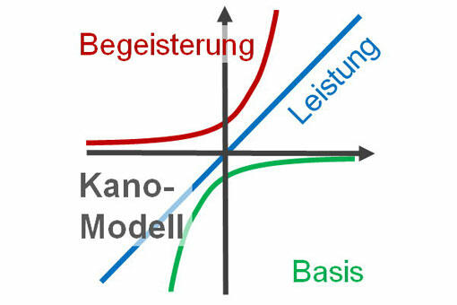
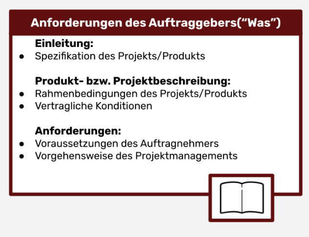
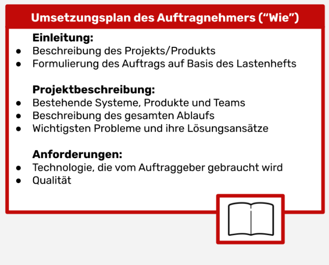

# Requirements Engineering

**Autoren:** Danny Meihöfer - Bjarne Zaremba

## Lenrziele für dieses Kapitel

Nach diesem Kapitel sollen folgende Aspekte klarer geworden sein:

- Was ist Requirements Engineering?
- Welche Arten von Anforderungen gibt es?
- Wie werden Anforderungen erhoben?
- Wie werden Anforderungen dokumentiert?
- Wie werden Anforderungen verifiziert?
- Was sind Use-cases?
- Was ist der Unterschied zwischen Functional und Technical User-Stories?
- Für was steht "DoD"?
- Wie schreibe ich eine gute User-Story?
- Was ist Story-Mapping?

## Was ist Requirements Engineering?

Bei Requirements Engineering (RE) handelt es sich um einen Prozess, der sich mit der Ermittlung, Analyse, Dokumentation, Verifikation und Verwaltung von Anforderungen beschäftigt. Ziel ist es, die Anforderungen an ein System zu ermitteln und zu dokumentieren. Die Ergebnisse werden in einer Anforderungsspezifikation festgehalten, die die Grundlage für die Entwicklung eines Systems ist. Sie dient als Kommunikationsmittel zwischen dem Auftraggeber und dem Entwickler. Ohne die Anforderungen präzise zu kennen kann man nicht am System arbeiten.

## Was ist eine Anforderung überhaupt?

Requirement bedeutet Anforderung. Eine Anforderung ist eine Eigenschaft oder Fähigkeit die ein System erfüllen, oder besitzen soll. Ein System kann viele Anforderungen haben, um den Wünschen der Auftraggeber zu entrsprechen. Für gewöhnlich werden die Anforderungen in einem Dokument festgehalten, um sie später zu verifizieren. Anforderungen können sich im Laufe der Entwicklung ändern, daher ist es wichtig, dass sie gut dokumentiert sind. Auf den Anforderungen basiert die Entwicklung eines Systems, und sie sind die Grundlage für Verträge.

Es gibt verschiedene Arten von Anforderungen, die später näher erläutert werden. Je nach dem welche Perspektive man hat, kann man unterschiedliche Anforderungen und Erwartungen an ein System haben.

## Problemraum vs. Lösungsraum

Man kann den Umgang mit Anforderungen in den Problem- und den Lösungsraum einteilen. Beide Räume sind voneinander getrennt, und haben unterschiedliche Ziele. Sie werden jeweils auch in zwei Phasen unterteilt. Die divergente Phase, und die konvergente Phase. In der divergenten Phase des Problemraums ist das Ziel, Probleme zu sammeln und zu Verstehen, um eine genaue Problemstellung generieren zu können. Hier kann man viele Probleme auf einmal sammeln. In der konvergenten Phase des Problemraums will man dann aus der Menge von Problemen und Problemstellungen eine genaue Problemstellung generieren. Man Filtert sozusagen die wichtigen Probleme und Aspekte heraus. Im Lösungsraum ist es ähnlich. Sie baut auf dem Prozess im Problemraum auf. In der divergenten Phase werden viele Lösungen gesammelt, und in der konvergenten Phase wird dann eine Lösung ausgewählt. Beim sammeln der Lösungen wird noch nicht auf die Machbarkeit geachtet. Es geht nur darum, viele verschiedene Lösungen zu finden, selbst wenn einige zum Beispiel wegen den Kosten nicht umsetzbar wären. Das auswählen der Lösung, die man verfolgen möchte, ist erst der nächste Schritt, bei dem auf Sachen wie die Umsetzbarkeit geachtet wird. Manchmal wird zusätzlich noch von einem Umsetzungsraum geredet, in dem Prototypen erstellt und getestet werden.

  

## Arten von Anforderungen

Wie bereits vorher erwähnt gibt es verschiedene Arten von Anforderungen. Die wichtigste Unterscheidung ist zwischen den funktionalen und den nicht-funktionalen Anforderungen. Es ist allerdings wichtig zu sagen, dass sich verschiedene Anforderungsarten oft unterscheiden können, da unterschiedliche Personen manche Anforderungen aus unterschiedlichen Perspektiven haben.

### Funktionale Anforderungen

Die **Funktionalen Anforderungen** beschreiben die Funktion die ein System erfüllen soll.

Ein paar Beispiele für Funktionale Anforderungen sind:

- Ein Benutzer muss sich anmelden können
- Ein Benutzer muss sich abmelden können
- Ein Benutzer muss eine Nachricht schreiben können
- Ein Computer muss eine Datei speichern können

Die Frage ist hier "was ist der Zweck des Systems?".

### Nicht-funktionale Anforderungen

**Nichtfunktionale Anforderungen** beschreiben Eigenschaften, die ein System erfüllen muss, die allerdings nicht direkt eine Funktion beschreiben. Dafür gibt es verschiedene Kategoriern, die jeweils für bestimmte Eigenschaften des Systems stehen.

### Qualitätsanforderungen

Die ersten nicht-funktionale Anforderung sind die **Qualitätsanforderungen**. Sie beschreiben die Qualität des Systems. Hierbei geht es um Aspekte wie die Zuverlässigkeit, die Wartbarkeit, die Sicherheit, die Benutzbarkeit, die Effizienz und die Portabilität des Systems. Die Frage ist hier "wie gut ist das System, oder die Software?".

Konkret könnte man Anforderungen wie " Die Software muss so und so sicher sein" oder "Die Software muss eine bestimmte Effizienz aufweisen" haben.

Ein Problem dabei ist, dass Qualitätsanforderungen nicht immer messbar sind.

### Randbedingungen

Die Randbedingungen sondern sich etwas von den anderen Anforderungsarten ab, weshalb sie auch oft als ganzu eigene Kategorie betrachtet werden.

Sie beschreiben nicht was das System können muss, sondern was es nicht können darf. Sie sind also Anforderungen, die das System beschränken. Sie beschreiben Nebenaspekte auf die man bei der Entwicklung achten muss und sind deshalb auch als Constraints bekannt.

Ein Beispiel für die Rahmenbedingungen sind zum Beispiel Angaben für die Kosten der Entwicklung, oder für die Zeit der Entwicklung.

Die ganze Vorgehensweise der Entwicklung kann über die Rahmenbedingungen bestimmt werden. Sie können beispielsweise bestimmen ob eine agile oder klassische Vorgehensweise verwendet wird.

### Rechlich-vertragliche Anforderungen

Die **Rechtlich-vertraglichen Anforderungen** beschreiben die rechtlichen Aspekte des Systems. Sie beschreiben zum Beispiel die Datenschutzbestimmungen, oder die Lizenz des Systems und sie ergeben sich aus den Verträgen und Gesetzen. Dazu gehören alle Spezifikationen zu Rechten und Pflichten, die sich aus den Verträgen ergeben.

Üblicherweise werden diese Anforderungen von Juristen formuliert und in ganz eigenen Dokumenten festgehalten.

Typische Themengebiete mit die in den rechtlich-vertraglichen Anforderungen behandelt werden sind:

- Kosten
- Haftung
- Datenschutz
- Gewährleistung
- Garantie
- Wartung
- Was für Gesetzte müssen eingehalten werden

### Technologische Anforderungen

Die **Technologischen Anforderungen** beschreiben die technischen Aspekte der Software, oder des Systems. Welche Technologien werden für die Entwicklung des Systems verwendet? Diese Anforderungen bestimmten die Umgebung in der das System entwickelt wird. Sie beschreiben die Hardware, die Software, die Programmiersprachen, die Datenbanken, die Netzwerke, die Betriebssysteme und die Entwicklungsumgebung. Auf welchen Geräten soll das System laufen?

Ein weiterer Aspekt dieser Anforderungen sind die Anforderungen an die Systemumwelt. Je nachdem wo das System eingesetzt wird, muss es bestimmte Anforderungen erfüllen. Zum Beispiel muss ein System, das in einem Krankenhaus eingesetzt wird, bestimmte Anforderungen erfüllen, die es in einem Büro nicht erfüllen muss. 

Zu Umwelteinflüssen auf die man je nach System achten muss gehören:

- Temperaturen
- Luftfeuchtigkeit
- Strahlung
- Druck
- Erschütterungen
- Chemische Einflüsse
- und noch viele mehr

Daneben gibt es auch noch technische Einschränkungen wie die Stromversorgung, und die Verbindung an ein bestimmtes Netzwerk.

Zu den Technologischen Anforderungen gehören auch die Mengengerüstanforderungen. Das heißt, wie viele Benutzer werden das System verwenden, und wie viele Daten werden verarbeitet und so weiter. Diese Anforderungen sind wichtig, um die Skalierbarkeit des Systems zu bestimmen.

Auch Schnittstellen zu anderen Systemen sind ein wichtiger Aspekt der Technologischen Anforderungen. Wie kommuniziert das System mit anderen Systemen? Welche Schnittstellen werden verwendet? Welche Protokolle werden verwendet? Wie werden die Daten ausgetauscht?

Auch die konkrete Hardware kann eine Anforderung sein.

## Anforderungen an die Benutzeroberfläche

Bei den Anforderungen an die Benutzeroberfläche geht es um die Frage "wie interagiert der Benutzer mit dem System?". Je nach System können Benutzeroberflächen sich stark unterscheiden. Will man eine Klassische Desktopanwendung, will man akustisch interagieren können, oder zum Beispiel eine haptische Benutzeroberfläche haben.

Wie wird das System bedient? Welche Eingabegeräte werden verwendet? Welche Ausgabegeräte werden verwendet? Wie sieht die Benutzeroberfläche aus? Wie ist die Benutzeroberfläche aufgebaut? Wie ist die Benutzeroberfläche strukturiert? Wie ist die Benutzeroberfläche gestaltet? Alle diese Fragen sind wichtige Aspekte der Anforderungen an die Benutzeroberfläche.

## Was sind Merkmale von guten Anforderungen

Sind Anforderungen schlecht, ist die Chance hoch, dass auch das Ergebniss schlcht wird. Deshalb sollte man bei der Erstellung der Anforderungen darauf achten, dass sie ein paar bestimmte Eigenschaften erfüllen.

Zum einen sollten sie **Atomar** sein. Das beduetet, dass jede einzelne Anforderung nicht in mehrere Anforderungen aufgeteilt werden können sollte. Es soll also keine allgemeinen Anforderungen geben. Beschreibt jede Anforderung eine konkrete Funktion kann man sie gezielt verfolgen. 

Der zweite Aspekt ist die **Eindeutigkeit**. Anforderungen müssen eindeutig sein. Gibt es Interpretationsspielraum muss man damit rechnen, dass das Ergebniss nicht den eigentlich Erwartungen entspricht. Hier muss man bei der Formulierung besonders aufpassen, um sicherzustellen, dass der Aufraggeber und der Entwickler die Anforderungen gleich verstehen und das gleiche Ziel haben.

Als nächstes kommt die **Testbarkeit**. Die einzelnen Anforderungen müssen so gewählt und formuliert sein, dass man sie testen kann. Kann man sie nicht richtig testen, kann man sie auch nicht richtig Entwickeln, oder überprüfen.

Der letzte Aspekt ist die **Notwendigkeit**. Alle genannten Anforderungen müssen essenziell für das System sein. Es werden keine Anforderungen aufgenommen, die nicht wirklich notwendig sind.

## Die Anforderungsanalyse

Die **Anforderungsanalyse** ist der Vorgang in dem die Anforderungen ermittelt werden. Dabei muss man auf verschiedene Dinge achten. Sie ist die Basis für das ganze weiter Vorgehen.

### Motivation

Warum macht man überhaupt eine Anforderungsanalyse? Wie bereits erwähnt ist die Anforderungsanalyse die Basis für alles was bei der Entwicklung eines Systems passiert. Man kann, oder sollte jedenfalls nicht mit der Entwicklung anfangen bevor man alle Anforderungen kennt. 

Oft lassen sich in der Praxis Probleme im Projektverlauf auf eine unzureichende Anforderungsanalyse zurückführen.

Eine schlechte Anforderungsanalyse wird fast immer zu einem gescheiterten Projekt führen. Sind die Anforderungen nicht klar, werden Eigenschaften vergessen, oder falsch verstanden. Dadurch wird das Endergebniss nicht den eigentlichen Erwartungen des Auftraggebers entsprechen, obwohl der Entwickler die Erwartungen aus seiner Sicht vielleicht erfüllt hat.

### Herausforderungen und Probleme bei der Anforderungsanalyse

Verschiedene Probleme treten bei der Anforderungsanlyse immer wieder auf. Eins davon sind **Mehrdeutige** oder Unvollständige Anforderungen. Das kann oft passieren wenn verschiedene Beteiligte unterschiedliche Vorstellungen von dem System haben, oder wenn sie ihre Anforderungen nicht richtig formulieren. Das führt zu Missverständnissen und zu einer Fehlinterpretation der Anforderungen. Deshalb muss man jede einzelne Anforderung detailiert Dokumentieren.

Das nächste Problem ist der **Scope Creep**. Das beduetet, dass der Umfang des Projekt immer größer wird. Oft werden die Anforderungen an ein Projekt immer größer, während die Rahmenbedingungen nicht verändert werden. Das kann immer mehr Aufwand für die Entwickler bedeuten, ohne dass sie dafür mehr Zeit bekommen. Das führt oft zu einem gescheiterten Projekt. Deshalb muss auch im laufenden Projekt, wenn weitere Anforderungen dazu kommen immer wieder überprüft werden, ob das Projekt noch im Rahmen der Anforderungen ist.

Ein weiterer Aspekt der zu Missverständissen führen kann inst eine **unzureichende Kommunikation** zwischen den Stakeholdern. Dabei hilft wieder eine ausführliche Dokumentation und es hilft wenn die Stakeholder sich details mit Tools wie Mockups oder Prototypen vorstellen können. Sie sollten sich ein genaues Bild von dem System machen können. Dabei helfen auch Tools wie UML Diagramme.

Beim Entwicklungsprozess kann es zu schwierigkeiten kommen wenn Anforderungen nicht richtig **zurückverfolgbar** sind. Man muss immer wissen, woher eine Anforderung kommt, und warum sie wichtig ist. Das hilft dabei, die Anforderungen zu verstehen, und sie zu priorisieren. Außerdem hilft es dabei, sicherzustellen, dass alle Anforderungen erfüllt werden. Zu der **Rückvervolgbarkeit** gehört auch, dass Zusammenhänge zwischen Anforderungen klar dokumentiert werden.

Im großen und ganzen müssen Anforderungen und Änderungen gut verwaltet werden. Über den Verlauf des ganzen Projekts muss es feste Prozesse dafür geben, wenn man eine neue Anforderung machen möchte, oder eine bestehende Anforderung verändern möchte.

### Stakeholder

Hier stellt sich die Frage wer stellt überhaupt die Anforderungen auf? Üblicherweise gibt es viele Parteien die ihre eigene Sicht auf die Dinge und ihre Aspekte hat, deshalb haben sie auch unterschiedliche Anforderungen, von denen möglichst viele berücksichtigt werden sollten. Jede Partei, also jede Person, oder Gruppe die Interesse und Ansprüche an ein Projekt hat gilt als Stakeholder und kann Anforderungen aufstellen. Beispiele für Stakeholder sind:

- Die Nutzer
- Investoren
- Betreiber
- Gesetzger
- Kaufentscheider
- und auch Leute die nur mit den Ergebnissen des Projekts weiter arbeiten müssen.

### SMART Ziele

SMART ist ein Akronym mit dem man sich merken soll wie gute Anforderungen oder Ziele formuliert werden sollten.

S steht für **Spezifisch**. Das bedeutet, dass die Anforderungen so genau wie möglich formuliert werden sollten. Sie sollten keine Interpretationsspielräume zulassen, damit Auftraggeber und Nehmer die gleichen Vorstellungen haben. Zu generelle Anforderungen kann man nur schwer erfüllen.

M steht für **Messbar**. Das Beduetet, dass man Anforderungen so stellen sollte, dass man im Anschluss messen kann ob und in wie weit sie erfüllt wurden. Sind sie nicht Messbar sind es quasi leere Anforderungen.

A steht für **Angemessen**. Das bezieht sich auf die Frage ob das Ziel überhaupt realistisch ist. Ist es das nicht müssen vielleicht die Rahmenbedingungen angepasst werden.

R steht für **Relevant**. Wie bereits erwähnt sollten Anforderungen nur gestellt werden, wenn sie auch wirklich notwendig sind. Sie sollten also einen Mehrwert für das Projekt haben.

T steht für **Terminiert**. Das bedeutet, dass die Anforderungen einen Zeitrahmen haben sollten. Es sollte klar sein bis wann sie erfüllt werden müssen. Das heißt für den Auftraggeber, dass er angemessene Deadlines setzten sollte. Dadurch kann man besser planen und Prioritäten setzten.

### Anforderungsquellen und Ermittlungstechniken

Die Anforderungsquellen sind die Stakeholder. Ihre Wünsche und Anforderungen sind die Grundlage für die Anforderungsanylse und ohne sie gibt es kein Projekt.

Es gibt verschiedene wege um Anforderungen zu ermitteln. Beispiele dafür sind Brainstormings, Interviews, einfache Beobachtung, Fragebögen, oder Berichte.

### Anforderungskategorien nach Kano

Das Kano-Modell sturkturiert Kundenanforderung in verschiedene Kategorien. Hierbei geht es nicht um die vorher beschriebenen Anforderungsarten (Funktional, Nichtfunktional etc.), sondern um die Kundenzufriedenheitl. Es gibt drei verschiedene Kategorien, die alle einen unterschiedlichen Einfluss darauf haben, wie zufrieden der Kunde am Ende mit dem Projekt ist. 

Die erste Kategorie sind die **Basisanforderungen**, auch Implied Needs genannt. Das sind Anforderungen, die der Kunde als selbstverständlich ansieht. Deshalb erwähnt er sie nicht mal, wenn die Anforderungen aufgestellt werden. Dabei ist zu beachten, dass man wenn man diese Anforderungen erfüllt nicht mit einer hohen Kundenzufriedenheit rechnen kann, auch wenn man sie besonders gut erfüllt. Sie sind zu grundlegend um einen großen positiven Einfluss zu haben. Sind sie allerdings nicht erfüllt macht das den Kunden besonders unzufrieden.

Ein Beispiel dafür wäre ein Restaurant das sauber ist. Als Kunde geht man selbstverständlich davon aus, dass das Restaurant in das man geht sauber ist. Man ist nicht besonders erfreut, wenn es besonders sauber ist, aber man ist sehr unzufrieden, wenn es dreckig ist.

Die nächste Kategorie sind die **Leistungsanforderungen**. Das sind Anforderungen, die der Kunde explizit nennt. Sie sind wichtig für die Kundenzufriedenheit, aber sie sind nicht selbstverständlich. Sie sind also nicht so grundlegend wie die Basisanforderungen. Der Knackpunkt ist hier, das mehr Leistung immer zu mehr Kundenzufriedenheit führt. Je mehr Leistung desto besser. Das gilt aber auch umgekehrt. Je weniger Leistung desto unzufriedener ist der Kunde.

Im Restaurante möchte man leckeres essen haben. Je besser das Essen schmeckt desto zufriedener ist mal als Kunde. Je schlechter es schmeckt desto unzufriedener ist man.

Die letzte Kategorie sind die **Begeisterungsanforderungen** sie sind quasi das Gegenteil zu den Basisanforderungen. Der Kunde rechnet nicht damit, dass sie überhaupt erfüllt werden, aber wenn sie doch erfüllt werden ist er begeistert. Sind sie nicht erfüllt findet er das nicht besonders gut, aber er wird auch nicht wirklich unzufriedener.

In der folgenden Abbildung kann man erkennen wie sich die Kundenzufriedenheit in Abhängigkeit von der Erfüllung der Anforderungen verhält. Die Y Achse steht für die Kundenzufriedenheit und die X Achse für die Erfüllung der Anforderungen. Dort sieht man zum Beispiel, dass wenn die Basisanforderungen sehr erfüllt sind die Kundenzufriedenheit nicht besonders hoch ist, aber wenn sie nicht erfüllt sind ist die Zufrieden heit sehr niedrig.

## Prozess der Anforderungsanalyes

Will man eine Anforderungsanalyse erstellen gibt es verschiedene Phasen die man durchgehen muss. Diese Phasen beziehungsweise Tätigkeiten sind immer Teil der Anforderungsanalyse.

Als erstes werden die **Anforderungen ermittelt**. Das heißt die Stakeholder äußern ihre Wünsche. Die Wünsche werden anschließend **dokumentiert**, um ein **Lastenheft** zu erstellen. Dort wird jede Anforderung genau beschrieben. Dabei arbeitet der Auftraggeber und der Projektmanager mit. Sind die Anforderungen dokumentiert werden sie **Klassifiziert und Bewertet**. Die Anforderungen werden **überprüft** und bestimmte Teile werden **priorisiert**.

Diese Schritte müssen immer am Anfang des Projekt geschehen, aber da auch im laufenden Projekt immer wieder neue Anforderungen dazu kommen, oder da sich alte Anforderungen ändern können, muss auch im laufenden Projekt immer wieder Anforderungsmanagment betrieben werden. Dafür ist meistens der Projektmanager verwantwortlich.

### Lastenheft

Die Anforderungen werden in einem Lastenheft dokumentiert, aber was ist das genau?

Das Lastenheft enthält alle Anforderungen an das System, aus der Sicht des Auftraggebers. Es enthällt alle Wünsche die er an das System hat. Dazu gehören sowohl funktionale als auch nichtfunktionale Anforderungen. Üblicherweise ist das Lastenheft auch Teil des Vertrags und es bildet die Grundlage für das Pflichtenheft.

### Pflichtenheft

Das Pflichtenheft ist das Pendant zum Lastenheft aus der Sicht des Auftragnehmers. Dort schreibt er alle seine eigenen Anforderungen an das System auf. Dabei liegt der Fokus auf der technischen Umsetzung und der Frage wie die Anforderungen die im Lastenheft beschrieben wurden erfüllt werden.

### Business Requirements Document

Das Business Requirements Document (BRD) wird oft mit dem Lastenheft gleich gesetzt. in diesem stehtn die Gesamtanforderungen an ein Projekt. Dabei betrachtet man das Projekt aus einer höheren Ebene. Die Fragen sind also: "Was ist das Ziel des Projekts?", "Warum wird das Projekt gemacht?", "Was soll das Projekt erreichen?". Die genauer technische Umsetzung spielt hier keine Rolle.

### Functional Requirements Document

Das "FRD" wird oft mit dem Pflichtenheft gleichsetzt. Es beschreibt die funktionalen Anforderungen an ein Projekt. Es beschreibt also detailiert was die Anforderungen können soll. Dabei ist zu beachten das es nicht wirklich nur um die funktionalen Anforderungen geht, sondern auch um die nichtfunktionalen Anforderungen. Es beschreibt also die Anforderungen aus der Sicht des Auftragnehmers. Dazu gehören dann auch technische Details und Spezifikationen.

### Software requirements Specification

In diesem Dokument (SRS) werden die Anforderungen an die Software an sich beschrieben. Was muss die Software leisten können. Dieses Dokument soll so detailiert sein, dass der Entwickler es als "Blaupause", oder "Roadmap" für die Entwicklung verwenden kann. Es muss also Aspekte beschreiben wie, welche Programmiersprachen verwendet werden, welche Datenbanken verwendet werden, welche Schnittstellen verwendet werden, welche Hardware verwendet wird, welche Betriebssysteme verwendet werden, welche Netzwerke verwendet werden, welche Entwicklungsumgebung verwendet wird, wie viele Nutzer soll es haben, was für Abhängigkeiten gibt es und so weiter.

## Use-Cases

- sollen helfen, die Anforderungen an ein System zu verstehen

### Systemkontext / Systemgrenze

- zentrale Konzepte, um den Rahmen und die Interaktion eines zu entwickelnden Systems zu verstehen

**Systemkontext:**

- definiert den Gesamtrahmen, in dem das System entwickelt werden sol
    - Er beschreibt die Umgebung und die externen Entitäten, die mit dem System interagieren. Unter externen Entitäten kann man Benutzer, Hardware oder andere Systeme fassen.
    - Mithilfe des Systemkontextes kann man Verbindungen, Beziehungen und Abhängigkeiten zwischen den Systemen und den Benutzern verstehen.
- Beispiel: Online-Shopsystem
    - externe Entitäten sind z.B. Kunden, Lieferanten, Zahlungsdienste oder das Lager

**Systemgrenze:**

- bildet klare Trennung zwischen dem zu entwickelnden System und seiner Umgebung
    - Die Systemgrenze definiert, welche Elemente innerhalb eines Systems liegen und welche außerhalb.
    - Dies fördert den Fokus auf die wichtigen Elemente und schafft Klarheit bezüglich Verantwortlichkeiten.
- Beispiel: Kontext Soziales Netzwerk
    - Systemgrenze könnte die Schnittstelle zum Benutzerprofil, den Nachrichten und anderen Funktionen des Netzwerks umfassen. Alles außerhalb dieser Grenze gehört nicht zum zu entwickelnden System.

### Ziele von Use-Cases

- Verständnis der Funktionalitäten
    - Use-Case sollte genau beschreiben, welche Funktionalitäten das System mitbringen soll. So können Entwickler und andere beteiligte Personen genau auf diese Funktionalitäten hinarbeiten.
- Klare Kommunikation mit Stakeholdern
    - Use-Cases sollten so formuliert werden, dass sie auch für nicht-technische Stakeholder verständlich sind. Dies erleichtert die Zusammenarbeit zwischen allen Stakeholdern.
- Bewertung des Use-Case-Erfolgs
    - Use-Cases sollten klare Bewertungskriterien enthalten, an denen der Erfolg des Use-Cases gemessen werden kann. Dadurch ist eine Einschätzung des Erfolgs des Use-Cases einfacher möglich.
- Benennung von Abhängigkeiten und Risiken
    - In den Use-Cases sollten Risiken und Abhängigkeiten zu anderen Systemen benannt werden. So wird direkt im Use-Case für Transparenz gesorgt und mögliche Probleme können angegangen werden.

### Szenario in Use-Cases

- beschreibt Abfolge von Aktionen und Interaktionen zwischen Benutzern und dem zu entwickelnden System

Wichtige Aspekte:

- Beschreibung der Abläufe
    - Es soll detailliert beschrieben werden, wie Akteure mit dem System interagieren können. Dies fördert das Verständnis von Funktionalitäten des Systems.
- Festlegung von Schritten
    - Im Szenario sollten die einzelnen Schritte im Verlauf des Use-Cases beschrieben werden. So ist ein klare Strukturierung möglich.
- Dokumentation von Tests
    - Das Szenario soll als Grundlage für Testfälle dienen. So können Testfälle einfach und effizient aus dem Szenario abgeleitet werden. Dies stellt sicher, dass die Implementierung den spezifizierten Anforderungen entspricht.

### Beispiel eines Use-Cases für eine “Online-Produktbestellung”

**Beschreibung:**

Dieser Use Case beschreibt den Prozess, wie ein registrierter Benutzer in einem Online-Shop ein Produkt bestellt.

**Akteure:**

- **Kunde:** Der registrierte Benutzer, der ein Produkt bestellen möchte.
- **System:** Die E-Commerce-Plattform.

**Vorbedingungen:**

Der Kunde ist angemeldet und hat ein gültiges Benutzerkonto.

**Hauptszenario:**

1. Der Kunde loggt sich in sein Benutzerkonto auf der E-Commerce-Plattform ein.
2. Der Kunde navigiert durch die Produktauswahl und wählt das gewünschte Produkt aus.
3. Das System zeigt detaillierte Informationen zum Produkt, einschließlich Preis, Verfügbarkeit und Bewertungen.
4. Der Kunde legt das Produkt in den Warenkorb.
5. Das System zeigt den Warenkorb mit dem ausgewählten Produkt an.
6. Der Kunde überprüft den Warenkorb und klickt auf "Zur Kasse".
7. Das System leitet den Kunden zur Zahlungs- und Versandseite weiter.
8. Der Kunde wählt die Lieferadresse aus seinem Profil aus oder fügt eine neue hinzu.
9. Der Kunde wählt eine Zahlungsmethode und gibt erforderliche Zahlungsinformationen ein.
10. Das System überprüft die Bestellung und zeigt eine Zusammenfassung an.
11. Der Kunde bestätigt die Bestellung.
12. Das System sendet eine Bestellbestätigung per E-Mail an den Kunden.
13. Das System aktualisiert den Lagerbestand und markiert die Bestellung als "bearbeitet".

**Nachbedingungen:**

Die Bestellung wurde erfolgreich abgeschlossen, und der Kunde erhält eine Bestellbestätigung per E-Mail.

**Alternativszenario:**

- *Schritt 10a:* Wenn die Zahlung fehlschlägt, zeigt das System eine Fehlermeldung an, und der Kunde wird zur erneuten Eingabe der Zahlungsinformationen aufgefordert.

**Ausnahmeszenario:**

- *Schritt 3a:* Wenn das ausgewählte Produkt nicht verfügbar ist, informiert das System den Kunden und bietet alternative Produkte an.

Dieser Use Case bietet einen Überblick über den typischen Ablauf einer Produktbestellung in einem Online-Shop. Durch Hinzufügen von Alternativ- und Ausnahmeszenarien wird sichergestellt, dass verschiedene mögliche Situationen berücksichtigt werden.

### Spezifikationen

- detaillierte Beschreibung der einzelnen Use-Cases
- dies kann in Diagrammen geschehen

**Use-Case-Diagramm:** 

Abb.1: Beispiel eines Use-Case-Diagramms

## User Stories

- werden benutzt, um Anforderungen an ein Softwareprodukt zu definieren

### Persona vs. Theme vs. Epic vs. User Story vs. Task

**Persona:** 

- Detaillierte Darstellung eines typischen Benutzers
    - semi-fiktiv
    - Es werden auch demografische Informationen, Verhaltensweisen, Bedürfnisse, Ziele und ein Bild der Person berücksichtigt. So entsteht ein möglich reales Bild eines potentiellen Nutzers der Software.
- Personas sollen das Team besser über Zielgruppe informieren
    - Mithilfe von Personas wird das Team über die Zielgruppe informiert und kann so die Software auf diese spezifische Persona anpassen.

**Theme:**

- Gruppierung von zusammengehörigen User-Stories
    - Repräsentieren ein großes, allgemeines Ziel
    - Themen sind häufig sehr abstrakt und umfassen mehrere Aspekte eines Produktes.

**Epic:**

- große, abstrakte User-Story
    - zu groß, um in einem großen Entwicklungszyklus umgesetzt zu werden
- wird in kleinere User-Stories unterteilt
- Epics werden zum Strukturieren großer Probleme benutzt

**User-Stories:**

- Kurze Beschreibung eines Features aus Sicht des Benutzers
    - Sie folgt dem Format "Als [Rolle], möchte ich [Funktion], damit [Nutzen]".
    - Grundlegende Bausteine für die Umsetzung von Funktionen

Tasks: 

- Konkrete Aufgabe, die erforderlich ist, um eine User-Story zu vervollständigen
    - Repräsentieren die konkreten Schritte, die das Team machen muss, um die User-Story zu erledigen.
    - Kleinste Einheit der Arbeit

### Functional User Story vs. Technical User Story

- man unterscheidet zwischen 2 verschiedenen Arten von User-Stories

**Functional User-Story:**

- beschreibt ein Feature aus der Sicht des Endbenutzers
- Welchen Nutzen hat das Feature?
    - Beispiel: "Als Kunde möchte ich die Bewertungen anderer Benutzer für ein Produkt sehen, um informierte Kaufentscheidungen zu treffen.”
- Merkmale: Benutzerzentriert, Mehrwerte für den Benutzer
    - Konzentriert sich auf die Bedürfnisse des Benutzers
    - Implementierung soll Mehrwert für den Benutzer bieten
- Verwendung: Features, die direkt vom Endbenutzer wahrgenommen werden

**Technical User-Story:**

- beschreibt eine technische Aufgabe
- konzentriert sich auf Aspekte wie Performance oder Skalierbarkeit
    - Beispiel: "Als Entwickler möchte ich die Datenbankanbindung optimieren, um die Ladezeiten für Produktbewertungen zu verbessern.”
- Merkmale: Technologiezentriert, Mehrwerte für die Entwicklung
    - Technische Aspekte stehen im Vordergrund
    - Technische Aspekte des Systems sollen verbessert werden#
- Verwendung: Features, die die technische Infrastruktur betreffen

### Aufbau / Bestandteile einer User Story

Aufbau: Als [Rolle] möchte ich [Funktion], damit [Nutzen].

- Rolle: Benutzer, der die Anforderung stellt.
    - Beispiel: Entwickler, Endnutzer, …
- Funktion: Welches Feature soll umgesetzt werden?
    - prägnante Formulierung
- Nutzen: Welchen Wert / welcher Vorteil hat die Umsetzung des Features?

Beispiel: 

“Als Kunde möchte ich die Bewertungen anderer Benutzer für ein Produkt sehen, damit ich informierte Kaufentscheidungen treffen kann.”

- Weitere Bestandteile
    - Priorität
    - Defintition of Ready
    - Definition of Done
    - …

### Definition of Ready (DoR) vs Definition of Done (DoD)

Definition of Ready (DoR):

- Kriterien, die eine User-Story erfüllen muss, bevor sie bereit für die Umsetzung durch das Entwicklerteam ist
- Beispiele für Kriterien
    - Alle relevanten Informationen über die User Story sind verfügbar.
    - Alle Fragen zu Klärungen sind beantwortet.
    - Benötigte Ressourcen sind verfügbar.
    - Abhängigkeiten zu anderen Aufgaben sind identifiziert und behandelt.

Definition of Done (DoD):

- Kriterien, die eine User-Story erfüllen muss, um als abgeschlossen zu gelten
- “Checkliste” für die vollständige Umsetzung der User-Story
- Beispiele für Kriterien
    - Code ist geschrieben und dokumentiert.
    - Unit-Tests wurden geschrieben und erfolgreich durchgeführt.
    - Code-Review wurde durchgeführt und alle Rückmeldungen wurden berücksichtigt.
    - Die Funktionalität wurde auf einer Testumgebung getestet und entspricht den Akzeptanzkriterien.

### Prinzipien für effektive ("gute") User Stories

- Benutzerzentrierung
    - Fokus sollte auf Endbenutzer liegen und die Anforderungen aus seiner Perspektive beschreiben
- Klarheit und Prägnanz
    - Klare und prägnante Formulierungen
    - keine überflüssigen Details
- Unabhängigkeit
    - So unabhängig wie möglich, damit sie einfacher in Entwicklungszyklen eingebunden werden können
    - Flexibilität
- Angemessene Größe
    - User Stories sollten klein genug sein, um in einem Entwicklungszyklus umgesetzt werden zu können. Dies ermöglicht eine bessere Planung und Kontrolle.
- Konsistenz
    - User-Stories sollten nicht zu Konflikten mit anderen User-Stories führen.
- Priorisierungsfähigkeit
    - Sollten einfach priorisierbar sein

### Formulierungsfehler, die zu vagen ("schlechten") User Stories führen

- Unklare Rolle
    - Fehler: "Als Benutzer möchte ich Funktion X."
    - Verbesserung: "Als eingeloggter Kunde möchte ich Funktion X, um meine Bestellhistorie einzusehen."
- Allgemeine Funktion ohne Nutzen
    - Fehler: "Als Benutzer möchte ich eine Suchfunktion."
    - Verbesserung: "Als Benutzer möchte ich eine Suchfunktion, um schnell nach Produkten zu suchen und Zeit zu sparen."
- Unspezifische Anforderung
    - Fehler: "Als Benutzer möchte ich ein verbessertes Design."
    - Verbesserung: "Als Benutzer möchte ich ein modernes und benutzerfreundliches Design, das die Navigation erleichtert."
- Keine klare Priorisierung
    - Fehler: "Der Benutzer soll mehrere neue Funktionen haben."
    - Verbesserung: "Als Benutzer möchte ich zuerst die Suchfunktion verbessert haben, gefolgt von einer optimierten Checkout-Option."

### Card, Conversation, Confirmation

- Prinzip, welches in User-Stories verwendet wird, um ein gemeinsames Verständnis von Anforderungen zu erlangen.

**3 Hauptaspekte:**

**Card (Karte):**

- Repräsentiert die eigentliche User-Story
    - wird auf einer physischen oder digitalen Karte festgehalten
- Visuelle Repräsentation der Anforderung
    - enthält in knapper Form die wichtigsten Aspekte der User-Story

**Conversation (Gespräch):**

- Diskussion und Gespräch der Teammitglieder über die User-Story
    - besonders zwischen Entwicklern und dem Product Owner
- sorgt für gemeinsames Verständnis der Anforderung

**Confirmation (Bestätigung):**

- Akzeptanzkriterien → Wann ist User-Story abgeschlossen?
    - klare Grundlage für die Umsetzung der User-Story

**Beispiel:** 

User Story:

- "Als Benutzer möchte ich eine Suchfunktion, um schnell nach Produkten zu suchen und Zeit zu sparen."

Card:

- Auf einer physischen Karte oder digitalen Notiz wird die obige User Story kurz und prägnant festgehalten.

Conversation:

- Das Entwicklungsteam, der Product Owner und andere Stakeholder besprechen die User Story. Dies könnte Fragen, Klärungen oder Diskussionen über mögliche Umsetzungsansätze beinhalten.

Confirmation:

- Die Akzeptanzkriterien werden festgelegt, z. B. dass die Suchfunktion nach Produktname, Kategorie und Preis filtern kann. Diese Kriterien dienen als klare Bestätigung dafür, wann die User Story als erledigt gilt.

### INVEST-Kriterien

- Akronym von Bill Wake, um Aspekte zu beschreiben, die eine gute User-Story ausmachen

**INVEST steht für:**

Abb.2: INVEST-Kriterien im Überblick

### User-Stories vs. Use Cases

Abb.3: Unterschied User-Stories zu Use-Cases

Was wird wann verwendet?

- User-Stories → häufig in agilen Umgebungen, fördern die Zusammenarbeit im Team
- Use-Cases → häufig in traditionellen Entwicklungsumgebungen, bieten detaillierte Spezifikation

### Misuse Stories

- User-Stories, die sich auf negative Szenarien konzentrieren
    - System wird absichtlich/unabsichtlich fehlerhaft benutzt
- wird in der Risikoanalyse eingesetzt
- Entwickler können proaktiv gegen Sicherheitsrisiken agieren
    - Späteres Risiko wird minimiert

### Priorisierung

- Priorisieren von User-Stores oder Use-Cases ist wichtig, damit das Team an den wichtigsten Aufgaben arbeitet

Mehrere Aspekte, nach denen man priorisieren kann:

- Geschäftswert
    - Welchen geschäftlichen Nutzen hat die Anforderung? Kann die Benutzerzufriedenheit verbessert werden?
- Risiko
    - Welche Aufgaben haben ein hohes Risiko in der Umsetzung? Diese sollten höher priorisiert werden.
- Abhängigkeiten
    - Hängen manche Aufgaben von anderen ab und können erst danach erledigt werden?
- Zeitaufwand
    - Aufgaben mit hohem Zeitaufwand sollten höher priorisiert werden, damit noch genug Zeit für die Umsetzung ist
- viele weitere Möglichkeiten

### Schätzung des Aufwands einer User-Story

- Schätzung von User-Stories ist ein wichtiger Bestandteil

**Einige bekannte Techniken für die Schätzung:**

**Planning Poker**

- Aufwand wird durch Vergabe von Punkten geschätzt
    - jedes Teammitglied enthält Spielkarten mit bestimmten Werten darauf. Diese werden dann den einzelnen Aufgaben zugeordnet.
- Fördert Diskussion im Team
- Einzelne Meinungen beeinflussen die Schätzung wenig

**T-Shirt-Sizing:**

- Aufgaben werden in die Größenkategorien von Klamotten (S, M, L, XL) eingeordnet
    - “Relative Größenordnung” statt “absoluter Größenordnung”
- Einfach, schnell

**User-Story-Points:**

- Bewertung mit Punkten
- Punkte haben keine zeitliche Bedeutung

### Story Mapping

- besseres Verständnis für die Gesamtheit eines Produkts
- User-Stories sollen sinnvoll organisiert werden
    - User-Stories werden in hierarchischer Struktur miteinander verbunden
    - X-Achse stellt die Zeitleiste dar
    - Y-Achse repräsentiert die Priorität

Beispiel: 

Abb.4: Darstellung einer User-Story-Map

### Referenzen
- https://www.qamentor.com/qa-services/business-analysis-requirement-engineering-services/
- https://blog.sophist.de/2013/07/10/nicht-funktionale-anforderungen-im-uberblick/
- https://visuresolutions.com/de/blog/high-quality-requirements-attributes/
- https://www.timeline-erp.de/blog/warum-ist-eine-anforderungsanalyse-so-wichtig/
- https://visuresolutions.com/de/requirements-management-traceability-guide/biggest-challenges-of-requirements-management/
- https://www.heflo.com/blog/customer-service/kano-model-examples/#:~:text=In%20other%20words%2C%20the%20higher,will%20bring%20to%20the%20customer
- https://www.projektmagazin.de/sites/default/files/styles/hero_tablet/public/2019-05/herobild_510x340_39.jpg?itok=v164HutM
- https://images.acquisa.de/media/pages/magazin/lastenheft-pflichtenheft/fd47c77a33-1679907691/was-ist-das-pflichtenheft.png
- [https://www.usability.gov/how-to-and-tools/methods/use-cases.html](https://www.usability.gov/how-to-and-tools/methods/use-cases.html) [letzte Einsicht: 23.11.23]
- [https://www.linkedin.com/pulse/use-cases-der-agilen-requirements-spezifikation/?trk=article-ssr-frontend-pulse_more-articles_related-content-card&originalSubdomain=de](https://www.linkedin.com/pulse/use-cases-der-agilen-requirements-spezifikation/?trk=article-ssr-frontend-pulse_more-articles_related-content-card&originalSubdomain=de) [letzte Einsicht: 23.11.23]
- [https://www.microtool.de/objectif-rm-anwenden/use-cases-personas-und-szenarien/](https://www.microtool.de/objectif-rm-anwenden/use-cases-personas-und-szenarien/) [letzte Einsicht: 23.11.23]
- Beispiel wurden von ChatGPT-3.5 erstellt: https://chat.openai.com
- [https://www.atlassian.com/de/agile/project-management/user-stories](https://www.atlassian.com/de/agile/project-management/user-stories) [letzte Einsicht: 23.11.23]
- [https://www.visual-paradigm.com/scrum/theme-epic-user-story-task/](https://www.visual-paradigm.com/scrum/theme-epic-user-story-task/) [letzte Einsicht: 23.11.23]
- [https://rgalen.com/agile-training-news/2013/11/10/technical-user-stories-what-when-and-how](https://rgalen.com/agile-training-news/2013/11/10/technical-user-stories-what-when-and-how) [letzte Einsicht: 24.11.23]
- [https://digitaleneuordnung.de/blog/user-stories](https://digitaleneuordnung.de/blog/user-stories) [letzte Einsicht: 24.11.23]
- [https://www.boost.co.nz/blog/2022/06/definition-ready-definition-done](https://www.boost.co.nz/blog/2022/06/definition-ready-definition-done)  [letzte Einsicht: 24.11.23]
- [https://anforderungsfabrik.de/blog/was-macht-eine-gute-user-story-aus/](https://anforderungsfabrik.de/blog/was-macht-eine-gute-user-story-aus/) [letzte Einsicht 24.11.23]
- [https://bbv-software.de/user-stories/](https://bbv-software.de/user-stories/) [letzte Einsicht: 24.11.23]
- [https://medium.com/@mojamcpds/card-conversation-confirmation-d88c074dd58c](https://medium.com/@mojamcpds/card-conversation-confirmation-d88c074dd58c) [letzte Einsicht: 24.11.23.]
- [https://www.peterjohann-consulting.de/invest-kriterien/](https://www.peterjohann-consulting.de/invest-kriterien/) [letzte Einsicht: 24.11.23]
- [https://www.software-quality-lab.com/wissen/blog/blogeintrag/user-story-oder-use-case-was-denn-nun/](https://www.software-quality-lab.com/wissen/blog/blogeintrag/user-story-oder-use-case-was-denn-nun/) [letzte Einsicht: 24.11.23]
- [https://en.wikipedia.org/wiki/Misuse_case](https://en.wikipedia.org/wiki/Misuse_case) [letzte Einsicht: 24.11.23]
- [https://agilescrumgroup.de/prioritaetensetzung-scrum-agile-product-backlog/](https://agilescrumgroup.de/prioritaetensetzung-scrum-agile-product-backlog/) [letzte Einsicht: 24.11.23]
- [https://www.c-sharpcorner.com/article/agile-story-point-estimation-techniques-t-shirt-sizing/](https://www.c-sharpcorner.com/article/agile-story-point-estimation-techniques-t-shirt-sizing/#:~:text=What%20is%20T%2Dshirt%20sizing,%2C%20M%2C%20L%2C%20XL) [letzte Einsicht: 24.11.23]
- [https://www.it-agile.de/agiles-wissen/agiles-produktmanagement/story-mapping/](https://www.it-agile.de/agiles-wissen/agiles-produktmanagement/story-mapping/) [letzte Einsicht: 24.11.23]

### Abbildungen

- https://www.qamentor.com/qa-services/business-analysis-requirement-engineering-services/

- https://blog.sophist.de/2013/07/10/nicht-funktionale-anforderungen-im-uberblick/

- https://visuresolutions.com/de/blog/high-quality-requirements-attributes/

- https://www.timeline-erp.de/blog/warum-ist-eine-anforderungsanalyse-so-wichtig/

- https://visuresolutions.com/de/requirements-management-traceability-guide/biggest-challenges-of-requirements-management/

- Abb.1: [https://www.microtool.de/wissen-online/was-ist-ein-use-case-diagramm/](https://www.microtool.de/wissen-online/was-ist-ein-use-case-diagramm/) [letzte Einsicht: 23.11.23]

- Abb.2: [https://www.peterjohann-consulting.de/invest-kriterien/](https://www.peterjohann-consulting.de/invest-kriterien/) [letzte Einsicht: 24.11.23]

- Abb.3: [https://www.software-quality-lab.com/wissen/blog/blogeintrag/user-story-oder-use-case-was-denn-nun/](https://www.software-quality-lab.com/wissen/blog/blogeintrag/user-story-oder-use-case-was-denn-nun/) [letzte Einsicht: 24.11.23]

- Abb.4: [https://www.objectbay.com/blog/user-story-mapping](https://www.objectbay.com/blog/user-story-mapping) [letzte Einsicht: 24.11.23]