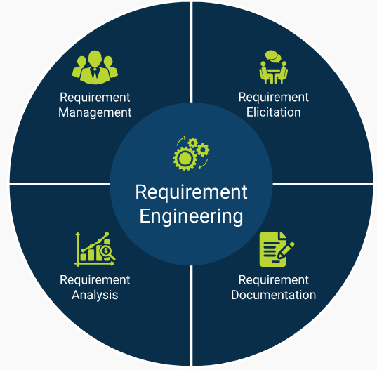
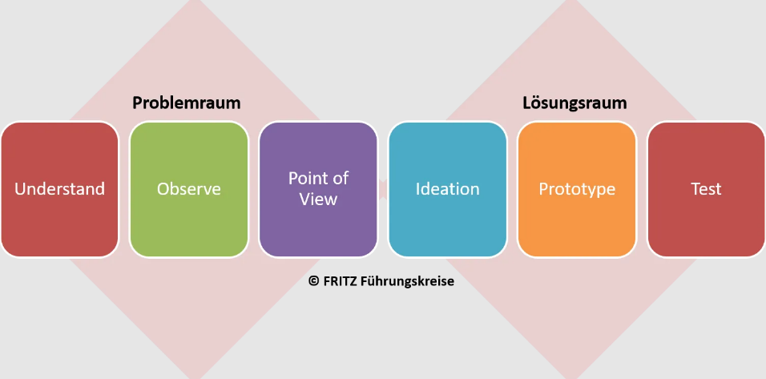
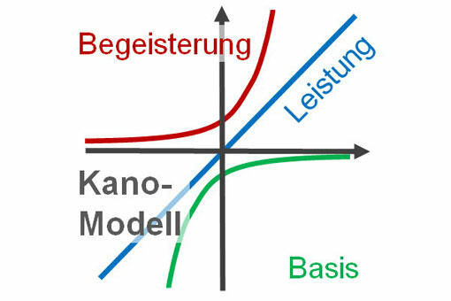
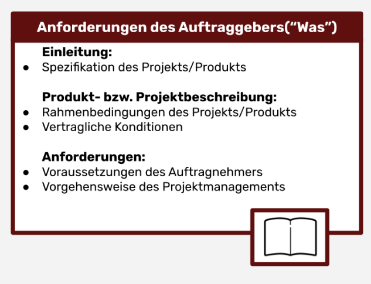
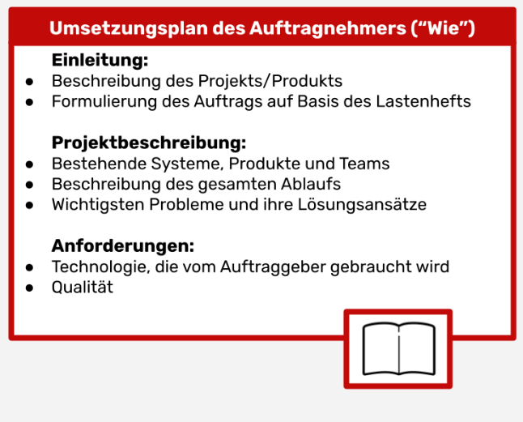
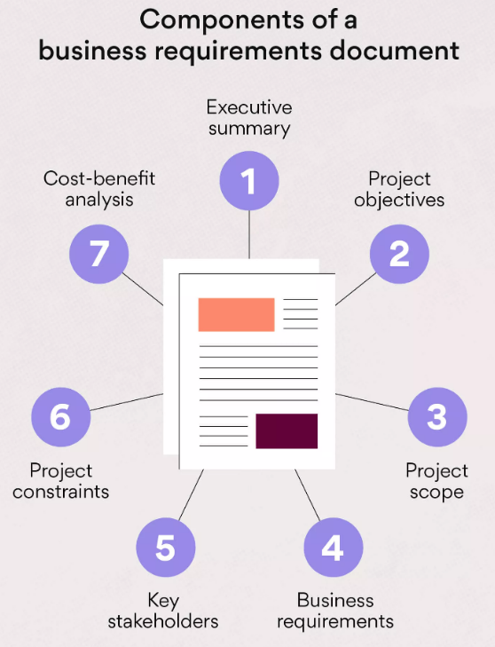

class: center, middle

## [Software Engineering](../../praesentationen.html)

#### Kapitel 8

# Requirements Engineering

Danny Meihöfer - Bjarne Zaremba

---
# Inhalt
***

1. Requirements Engineering
2. Problemraum vs. Lösungsraum
3. Arten von Anforderungen
4. Anforderungsanalyse
5. Prozess der Anforderungsanalyse
6. Dokumentation und Spezifikation der Anforderungen

---

class: center, middle

# Requirements Engineering

- Requirements Engineering (RE) ist der Prozess der Ermittlung, Analyse, Dokumentation und Verwaltung von Anforderungen in Softwareentwicklungsprojekten
- Einer der ersten Schritte im Softwareentwicklungsprozess

---

## Was ist eine Anforderung?

Anforderung - Requirement

- Eine Anforderung ist eine Eigenschaft oder Fähigkeit, die ein System besitzen muss, um einen Vertrag, eine Norm, eine Spezifikation oder andere formale Dokumente zu erfüllen
- Verschiedene Arten von Anforderungen
  - Funktionale Anforderungen
  - Nicht-funktionale Anforderungen
  - Technische Anforderungen
  - Qualitätsanforderungen
  - Randbedingungen
  - Rechtlich-vertragliche Anforderungen
  - Anforderungen an die Benutzeroberfläche

- Je nach Perspektive können Anforderungen unterschiedlich sein

---

## Problemraum vs. Lösungsraum

- Problemraum
  - Identifikation der Anfordeungen / Probleme
  - Keine Lösungsvorschläge
  - Probleme werden dokumentiert
  - Probleme werden analysiert
  - Probleme werden priorisiert

- Lösungsraum
  - Lösungsvorschläge werden erarbeitet
  - Lösungsvorschläge werden dokumentiert
  - Prototype werden erstellt
  - Lösungsvorschläge werden getestet

  

---

## Arten von Anforderungen

- Wie bereits erwähnt gibt es verschiedene Arten von Anforderungen  
  - Diese können sich inhaltlich überschneiden

Die erste Art sind Funktionale Anforderungen

**Funktionale Anforderungen** beschreiben die Funktion die erfüllt werden muss

Beispiel: 

- Ein Benutzer muss sich anmelden können
- Ein Benutzer muss sich abmelden können
- Ein Benutzer muss eine Nachricht schreiben können
- Ein Computer muss eine Datei speichern können

---

## Arten von Anforderungen

**Nichtfunktionale Anforderungen** beschreiben die Eigenschaften, die erfüllt werden müssen, aber nicht direkt eine Funktion beschreiben

Zu den nichtfunktionalen Anforderungen gehören mehrere Unterkategorien

- Qualitätsanforderungen
- Randbedingungen
- Rechtlich-vertragliche Anforderungen
- Technologische Anforderungen
- Anforderungen an Benutzeroberfläche

---

## Arten von Anforderungen

**Qualitätsanforderungen**

Eine erfüllung der Funktionalen Anforderungen bedeutet nicht automatisch, dass die Software auch gut ist (Qualitativ hochwertig)

Dazu gehören weitere Aspekte wie:

- Zuverlässigkeit
- Sicherheit gegen Fehler und Angriffe
- Wartbarkeit
- Überprüfbarkeit
- Erweiterbarkeit
- Kompatibilität

Ein konkretes Beispiel wäre:

- Die Software soll besonders genau sein und Effizient arbeiten

Es kann sein, dasds Qualitätsanforderungen nicht direkt messbar sind, oder dass sie sich mit anderen Anforderungen überschneiden

---

## Arten von Anforderungen

**Randbedingungen**

Randbedingungen werden oft als eigene Kategorie betrachtet

Die Randbedingungen beschreiben nicht was das System können muss, sondern was es nicht können darf

Sie schränken die Funktionalen Anforderungen ein

Beispiele:

- Wie viel darf die Software maximal kosten?
- Wie lange hat man für die Entwicklung Zeit?

Randbedingungen können auch die ganze Vorgehensweise bestimmen

- Sie können z.B. bestimmen, ob eine agile oder eine klassische Vorgehensweise gewählt wird

---

## Arten von Anforderungen

**Rechtlich-vertragliche Anforderungen**

Rechtlich-vertragliche Anforderungen sind Anforderungen, die sich aus Verträgen oder Gesetzen ergeben

Dazu gehören alle Spezifikationen zu Rechten und Pflichten, die sich aus Verträgen ergeben

Diese Anforderungen werden oft von Juristen formuliert und in eigenen Dokumenten festgehalten

Typische Themengebiete sind:

- Kosten
- Haftung
- Datenschutz
- Gewährleistung
- Garantie
- Wartung
- Was für Gesetzte müssen eingehalten werden

---

## Arten von Anforderungen

**Technologische Anforderungen**

Diese Kategorie betrachtet die technischen Aspekte der Software

Das fasst Anforderungen zusammen, die sich auf die Technologie beziehen, die für die Entwicklung verwendet wird

Dazu gehört:

- Anforderungen and die Systemumwelt
  - Umwelteinflüsse (Temperatur, Luftfeuchtigkeit, Druck, Chemische Einflüsse. etc.)
  - Stromversorgung, Netzwerk, etc.

- Mengengerüstanforderungen
  - Wie viele Benutzer müssen unterstützt werden
  - Wie viele Daten müssen verarbeitet werden
  - Wie viele Transaktionen müssen verarbeitet werden
  - Wie viel Speicherplatz wird benötigt
  - Stromstärken

---

## Arten von Anforderungen

**Technologische Anforderungen**

- Anforderungen an Schnittstellen
  - Anforderungen an die Kommunikation mit anderen Systemen
  - Anforderungen an die Kommunikation mit dem Benutzer
  - Anforderungen an die Kommunikation mit der Hardware
  - Mechanisch, oder softwareseitige Schnittstellen

- Vorgaben an Komponenten
  - Aus welchen Hardware- oder Softwarekomponenten besteht das System
  - Was ist bei den Komponenten zu beachten

---

## Arten von Anforderungen

**Anforderungen an die Benutzeroberfläche**

Wie interagiert der Benutzer mit dem System

Benutzeroberfächen können sehr unterschiedlich sein

- Klassische Desktopanwendungen
- Akustische Benutzeroberflächen
- Haptische Benutzeroberflächen
- Visuelle Benutzeroberflächen

Wie wird das System bedient?

Was sind die *Rahmenbedingungen* für die Benutzeroberfläche?

Was für Bedienelemente, oder Ein- und Ausgabegeräte werden verwendet?

---

## Arten von Anforderungen

---

## Was sind die Merkmale von guten Anforderungen?

**Atomarität**

- Anforderung sollen automar sein, d.h. sie sollten unteilbar sein
- Eine Anforderung sollte nur eine einzige Funktion beschreiben

**Eindeutigkeit**

- Anforderungen sollten eindeutig sein
- Wenig, oder kein Interpretationsspielraum
- Kein Raum für Zweifel

**Testbarkeit**

- Anforderungen sollten testbar sein
- Es sollte möglich sein zu überprüfen, ob die Anforderung erfüllt wurde

**Notwendigkeit**

- Keine überflüssigen Anforderungen
- Alle Anforderungen sollten essentiell sein

---

class: center, middle

# Anforderungsanalyse

- Bei der Anforderungsanalyse werden die Anforderungen ermittelt
- Alle Beteiligten geben ihre Anforderungen an das System an und versuchen diese zu ordnen und zu priorisieren
- Die Ergebnisse werden in einem Dokument festgehalten

---

## Motivation

Warum ist die Anforderungsanalyse wichtig?

- Um mit der Entwicklung beginnen zu können, müssen die Anforderungen bekannt sein
- Deshalb ist die Anforderungsanalyse einer der ersten Schritte im Softwareentwicklungsprozess

Eine schlechte Anforderungsanalyse führt zum scheitern von Projekten

- Die Anforderungen sind nicht klar
- Eigenschaften werden vergessen oder falsch verstanden
- **Das System funktioniert nicht wie erwartet**

In der Praxis lassen sich Probleme im Projektverlauf oft auf eine schlechte Anforderungsanalyse zurückführen

---

## Herausforderungen und Probleme bei der Anforderungsanalyse

- Mehrdeutige / Unvollständige Anforderungen
  - Stakeholder haben unterschiedliche Vorstellungen
  - Anforderungen werden oft nicht klar und vollständig formuliert
  - -> Missverständnisse und Fehlinterpretationen
  - Detailierte Dokumentation kann helfen

- Scope Creep
  - Der Umfang des Projekts wird immer größer
  - Neue Anforderungen werden hinzugefügt
  - -> Das Projekt wird immer größer und komplexer, aber die Rahmenbedingungen bleiben gleich
  - Jede Änderung muss gründlich evaluiert werden

- Kommunikation
  - Die Kommunikation zwischen den Stakeholdern ist oft schwierig
  - -> Missverständnisse und Fehlinterpretationen
  - Tools wie UMLs können helfen

---

## Herausforderungen und Probleme bei der Anforderungsanalyse

- Rückverfolgbarkeit
  - Manchmal ist es schwierig die Anforderungen zu verfolgen
  - -> Es ist schwierig zu überprüfen, ob alle Anforderungen erfüllt wurden
  - -> Besonders wenn mehrere Anforderungen sich überschneiden
  - Deshalb muss sicher gestellt werden, dass die Anforderungen tastbar sind
  - Die Zusammenhänge zwischen den Anforderungen müssen klar dokumentiert werden

---

## Herausforderungen und Probleme bei der Anforderungsanalyse

- Schlechte Verwaltung von Änderungen
  - Änderungen müssen gründlich verwaltet werden
  - Auch im späteren Verlauf des Projekts müssen vorherige Änderungen nachvollziehbar sein und bei jeder Änderung müssen alle ihre Aspekte geprüft werden
  - Sonst können durch Änderungen Probleme auftreten, die man schwer nachvollziehen kann
  - Man braucht einen festen Prozess um Änderungen zu implementieren

- Fehlende Kapazitäten

---

## Stakeholder

Als Stakeholder zählen alle Personen, oder Gruppen, die ein Interesse und Ansprüche an die Entwicklung eines Projekts haben

- Nutzer / Anwender
- Personen, die mit den Ergebnissen weiterarbeiten
- Investoren
- Betreiber
- Gesetzgeber
- Kaufentscheider

---

## SMART Ziele

Wie sollten Anforderungen formuliert werden?

S - Spezifisch

- Die Anforderungen sollten so spezifisch wie möglich sein
- Generelle Anforderungen sind schwer zu erfüllen

M - Messbar

- Woher weiß man ob man Fortschritt gemacht hat?
- Die Anforderungen sollten messbar sein

A - Angemessen

- Ist das Ziel realistisch?
- Sind die Rahmenbedingungen angemessen?

---

## SMART Ziele

R - Relevant

- Ist das Ziel relevant?
- Jedes Ziel sollte einen Mehrwert haben
- Jede Anforderung sollte wichtig für das Ergebnis sein

T - Terminiert

- Was ist der zeitliche Rahmen des Ziels?
- Enddatum, oder Deadline
- Prioritäten

---

## Anforderungsquellen und Ermittlungstechniken

Die Anforderungsquellen sind die Stakeholder

- Die Wünsche der Stakeholder zählen

Wie können die Anforderungen ermittelt werden?

- Brainstorming
- Interviews
- Beobachtung
- Berichte
- Fragebögen

---

## Anforderungskategorien nach Kano

Das Kano-Modell strukturiert Kundenanforderungen in mehrere Kategorien

Laut Kano gibt es Basisanforderungen, Leistungsanforderungen und Begeisterungsanforderungen

---

## Anforderungskategorien nach Kano

**Basisanforderungen** sind die Musskriterien

Sie werden auch implied needs genannt

- Der Kunde sieht sie als selbstverständlich an
- Man geht davon aus, dass sie erfüllt werden, ohne dass sie explizit genannt werden

Ein Restaurant sollte selbstverständlich immer sauber sein

- Man geht davon aus, dass es sauber ist, ohne dass es explizit erwähnt wird
- Man ist nicht besonders zufrieden, wenn es sauber ist, aber sehr unzufrieden, wenn es nicht sauber ist

Sind die Basisanforderungen nicht erfüllt, ist der Kunde sehr unzufrieden

Sind sie erfüllt, ist der Kunde nicht besonders zufrieden, aber auch nicht unzufrieden

---

## Anforderungskategorien nach Kano

**Leistungsanforderungen** sind die Sollkriterien

Anforderungen die explizit genannt werden

Mehr Leistung führt immer zu mehr Zufriedenheit

Weniger Leistung führt immer zu weniger Zufriedenheit

Beispiele:

- Das Essen sollte gut schmecken
  - Je besser es schmeckt, desto zufriedener ist der Kunde
  - Je schlechter es schmeckt, desto unzufriedener ist der Kunde
- Ein Auto sollte wenig Sprit verbrauchen

---

## Anforderungskategorien nach Kano

**Begeisterungsanforderungen** sind die Wunschkriterien

Der Kunde geht nicht davon aus, dass sie erfüllt werden

- Sind sie erfüllt ist der Kunde sehr zufrieden
- Sind sie nicht erfüllt ist der Kunde nicht unzufrieden

Wenn ein Restaurante einen kostenlosen Parkplatz anbietet, ist der Kunde sehr zufrieden

- Er geht nicht davon aus, dass es einen kostenlosen Parkplatz gibt

Auch hier können verschiedene Bereiche sich überschneiden

---

## Anforderungskategorien nach Kano

---

class: center, middle

# Prozess der Anforderungsanalyse

---

## Phasen und Aktivitäten

- Anforderungen ermitteln
- Ein Lastenheft erstellen
- Anforderungsbeschreibung
  - Auch Auftraggebeer und Projektmanager arbeiten mit
- Klassifizierung / Bewertung der Anforderungen
- Anforderungen priorisieren
- Anforderungsvalidierung

Im gesamten Projektverlauf muss Anforderungsmanagement betrieben werden

- Anforderungen müssen verwaltet werden
- Neue Anforderungen müssen verwaltet werden
- Änderungen müssen verwaltet werden

Der Projektmanager ist dafür verantwortlich, dass das Anforderungsmanagement betrieben wird

---

class: center, middle

# Dokumentation und Spezifikation der Anforderungen

---

## Lastenheft

Das Lastenheft enthält die Anforderungen an das System

- Dazu gehören sowohl funktionale als auch nichtfunktionale Anforderungen

Damit ist es die Grundlage für die Vertragsgestaltung

- Das Lastenheft ist auch Teil des Vertrags

Da Lastenheft kommt vom Auftraggeber und bildet die Grundlage für das Pflichtenheft

---

## Lastenheft

---

## Pflichtenheft

Das Pflichtenheft ist das Pendant zum Lastenheft aus Sicht des Auftragnehmers

- Es enthält die Anforderungen an das System aus Sicht des Auftragnehmers

Der Fokus liegt auf der technischen Umsetzung und der Frage wie die Anforderungen erfüllt werden

---

## Pflichtenheft

---

## Business Requirements Document

Das Business Requirements Document (BRD) ist ein Dokument in dem die Gesamtanforderungen an ein Projekt festgehalten werden

Die Anforderungen werden aus einer höheren Ebene betrachtet

Was will das Unternehen erreichen?

- Welche Probleme sollen gelöst werden?
- Welche Ziele sollen erreicht werden?
- Welche Anforderungen gibt es an das Projekt?

Das BRD befasst sich nicht mit technischer Umsetzung

Das BRD wird oft equivalent zum Lastenheft verwendet

---

## Business Requirements Document

---

## Functional Requirements Document

Das Functional Requirements Document (FRD) baut auf dem BRD auf

Es beschreibt detailierte Anforderungen die erfüllt werden müssen, damit die Anforderungen des BRD erfüllt werden können

Es beinhaltet technische Details und Spezifikationen

Das FRD wird oft equivalent zum Pflichtenheft verwendet

---

## Software Requirements Specification

Das Software Requirements Specification (SRS) ist ein Dokument, das die Anforderungen an die Software beschreibt

Es beschreibt genau was die Software können muss

Man kann sich dieses Dokument als Blaupause für die Software vorstellen

- Beschreibe den Zweck des Programms
- Produktscopes
- Funktionale und nichtfunktionale Anforderungen
- Beabsichtigte Benutzer
- Abhängigkeiten
- Externe Schnittstellen
  - Z.B. Hardware

---

class: center, middle

## Lernfragen

1. Was ist Requirements Engineering?
2. Was ist der Unterschied zwischen Funktionalen und Nichtfunktionalen Anforderungen?
3. Was sind die Merkmale von guten Anforderungen?
4. Wie macht man eine Anforderungsanalyse?
5. Was bedeutetn die Anforderungskategorien nach Kano?
6. Was ist ein Lastenheft?
7. Was ist ein Pflichtenheft?

---
# Quellen
***

- https://www.qamentor.com/qa-services/business-analysis-requirement-engineering-services/

- https://blog.sophist.de/2013/07/10/nicht-funktionale-anforderungen-im-uberblick/

- https://visuresolutions.com/de/blog/high-quality-requirements-attributes/

- https://www.timeline-erp.de/blog/warum-ist-eine-anforderungsanalyse-so-wichtig/

- https://visuresolutions.com/de/requirements-management-traceability-guide/biggest-challenges-of-requirements-management/

- https://www.heflo.com/blog/customer-service/kano-model-examples/#:~:text=In%20other%20words%2C%20the%20higher,will%20bring%20to%20the%20customer

- https://www.projektmagazin.de/sites/default/files/styles/hero_tablet/public/2019-05/herobild_510x340_39.jpg?itok=v164HutM

---

# Quellen
***

- https://images.acquisa.de/media/pages/magazin/lastenheft-pflichtenheft/fd47c77a33-1679907691/was-ist-das-pflichtenheft.png