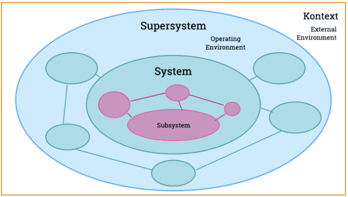
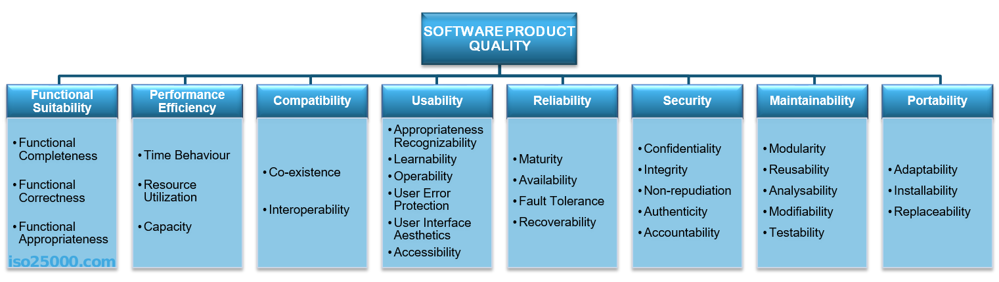

class: center, middle

## [Software Engineering](../../praesentationen.html)

#### Kapitel 9

# Softwaresysteme

Danny Meihöfer - Bjarne Zaremba

---
# Inhalt
***

1. Was sind Systeme?
2. Systemeigenschaften
3. Systemstrukturen
4. Systemthinking
5. Software Systeme
6. Softwaresystembausteine
7. Qualitätsmerkmale von Softwaresystemen

---

class: center, middle

#  Systeme

---

## Sozioökonomische Systeme

Sozioökonomie beschäftigt sich mit dem Zusammenhang zwischen sozialem und wirtschaftlichem Verhalten

Ein Sozioökonomisches System besteht aus mehreren Komponenten

- Soziale Strukturen (z.B. Institutionen)
- Wirtschaftliche Aktivitäten (z.B. Produktion)
- Kulturelle Faktoren (z.B. Religion)
- Politische Rahmenbedingungen (z.B. Gesetze)

Die einzelnen Komponenten beeinflussen sich gegenseitig

- Eine neue Technologie kann die Wirtschaft ankurbeln
- Aber auch Arbeitsplätze schaffen, oder vernichten

Sozioökonomische Systeme sind z.B. Unternehmen und Staaten

Softwaresysteme können sozioökonomische Systeme beeinflussen

---

## Technische Systeme

Technische Systeme sind Systeme, die aus technischen Komponenten bestehen

Um bestimmte Funktionen auszuführen arbeiten die Komponenten zusammen

Komponenten können z.B. sein:
 
- Hardware
- Software
- Daten
- Prozesse
- Personen

---

## Technische Systeme

Für gewöhnlich verarbeiten technische Systeme automatisch Informationen

Es gibt technische Systeme überall. Ein paar Beispiele:

- Verkehrsleitsysteme
- Computer
- Energiesysteme
- Kommunikationssysteme

Softwaresysteme sind technische Systeme

---

## Soziale Systeme

Soziale Systeme basieren auf Verbindungen zwischen sozialen Akteuren

- Das können Personen, Gruppen, oder Organisationen sein

Das System ist durch Beziehungen, Regeln, Normen und Muster der sozialen Interaktionen definiert

Man ist Teil von mehreren sozialen Systemen

- Familie
- Freundeskreis
- Arbeitsplatz
- etc.

In jedem sozialen System unterscheidet sich die soziale Interaktion

Jedes soziale System hat seine eigenen Werte und Normen

Softwaresysteme können soziale Systeme unterstützen

---

## Natürliche Systeme

Natürliche Systeme sind Systeme, die in der Natur vorkommen

- Sie sind nicht vom Menschen geschaffen

Natürliche Systeme bestehen aus komplexen Komponenten

- Ökosysteme
- Wetter
- Klima
- Wasser
- Biologische Systeme
- etc.

Softwaresysteme können natürliche Systeme z.B. überwachen

---

class: center, middle

# Systemeigenschaften

---

## Komplizierte vs. komplexe Systeme

Komplizierte Systeme sind schwer zu verstehen

- Aber sie sind vorhersagbar
- Man kann sie immer "lösen"
- Man muss nur genug Informationen haben
- z.B. ein Auto, oder ein Mischpult

Komplexe Systeme sind unvorhersehbar

- Mehr komplexität = mehr Unberechenbarkeit
- Kein einfacher Zusammenhang zwischen Ursache und Wirkung
- Einflussfaktoren beeinflussen sich gegenseitig
- Können nicht immer "gelöst" werden
- z.B. Wetter, oder ein Ökosystem

Manchmal wird Komplex als Steigerung von Kompliziert verwendet

---

## Adaptive Systeme

Adaptive Systeme sind Systeme, die sich anpassen können

Verändert sich ihre Umgebung, verändern sie sich auch

Für gewöhnlich sind adaptive Systeme komplexe Systeme

Sie können aus Erfahrungen lernen (müssen sie aber nicht)

- z.B. das Ökosystem, Gehirn, oder das Immunsystem

Auch Softwaresysteme können adaptiv sein

- z.B. Künstliche Intelligenz

---

## Lernende Systeme

Lernende Systeme sind Systeme, die aus Erfahrungen lernen

Das Ziel ist es Informationen zu sammeln und zu verarbeiten

- Muster aus den Informationen erkennen
- Durch die Informationen kann das System seine Leistung verbessern

Machine Learning - Künstliche Intelligenz

Ein Beispiel ist ein neurales Netz, dass Bilder / Gesichter erkennen kann

- Es bekommt viele Beispielbilder und lernt daraus Muster zu erkennen
- Wenn es genug gelernt hat, kann es neue Bilder erkennen
- Leistung wird immer besser und genauer

---

## Dynamische Systeme

Dynamische Systeme verändern sich über die Zeit

- Sie sind nicht statisch

Eigenschaften können sich ständig ändern

Die Veränderungen können durch mathematische Gleichungen beschrieben werden

z.B. Wetter

---

## Selektive Systeme

Selektive Systeme, können bestimmte Informationen auswählen

Sie haben bestimmte Algorithmen und Kriterien um Informationen zu Filtern

Ein Beispiel ist ein Suchalgorithmus, oder ein Spamfilter

- Eine große Menge an Informationen wird gefiltert
- Nur die relevanten Informationen werden weitergegeben

Suchmaschinen wie Google können mit machine learning erweitert werden

Die Suchergebnisse werden immer besser

---

class: center, middle

# Systemstrukturen

Die Systemstruktur ergibt sich aus:

- den Elementen
- den Grenzen
- Kontext
- Umgebung
- Eingabe / Ausgabe

---

## System

Ein System kann ein Teilsysten (Subsystem) von einem anderen System sein

Oder ein System kann ein Supersystem von einem anderen System sein

Elemente für die Ein- und Ausgabe werden als Schnittstellen bezeichnet

Der Systemkontext beschreibt die Interaktion eines Systems mit seiner Umgebung

Es ist wichtig die Grenzen (Den Scope) eines Systems zu definieren

- Was soll entwickelt werden?
- Welche anderen Systeme / Schnittstellen müssen berückstichtigt werden?
- Welche anderen Systeme / Schnittstellen müssen NICHT berücksichtigt werden? 

---

## Systemkontext

---

## Systemkontext

---

## Systemthinking

Systemthinking ist ein Denkansatz, der sich mit Systemen beschäftigt

- Es geht darum die Zusammenhänge zwischen den Elementen zu verstehen
- Ein System auf struktureller und dynamischer Ebene zu verstehen

Werkzeuge und Fragestellungen um Eigenschaften von Systemen zu verstehen

-> Lösungen für komplexe Probleme finden

---

### Werkzeuge Systemthinking

**Strukturen identifizieren / Vernetzen**

Der erste Schritt ist das identifizieren der Struktur des Systems

- Welche Elemente gibt es?
- Wie sind sie miteinander verbunden?
- Welche Grenzen hat das System?
- Welche Elemente sind innerhalb der Grenzen?
- Welche Elemente sind außerhalb der Grenzen?
- Was für Einflussfaktoren gibt es?

Die Struktur wird skizziert um ein Verständnis über die Funktionsweise des Systems zu bekommen

Beispiel: Die Zusammenhänge in der Natur

- Man möchte eine Stuhl herstellen
- Dafür muss ein Baum gefällt werden
- Der Baum wird zu Holz verarbeitet
- Das Holz wird zu einem Stuhl verarbeitet

Versteht man die Elemente in kann man besser mit dem System arbeiten

---

### Werkzeuge Systemthinking

**Emergenz**

Emergenz ist ein Phänomen, dass in komplexen Systemen auftritt

- Durch die Synergie / Vernetzung einzelner Elemente entstehen ganz neue Eigenschaften

Emergenz ist ein universales Konzept

Ein Beispiel ist ein Ameisenhaufen

- Die Ameisen sind die Elemente
- Die Ameisen kommunizieren miteinander
- Zusammen bilden sie riesige Straßennetze
- Ein Ameisenhaufen ist ein komplexes System, das weit über Fähigkeiten der einzelnen Ameisen hinausgeht

---

### Werkzeuge Systemthinking

**Synthese**

Synthese ist ein Prozess, der aus mehreren Elementen ein neues Element erzeugt

Das neue Element ist mehr als die Summe seiner Teile

Man muss die Einzelteile und die Gesamtheit verstehen

Das Gegenstück zur Synthese ist die Analyse

- Die Analyse zerlegt ein System in seine Einzelteile
- Die Synthese setzt die Einzelteile wieder zusammen

---

### Werkzeuge Systemthinking

**Feedbackschleifen**

Da alle Elemnente in einem System miteinander verbunden sind, beeinflussen sie sich gegenseitig

Immer wieder gibt es Rückkopplungen zwischen den Elementen

Eine Änderung von A beeinflusst B, was wiederum A beeinflusst

Feedbackschleifen können positiv oder negativ sein

Beispiele für sich selbst balancierende Systeme:

- Jäger und Beute
- Thermostat

Beispiele für unbalancierte Systeme:

- Überfischung

---

### Werkzeuge Systemthinking

**Kausalität**

Kausalität beschreibt die Ursache-Wirkung-Beziehung

Um Feedbackschleifen zu verstehen muss man die Kausalität verstehen

Cause -> Effect

Jedes Ereignis hat eine Ursache

- Die Ursache ist die Wirkung eines anderen Ereignisses

Man muss entschlüsseln, welche Ereignisse zu welchen Wirkungen führen

---

### Werkzeuge Systemthinking

**Systemabbildung**

Die Systemabbildung ist eine Schlüsseltechnik des Systemthinkings

Das "mapping" ist eine grafische Darstellung des Systems

- Es zeigt die Elemente und deren Beziehungen
- Es kann aber auch nur einzelne Verhaltensweisen darstellen

---

class: center, middle

# Software Systeme

---

class: center, middle

## Arten von Softwaresystemen

---

## Eingebettete Systeme

*Embedded Systems* sind spezielle Computersysteme, die in andere Systeme eingebettet sind

Sie sind Teil eines größeren Systems und erfüllen eine bestimmte Funktion

Heutzutage sind sie in fast allen elektronischen Geräten zu finden

- Autos
- Waschmaschinen
- Smartphones
- Microcontroller
- Überall

---

## Intelligentes System

Intelligente Systeme sind Systeme, die selbstständig Probleme lösen können

Sie lösen Probleme die "intelligentes" Verhalten erfordern

Sie können oft aus Erfahrungen lernen und sich anpassen

Die Fähigkeit rational zu handeln ist ein wichtiger Bestandteil

Beispiele für intelligente Systeme:

- Künstliche Intelligenz
- Expertensysteme
- Autonome Systeme
- etc.

Die Grenzen zwischen intelligenten Systemen und normalen Softwaresystemen sind fließend

---

## Informationssysteme

Informationssysteme sind Systeme, die Informationen verarbeiten

Sie sammeln, speichern, verarbeiten und verteilen Informationen

Sie sind nicht dazu da, um die Informationen anderweitig zu verarbeiten

Heutzutage sind sie überall und werden immer wichtiger (Digitalisierung)

Beispiele für Informationssysteme:

- Datenbanken
- Suchmaschinen
- Cloud Computing
- etc.

---

class: center, middle

# Softwaresystembausteine

Softwaresysteme bestehen aus vielen Komponenten

- Diese Komponenten haben verschiedene Eigenschaften und Funktionen

---

## Was für Bausteine gibt es?

**Systeme / Subsysteme** - Systeme bestehen teilweise aus anderen Systemen

**Module** - Module sind unabhängige Teile, die eine bestimmte Funktion erfüllen und wiederverwendet werden können

**Pakete** - Pakete sind eine Sammlung von Modulen, oder anderen Paketen

**Klassen / Objekte** - Objekte sind Datenstrukturen, die bestimmte Eigenschaften je nach Klasse haben

**Interface** - Interfaces sind Schnittstellen, die die Kommunikation zwischen verschiedenen Komponenten ermöglichen

**Funktion** - Funktionen sind Teile von Code, die eine bestimmte Aufgabe erfüllen

---

class: center, middle

## Qualitätsmerkmale von Softwaresystemen

Ist mein Softwaresystem gut?

---

## Innere und äußere Qualität

Innere Qualität ist die Perspektive des Entwicklers

- Codequalität
- Wartbarkeit
- Testbarkeit
- Erweiterbarkeit
- Wiederverwendbarkeit
- Verständlichkeit
- Lesbarkeit
- Architektur
- Dokumentation

Äußere Qualität ist die Perspektive des Kunden

- Einfache Verwendung
- Bedienbarkeit
- Benutzerfreundlichkeit
- Zuverlässigkeit
- Robustheit
- Fehlerfreiheit
- Sicherheit

---

## Qualitätsdreieck und Teufelsquadrat

Das Qualitätsdreieck beschreibt die Beziehung zwischen Kosten, Zeit und Qualität

---

## Qualitätsdreieck und Teufelsquadrat

Das Teufelsquadrat beschreibt die Beziehung zwischen Kosten, Zeit, Qualität und Funktionalität

Wird eine der Eigenschaften verändert, verändern sich auch die anderen

---

class: center, middle

## Qualitätsmodelle

Man kann die Qualität von Softwaresystemen mit verschiedenen Modellen bewerten

---

## FCM-Modelle

FCM - Factor-Criteria-Metric

Qualitätsmerkmale werden in Faktoren, Kriterien und Metriken unterteilt

FCM-Modelle sind sehr allgemein und können auf alle Softwaresysteme angewendet werden

Faktoren sind die verschiedenen Aspekte, oder Eigenschaften, die die Qualität beeinflussen

Kriterien sind Maßstäbe, oder Standards, mit denen die Faktoren bewertet werden

Metriken sind Messwerte mit denen die Kriterien bewertet werden

Das FCM-Modell hilft dabei Faktoren zu bestimmen und zu bewerten

---

## ISO 25010

ISO 25010 ist ein Qualitätsmodell, dass sich auf Softwareprodukte bezieht

Dieses Modell bestimmt eine Reihe von Qualitätsmerkmalen und deren Unterkriterien

---

## FURPS

FURPS ist ein weiteres Qualitätsmodell, dass bestimmte Qualitätsmerkmale definiert

FURPS ist ein Akronym für:

- Functionality - Funktionalität
- Usability - Benutzbarkeit
- Reliability - Zuverlässigkeit
- Performance - Leistung
- Supportability - Wartbarkeit

---

# Lernfragen

1. Was sind Sozioökonomische Systeme und wie können Softwaresysteme diese beeinflussen?
2. Was ist der Unterschied zwischen natürlichen und technischen Systemen?
3. Was sind komplexe Systeme und wie unterscheiden sie sich von komplizierten Systemen?
4. Was haben adaptive Systeme mit lernenden Systemen zu tun?
5. Was sind typische Systemstrukturen?
6. Was bedeutet Systemthinking?
7. Was für Software Systeme gibt es?
8. Woraus bestehen Softwaresysteme?
9. Wie kann man die Qualität von Softwaresystemen bewerten?

---
# Quellen
***

- https://fluxum.substack.com/p/warum-der-unterschied-zwischen-komplex#:~:text=Komplizierte%20Systeme%20k%C3%B6nnen%20analysiert%20werden,die%20Faktoren%20sich%20gegenseitig%20beeinflussen

- https://www.riseup.ai/de/blog/adaptives-machinelles-lernen

- https://t2informatik.de/wissen-kompakt/systemkontext/#:~:text=Systemkontext%20Definition,einer%20Entwicklung%20zu%20beachten%20sind

- https://digitaleneuordnung.de/blog/system-thinking/

- https://www.eveline-lemke.de/2018/08/systems-thinking/

- https://www.studysmarter.de/schule/psychologie/hauptstroemungen-der-psychologie/emergenz/

- https://medium.com/disruptive-design/tools-for-systems-thinkers-the-6-fundamental-concepts-of-systems-thinking-379cdac3dc6a

- https://interim-cio.biz/artikel-projektsteuerung-teufelsquadrat#:~:text=Das%20Teufelsquadrat%20ist%20ein%20anschauliches,Dreieck%20macht%20das%20Modell%20unpraktikabel.