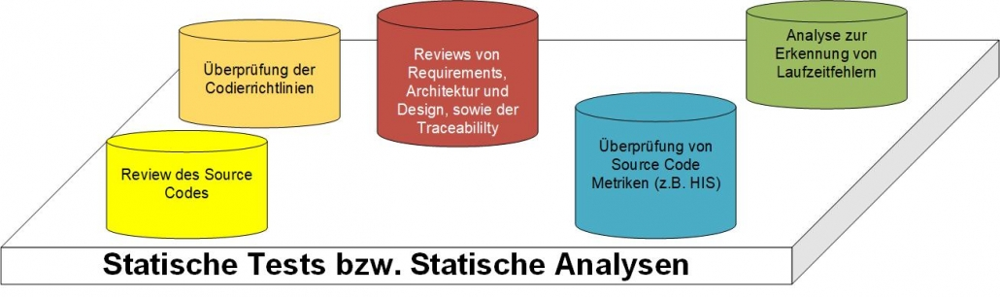

# Kapitel 10 - Softwareprüfung

**Autoren:** Bjarne Zaremba - Danny Meihöfer

## Lernziele für den ersten Teil

Nach diesem Kapitel sollen folgende Aspekte klarer geworden sein:

- Was ist Softwareprüfung?
- Was sind Bug, Defect, Failure, Error und Fault?
- Was bedeutet Continuous Testing?
- Was ist Shift-Left- / Right-Testing
- Was sind Anti-Patterns?
- Unterschied zwischen Validierung und Verifikation?
- Was ist statisches Testen
  - Statische Analyse
  - Review
- Was ist dynamisches Testen
  - Testpyramide
  - Unit-Tests, Integrationstests, E2E-Tests

## Lernziele für den zweiten Teil

Nach diesem Kapitel sollen folgende Aspekte klarer geworden sein:

- Was ist Alpha- und Beta-Testing?
- Was ist A/B-Testing?
- Was ist Penetrationstest?
- Was ist SAST und DAST?
- Welche Tools gibt es für die Testautomatisierung?
- Was ist Testdatengenerierung?
- Wie kann ich Testdaten generieren?
- Was sind Flaky Tests?
- Was ist Black-Box-Testing?
- Was ist White-Box-Testing?


## Einleitung
Diese Ausarbeitung behandelt das Kapitel 10 zum Thema Softwareprüfung im Bereich Software Engineering. Die Präsentation wurde von Bjarne Zaremba und Danny Meihöfer erstellt.

---

# Was ist Softwareprüfung?

Softwareprüfung ist ein Prozess, bei dem Software auf Fehler und Defekte überprüft wird. Das Ziel ist es, die Qualität der Software zu verbessern. In diesem Kapitel werden wird euch einige Methoden und Aspekte der Softwareprüfung vorstellen.

Als erstes geht es um die Frage wonach überhaupt gesucht wird, denn es gibt verschiedene Arten von Fehlerquellen, die dafür sorgen können, dass eine Software nicht den Anforderungen entspricht die es haben sollte. Dazu gehören zum Beispiel Bugs, Defects, Faults und Failures. Und was das genau ist erkläre ich als nächstes.

# Typen von Fehlern

## Error

Ein Error entsteht wenn ein Entwickler einen Fehler macht, während er am Code arbeitet. Dieser Fehler kann sich in verschiedenen Formen zeigen. Als erstes denkt man an Syntaxfehler, die der Compiler anzeigt. Es gibt aber auch Fehler, die der Compiler nicht anzeigt. Dazu gehören zum Beispiel Logikfehler, wegen denen ein Algorithmus sich nicht so verhält, wie man es von ihm erwartet. Neben Fehlern die auftreten, weil der Entwickler den Code "falsch" geschrieben hat, können Errors auch dadurch auftreten, dass der Entwickler die Spezifikation falsch verstanden hat, oder dadurch das diese nicht korrekt definiert wurden. Kennt er nicht die genauen Anforderungen an die Software, schreibt er möglicherweise Code, dessen Funktion sich stark von der gewünschten Funktion unterscheidet.

Jeder einzelne dieser Fehler kann alleine, oder in Kombination mit anderen Fehlern dazu führen, dass die Software nicht mehr wie gewünscht funktioniert, weil Probleme wie Bugs und Defekte entstehen. Typischerweise sind die Errors die erste Fehlerquelle, die bei der Softwareprüfung entdeckt werden.

## Bug

Die Begriffe **Bug und Defect** werden oft synonym verwendet. Obwohl beide Begriffe Fehler in der Software beschreiben, gibt es einen Unterschied zwischen ihnen. Ein Bug ist ein **Error**, der in der Entwicklung entsteht und dazu führt, dass sich die Software nicht so verhält wie der Entwickler es von ihr erwartet.

**Ein Beispiel Szenario:** Ein Programm soll einen Button haben, der bei einem Klick das Programm beendet. Der Entwickler schreibt den Code für den Button, aber da er eine falsche Methode verwendet. wird das Programm nach einem Klick auf den Knopf nicht beendet.

- Button ist da, aber **funktioniert** wegen eines Codingfehlers **nicht wie erwartet** -> **Bug**

Häufig treten Bugs auf, weil der Entwickler unabsichtlich Syntax-, oder Logikfehler in seine Software einbaut. Das kann zu verschiedenen Arten von Bugs führen. Beispiele für verschiedene Arten von Bugs sind:

- **Funktionale Bugs:** Eine bestimmte Funktion der Software funktioniert nicht wie erwartet. Zum Beispiel kann es sein, dass ein Button nicht auf einen Klick reagiert, oder ein user kann sich nicht auf einer Webseite anmelden. Möglicherweise stürzt die Software auch ab, oder es werden falsche Daten angezeigt. Werden Daten falsch berechnet, oder angezeigt kann das noch schlimmere Folgen haben, als wenn die Software abstürzt.

- **Kosmetische Bugs:** Visuelle Bugs, die die Benutzererfahrung beeinträchtigen. Beispielsweise kann ein Fenster nicht richtig angezeigt werden. Die Grenze zwischen kosmetischen Bugs und funktionalen Bugs ist nicht immer klar. Wenn ein Button nicht richtig angezeigt wird, kann das dazu führen, dass die Funktion der Programms eingeschränkt wird.

- **Performance Bugs:** Diese Bugs führen dazu, dass die Software langsamer läuft als erwartet. Das kann bedeuten, dass eine Software, oder eine bestimmte Funktion lange braucht um zu starten. Ein bestimmtes Fenster einer Webseite braucht vielleicht zu lange um zu laden, oder man muss lange auf eine Antwort des Servers warten.

- **Kompatibilitäts Bugs:** Software soll oft auf verschiedenen Betriebssystemen, oder in verschiedenen Umgebungen funktionieren und in jedem Fall die gleiche Funktionalität bieten. Kompatibilitäts Bugs treten auf wenn sich die Software in verschiedenen Umgebungen inkonsistent verhält.

Beim Testen der Software versucht man alle Bugs zu finden. Es haben allerdings nicht alle Bugs die gleiche Priorität. Während manche Bugs die Funktionalität der Software stark einschränken, sind andere Bugs kaum merkbar und müssen nicht zwangsweise direkt gefixt werden. Deshalb werden den Bugs **Schweregrade** zugeordnet (Wie schlimm ist ein Bug) und nach ihrer **Priorität** sortiert.


## Defect

Defects, oder Defekte sind Errors, die dazu führen, dass das Verhalten der Software sich von der Spezifikation abhebt. Defects können durch Bugs entstehen, aber auch durch andere Fehlerquellen. Möglicherweise hat das Entwicklungsteam die Spezifikation falsch verstanden, oder die Spezifikation ist nicht korrekt definiert. Das führt dazu, dass eine Software mit Funktionen erstellt werden, die zwar funktionieren, aber nicht die vom Kunden gestellten Anforderungen erfüllen. 

Ein Beispielsznenario in dem ein Defekt auftritt: Ein Webform soll einen Button haben, der die Eingaben des Nutzers speichert und das Programm beendet. Der Entwickler hat das anders verstanden und deshalb das Form so programmiert, dass es zwei Buttons gibt. Einer speichert die Eingaben und der andere beendet das Programm.

- Die Funktion, die der Entwickler eingebaut hat funktioniert so wie er es erwartet (Kein Bug)
- Aber die Funktion weicht von der Spezifikation des Kunden ab (Defect)

Ähnlich wie bei den Bugs, werden Defects Prioritäten zugeordnet, um zu bestimmten, wann welche Defects gefixt werden müssen.


## Fault

Ein Fault (engl. Fehler) ist die ""Ursache"" für das Auftreten von Bugs und Defects. Genauer gesagt ist ein Fault ein bestimmter Zustand der Software, oder der Umgebung der Software, der dazu führt das ein Bug, oder ein Defect auftritt. Erwartet ein Programm zum Beispiel als Benutzereingabe eine Zahl, aber der Benutzer gibt einen String ein, kann das zu einem Fehler führen. Der Fault ist hier, dass der Benutzer eine ungültige Eingabe gemacht hat. Einzelne Faults können zu einem, oder mehereren Problemen führen. 

## Failure

Eine Failure (Fehlschlag) tritt auf wenn ein Bug, oder ein Defect zu einem unerwartetem Verhalten für den Endnutzer führt. Ein Fehler kann zu mehreren Failures

Soll ein Button in einer Banking App zum Beispiel eine Überweisung starten, aber der Button funktioniert nicht und der Endnutzer kann die Software deshalb nicht richtig benutzen, ist das ein Failure. Die Software hat versagt.

Failures können auch entstehen, weil der Entwickler nicht bedacht hat in welcher Umgebung die Software laufen soll. Ein Beispiel dafür ist, wenn eine Software auf einem Computer mit einer bestimmten Auflösung entwickelt wird, aber auf einem Computer mit einer anderen Auflösung nicht richtig funktioniert.

Die Entstehung einer Failure kann mit einem Zyklus beschrieben werden. Der erste Schritt ist ein Error. Aus dem Error entsteht ein Bug, Defect, oder ein Fault (oder mehrere). Der Bug, Defect, oder Fault führt zu einem Failure.


## Issue

Issue ist ein breiter Begriff, der alle Probleme beschreibt, die während der Entwicklung einer Software auftreten. Dazu gehören Bugs, Defects, Faults und Failures. Aber auch andere Probleme, wie zum Beispiel Probleme mit der Infrastruktur, oder Probleme mit der Organisation des Entwicklungsteams.

Sie werden genutzt um Probleme zu beschreiben und zu verwalten. Dazu werden sie in einer Datenbank gespeichert und mit Informationen wie dem Status des Issues, der Priorität und dem Schweregrad versehen. Sie durchgehen dann einen typischen Zyklus von der Erstellung, über die Bearbeitung bis zur Lösung des Problems.

Sie spielen eine große Rolle für den Projektmanager, der anhand der Issues plant wie das Projekt weitergeht.

## Flaw

Flaws sind Mängel im Design, in der Architektur, oder in der Implementierung der Software. Sie können die Ursache für Bugs, Defects, Faults und Failures sein. Flaws können schwer zu finden sein, weil sie sich nicht immer zeigen wenn man einzelne Teile der Software betrachtet. Sie können zum Beispiel in der Architektur der Software liegen, oder in der Art und Weise wie die Software entwickelt wurde.

Ein Beispielszenario: Ein Entwickler erstellt ein soziales Netzwerk. Er hat die Designentscheidung getroffen, dass sämtliche persönliche Daten der Nutzer standardmäßig öffentlich zu sehen sind.

- Kein offensichtlicher Bug, oder fehler
- Aber ein grundlegender Designfehler, der zu Datenschutzproblemen führen kann

# Testansätze

Jetzt stellt sich die Frage: Wie sollte getestet werden? Es gibt verschiedene Ansätze, die sich in zwei Kategorien einteilen lassen: **Statisches Testen** und **Dynamisches Testen**. Beide Ansätze haben unterschiedliche Ziele und sollten in kombination verwendet werden. 

Vorher muss allerdings noch geklärt werden, wann getestet werden soll. Das spielt eine große Rolle, vor allem wenn man CI/CD verwendet. In den nächsten vier Abschnittern werde ich erläutern wann man testen sollte und was es mit den Begriffen **Shift Left Testing**, **Shift Right Testing** und **Testing in Production** auf sich hat.

## Continuous Testing (CT)

Continuous Testing bedeutet kontinuirliches Testen und wird auch mit CT abgekürzt. CT ist ein Ansatz, bei dem Software während der Entwicklung immer wieder (kontinuirlich) getestet wird, so dass eine kontinuirliche Feedbackschleife entsteht. Das **Ziel** davon ist, dass man durch häufigeres und schnelleres Feedback die Software **schneller ausliefern** kann und dass die Software eine **höhere Qualität** hat.

Bevorzugt werden hier automatisierte, oder zumindest werkzeuggestüzte Tests verwendet, um den Prozess zu beschleunigen und den Entwicklern Arbeit zu ersparen. Da immer wieder Tests durchgefüht werden müssen, wäre es sehr aufwendig, wenn immer wieder manuelle Tests durchgeführt werden müssen. 

Dieses vorgehen ist ein wichtiger Bestandteil von **Continuous Integration** und **Continuous Delivery** (DevOps) und ist für gewöhnlich fest in den Workflow integriert. Dadurch wird die Lücke zwischen Entwicklung und Release geschlossen und die Software kann schneller ausgeliefert werden.


Jetzt stellt sich die Frage an welcher Stelle im Workflow getesten werden sollte. Dazu gibt es zunächst den Shift Left Testing Ansatz.

### Shift Left Testing

Bei dem Shift Left Testing Ansatz, wird die Software bereits in **frühen Phasen** des Entwicklungsprozesses getestet. Das Ziel ist es, Fehler so früh wie möglich zu finden, um die Kosten für die Fehlerbehebung zu senken.

Das IBM Institut für Wissenschaft hat in einer Studie herausgefunden, dass Fehler, die in frühen Entwicklungsphasen gefunden werden insgesamt günstiger zu beheben sind, als wenn sie in späteren Phasen entdeckt werden.


Frühe Phasen der Entwicklung bedeutet in diesem Fall, dass getestet wird bevor die Software released wurde. Dabei werden in der Regel viele kleine Tests durchgeführt, die sich auf einzelne Komponenten der Software konzentrieren. Das können zum Beispiel Unit Tests sein.

### Shift Right Testing

Der Shift Right Testing Ansatz ist das Gegenstück zum Shift Left Testing. Hier wird die Software in **späten Phasen** des Entwicklungsprozesses getestet. Späte Phasen bedeutet nach dem Release, oder Teilrelease der Software. Das Ziel ist es, Fehler zu finden, die in früheren Phasen nicht gefunden wurden. Der Vorteil davon ist, dass man die Software unter realistischen Bedingungen testen kann.

Das bedeutet man hat echte Benutzer und eine realistische Last. Das reale Szenario kann man nie zu 100% simulieren. Des weiteren wird auf Dinge geachtet wie die Performance, die Zuverlässigkeit, die Sicherheit der Software, und die Erfahrungen mit der Software in verschiedenen Umgebungen. Die Benutzererfahrungen können als zusätzliches Feedback genutzt werden, um die Software zu verbessern.

Beispielmethoden für diese Art von Tests sind:

- A/B Testing
- Canary Releases
- Feature Toggles
- Blue/Green Deployment

Für gewöhnlich werden sowohl Shift Left, als auch Shift Right Testing mit einander kombiniert, da beide Ansätze für bestimmte Arten von Tests besser geeignet sind.

Die Abbildung macht deutlich wo die beiden Ansätze im Entwicklungsprozess angesiedelt sind.


### Testing in Production (TiP)

Wie ich im letzten Abschnitt erwähnt habe können beim Shift Right Testing echte benutzer verwendet werden um Software zu testen. Das passiert unter dem Ansatz des **Testing in Production**.
**Testing in Production** bedeutet, dass die Software in der Produktionsumgebung getestet wird. 

Dabei kommt die Frage auf, warum sollte man Software nach der Auslieferung noch testen? Das hat mehrere Gründe:

- Es ist schwierig die Produktionsumgebung perfekt zu simulieren. In der Regel kann man nicht immer jedes mögliche Szenario testen. In der Produktionsumgebung wird die Software unter realistischen Bedingungen getestet.
- Selbst wenn man gute Tests hat, kann es sein das man nicht alle Bugs findet. Oft bleiben Bugs unentdeckt.
- Das bedeutet man kann sehr viel Aufwand in das finden von Bugs stecken, bevor die Software in der Produktionsumgebung ist und trotzdem nicht alle finden.

Bei TiP muss man allerdings bedenken, dass es ein hohes Risiko birgt, weil man nicht weiß was für Bugs es möglicherweise gibt und wie Fatal diese sind. Deshalb sollte man diesen Ansatz mit großer Vorsicht verwenden.

## Testing Anti Patterns

Testing Anti Patterns sind Testansätze die nicht empfohlen werden. Also was sollte man beim Testen nicht machen. Es gibt allerdings keine feste Liste von Testing Anti Patterns, da diese sich von Person zu Person, oder von Organisation zu Organisation unterscheiden können. Manchmal werden auch Ansätze, die in der Vergangenheit funktioniert haben, zu Anti Patterns, weil sie nicht mehr zu den aktuellen Anforderungen passen, oder einer findet einen Ansatz gut, den ein anderer nicht gut findet.

Ein paar Beispiele für sehr allgemeine Testing Anti Patterns sind:

- **Keine Tests** schreiben. Keine Tests zu machen ist natürlich sehr riskant und erhöht die Wahrscheinlichkeit, dass Fehler in der Software sind.
- **Unzureichende Testfallabdeckung**. Tests müssen mit genügend verschiedenen Eingaben durchgeführt werden, um sicherzustellen, dass die Software in allen Fällen richtig funktioniert. Das mindeste sind Randfälle und typische Fälle.
- **Zu große Tests**. Sind Tests sehr groß wird es schwierig genaue Fehlerquellen zu identifizieren. Natürlich gibt es für die Regel Ausnahmen, da man auch große Systeme testen muss.
- **Nur Unit Tests / Nur Integration Tests**. Man muss immer einzelne Komponenten und auch ihre Zusammenarbeit testen.
- **Mehr Tests != Bessere Qualität**. Es ist nicht automatisch besser mehr Tests zu haben, wenn die Qualität der Tests nicht stimmt.

## Validierung und Verifikation

Die Begriffe **Validierung** und **Verifikation** werden oft synonym verwendet, haben aber unterschiedliche Bedeutungen. Beide Begriffe beschreiben den Prozess der Softwareprüfung.

**Validierung ist der Prozess der Überprüfung, ob das Produkt die tatsächlichen Anforderungen erfüllt**. Die Hauptfrage ist hier: **"Wird das richtige Produkt entwickelt?"**. Also erfüllt das Produkt die Anforderungen die der Kunde gestellt hat und Funktioniert das Produkt auch so wie der Kunde es erwartet? Dafür wird die Software ausgeführt und mit den Anforderungen des Kunden verglichen. Neben den einzelnen Funktionen wird auch das Zusammenspiel mehrerer Teile des Programms getestet. Die Validierungist so gesehen das Testen aus der Sicht des Kunden.

**Die Verifizierung ist der Prozess der Überprüfung, ob das Produkt gemäß den Spezifikationen entwickelt wurde / wird**. Die Hauptfrage ist hier nicht was wird Entwickelt, sondern "Wird das Produkt richtig entwickelt?". Also wird die Software so entwickelt, wie es der Kunde erwartet? Dafür wird die Software nicht ausgeführt, sondern der Code wird analysiert. Es wird überprüft ob der Code den Anforderungen entspricht. Mittel dafür sind Inspektionen, Überprüfungen, Peer Reviews und noch viele weitere. Die Verifizierung ist so gesehen das Testen aus der Sicht des Entwicklers. Neben dem Code wird auch die Dokumentation und die Spezifikation überprüft.

Anstatt zu sagen Kunden- und Entwicklerperspektive kann man auch sagen die Validierung ist der Lebenszyklus des Entwicklers und die Verifizierung ist der Lebenszyklus des Testers.


## Statischer Test von Software

Das statische Testen von Software ist ein konkreter Ansatz, der die Frage beantwortet: **"Wie wird getestet?"**. Das ISTQB (International Software Testing Qualification Board) sagt: "Ein statischer Test ist eine Form der Softwareprüfung, bei der ein Softwaresystem bewertet wird, ohne dass es ausgeführt wird".

Dabei werden die folgenden Aspekte der Software überprüft:



Die verschiedenen Aspekte werden durch verschiedene Methoden überprüft. Die erste Methode ist die statische Analyse.

### Statische Analyse

Die **statische Analyse** ist dazu da, um Sourcecode automatisch zu überprüfen. Auch hier ohne ihn auszuführen. Dabei wird der Code nicht nur Kompiliert, um zu überprüfen, ob er ausführbar ist, sondern auch auf andere Aspekte überprüft. Zu diesen Aspekten gehören zum Beispiel:

- Sicherheitslücken
- Leistungsprobleme (Code kann bereits vor der Ausführung optimiert werden)
- Standards und Normen (z.B. Code Conventions)
- Veraltete Programmierpraktiken und Bibliotheken
- Codefehler
- und viele weitere.

MISRA C ist ein Beispiel für einen Standard, der mit statische Analyse überprüft werden kann. MISRA C ist ein Standard für die Programmierung in C, der sicherstellen soll, dass der Code sicher und zuverlässig ist. Er wird oft in sicherheitskritischen Bereichen verwendet, wie zum Beispiel in der Automobilindustrie. Generell ist er vorallem für Embedded Systems gedacht. Für die Überprüfung gibt es Tools wie SonarQube, die den Code automatisch überprüfen.

### Review

Leider kann nicht jeder Aspekt des statischen Tests automatisiert werden. Deshalb gibt es zusätzlich zu der statischen Analyse die **Reviews**. Bei einem Review wird der Code von einem oder mehreren Entwicklern **manuell** überprüft.

Der Vorteil ist, dass das Review andere Perspektiven auf das System bietet. Der Entwickler kann mit dem Feedback der anderen Entwickler seine Arbeit verbessern, besonders wenn die anderen Entwickler erfahrener sind als er.

Worauf liegt der Fokus beim Review?

- Code Review
  - Die statische Analyse zeigt nicht alle Fehler. Zum Beispiel hat der Entwickler vielleicht einen ineffizienten Algorithmus verwendet, der zwar funktioniert, aber besser sein könnte.
- Design Review
  - Ist das Design gut?
- Requirements Review
  - Wurden die Anforderungen richtig verstanden?
- Traceability Review
  - Kann man den Prozess der Entwicklung nachvollziehen?

Oft werden werden Review mit Pull-Request durchgeführt. Zum Beispiel über Github kann der Entwickler seine Änderungen "committen" und einen Pull-Request erstellen. Andere Entwickler können dann den Code überprüfen und Feedback geben. Das ist ein sehr effizienter Weg, um Code zu überprüfen.

Typischerweise ähneln sich die Phasen eines Reviews immer wieder.

**Planung**
- Auswahl der beteiligten Personen und Besetzung der Rollen
- Festlegung der Vor- und Nachbedingungen
**Start**
- Verteilung der Dokumente
- Erläuterung der Ziele und des Prozesses
- Prüfung der Vorbedingungen
**Individuelle Vorbereitung**
- Notierung von potentiellen Fehlern, Fragen und Kommentaren
**Reviewsitzung**
- Diskussion und Protokollierung der Ergebnisse
- Empfehlungen geben oder Entscheidungen über Fehler treffen
**Überarbeitung**
- Beheben der gefundenen Fehler, typischerweise durch den Autor
**Nachbearbeitung (follow up)**
- Überprüfung der Überarbeitung
- Prüfung von Testende-Kriterien

### Walkthrough

Ein **Walkthrough** ist eine Art Review, bei der der Autor des Codes den Code vorstellt und erklärt. Dabei sind Mitglieder des Entwicklungsteams, oder andere Stakeholder die etwas mit dem Projekt zu tun haben. Das Ziel ist es, dass alle Teilnehmer ein gemeinsames Verständnis des Codes bekommen. Das ist besonders wichtig, wenn der Code von mehreren Entwicklern geschrieben wurde, oder wenn der Code von einem Entwickler geschrieben wurde und wenn andere Entwickler mit dem Code arbeiten müssen.

In der Regel wird der Code Stück für Stück erklärt und die Teilnehmer können jederzeit Fragen stellen, Probleme ansprechen und Verbesserungsvorschläge äußern. Tendenziell bieten Walkthroughs einen informelleren Rahmen als andere Arten von Reviews.

### Relevante Werkzeuge

Es gibt viele Verschiedene Tools die Entwickler nutzen können um die statische Analyse durchzuführen. Ein paar Beispiele sind:

- SonarQube
- Checkstyle
- FindBugs
- Lint

Diese Programme können den Code automatisch durchgehen und auf verschiedene Aspekte überprüfen, die entweder von dem Team selbst definiert werden, oder bereits in einem Standard definiert sind. So ein Tool kann zum Beispiel überprüfen, ob im ganzen Code der gleiche Code Style verwendet wird. Das ist besonders wichtig, wenn mehrere Entwickler an einem Projekt arbeiten.

Entwickler können natürlich auch manuell den Code überprüfen, oder eigene Tools schreiben, die das machen.

Wie bereits vorher erwähnt helfen Dienste wie Github durch das Pull-Request Feature dabei Reviews durchzuführen. Es gibt auch weitere Tools, die bei der Durchführung von Reviews helfen, wie zum Beispiel Review Board.

## Dynamischer Test von Software

Die dynamischen Tests sind das Gegenstück zu den statischen Tests. Laut ISTQB ist ein dynamischer Test **"die Prüfung des Testobjekts durch Ausführung auf einem Rechner."**

Dabei wird geprüft wie sich die Software verhält wenn sie ausgeführt wird. Neben Funktionalen Aspekten werden auch nicht funktionale Aspekte wie die Performance, die Benutzerexperience, die Zuverlässigkeit und die Sicherheit der Software überprüft.

Es gibt eine Testpyramide, die beschreibt auf was für Ebenen man Testen kann.


Je weiter unten man in der Pyramide ist, desto spezifischer sind die Tests, für bestimmte Einheiten.

### Black Box und White Box Testing

Der untere Teil der Pyramide beschreibt die White Box Tests

Für **White Box Tests** gilt:

- Der Tester kennt den Code und die interne Struktur der Software
- Der Tester kann die Software von innen heraus testen

Die White Box Tests sind also Tests, die aus der Perspektive des Entwicklers wichtig sind. Das ist zum Beispiel bei Unit Tests und Integration Tests der Fall.

Für **Black Box Tests** gilt:

- Der Tester kennt den Code und die interne Struktur der Software nicht
- Funktionieren mehrere Komponenten zusammen?

Bei den Black Box Tests geht es um die Perspektive des Endnutzers. Dafür macht man zum Beispiel System- und E2E Tests. Die Black Box Tests sind der obere Teil der Testpyramide.

Welche Tests es gibt und in welche Kategorie sie fallen, werde ich in den nächsten Abschnitten erläutern.

### Unit Testing

Unit Tests sind Tests, für **einzelne Komponenten**. Eine Komponente ist eine Einheit, die unabhängig von anderen Einheiten funktioniert. Das können zum Beispiel einzelne Funktionen, Klassen, oder Module sein. Unit Tests werden von Entwicklern geschrieben, um automatisch überprüfen zu können, ob Funktionen funktionieren. Dafür gibt es verschiedene Frameworks, die das Testen erleichtern. Zum Beispiel JUnit für Java. Eine Funktion kann mit vielen Testfällen getestet werden, um sicherzustellen, dass sie in allen Fällen richtig funktioniert. Das ist besonders wichtig, wenn die Funktion von anderen Funktionen verwendet wird und man davon ausgeht, dass die Fälle sich unterscheiden werden. Deshalb sagt man, dass man immer mindestens die Randfälle und die typischen Fälle testen sollte. Eine Methode, wenn man nicht selbst die Testfälle schreiben möchte ist das Fuzzing. Dabei werden automatisch große Mengen an Testfällen generiert, die dann ausgeführt werden. Unittests gehören zu den White Box Tests.

#### Wie kann ein Unit Test aussehen?

Ein Beispiel für einen Unit Test in Java mit JUnit:

```java
public class Calculator {
    public int add(int a, int b) {
        return a + b;
    }
}
```

```java
public class CalculatorTest {
    
    @Test
    public void testAdd() {
        Calculator calculator = new Calculator();
        // Definierte Werte für den Test
        int a = 5;
        int b = 7;
        // Erwartetes Ergebnis
        int expectedResult = 12;
        // Aufruf der add-Methode
        int result = calculator.add(a, b);
        // Überprüfung, ob das Ergebnis stimmt
        assertEquals(expectedResult, result);
    }
}
```

Hier wird die add-Methode der Calculator Klasse getestet. Dafür wird ein Objekt der Calculator Klasse erstellt und die add-Methode mit zwei Zahlen aufgerufen. Das Ergebnis wird dann mit dem erwarteten Ergebnis verglichen. Wenn die beiden Werte gleich sind, ist der Test erfolgreich. In diesem Fall wird nur ein Testfall durchgeführt. In der Regel werden mehrere Testfälle durchgeführt, um sicherzustellen, dass die Funktion in allen Fällen richtig funktioniert. Hier könnte man zum Beispiel testen, ob die Funktion auch mit negativen Zahlen funktioniert, oder ob die Funktion auch mit sehr großen Zahlen funktioniert.

### Integration Testing

Integrationstest sind eine Ebene höher als die Unittests. Sie testen nicht nur einzelne Komponenten, sondern auch wie sie mit anderen Komponenten zusammenarbeiten. Auch diese Kategorie von Tests gehört zu den White Box Tests.

Das Ziel ist es also herauszufinden, ob es Probleme im Zusammenspiel mehrerer Komponenten gibt.

- Funktionieren die Komponenten zusammen?
- Funktionieren die Schnittstellen zwischen den Komponenten?

Das ist wichtig weil es möglich ist, dass Komponenten einzeln funktionieren, aber nicht zusammen. Das kann zum Beispiel passieren, wenn die Komponenten von verschiedenen Entwicklern geschrieben wurden und die Entwickler nicht gut genug kommuniziert haben. Deshalb ist es wichtig, dass die Entwickler zusammenarbeiten und die Komponenten zusammen testen.

Integrationstests sehen ähnlich aus wie Unittests und werden auch von Entwicklern geschrieben um automatisiert getestet werden zu können.


### E2E Testing

E2E Tests steht für End to End Tests. Das sind Tests, die die Software aus der Perspektive des Endnutzers testen. Das heißt, dass die Software als Ganzes getestet wird. Die E2E Tests gehören zu den Black Box Tests. Das heißt der Tester kennt den Code nicht. Diese Tests sind die Spitze der Testpyramide.

Man kann die E2E Tests als umfassende Form von Integrations- beziehungsweise Systemtests ansehen. Wie werden diese Tests durchgeführt?

Als erstes wird analysiert und identifiziert was alles getestet werden muss. Dann wird eine Testumgebung und Daten erstellt um reale Bedingungen zu erzeugen. Dann wird die Software ausgeführt und das Ergebnis wird mit den erwarteten Ergebnissen verglichen. Diese Art von Tests ist extrem aufwendig und kostenintensiv.	


### Systemtest

Systemtests sind etwas umfangreicher als Integrationstests. Sie testen ein System als ganzes. Ein System besteht aus vielen mehreren Komponenten, die zusammenarbeiten und eventuell von einander abhängig sind. Das können zum Beispiel Module sein. Die einzelnen Komponenten sollten an und für sich schon getestet sein und funktionieren. 

Beim erstellen des Systemtests fragt man sich wie die Komponenten zusammen arbeiten.

Die Systemtests sind die ersten Tests, in der Black Box Kategorie, also aus der Perspektive des Endnutzers. Auch hier haben die Tester keine Kentnisse über die internen Strukturen der Software. 

Systemtests müssen regelmäßig ausgeführt werden um sicherzustellen, dass die Software immer noch richtig funktioniert.

### Regressionstest

Regressionstests sind dazu da um sicherzustellen, dass eine Funktion einer Software auch nach einer Änderung noch Funktioniert. Das bedeutet man wiederholt "alte" Tests die vorher bereits erfolgreich waren um zu überprüfen, ob sie immernoch funktionieren. Abgesehen von der Überprüfung, ob die Funktion überhaupt noch funktioniert, testet man auch ob die Leistung immernocch stimmt.

Das zweite Ziel der Regressionstest ist die überprüfung, ob eine Software immer gleich funktioniert. Es gibt nichtdeterministische Software bei der sich das Ergebniss immer wieder unterscheiden kann. Typische Probleme bei denen das auftritt sind:

- Race Conditions
- Änderungen der Umgebung
- Änderung von Abhängigkeiten

### Loadtest

Loadtests testen die **Leistungsfähigkeit** eines Systems. Dafür wird traffic auf das System simuliert. Zum Beispiel Useranfragen. Beim Test wird darauf geachtet wie sich das System verhält wenn es belastet wird, um zu überprüfen wie das System bei kleiner, normaler, und hoher Last funktioniert.

Ein Test der eng mit dem Loadtest verwandt ist, ist der **Stresstest**. Dabei wird das System absichtlich überlastet, um die Grenzen des Systems kennenzulernen und zu sehen wie das System unter so einer hohen Last arbeitet. 

### Performance Test

**Performancetests** sind nicht das gleiche wie Loadtests. Bei Performancetests achten die Tester vorallem auf bestimmte Metriken

Dazu gehören Metriken wie:

- Antwortzeit
- Durchsatz
- Speicherverbrauch
- CPU-Auslastung
- Effizienz
- Stabilität
- Latenz

Nach einem Performancetest kann man feststellen ob ein System die Anforderungen an die Performance erfüllt. Das heißt ist es zum Beispiel schnell genug. Schlechte Performance äußert sich zum Beispiel in einer hohen Antwortzeit, oder in einer hohen CPU-Auslastung. Wenn man die Performance von einzelnen Teilen testet kann man genau identifizieren welcher Teil des Systems optimiert werdenm muss und welcher Teil möglicher weise ein Bottleneck ist. Ein Bottleneck ist ein Teil des Systems, dessen Performance schlechter ist als die Performance des Rests des Systems und deshalb die Performance des gesamten Systems einschränkt.

### UI Test

Bei den UI Tests wird die Benutzeroberfläche bewertet. Diese Tests werden in der Regel zum größten Teil manuell durchgeführt, weil Software nicht so gut darin ist die Benutzeroberfläche zu bewerten. Bestimmte Aspekte können aber auch automatisiert getestet werden.

Der UI Tester testet die Benutzeroberfläche und macht sich Gedanken darüber, ob die Benutzeroberfläche intuitiv ist, ob sie gut aussieht, ob sie gut funktioniert und ob sie die Anforderungen erfüllt. Ein weiterer Aspekt ist die Barrierefreiheit und die Abhängigkeit von Betriebssystemen, da man nicht möchte, dass die Software nur auf einem Betriebssystem funktioniert. 

Für diese Tests sind in der Regel Qualitätsanalysten und UX Designer zuständig. Sie legen dabei keinen Fokus auf die Funktionalität hinter der Benutzeroberfläche, sondern auf die Benutzeroberfläche selbst. Ihr Job ist sehr wichtig da selbst ein gutes Programm mit einer schlechten Benutzeroberfläche nicht gut ankommt.


### Mutationtest

Mutationstests sind **Tests für die Tests**. Ein Mutationstest ist wie ein Unittest mit dem ein Test auf Korrektheit überprüft wird. Testet man ein Programm mit einem Test, der nicht richtig geschrieben ist kann es sein, dass der Test erfolgreich ist, obwohl er es nicht sein dürfte, oder anders herum. Deshalb kann man die Tests selbst testen.

Dafür verändert man einen Aspekt des getesteten Codes, so dass sich das eigentlich Testergebniss ändern müsste. Diese Änderung nennt man Codemutation. Für gewöhnlich wird entweder ein Statement verändert (A = B -> A = C), eine Value wird geändert (A = B -> A = 0), oder eine Operation wird geändert (A < B -> A > B).

Ist das Ergebniss des Tests nach der Mutation immer noch das gleiche, dass es vorher ist, weiß der Tester, dass der erste Test nicht gut genug ist. Das bedeutet, dass der Test verbessert werden muss. Hat man den Code bereits mit dem Test getestet heißt das, dass das vorherige Ergebniss nicht mehr gültig ist.

### Property Based Testing

Property Based Testing basiert darauf, dass bestimmte Teile des Codes bestimmte Eigenschaften erfüllen sollen, die man überprüfen kann. Am besten versteht man diese Art von Tests an einem Beispiel.

Beispielproperty:

- Für alle strings a, b und c, die nicht leer sind, gilt: Die Konkatenation von a + b + c enthält b.

Dies ist ein simples property mit dem man zum Beispiel eine Funktion testen kann, die drei Strings zusammenfügt. Die Funktion soll sicherstellen, dass der zweite String in dem Ergebnisstring enthalten ist.

Das typische Muster eines Property Based Tests ist:

1. for all (x, y, ...)
2. precondition of (x, y, ...)
3. property ... is true

### 1. Alpha- und Beta-Tests

#### Alpha-Testing

**Definition und Zweck:**
- Erste umfassende Testphase, bei der die Software intern von den Entwicklern getestet wird.
- Fehler sollen gefunden werden, bevor die Software von externen Testern getestet wird.
- Grundlegende Fehler sollen behoben werden.

**Alpha-Testing im Softwareentwicklungszyklus:**
- Tests erfolgen vor Beginn der Beta-Phase → Software soll vorher auf Herz und Nieren geprüft werden.
- Entwickler testen die Software und besprechen internes Feedback.
- Fokus: Sicherung der Softwarequalität und Vermeidung kritischer Fehler.

**Herausforderungen:**
- Zeitaufwendig → Interne Ressourcen werden benötigt.
- Mangel an externem Feedback.

**Vorteile von Alpha-Testing:**
- Identifikation grundlegender Fehler vor externem Feedback.
- Höhere Wahrscheinlichkeit der Fehlerbehebung vor Start der Beta-Phase.

**Zusammenfassung:**
- Alpha-Testing stellt die grundlegende Funktionsweise eines Softwareprodukts sicher.
- Durch die interne Testung können Entwickler noch Fehler beheben, bevor die Software weiteren Tests unterzogen wird.

#### Beta-Testing

**Definition und Zweck:**
- Vorläufige Softwareversion wird an eine begrenzte Anzahl externer Benutzer ausgeliefert.
- Benutzerfeedback sammeln.
- Akzeptanz validieren.
- Probleme in der “realen Welt” sollen identifiziert werden.

**Arten des Beta-Testings:**
- Offenes Beta-Testing:
  - Software ist öffentlich zugänglich.
  - Jeder Interessierte kann am Beta-Testing teilnehmen.
  - Breite Abdeckung von Benutzerperspektiven.

- Geschlossenes Beta-Testing:
  - Nur ausgewählte Benutzer erhalten Zugriff.
  - Spezifische Testgruppe.
  - Gezielteres Feedback von einzelnen Benutzergruppen möglich.

**Beta-Testing im Softwareentwicklungszyklus:**
- Bindeglied zwischen der internen Testung (Alphatests) und der Markteinführung.
- Leistungsfähigkeit und Benutzerfreundlichkeit werden von realen Benutzern getestet.
- Durch echtes Benutzerfeedback können Entwickler die Software weiter optimieren.

**Beispiel für Betatests: Microsoft-Windows-Insider-Program:**
- Registrierung/Bewerbung bei Microsoft (halboffener Betatest).
- Vorabzugriff auf neue Versionen des Windows-Betriebssystems.
- Wertvolles Feedback für Microsoft vor offizieller Markteinführung der neuen Version.

**Vorteile von Beta-Testing:**
- Vielfältiges Feedback → Unterschiedliche Benutzerperspektiven.
- Benutzerakzeptanz → Kann nur schlecht in Alpha-Tests simuliert werden.
- Fehlerbehebung → Identifikation von Fehlern, die in der Alpha-Phase nicht gefunden wurden.

**Zusammenfassung Alpha- und Betatests:**

- Alpha-Tests werden intern durchgeführt → Sicherstellung, dass Software grundlegend funktioniert.
- Beta-Tests werden ausgewählten (geschlossener Betatest) oder allen Benutzern (offener Betatest) zur Verfügung gestellt → Echtes Benutzerfeedback durch Tests in der realen Welt.

### 2. A/B-Tests (auch bekannt: Split-Testing)


**Definition und Zweck:**
- Methode, bei der zwei oder mehr Varianten eines Softwareprodukts (z.B. Website, App, …) erstellt und gleichzeitig getestet werden.
  - Welche Variante des Produkts liefert bessere Ergebnisse?
- Treffen von datengesteuerten Entscheidungen, um Benutzererfahrung zu verbessern und geschäftliche Ziele zu erreichen.

**Vorgehensweise im A/B-Testing:**
- Identifikation des Ziels: Was soll getestet/verbessert werden?
- Unterteilung der Zielgruppe: Zielgruppe soll in sinnvolle Teile geteilt werden.
- Erstellung von Varianten: Entwicklung von Version A und Version B.
- Zufällige Zuweisung der Varianten zu den Zielgruppen.
- Auswertung der Testdaten: Welche Variante hat bessere Daten im Hinblick auf das Ziel geliefert?

**Fiktives Beispiel: Amazon:**
- Amazon testet die Wirkung einer Farbveränderung des “Sofortkaufen”-Buttons, um festzustellen, ob eine andere Farbe das Nutzerverhalten verbessert.

**Vorteile von A/B-Tests:**
- Datengestützte Entscheidungen: Keine Annahmen, sondern Entscheidungen basieren auf Daten.
- Kontinuierliche Verbesserung: A/B-Tests sind iterativ (können immer wieder durchgeführt werden) → ständige Optimierung.

### 3. Sicherheitstests

**Definition und Zweck:**
- Prüfung der Sicherheitsaspekte eines Softwareprodukts.
- Identifikation von Sicherheitslücken und Schwachstellen.
- Schutz vor Angriffen und Datenverlust.

**Arten von Sicherheitstests:**
1. **Penetrationstests:**
   - Simulation von Angriffen auf das System.
   - Ziel: Identifikation von Schwachstellen, die von Angreifern ausgenutzt werden könnten.

2. **Authentifizierungstests:**
   - Überprüfung der Sicherheit von Benutzeranmeldungen und Zugriffskontrollen.
   - Schutz vor unbefugtem Zugriff.

3. **Verschlüsselungstests:**
   - Überprüfung der Wirksamkeit von Verschlüsselungstechnologien.
   - Schutz von sensiblen Daten.

4. **Code-Analyse:**
   - Prüfung des Quellcodes auf mögliche Sicherheitslücken.
   - Identifikation und Behebung von potenziellen Bedrohungen.

**Beispiel: Ethical Hacking:**
- Unternehmen beauftragen ethische Hacker, um Sicherheitslücken zu finden und zu beheben, bevor böswillige Hacker diese ausnutzen können.

**Vorteile von Sicherheitstests:**
- Früherkennung von Sicherheitslücken: Behebung bevor Software in den Produktivbetrieb geht.
- Schutz sensibler Daten: Verhindern von Datenlecks und unbefugtem Zugriff.

### 4. Relevante Werkzeuge für die Softwareprüfung

**Statische Analysetools:**
- Prüfung des Quellcodes ohne Ausführung.
- Identifikation von potenziellen Problemen, bevor der Code ausgeführt wird.
- Beispiel: SonarQube.

**Dynamische Analysetools:**
- Analyse des Codes während der Ausführung.
- Identifikation von Fehlern und Leistungsproblemen in einer realen Umgebung.
- Beispiel: Selenium.

**Testautomatisierungstools:**
- Automatisierung von Testprozessen, um Zeit zu sparen und menschliche Fehler zu reduzieren.
- Beispiel: JUnit, TestNG.

**Performance-Testtools:**
- Überprüfung der Leistungsfähigkeit einer Anwendung unter verschiedenen Bedingungen.
- Beispiel: Apache JMeter.

### 5. Flaky-Tests

**Definition und Ursachen:**
- Flaky-Tests sind Tests, die bei mehrmaligem Ausführen unterschiedliche Ergebnisse liefern.
- Ursachen können externe Faktoren wie Netzwerkverzögerungen, zufällige Fehlertoleranz und nicht deterministisches Verhalten von Code sein.

**Probleme durch Flaky-Tests:**
- Zeitverlust: Entwickler müssen Zeit für die Fehleranalyse aufwenden.
- Geringere Zuverlässigkeit: Flaky-Tests führen zu Unsicherheit über die tatsächliche Qualität der Software.

**Lösungsansätze:**
- Identifikation von Flaky-Tests durch wiederholte Ausführung.
- Analyse der Ursachen und Behebung der zugrunde liegenden Probleme.

### 6. Funktionsorientierte Tests

**Definition und Zweck:**
- Tests, die die funktionalen Anforderungen einer Software überprüfen.
- Ziel: Sicherstellen, dass die Software gemäß den Spezifikationen funktioniert.

**Beispiele funktionsorientierter Tests:**
- Unit-Tests: Überprüfung einzelner Units (kleinste Teile) des Codes.
- Integrationstests: Prüfung der Interaktion zwischen verschiedenen Units.
- Systemtests: Gesamtheitliche Überprüfung der Anwendung.

**Zusammenfassung:**
- Funktionsorientierte Tests spielen eine entscheidende Rolle bei der Sicherstellung, dass eine Software ihren funktionalen Anforderungen entspricht.
- Unterschiedliche Testarten ermöglichen eine umfassende Überprüfung verschiedener Aspekte der Software.

### 7. Strukturorientierte Tests

**Definition:**

Ein strukturorientierter Test, auch als White-Box-Test bekannt, ist ein Testansatz, bei dem die interne Struktur einer Software analysiert wird. Im Gegensatz zum Black-Box-Test, bei dem nur die funktionalen Aspekte der Software überprüft werden, berücksichtigt der strukturorientierte Test den internen Code und die Softwarearchitektur. Das Hauptziel besteht darin, sicherzustellen, dass alle Anweisungen im Code ordnungsgemäß funktionieren.

**Vorteile:**

- **Frühe Fehlererkennung:** Durch die Analyse der internen Struktur können potenzielle Fehler frühzeitig im Entwicklungsprozess identifiziert und behoben werden.

- **Maximale Codeabdeckung:** Der White-Box-Test zielt darauf ab, jede Anweisung im Code abzudecken, was zu einer maximalen Testabdeckung führt.

- **Transparente Fehleranalyse:** Durch den Einblick in die interne Struktur der Software ist es einfacher, Fehler zu analysieren und zu verstehen.

**Nachteile:**

- **Aufwendige Durchführung:** Der White-Box-Test erfordert einen detaillierten Einblick in den Code, was zeitaufwändig sein kann.

- **Abhängig von der Codequalität:** Die Effektivität des Tests hängt stark von der Qualität des Codes ab.

- **Benutzererwartung wird nicht berücksichtigt:** Da der Fokus auf der internen Struktur liegt, kann der Test die Benutzererwartungen möglicherweise nicht vollständig abdecken.

---

#### Verfahren zur Testfallermittlung

**Statement-Coverage:**

- Sicherstellung, dass jede Anweisung im Code mindestens einmal ausgeführt wird.
- Testfälle werden entwickelt, um sicherzustellen, dass jede Anweisung aufgerufen wird.
- Beispiel: Angenommen, es gibt eine Funktion mit drei Zeilen Code. Ein Testfall wird erstellt, um sicherzustellen, dass jede dieser Zeilen mindestens einmal während des Tests ausgeführt wird.

**Branch-Coverage:**

- Stellt sicher, dass alle Entscheidungspunkte/Abzweigungen im Code durchlaufen werden.
- Testfälle werden so entwickelt, dass alle Entscheidungspunkte einmal durchlaufen werden.
- Beispiel: Eine Funktion enthält eine if-else-Anweisung. Testfälle werden erstellt, um sicherzustellen, dass sowohl der Zweig innerhalb der if-Anweisung als auch der Zweig innerhalb der else-Anweisung durchlaufen werden.

**Path-Coverage:**

- Anspruchsvoller als Branch-Coverage.
- Stellt sicher, dass alle möglichen Pfade im Code durchlaufen werden.
- Alle Kombinationen von Anweisungen und Verzweigungen werden getestet.
- Beispiel: Eine komplexe Funktion hat verschiedene Pfade, abhängig von den Eingabeparametern. Testfälle werden entwickelt, um sicherzustellen, dass jeder mögliche Pfad durchlaufen wird.

**Condition-Coverage:**

- Jeder logische Ausdruck im Code wird betrachtet.
- Jeder Ausdruck wird sowohl mit falsch als auch mit wahr getestet.
- Beispiel: In einer Funktion gibt es eine logische Bedingung. Testfälle werden erstellt, um sicherzustellen, dass diese Bedingung sowohl als wahr als auch als falsch getestet wird.


---

## Fazit

Die Softwareprüfung ist ein wesentlicher Bestandteil des Softwareentwicklungszyklus. Alpha- und Beta-Tests gewährleisten die Funktionsfähigkeit und Benutzerakzeptanz, A/B-Tests ermöglichen datengesteuerte Verbesserungen, Sicherheitstests schützen vor Bedrohungen, und verschiedene Tools unterstützen Entwickler bei der effizienten Durchführung von Tests. Die Identifikation und Behebung von Flaky-Tests sowie die Durchführung funktionsorientierter Tests sind ebenfalls von großer Bedeutung.

Abschließend ist zu betonen, dass eine umfassende Softwareprüfung die Qualität, Sicherheit und Benutzerfreundlichkeit eines Softwareprodukts sicherstellt und somit einen erfolgreichen Einsatz in der realen Welt ermöglicht.


## Bilder


- https://www.dynatrace.com/news/blog/what-is-shift-left-and-what-is-shift-right/#&gid=0&pid=1
- https://www.shakebugs.com/blog/bug-priority-vs-severity/
- https://heicon-ulm.de/wp-content/uploads/2020/06/Statische_Tests_versus_Dynamische_Tests_deu-1-1030x306.jpg
- https://martinfowler.com/articles/practical-test-pyramid.html
- https://www.headspin.io/blog/the-testing-pyramid-simplified-for-one-and-all
- https://www.synopsys.com/glossary/what-is-continuous-testing.html#:~:text=Continuous%20testing%20(CT)%20is%20a,higher%2Dquality%20and%20faster%20deliveries
- https://farhan-labib.medium.com/the-confusion-error-vs-fault-vs-bug-vs-defect-vs-failure-c557af04726b
- Abb.1: [https://t2informatik.de/wissen-kompakt/alpha-version/](https://t2informatik.de/wissen-kompakt/alpha-version/) [letzte Einsicht: 05.12.23]
- Abb.2: [https://cxl.com/blog/ab-testing-guide/](https://cxl.com/blog/ab-testing-guide/) [letzte Einsicht: 05.12.23]


## Referenzen

- https://www.german-testing-board.info/lehrplaene/istqbr-certified-tester-schema/glossar/
- [https://www.guru99.com/de/alpha-beta-testing-demystified.html](https://www.guru99.com/de/alpha-beta-testing-demystified.html) [letzte Einsicht: 05.12.23]
- [https://www.seo-analyse.com/seo-lexikon/e/entwicklungsstadium](https://www.seo-analyse.com/seo-lexikon/e/entwicklungsstadium) [letzte Einsicht: 05.12.23]
- [https://de.wikipedia.org/wiki/Betatest](https://de.wikipedia.org/wiki/Betatest) [letzte Einsicht: 05.12.23]
- [https://www.computerweekly.com/de/definition/Betatest](https://www.computerweekly.com/de/definition/Betatest) [letzte Einsicht: 05.12.23]
- [https://www.zaptest.com/de/beta-tests-was-es-ist-arten-prozesse-ansaetze-tools-im-vergleich-zu-alpha-tests-und-mehr](https://www.zaptest.com/de/beta-tests-was-es-ist-arten-prozesse-ansaetze-tools-im-vergleich-zu-alpha-tests-und-mehr) [letzte Einsicht: 05.12.23]
- [https://www.optimizely.com/de/optimization-glossary/ab-testing/](https://www.optimizely.com/de/optimization-glossary/ab-testing/) [letzte Einsicht: 05.12.23]
- [https://gruenderplattform.de/unternehmensfuehrung/ab-testing](https://gruenderplattform.de/unternehmensfuehrung/ab-testing) [letzte Einsicht: 05.12.23]
- Beispiel wurden mithilfe von ChatGPT-3.5 erstellt: [https://chat.openai.com/](https://chat.openai.com/)
- [https://www.pcspezialist.de/blog/2021/02/05/schwachstellen/](https://www.pcspezialist.de/blog/2021/02/05/schwachstellen/) [letzte Einsicht: 05.12.23]
- [https://www.security-insider.de/was-ist-eine-sicherheitsluecke-a-648842](https://www.security-insider.de/was-ist-eine-sicherheitsluecke-a-648842) [letzte Einsicht: 05.12.23]
- [https://it-service.network/it-lexikon/penetrationstest](https://it-service.network/it-lexikon/penetrationstest) [letzte Einsicht: 05.12.23]
- [https://www.security-insider.de/was-ist-ein-penetrationstest-a-667683/](https://www.security-insider.de/was-ist-ein-penetrationstest-a-667683/) [letzte Einsicht: 05.12.23]
- [https://www.synopsys.com/glossary/what-is-sast.html](https://www.synopsys.com/glossary/what-is-sast.html) [letzte Einsicht: 05.12.23]
- [https://www.secodis.com/statisches-application-security-testing-sast/](https://www.secodis.com/statisches-application-security-testing-sast/) [letzte Einsicht: 05.12.23]
- [https://en.wikipedia.org/wiki/Dynamic_application_security_testing](https://en.wikipedia.org/wiki/Dynamic_application_security_testing) [letzte Einsicht: 05.12.23]
- [https://www.rapid7.com/de/cybersecurity-grundlagen/dast](https://www.rapid7.com/de/cybersecurity-grundlagen/dast) [letzte Einsicht: 05.12.23]
- [https://www.dev-insider.de/was-ist-dast-a-517156f0cc989cb6ce982ab2435c2150/](https://www.dev-insider.de/was-ist-dast-a-517156f0cc989cb6ce982ab2435c2150/) [letzte Einsicht: 05.12.23]
- [https://q-centric.com/blogs/die-besten-tools-fuer-die-testautomatisierung-2021](https://q-centric.com/blogs/die-besten-tools-fuer-die-testautomatisierung-2021) [letzte Einsicht: 06.12.23]
- [https://www.testautomatisierung.org/lexikon/selenium/](https://www.testautomatisierung.org/lexikon/selenium/) [letzte Einsicht: 06.12.23]
- [https://www.testautomatisierung.org/lexikon/appium/](https://www.testautomatisierung.org/lexikon/appium/) [letzte Einsicht: 06.12.23]
- [https://testsigma.com/blog/test-data-generation-tools/](https://testsigma.com/blog/test-data-generation-tools/) [letzte Einsicht: 06.12.23]
- [https://sonery.medium.com/generate-mock-data-of-any-format-with-mockaroo-9345facabc1e](https://sonery.medium.com/generate-mock-data-of-any-format-with-mockaroo-9345facabc1e) [letzte Einsicht: 07.12.23]
- [https://faker.readthedocs.io/en/master/](https://faker.readthedocs.io/en/master/) [letzte Einsicht: 07.12.23]
- [https://www.jetbrains.com/de-de/teamcity/ci-cd-guide/concepts/flaky-tests](https://www.jetbrains.com/de-de/teamcity/ci-cd-guide/concepts/flaky-tests) [letzte Einsicht: 08.12.23]
- [https://www.datadoghq.com/knowledge-center/flaky-tests/](https://www.datadoghq.com/knowledge-center/flaky-tests/) [letzte Einsicht: 08.12.23]
- [https://www.software-testing.academy/black-box-test.html](https://www.software-testing.academy/black-box-test.html) [letzte Einsicht: 08.12.23]
- [https://blog.milsystems.de/2012/03/durchfuehrung-von-aequivalenzklassentest-und-grenzwertanalyse-nach-istqb-teil-1/](https://blog.milsystems.de/2012/03/durchfuehrung-von-aequivalenzklassentest-und-grenzwertanalyse-nach-istqb-teil-1/) [letzte Einsicht: 08.12.23]
- [https://de.wikipedia.org/wiki/Dynamisches_Software-Testverfahren](https://de.wikipedia.org/wiki/Dynamisches_Software-Testverfahren) [letzte Einsicht: 08.12.23]
- [https://expleoacademy.com/dach/service/glossar/erklaerung/grenzwertanalyse](https://expleoacademy.com/dach/service/glossar/erklaerung/grenzwertanalyse) [letzte Einsicht: 08.12.23]
- [https://www.pw-akademie.eu/glossar/grenzwertanalyse/](https://www.pw-akademie.eu/glossar/grenzwertanalyse/) [letzte Einsicht: 08.12.23]
- [https://aqua-cloud.io/de/what-is-white-box-testing/](https://aqua-cloud.io/de/what-is-white-box-testing/) [letzte Einsicht: 08.12.23]
- [https://www.zaptest.com/de/white-box-tests-was-es-ist-wie-es-funktioniert-herausforderungen-metriken-tools-und-mehr](https://www.zaptest.com/de/white-box-tests-was-es-ist-wie-es-funktioniert-herausforderungen-metriken-tools-und-mehr) [letzte Einsicht: 08.12.23]
- [https://www.zyxware.com/articles/4161/what-is-statement-coverage-in-testing](https://www.zyxware.com/articles/4161/what-is-statement-coverage-in-testing) [letzte Einsicht: 08.12.23]