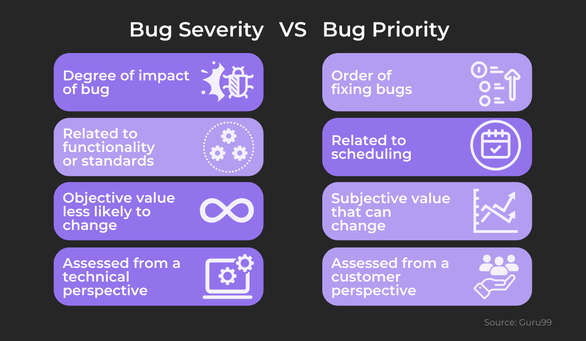
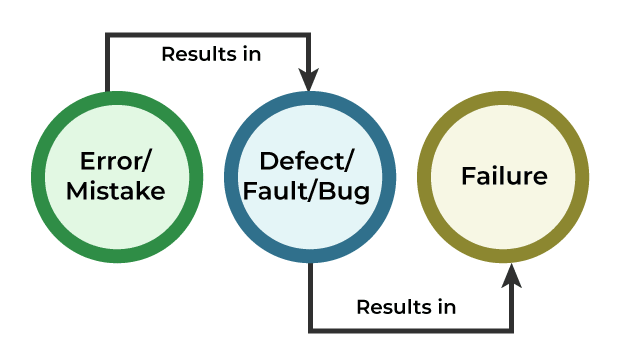
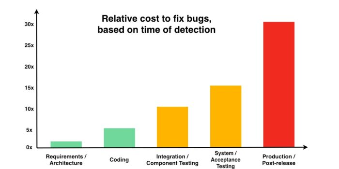
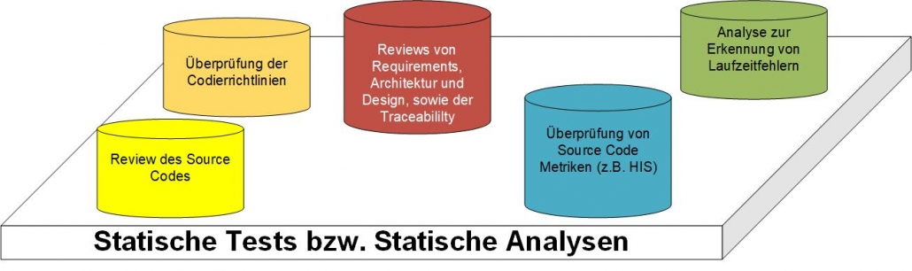
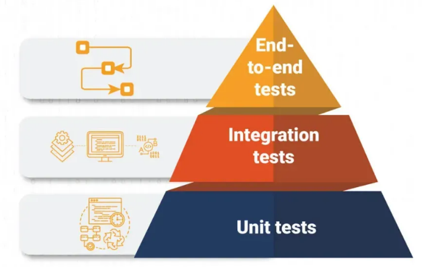

class: center, middle

## [Software Engineering](../../praesentationen.html)

#### Kapitel 10

# Softwareprüfung 

Danny Meihöfer & Bjarne Zaremba

---

# Inhalt
***

1. Bugs, Defects, Errors, Failures, etc.
2. Continuous Testing
3. Validierung vs formale Verifikation
4. Statische Tests
5. Dynamische Tests
6. Alpha- und Beta-Tests
7. A/B-Tests
8. Sicherheitstests
9. Relevante Werkzeuge für die Softwareprüfung
10. Flaky-Tests
11. Funktionsorientierte Tests
12. Strukturorientierte Tests
13. Zusammenfassung

## Was sind Softwareprüfungen?

Softwareprüfungen sind Prozesse, die die Software auf ihre Funktionalität prüfen

Funktioniert die Software **einwandfrei**?

Manuelle, oder automatisierte Prüfungen

Was wird gesucht?

- Bugs
- Issues
- Flaws
- Faults
- Failures
- Errors
- Defects

**Aber was ist das eigentlich?**

---

## Errors

Ein Error ist ein Fehler, der während der Entwicklung auftritt

**Fehler im Code**

- Syntaxfehler
- Logikfehler
- **Nicht nur Fehler die der Compiler erkennt**

Beispielsweise ein Tippfehler, oder ein Variablenname wird vertauscht

Auch **Abweichungen** von der **Spezifikation** können zu Errors führen

Errors führen zu Bugs, Defects, Failures, Crashes, etc.

---

## Bugs

Ein **Bug** ist ein **Fehler in dem System**, der zu **unerwartetem Verhalten** führt

- Resultat eines Errors

Verschiedene Arten von Fehlern können zu Bugs führen

Häufige Gründe für Bugs:

- Syntaxfehler
- Logikfehler

Bugs **können reproduziert** werden

Typen von Bugs:

- Funktionaler Bug
- Kommunikations Bug
- Fehlende Funktion
- Performance Bug
- Kompatibilitäts Bug
- Error Handling Fehler

---

## Bugs

**Szenario:** Ein Programm soll einen Button haben, der das Programm beendet

- Der Programmierer macht einen Button, der unabsichtlich das Programm nicht beendet
- Der Button **funktioniert nicht** wie erwartet (Coding Fehler)
- **Funktion ist nicht erfüllt -> Bug**

Bugs können in **Prioritäten** und **Schweregrade** eingeteilt werden

---

## Bugs



---

## Defects

Ein **Defekt** ist ein **Verhalten** der Software, das **von der Spezifikation abweicht**

- Resultat eines Errors

**Szenario:** Ein Webform soll einen Button haben, der die Eingaben des Nutzers speichert und das Programm beendet

- Der Programmierer macht zwei Buttons, einen zum Speichern und einen zum Beenden
- Die **Funktion ist erfüllt**, aber **nicht wie erwartet**

Ein Bug ist ein Defekt, aber ein **Defekt ist nicht immer ein Bug**

---

## Defects


---

## Faults

**Faults (engl. Fehler)** sind die **""Ursache""** für das Auftreten von Bugs, Defects, Failures, etc.

Zustände / Bedingungen, die zu Fehlern führen

Ein Fault kann zu einem, oder mehreren Bugs, Defects, Failures, etc. führen

**Beispielsweise:** Ein Programm erwartet eine Zahl als Eingabe, aber der Nutzer gibt einen String ein. Das führt zu einem Fehler.

- Das Programm ist nicht dazu in der Lage, mit ungültigen Eingaben umzugehen
- Der Nutzer gibt eine ungültige Eingabe(Fault)

---

## Failures

Ein **Failure / Fehlschlag** tritt auf wenn ein Bug oder Defekt zu einem **unerwarteten Verhalten für den Endnutzer** führt

Ein Fehler kann zu einem, oder mehreren Failures führen

**Szenario:** In einer Banking App soll ein Button die Überweisung starten. Der Endnutzer drückt den Button, aber es passiert nichts

- Das Programm hat versagt



---

## Issues

**Issues** sind generell Probleme, die während der Entwicklung auftreten und gelöst werden müssen

Dazu kann alles gehören, was die Entwicklung behindert

- Bugs
- Errors
- Defects
- Dokumentationsfehler
- Kommunikationsfehler
- etc.

Issues werden verwaltet, um Probleme nachzuverfolgen

Issues haben einen Lebenszyklus

- Eröffnet
- In Bearbeitung
- Geschlossen


---

## Flaws

Ein **Flaw** ist ein **Mangel im Design, in der Architektur, oder in der Implementierung**

Strukturelles Problem / Schwachstelle im Design

- Führen potentiell zu Bugs, Defects, Failures, etc.

**Szenario:** Bei einem sozialen Netzwerk wurde die Designentscheidung getroffen, dass sämtliche persönliche Daten der Nutzer standardmäßig öffentlich sind

- Kein offensichtlicher Bug, oder Fehler
- Aber dieser Flaw führt zu erheblichen Problemen
- Datenschutzverletzung
- Defekt

---

class: center, middle

# Testansätze

Wie und wann wird getestet?

Continuous Testing

Shift-Left / Right Testing

Testing in production

---

## Continuous Testing (CT)

**Kontinuierliches Testen** ist ein Ansatz, bei dem die Software **während der Entwicklung kontinuierlich (Continuous Feedbackloop) getestet** wird

**Das Ziel: Höhere Qualität und schnellere Lieferungen** durch kontinuierliches Feedback

Automatisierte Tests > Manuelle Tests

- Manuelle Tests sind zu ineffizient
- **Die Lücke zwischen Entwicklung und Release wird geschlossen**
- Tools wie Jenkins ermöglichen einbindung von CT in den Workflow

In jeder Phase des Softwareentwicklungsprozesses wird getestet

**Essentiell für CI/CD (DevOps)**

- Automatisierte Workflows -> Automatisierte Tests

---

## Continuous Testing (CT)


---

## Shift-Left Testing

**Shift Left Testing** ist ein Ansatz, bei dem die Software bereits in **frühen Phasen** des Softwareentwicklungsprozesses **getestet** wird

Früheres Testen -> Früheres Feedback und schnellere Fehlerbehebung

- Bugs und andere Fehler werden frühzeitig erkannt
- Probleme werden schnell gelöst
- Mehr kleine Tests, statt weniger große Tests
- Tests bevor die Software released wird

Kosten, Zeit und Aufwand werden gespart


---

## Shift-Right Testing

**Shift Right Testing** ist ein Ansatz, bei dem die Software in **späten Phasen** des Softwareentwicklungsprozesses **getestet** wird

Testen nach der Veröffentlichung

- Wie verhält sich die Software unter realen Bedingungen?
- Wie verhält sich die Software unter Last?
- Performance
- Zuverlässigkeit
- Sicherheit
- Verschiedene Umgebungen

Beispielmethoden: A/B Testing, Canary Testing, Blue/Green Deployment, Feature Flags

---

## Shift-Left vs. Shift-Right

Beide Ansätze haben unterschiedliche Ziele

Für gewöhnlich werden beide Ansätze kombiniert


---

## Testing in Production (TiP)

**Testing in Production** bedeutet: Die Software wird **in der Produktionsumgebung getestet**

Man kann **TIP** als Teil von **Shift-Right Testing** sehen

**Warum?**

- Es kann **schwierig** sein die **Produktionsumgebung zu simulieren**
- **Man findet nicht immer alle Bugs** und Fehler in der Testumgebung
- Trotz hohem Aufwand können Fehler in der Produktionsumgebung auftreten

In der Produktionsumgebung wird die Software unter **realen Bedingungen** getestet

- Nutzerinteraktionen
- Performance
- etc.

**Das birgt natürlich Risiken** und sollte mit **Vorsicht** durchgeführt werden**!!!**

---

## Testing Anti-Patterns

**Anti Patterns** sind **Testansätze**, die **nicht empfohlen** werden

Es gibt **keine einheitliche Definition** für Anti Patterns

- Manchmal findet einer einen Ansatz gut, den ein anderer als Anti Pattern bezeichnet

**Beispiele:**

- Keine Tests
- Unzureichende Testfallabdeckung
- Zu große Tests
- Nur Unit Tests / Nur Integration Tests
- Verteilung von Unit / Integration Tests
- Mehr Tests != Bessere Qualität

---

class: center, middle

## Validierung vs formale Verifikation

Was ist der Unterschied?

---

## Validierung vs formale Verifikation

**Validierung ist der Prozess der Überprüfung, ob das Produkt die tatsächlichen Anforderungen erfüllt**

- Erfüllt das Produkt die Anforderungen des Kunden?
- Wird das richtige Produkt entwickelt?
- Funktioniert das Produkt in der realen Welt?
- Validierung durch Ausführung
- Systemtests, Funktionstests, etc.
- Kundenperspektive

**Verifizierung ist der Prozess der Überprüfung, ob das Produkt gemäß den Spezifikationen entwickelt wurde / wird**

- Wird das Produkt richtig entwickelt?
- Wird das Produkt gemäß den Spezifikationen entwickelt?
- Inspizieren, überprüfen, überwachen, Peer Reviews
- Entwicklerperspektive

---

## Validierung vs formale Verifikation 

**V And V Model** (Verification and Validation)

- Developers Life Cycle - Testers Life Cycle


---

class: center, middle

# Statischer Test von Software

Testen ohne Ausführung

Statische Analyse und Reviews

---

## Statischer Test von Software

**ISTQB - International Software Testing Qualifications Board**

"Ein statischer Test ist eine Form der Softwareprüfung, bei der ein Softwaresystem bewertet wird, ohne dass es ausgeführt wird"

Was wird überprüft?



Wie wird das geprüft?

---

## Statische Analyse

Ein Teil des Statischen Tests ist die **statische Analyse**

Statische Analyse ist die **automatisierte** Überprüfung von Code ohne Ausführung(oder Werkzeuggestützt)

- Dadurch erkennt man:
  - Sicherheitslücken
  - Leistungsprobleme
  - Nichteinhaltung von Standards und Normen
  - Veraltete Programmierpraktiken
  - Codefehler
  - etc.

MISRA C ist ein Beispiel für einen Standard, der durch statische Analyse überprüft werden kann (Embedded Systems)

Dafür gibt es Tools wie **SonarQube**

---

## Review

Nicht alle Aspekte des Statischen Tests können automatisiert werden

Das **Review** ist eine Form des Statischen Tests, bei der das System manuell von Menschen überprüft wird

Reviews bieten eine andere Perspektive auf das System

Was wird gereviewt?

- Code Review
  - Die Analyse zeigt nicht alle Probleme im Code
- Design Review
  - Ist das Design gut?
- Requirements Review
  - Macht das System das, was es soll?
- Traceability Review
  - Kann man den Prozess der Entwicklung nachvollziehen?

Code-Reviews werden oft mit **Pull-Requests** durchgeführt

Reviewphasen: Planung, Vorbereitung, Durchführung, Nachbereitung

---

## Walkthrough

Ein **Walkthrough** ist eine Art Review, bei der der Autor des Codes das System erklärt

Teilnehmer können Mitglieder des Entwicklungsteams, oder andere Stakeholder sein

Code wird Stück für Stück erklärt

- Jeder kann Fragen stellen
- Jeder kann Probleme ansprechen
- Jeder kann Verbesserungsvorschläge machen

Das Ziel ist es, das System zu verstehen, Probleme zu finden und Feedback zu sammeln

Erfahrene Entwickler können unerfahrene Entwickler anleiten

Der Walkthrough bietet tendenziell einen informelleren Rahmen als andere Reviews

- Diskussion, Fragen, und Verbesserungsvorschläge sind erwünscht

---

## Relevante Werkzeuge

Tools für die statische Analyse:

- SonarQube
- Lint
- Checkstyle
- FindBugs
- PMD
- Cppcheck
- Kompiler

Selbst geschriebene Tools für eigene Standards

---

class: center, middle

# Dynamischer Test von Software

Testen mit Ausführung

Dynamische Testarten

---

## Dynamischer Test von Software

**ISTQB: "Prüfung des Testobjekts durch Ausführung auf einem Rechner"**

Dynamisches Testen ist der Prozess der **Überprüfung der Funktionalität** des Systems

Was wird getestet? (Funktionale Tests - Nichtfunktionale Tests)

End to End Tests - Integrationstests - Unit Tests



Was für Testarten gibt es?

---

## Black Box / White Box Testing

Es werden immer sowohl funktionale, als auch nichtfunktionale Anforderungen getestet

**White Box Testing**

- Testen mit Kenntnis der internen Struktur der Software
- Testen aus der Sicht des Entwicklers
- Neben Funktionalen Tests wird auch die interne Struktur getestet

Basis der Testpyramide (Unit Tests, Integrationstests)

**Black Box Testing**

- Testen ohne Kenntnis der internen Struktur des Systems
- Testen aus der Sicht des Endnutzers

Spitze der Testpyramide

---

## Unittest

**Unit Tests = Komponententests**

Die Funktion von einzelnen Komponenten wird getestet

- Eine Komponente ist eine Einheit, die unabhängig von anderen Einheiten funktioniert

Beispiele:

- Funktionen
- Klassen
- Module
- etc.

Unit Tests sind **automatisiert**

- Sie werden in der Regel von Entwicklern geschrieben

Es gibt verschiedene Frameworks für Unit Tests

Testfälle können selbst oder automatisch erstellt werden (Fuzzing)

---

## Wie kann ein Unit Test aussehen?


JUnit ist ein Beispiel für ein Framework für Unit Tests in Java

```java
public class Calculator {
    public int add(int a, int b) {
        return a + b;
    }
}
```

```java
public class CalculatorTest {
    
    @Test
    public void testAdd() {
        Calculator calculator = new Calculator();
        // Definierte Werte für den Test
        int a = 5;
        int b = 7;
        // Erwartetes Ergebnis
        int expectedResult = 12;
        // Aufruf der add-Methode
        int result = calculator.add(a, b);
        // Überprüfung, ob das Ergebnis stimmt
        assertEquals(expectedResult, result);
    }
}
```

---

## Integrationstest

Integrationstests testen die **Zusammenarbeit** von Komponenten

Ziel: Fehler im Zusammenspiel mehrerer Komponenten finden

- Einzelne getestete Komponenten werden zusammengefügt

- Integrationstests sind **automatisiert**

- Schnittstellentest


---

## E2E-Test

Testen einer ganzen Software von Anfang bis Ende

- Spitze der Testpyramide
- Umfassende Form von Integrationstests / Systemtests
- Endbenutzerperspektive

Wie?

- Analyse was alles getestet werden soll
- Eine Testumgebung und Daten werden erstellt um reale Bedingungen zu simulieren
- Sehr aufwendig
- Ähnlich wie bei JUnit werden erwartete Ergebnisse mit den tatsächlichen Ergebnissen verglichen


---

## Systemtest

Systemtests testen ein **System als ganzes**

- Wie arbeiten die Komponenten zusammen?
- Umfassende Form von Integrationstests
- Erste Tests aus der Sicht des Endnutzers (Black Box Testing)
  - Ausührung nach Unit und Integrationstests
  - Systemtest vor Unit und Integrationstests machen keinen Sinn

Ein System ist eine **Einheit**, die **aus mehreren Komponenten** besteht

Die Tester haben **keine Kenntnis** der **internen Struktur** des Systems

- Der Tester bewertet das System aus der **Sicht des Endnutzers**

Systemtests müssen regelmäßig ausgeführt werden um sicherzustellen, dass an einer funktionierenden Software gearbeitet wird


---

## Regressionstest

**1 Ziel:**

Regressionstests werden durchgeführt, um sicherzustellen, dass **Änderungen** an der Software **keine unerwarteten Nebenwirkungen** haben

Das bedeutet:

- Ein Test wird nach einer Änderung **wiederholt**

Eine Änderung des Codes soll nicht die Funktionalität / Zuverlässigkeit / Leistungsfähigkeit der Software beeinträchtigen

**Ziel 2:**

Regressionstests prüfen, ob eine Software immer gleich funktioniert

- Wichtig für nichtdeterministische Software
- Race Conditions
- Änderung der Umgebung
- Änderung von Abhängigkeiten

---

## Loadtest

**Loadtests** testen die **Leistungsfähigkeit** eines Systems unter **Last**

Dafür wird traffic auf das System simuliert

Worauf wird geachtet?

- Verhalten bei erwarteter Last
- Verhalten bei erhöhter Last
- Wieviele Nutzer kann das System gleichzeitig verarbeiten?
- Wieviele Anfragen kann das System verarbeiten?

Das Ziel ist die Ermittlung der Grenzen des Systems

Zu der Ermittlung der Grenzen gehören außerdem:

- Ausdaurtests
- Spike Tests
- Isolationstests

Diese Art von Tests werden gegen Ende des Entwicklungsprozesses durchgeführt

---

## Performancetest

**Performancetests** sind nicht das gleiche wie **Loadtests**

Die Priorität liegt auf der **Leistung** des Systems

Leistung bedeutet:

- Metriken wie:
  - Antwortzeit
  - Durchsatz
  - Speicherverbrauch
  - CPU-Auslastung
  - Effizienz
  - Stabilität
  - Latenz

Erkennung von **Bottlenecks**

- Welche Komponenten müssen optimiert werden?

---

## UI-Test

Bewertung der **Benutzeroberfläche**

1. Funktioniert die Benutzeroberfläche wie erwartet?
2. Ist die Benutzeroberfläche intuitiv?
3. Ist die Benutzeroberfläche ansprechend?
4. Ist die Benutzeroberfläche barrierefrei?
5. Betriebssystemunabhängigkeit

Qualitätsanalysten und UX-Designer sind für UI-Tests verantwortlich

- Sie prüfen jedes Detail der Benutzeroberfläche
- UI Tests können nicht zu 100% automatisiert werden

Funktionale Aspekte werden nicht berücksichtigt (Nur die höchste Ebene)

Ein gutes Programm kann durch eine schlechte Benutzeroberfläche ruiniert werden

---

## UI-Test Typen


---

## Mutation Testing

Beim **Mutation Testing testet man die Tests**

- Ähnelt Unit Tests (White Box Testing)

**Codemutation** = Änderung des Codes

- Statement mutation (A = B -> A = C)
- Value mutation     (A = B -> A = 0)
- Decision mutation  (A < B -> A > B)

Wie funktioniert Mutation Testing?

1. Codemutation erzeugen
2. Test ausführen
3. Ergebnis analysieren

Man erwartet, dass sich das Ergebnis des Tests ändert

- Wenn sich das **Ergebnis nicht ändert**, ist der **Test fehlerhaft**
  - Das bedeutet, dass der **Test überarbeitet** werden muss
  - Alte Ergebnisse des Tests sind nicht mehr gültig

---

## Property based test

**Property based tests** basieren auf **Eigenschaften** des Codes

Überprüfung von bestimmten Eigenschaften des Codes

Eine Beispielproperty:

- Für alle strings a, b und c, die nicht leer sind, gilt: Die Konkatenation a + b + c enthält b.

Typisches Muster:

1. for all (x, y, ...)
2. precondition of (x, y, ...)
3. property ... is true

---

class: center, middle

# Fragen?

---

class: center, middle

## Alpha and Beta Testing

---

### Alpha-Testing

**Definition und Zweck:**

- erste umfassende Testphase, bei der die Software intern von den Entwicklern getestet wird
- Fehler sollen gefunden werden, bevor die Software von externen Testern getestet wird
- Grundlegende Fehler sollen behoben werden

**Alpha-Testing im Softwareentwicklungszyklus:**

- Tests erfolgen vor Beginn der Beta-Phase → Software soll vorher auf Herz und Nieren geprüft werden
- Entwickler testen die Software und Besprechen internes Feedback
- Fokus: Sicherung der Softwarequalität und Vermeidung kritischer Fehler

**Herausforderungen:**

- Zeitaufwendig → interne Ressourcen werden benötigt
- Mangel an externem Feedback

---

**Vorteile von Alpha-Testing:**

- Identifikation grundlegender Fehler vor externem Feedback
- Höhere Wahrscheinlichkeit der Fehlerbehebung vor Start der Beta-Phase

**Zusammenfassung:**

- Alpha-Testing stellt die grundlegende Funktionsweise eines Softwareprodukts sicher
- Durch die interne Testung können Entwickler noch Fehler beheben, bevor die Software weiteren Tests unterzogen wird

---

### Beta-Testing

**Definition und Zweck:**

- Vorläufige Softwareversion wird an eine begrenzte Anzahl externer Benutzer ausgeliefert
- Benutzerfeedback sammeln
- Akzeptanz validieren
- Probleme in der “realen Welt” sollen identifiziert werden

---

**Arten des Beta-Testings:**

Offenes Beta-Testing:

- Software ist öffentlich zugänglich
- jeder Interessierte kann am Beta-Testing teilnehmen

   → breite Abdeckung von Benutzerperspektiven

Geschlossenes Beta-Testing:

- nur ausgewählte Benutzer erhalten Zugriff
- spezifische Testgruppe

    → gezielteres Feedback von einzelnen Benutzergruppen möglich

weitere Testarten:

- Gezielte Betatests → Testen von bestimmten Komponenten der Software
- Technische Betatests
- Betatests nach der Veröffentlichung

---

**Beta-Testing im Softwareentwicklungszyklus:**

- Bindeglied zwischen der internen Testung (Alphatests) und der Markteinführung
- Leistungsfähigkeit und Benutzerfreundlichkeit wird von realen Benutzern getestet
- durch echtes Benutzerfeedback können Entwickler die Software noch besser optimieren

**Beispiel für Betatests: Microsoft-Windows-Insider-Program:**

- Registrierung/Bewerbung bei Microsoft (halboffener Betatest)
- Vorabzugriff auf neue Versionen des Windows-Betriebssystems

     → wertvolles Feedback für Microsoft vor offizieller Markteinführung der neuen Version

**Vorteile von Beta-Testing:**

- Vielfältiges Feedback → Unterschiedliche Benutzerperspektiven
- Benutzerakzeptanz → kann nur schlecht in Alpha-Tests simuliert werden
- Fehlerbehebung → Identifikation von Fehlern, die in der Alpha-Phase nicht gefunden wurden

---

### Zusammenfassung Alpha- und Betatests


Abb.1: Entwicklungsphasen eines Softwareproduktes

- Alpha-Tests werden intern durchgeführt → Sicherstellung, dass Software grundlegend funktioniert
- Beta-Tests werden ausgewählten (geschlossener Betatest) oder allen Benutzern (offener Betatest) zur Verfügung gestellt

       → echtes Benutzerfeedback durch Tests in der realen Welt

---

### A/B-Tests (auch bekannt: Split-Testing)


Abb.2: Funktionweise von A/B-Testing

---

**Definition und Zweck:**

- Methode, bei der zwei oder mehr Varianten eines Softwareprodukts (z.B. Website, App, …) erstellt und gleichzeitig getestet werden
    
    → Welche Variante des Produkts liefert bessere Ergebnisse?
    
- Treffen von datengesteuerten Entscheidungen um Benutzererfahrung zu verbessern und geschäftliche Ziele zu erreichen

**Vorgehensweise im A/B-Testing:**

- Identifikation des Ziels: Was soll getestet/verbessert werden?
- Unterteilung der Zielgruppe: Zielgruppe soll in sinnvolle Teile geteilt werden
- Erstellung von Varianten: Entwicklung von Version A und Version B
- Zufällige Zuweisung der Varianten zu den Zielgruppen
- Auswertung der Testdaten: Welche Variante hat bessere Daten im Hinblick auf das Ziel geliefert?

---

**Fiktives Beispiel: Amazon:**

- Amazon testet die Wirkung einer Farbveränderung des “Sofortkaufen”-Buttons, um festzustellen, ob eine andere Farbe das Nutzerverhalten verbessert

**Vorteile von A/B-Tests:**

- Datengestützte Entscheidungen: Keine Annahmen, sondern Entscheidungen basieren auf Daten
- Kontinuierliche Verbesserung: A/B-Tests sind iterativ (können immer wieder durchgeführt werden) → ständige Optimierung

---
class: center, middle

## Sicherheitstests

---

### Sicherheitslücke vs. Schwachstelle

**Sicherheitslücke:**

- Schwachstelle im System, die von Angreifern ausgenutzt werden kann, um unbefugten Zugriff zu erlangen
- resultiert aus Kombination aus Fehlern und unzulässigen Sicherheitsvorkehrungen
- Schließung der Sicherheitslücke erfordert konkrete Maßnahme

**Schwachstelle:**

- allgemeine Bezeichnung für eine Unsicherheit im System, die zu einer Sicherheitslücke führen kann
- Schwäche oder Fehler, der nicht beabsichtigt war
- Verschiedene Formen: Designschwächen, Implementierungsfehler, menschliche Fehler

→ Schwachstelle ist allgemeine Definition für eine Unsicherheit im System, Sicherheitslücke ist eine konkret ausgenutzte Schwachstelle. 

---

### Penetrationstest (kurz Pentest oder Ethical Hacking)

**Definition und Ziel:**

- autorisierte, aggressive Methode, die einen Hackerangriff auf ein System simuliert
- dient zur Bewertung der Sicherheit eines Systems
- Verwendung von Methoden, die auch von echten Hackern genutzt werden
- Ziel: Identifikation von Sicherheitslücken, bevor diese von echten Hackern gefunden werden

**Relevanz und Notwendigkeit:**

- Penetrationstest entscheidend, um Angriffsfläche von Software zu minimieren
- Regulatorische Anforderungen und Kundenvertrauen sind Gründe, um Pentests durchzuführen

---

**Tools und Techniken:**

- Social Engineering → Informationserhalt durch soziale Interaktion mit den Benutzern der Anwendung
- Exploitation von Software-Schwachstellen → Ausnutzen von Schwachstellen in der Software, um unbefugten Zugriff zu erlangen
- Password-Cracking → Systematisches Ausprobieren oder Anwenden von Techniken (z.B. Brute-Force), um Zugriff zum System zu erlangen

**Risiken, Rechtliches und Ethik:**

- Unzureichende Planung kann zu Systemausfällen kommen → Datenverluste
- Klare ethische Richtlinie erforderlich → Kein Überschreiten von rechtlichen und moralischen Grenzen

---

### **Static Application Security Testing (SAST) (Statische Codeanalyse)**

**Definition und Ziel:**

- Methode zur Identifikation von Sicherheitslücken im Quellcode der Anwendung → noch vor dem Kompilieren des Codes
- Schwachstellen und Risiken sollen möglichst früh erkannt werden
- bereits Code in einer sehr frühen Entwicklungsphase kann so auf Sicherheitslücken untersucht werden
- Code wird automatisiert durch Tool analysiert

**Mögliche Schwachstellen, die mit SAST gefunden werden können:**

- Cross-Site-Scripting
- SQL-Injection
- Buffer Overflow
- unsichere API-Aufrufe

---

**Vorteile von SAST:**

- Frühe Erkennung → Schwachstellen können bereits in der Entwicklungsphase erkannt und direkt behoben werden
- Integration in den Entwicklungsprozess → Sicherheit wird zu integralem Bestandteil der Softwareentwicklung
- Codequalität → SAST verbessert nicht nur die Sicherheit, sondern auch die Qualität des Codes

---

### **Dynamic Application Security Testing (DAST) (Dynamische Codeanalyse)**

**Definition und Ziel:** 

- Verfahren (Penetrationstest), der eine Anwendung während des aktiv-laufenden Prozesses untersucht (dynamisch)
- Simulation von realen Angriffsszenarien
- benötigt keinen Zugriff auf den Quellcode der Anwendung (im Gegensatz zu SAST)
- Anwendung wird “von Außen” bewertet → sehr realitätsnah

**Vorteile von DAST:**

- Realitätsnahe Tests → es wird in der tatsächlichen Umgebung getestet
- Schnelle Implementierung → DAST benötigt keinen Zugriff auf den Quellcode
- Integration in den Entwicklungsprozess → kann in den CI/CD-Prozess integriert werden
- Rate der falschpositiven Ergebnisse ist sehr gering
- kann während der Entwicklung, aber auch danach weiter genutzt werden

---

**Nachteile von DAST:**

- Skalierbarkeit → da DAST auf spezielle Angriffe eingerichtet wird, können die Tests nur von Sicherheitsexperten angepasst werden
- Langsam → DAST-Tools brauchen meistens 5-7 Tage
- Spät im Lebenszyklus → können erst bei lauffähiger Version der Anwendung eingesetzt werden (im Gegensatz zu SAST)
- Basiert auf bekannten Fehlern → neuartige Fehler werden erst spät erkannt

---
class: center, middle

## Relevante Werkzeuge

---

### Testautomatisierung

**Definition und Ziel:**

- Einsatz von Softwarewerkzeugen, um Testfälle automatisch auszuführen und Ergebnisse mit erwarteten Ergebnissen zu vergleichen
- Manueller Testaufwand wird reduziert → Ressourcen können anderweitig eingesetzt werden

**Vorteile von Testautomatisierung:**

- Effizienzsteigerung
- Wiederholbarkeit → Tests können immer wieder durchgeführt werden und müssen nicht manuell jedes Mal neu getestet werden

---

**Relevante Tools:**

Selenium:

- Open-Source-Framework zum Testen von Webanwendungen
- Automatisierung von Klicken, Navigieren und Formularausfüllen
- in vielen Sprachen unterstützt (Java, Python, C#, …)

Appium:

- Testautomatisierung für mobile Anwendungen
- “Selenium für Apps”
- Automatisierung von Touch-Gesten und Bildschirmnavigation

JUnit:

- Testen von Java-Anwendungen
- Automatisierung von Unit-Tests, Integrationstests und funktionalen Tests

pytest:

- Framework für Python
- Akzeptanztestgetriebene Entwicklung (ATDD)

---

### Test-Data-Generation

**Definition und Ziel:**

- Erstellung von realistischen Testdaten zum Gebrauch in Testumgebungen
- Realistische Testdaten sind wichtig, damit die Software unter verschiedenen Bedingungen funktioniert

---

**Tools zur automatisierten Erstellung von Testdaten:**

Mockaroo:

- Generierung von großen Mengen an Daten
- umfangreiche Liste von Datentypen bereits vorhanden (Namen, Adressen, komplexe JSON-Objekte)
- Skalierbarkeit → große Mengen an Daten können schnell generiert werden
- Daten können einfach in verschiedene Formate exportiert werden

Faker:

- Bibliothek für Python, mit der einfache Testdaten (Passwörter, Emails, …) generiert werden können
- Java-Äquivalent: JavaFaker

---

## Flaky-Tests

**Definition:**
- Flaky-Tests sind zufällig fehlgeschlagene Tests
- Flaky-Tests liefern bei gleichen Bedingungen (keine Änderungen am Code) unterschiedliche Ergebnisse

**Warum entstehen Flaky-Tests?**
- zufällige Verzögerungen
- Nebeneffekte von vorherigen Tests
- keine Wartezeiten in der Testautomatisierung

---

**Auswirkungen auf die Testumgebung:**
- Konsequenzen → Testautomatisierung unzuverlässig → Entwickler vertrauen den Tests nicht mehr
- Zeitverlust → Entwickler müssen die Ursachen des Fehlschlagens der Tests finden

**Vermeidung des Auftretens von Flaky-Tests:**
- Stabile Testumgebung → Klare Zustände, Minimierung von Nebeneffekten
- Korrekte Wartezeiten → Realistische Wartezeiten, Keine “harten” Wartezeiten
- Testisolierung → Testdaten separieren, Unabhängigkeit zwischen den Tests
- Automatisierte Testwiederholung einrichten

---
class: center, middle

## Funktionsorientierter Test (Black-Box-Test)

---

**Definition:**

- Testverfahren, bei dem Testfälle nur über die Spezifikation der Software erstellt werden
- innere Struktur (Code und Architektur) bleiben unbeachtet → Black-Box
- Fokus auf dem Verhalten der Software nach außen

**Ziel:**

- Aufdecken von Implementierungslücken → prüft das, was in der Spezifikation angegeben wird
- Blackbox-Tests belegen die mögliche Wahrscheinlichkeit von Fehlern

**Nachteile von Black-Box-Tests:**

- Aufwendige Testfallableitung → Testfälle müssen aus einer informellen Spezifikation abgeleitet werden
- Begrenzte Systemabdeckung → Nur die Teile, die in der Spezifikation erwähnt werden, werden auch getestet
- Keine Garantie für Fehlerfreiheit

---
class: center, middle

### Verfahren zur Testfallermittlung

---

**Äquivalenzklassenbildung:**

- Eingabewerte werden in Gruppen unterteilt
- Voraussetzung: Alle Werte einer Gruppe verhalten sich gleich
- Effiziente Testfallerstellung

**Vorgehensweise:**

- Identifikation relevanter Äquivalentklassen → Gemeinsamkeiten zwischen den möglichen Eingabewerten identifizieren
- Auswahl von repräsentativen Werten für jede Äquivalenzklasse → Ein Testfall pro Wert aus jeder Äquivalenzklasse

Beispiel: Eingabefeld für eine Altersüberprüfung

- Spezifische Aktionen, je nach Alter des Benutzers
- Äquivalentklassen:
    - Benutzer unter 18 Jahre (Mindestalter)
    - Benutzer im Alter von 18 bis 65 Jahren (Standardalter)
    - Benutzer über 65 Jahre (Seniorenalter)

---

**Grenzwertanalyse:**

- Testfälle sollen speziell an den Grenzen der Eingabedaten erstellt werden
    
    → Fehler treten häufig in diesen kritischen Bereichen auf
    
- Grenzwerte liegen an den Rändern der zuvor gebildeten Äquivalenzklassen
- auf Basis der Grenzwerte werden dann Testfälle erstellt

Beispiel: Mindestalter für die Nutzung einer Anwendung

- Software erfordert, dass Benutzer mindestens 18 Jahre alt sein muss
- Grenzwerte: 17 Jahre (fehlschlagender Test), 18 Jahre (erfolgreicher Test), 19 Jahre (erfolgreicher Test)

→ Durch Grenzwertanalyse wird sichergestellt, dass die Software auch in kritischen Bereichen richtig funktioniert.

---
class: center, middle

## Strukturorientierter Test (White-Box-Test)

---

**Definition:**

- Test, bei dem die innere Struktur einer Software analysiert wird (im Gegensatz zum Black-Box-Test)
- Interner Code und Softwarearchitektur wird berücksichtigt
- Sicherstellung, dass alle Anweisungen im Code funktionieren

**Vorteile:**

- Frühe Fehlererkennung
- Maximale Codeabdeckung
- Transparente Fehleranalyse

**Nachteile:**

- Aufwendige Durchführung
- Abhängig von der Codequalität
- Benutzererwartung wird nicht berücksichtigt

---

### Verfahren zur Testfallermittlung

**Statement-Coverage:**

- Sicherstellung, dass jede Anweisung im Code mindestens einmal ausgeführt wird
- Testfälle stellen sicher, dass jede Anweisung aufgerufen wird
- Beispiel: Angenommen, es gibt eine Funktion mit drei Zeilen Code. Ein Testfall wird erstellt, um sicherzustellen, dass jede dieser Zeilen mindestens einmal während des Tests ausgeführt wird.

**Branch-Coverage:**

- Stellt sicher, dass alle Entscheidungspunkte/Abzweigungen im Code durchlaufen werden
- Testfälle werden so entwickelt, dass alle Entscheidungspunkte einmal durchlaufen werden
- Beispiel: Eine Funktion enthält eine if-else-Anweisung. Testfälle werden erstellt, um sicherzustellen, dass sowohl der Zweig innerhalb der if-Anweisung als auch der Zweig innerhalb der else-Anweisung durchlaufen werden.

---

**Path-Coverage:**

- anspruchsvoller als Branch-Coverage
- stellt sicher, dass alle möglichen Pfade im Code durchlaufen werden
- Alle Kombinationen von Anweisungen und Verzweigungen werden getestet
- Beispiel: Eine komplexe Funktion hat verschiedene Pfade, abhängig von den Eingabeparametern. Testfälle werden entwickelt, um sicherzustellen, dass jeder mögliche Pfad durchlaufen wird.

**Condition-Coverage:**

- jeder logische Ausdruck im Code wird betrachtet
- jeder Ausdruck wird sowohl mit falsch als auch mit wahr getestet
- Beispiel: In einer Funktion gibt es eine logische Bedingung. Testfälle werden erstellt, um sicherzustellen, dass diese Bedingung sowohl als wahr als auch als falsch getestet wird.

---

class: center, middle

# Fragen?

---

## Zusammenfassung 1

- Softwareprüfungen sind Prozesse, die die Software auf ihre funktionalen und nichtfunktionalen Anforderungen prüfen

- Bugs, Defects, Errors, Failures, etc. sind verschiedene Arten von Fehlern, die zu Problemen führen können

- Continuous Testing ist ein Ansatz, bei dem die Software während der Entwicklung kontinuierlich getestet wird

- Anti Patterns sind Testansätze, die nicht empfohlen werden

- Statische Tests sind Tests ohne Ausführung
  - Dabei wird die Software analysiert und gereviewt
  
- Dynamische Tests sind Tests mit Ausführung
  - Die Testpyramide zeigt die verschiedenen Arten von dynamischen Tests
  - Die wichtigsten sind Unit Tests, Integrationstests und E2E Tests

---

## Zusammenfassung 2

- Alpha-Tests: Interne, erste umfassende Testphase
- Beta-Tests: Auslieferung einer vorläufigen Version an externe Benutzer
- A/B-Tests: Testen von Varianten für datengestützte Entscheidungen
- Sicherheitstest
    - Penetrationstests: Simuliert autorisierte Hackerangriffe
    - SAST: Identifikation von Sicherheitslücken im Quellcode vor dem Kompilieren
    - DAST: Simuliert Angriffe während des laufenden Prozesses
- Black-Box-Tests: Testverfahren ohne Kenntnis der inneren Struktur
- White-Box-Tests: Testverfahren mit Kenntnis der inneren Struktur

---

# Quellen 1
***

- https://www.geeksforgeeks.org/software-testing-bug-vs-defect-vs-error-vs-fault-vs-failure/
- https://farhan-labib.medium.com/the-confusion-error-vs-fault-vs-bug-vs-defect-vs-failure-c557af04726b
- https://www.browserstack.com/guide/difference-between-bugs-and-errors#:~:text=A%20bug%20is%20a%20specific,types%20of%20requests%20or%20challenges
- https://www.shakebugs.com/blog/bug-priority-vs-severity/
- https://www.synopsys.com/glossary/what-is-continuous-testing.html#:~:text=Continuous%20testing%20(CT)%20is%20a,higher%2Dquality%20and%20faster%20deliveries.
- https://www.browserstack.com/guide/shift-left-vs-shift-right
- https://www.dynatrace.com/news/blog/what-is-shift-left-and-what-is-shift-right/#&gid=0&pid=1
- https://www.optimizely.com/de/optimization-glossary/testing-in-production/

---

# Quellen 2

- https://blog.codepipes.com/testing/software-testing-antipatterns.html#anti-pattern-1---having-unit-tests-without-integration-tests
- https://www.fierceelectronics.com/components/verification-and-validation-upping-your-quality-management-game
- https://www.technolush.com/blog/verification-validation-model
- https://www.german-testing-board.info/lehrplaene/istqbr-certified-tester-schema/glossar/
- https://heicon-ulm.de/wp-content/uploads/2020/06/Statische_Tests_versus_Dynamische_Tests_deu-1-1030x306.jpg
- https://heicon-ulm.de/statische-analyse-und-dynamischer-test-wo-liegen-die-staerken-und-schwaechen/
- https://martinfowler.com/articles/practical-test-pyramid.html
- https://www.headspin.io/blog/the-testing-pyramid-simplified-for-one-and-all

---

# Quellen 3

- https://www.johner-institut.de/blog/iec-62304-medizinische-software/integrationstests-und-strategie/#:~:text=Was%20sind%20Integrationstests%3F&text=Integrationstests%20sind%20in%20der%20Software,eines%20Software%2DSystems%20zu%20finden.
- https://www.johner-institut.de/blog/iec-62304-medizinische-software/regressionstest/#:~:text=Unter%20einem%20Regressionstest%20verstehen%20Software,%C3%84nderung%20noch%20immer%20erfolgreich%20durchl%C3%A4uft.
- https://www.zaptest.com/de/was-sind-lasttests-ein-tiefer-einblick-in-die-arten-praktiken-werkzeuge-herausforderungen-und-mehr
- https://blog.postman.com/performance-testing-vs-load-testing-vs-stress-testing/#:~:text=Load%20testing%20focuses%20on%20the,the%20system%20handles%20regular%20activity.
- https://www.resonio.de/marktforschung/ui-tests-gui-tests/#:~:text=UI%2DTests%20oder%20GUI%2DTests,Software%20oder%20Website%20zu%20verbessern.
- https://www.techtarget.com/searchitoperations/definition/mutation-testing
- https://medium.com/criteo-engineering/introduction-to-property-based-testing-f5236229d237

---

# Quellen 4
***

- [https://www.guru99.com/de/alpha-beta-testing-demystified.html](https://www.guru99.com/de/alpha-beta-testing-demystified.html) [letzte Einsicht: 05.12.23]
- [https://www.seo-analyse.com/seo-lexikon/e/entwicklungsstadium](https://www.seo-analyse.com/seo-lexikon/e/entwicklungsstadium) [letzte Einsicht: 05.12.23]
- [https://de.wikipedia.org/wiki/Betatest](https://de.wikipedia.org/wiki/Betatest) [letzte Einsicht: 05.12.23]
- [https://www.computerweekly.com/de/definition/Betatest](https://www.computerweekly.com/de/definition/Betatest) [letzte Einsicht: 05.12.23]
- [https://www.zaptest.com/de/beta-tests-was-es-ist-arten-prozesse-ansaetze-tools-im-vergleich-zu-alpha-tests-und-mehr](https://www.zaptest.com/de/beta-tests-was-es-ist-arten-prozesse-ansaetze-tools-im-vergleich-zu-alpha-tests-und-mehr) [letzte Einsicht: 05.12.23]
- [https://www.optimizely.com/de/optimization-glossary/ab-testing/](https://www.optimizely.com/de/optimization-glossary/ab-testing/) [letzte Einsicht: 05.12.23]
- [https://gruenderplattform.de/unternehmensfuehrung/ab-testing](https://gruenderplattform.de/unternehmensfuehrung/ab-testing) [letzte Einsicht: 05.12.23]
- Beispiel wurden mithilfe von ChatGPT-3.5 erstellt: [https://chat.openai.com/](https://chat.openai.com/)
- [https://www.pcspezialist.de/blog/2021/02/05/schwachstellen/](https://www.pcspezialist.de/blog/2021/02/05/schwachstellen/) [letzte Einsicht: 05.12.23]
- [https://www.security-insider.de/was-ist-eine-sicherheitsluecke-a-648842](https://www.security-insider.de/was-ist-eine-sicherheitsluecke-a-648842) [letzte Einsicht: 05.12.23]

---

# Quellen 5

- [https://it-service.network/it-lexikon/penetrationstest](https://it-service.network/it-lexikon/penetrationstest) [letzte Einsicht: 05.12.23]
- [https://www.security-insider.de/was-ist-ein-penetrationstest-a-667683/](https://www.security-insider.de/was-ist-ein-penetrationstest-a-667683/) [letzte Einsicht: 05.12.23]
- [https://www.synopsys.com/glossary/what-is-sast.html](https://www.synopsys.com/glossary/what-is-sast.html) [letzte Einsicht: 05.12.23]
- [https://www.secodis.com/statisches-application-security-testing-sast/](https://www.secodis.com/statisches-application-security-testing-sast/) [letzte Einsicht: 05.12.23]
- [https://en.wikipedia.org/wiki/Dynamic_application_security_testing](https://en.wikipedia.org/wiki/Dynamic_application_security_testing) [letzte Einsicht: 05.12.23]
- [https://www.rapid7.com/de/cybersecurity-grundlagen/dast](https://www.rapid7.com/de/cybersecurity-grundlagen/dast) [letzte Einsicht: 05.12.23]
- [https://www.dev-insider.de/was-ist-dast-a-517156f0cc989cb6ce982ab2435c2150/](https://www.dev-insider.de/was-ist-dast-a-517156f0cc989cb6ce982ab2435c2150/) [letzte Einsicht: 05.12.23]
- [https://q-centric.com/blogs/die-besten-tools-fuer-die-testautomatisierung-2021](https://q-centric.com/blogs/die-besten-tools-fuer-die-testautomatisierung-2021) [letzte Einsicht: 06.12.23]
- [https://www.testautomatisierung.org/lexikon/selenium/](https://www.testautomatisierung.org/lexikon/selenium/) [letzte Einsicht: 06.12.23]
- [https://www.testautomatisierung.org/lexikon/appium/](https://www.testautomatisierung.org/lexikon/appium/) [letzte Einsicht: 06.12.23]
- [https://testsigma.com/blog/test-data-generation-tools/](https://testsigma.com/blog/test-data-generation-tools/) [letzte Einsicht: 06.12.23]

---

# Quellen 6

- [https://sonery.medium.com/generate-mock-data-of-any-format-with-mockaroo-9345facabc1e](https://sonery.medium.com/generate-mock-data-of-any-format-with-mockaroo-9345facabc1e) [letzte Einsicht: 07.12.23]
- [https://faker.readthedocs.io/en/master/](https://faker.readthedocs.io/en/master/) [letzte Einsicht: 07.12.23]
- [https://www.jetbrains.com/de-de/teamcity/ci-cd-guide/concepts/flaky-tests](https://www.jetbrains.com/de-de/teamcity/ci-cd-guide/concepts/flaky-tests) [letzte Einsicht: 08.12.23]
- [https://www.datadoghq.com/knowledge-center/flaky-tests/](https://www.datadoghq.com/knowledge-center/flaky-tests/) [letzte Einsicht: 08.12.23]
- [https://www.software-testing.academy/black-box-test.html](https://www.software-testing.academy/black-box-test.html) [letzte Einsicht: 08.12.23]
- [https://blog.milsystems.de/2012/03/durchfuehrung-von-aequivalenzklassentest-und-grenzwertanalyse-nach-istqb-teil-1/](https://blog.milsystems.de/2012/03/durchfuehrung-von-aequivalenzklassentest-und-grenzwertanalyse-nach-istqb-teil-1/) [letzte Einsicht: 08.12.23]
- [https://de.wikipedia.org/wiki/Dynamisches_Software-Testverfahren](https://de.wikipedia.org/wiki/Dynamisches_Software-Testverfahren) [letzte Einsicht: 08.12.23]
- [https://expleoacademy.com/dach/service/glossar/erklaerung/grenzwertanalyse](https://expleoacademy.com/dach/service/glossar/erklaerung/grenzwertanalyse) [letzte Einsicht: 08.12.23]
- [https://www.pw-akademie.eu/glossar/grenzwertanalyse/](https://www.pw-akademie.eu/glossar/grenzwertanalyse/) [letzte Einsicht: 08.12.23]
- [https://aqua-cloud.io/de/what-is-white-box-testing/](https://aqua-cloud.io/de/what-is-white-box-testing/) [letzte Einsicht: 08.12.23]

---

# Quellen 7

- [https://www.zaptest.com/de/white-box-tests-was-es-ist-wie-es-funktioniert-herausforderungen-metriken-tools-und-mehr](https://www.zaptest.com/de/white-box-tests-was-es-ist-wie-es-funktioniert-herausforderungen-metriken-tools-und-mehr) [letzte Einsicht: 08.12.23]
- [https://www.zyxware.com/articles/4161/what-is-statement-coverage-in-testing](https://www.zyxware.com/articles/4161/what-is-statement-coverage-in-testing) [letzte Einsicht: 08.12.23]


---

# Abbildungen

Abbildungen vor Alpha und Beta Testing:

- https://www.dynatrace.com/news/blog/what-is-shift-left-and-what-is-shift-right/#&gid=0&pid=1
- https://www.shakebugs.com/blog/bug-priority-vs-severity/
- https://heicon-ulm.de/wp-content/uploads/2020/06/Statische_Tests_versus_Dynamische_Tests_deu-1-1030x306.jpg
- https://martinfowler.com/articles/practical-test-pyramid.html
- https://www.headspin.io/blog/the-testing-pyramid-simplified-for-one-and-all
- https://www.synopsys.com/glossary/what-is-continuous-testing.html#:~:text=Continuous%20testing%20(CT)%20is%20a,higher%2Dquality%20and%20faster%20deliveries
- https://farhan-labib.medium.com/the-confusion-error-vs-fault-vs-bug-vs-defect-vs-failure-c557af04726b

---

# Abbildungen 2

- Abb.1: [https://t2informatik.de/wissen-kompakt/alpha-version/](https://t2informatik.de/wissen-kompakt/alpha-version/) [letzte Einsicht: 05.12.23]
- Abb.2: [https://cxl.com/blog/ab-testing-guide/](https://cxl.com/blog/ab-testing-guide/) [letzte Einsicht: 05.12.23]
