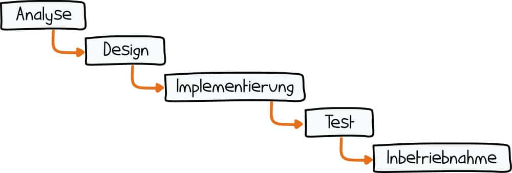
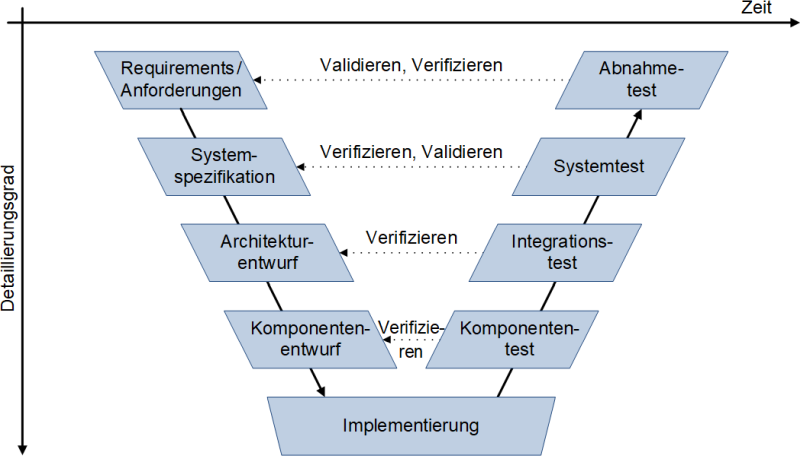
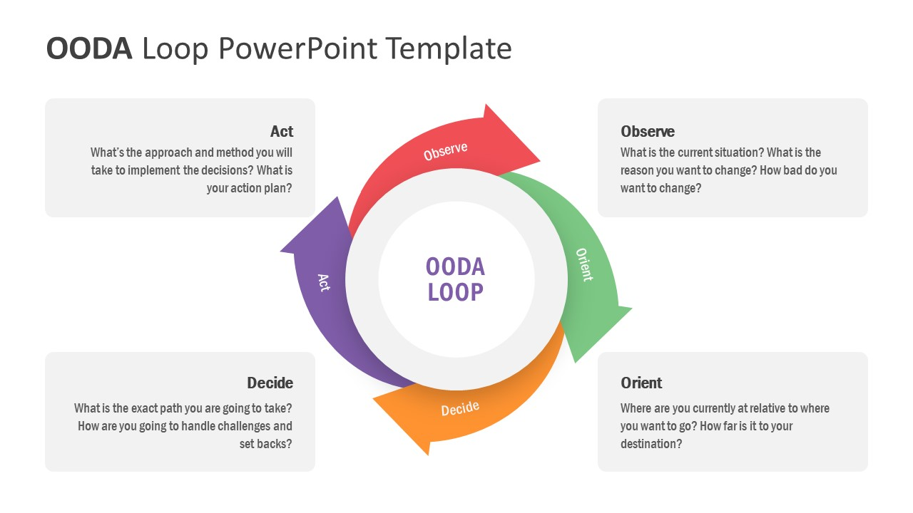
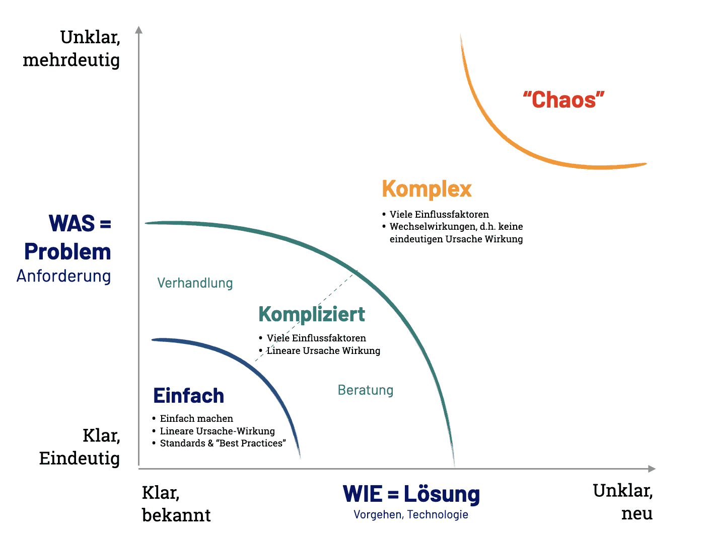
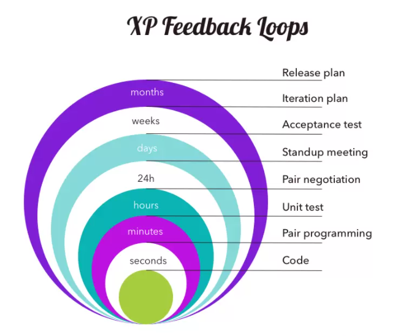
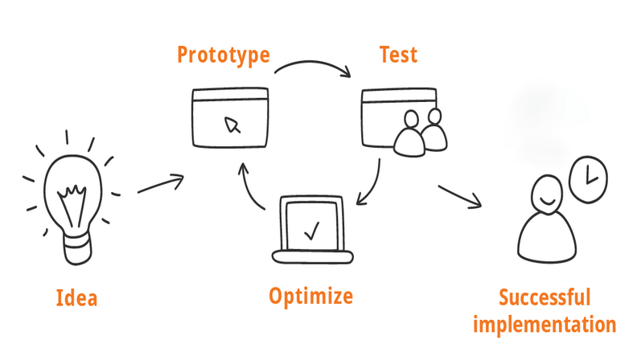

# Softwaredevelopment Lifecycle

**Autoren:** Danny Meihöfer & Bjarne Zaremba

Lernziele für dieses Kapitel:

- Was ist der Softwaredevelopment Lifecycle?
- Klassische (sequentielle) Modelle
- Agile Modelle
- Evolutionäre Modelle
- Vor- und Nachteile

# Was ist der Softwaredevelopment Lifeycle?

Die Softwareentwicklung ist ein iterativer Prozess der aus mehreren Phasen besteht. Die einzelnen Phasen werden hintereinander wie ein Zyklus durchlaufen. Der Softwaredevelopment Lifecycle (SDLC) beschreibt diesen Prozess. Neben der Erstellung eines Systems gehört auch die anschließende Wartung dazu.

## Phasen im Softwarelebenszyklus

Auf der Abbildung sieht man die typischen Phasen, die eine Software im SDLC durchläuft. Je nach Modell können die Phasen variieren und sich in den Abfolgen unterscheiden. 

Beim Planning werden die Anforderungen an das System definiert. Dazu gehören die Anforderungen an die Software, die Hardware und die Benutzeroberfläche. Außerdem werden die Kosten und der Zeitplan festgelegt.

Die Analysis Phase beschäftigt sich mit der Analyse der Anforderungen. Dazu gehören die Analyse der Benutzer, der Software und der Hardware. Außerdem werden die Anforderungen an die Software spezifiziert.

In der Design Phase wird die Softwarearchitektur entworfen. Dazu gehören die Datenstrukturen, die Softwarearchitektur und die Algorithmen. Außerdem wird die Benutzeroberfläche entworfen.

In der Implementation Phase wird die Software implementiert. Dazu gehören die Implementierung der Datenstrukturen, der Softwarearchitektur und der Algorithmen. Außerdem wird die Benutzeroberfläche implementiert.

In der Testing Phase wird die Software getestet. Dazu gehören die Unit Tests, die Integration Tests und die System Tests. Außerdem wird die Benutzeroberfläche getestet.

In der Deployment Phase wird die Software ausgeliefert. Dazu gehört die Installation der Software und die Schulung der Benutzer.

In der Maintenance Phase wird die Software gewartet. Dazu gehören die Fehlerbehebung, die Anpassung an neue Anforderungen und die Anpassung an neue Hardware.

Im Folgenden werden ein paar unterschiedliche Modelle näher erklärt.

## Klassische (sequentielle) Modelle

In den klassischen Modellenwerden die verschiedenen Phasen sequentiell (linear) durchlaufen. Die Phasen bauen aufeinander auf und jede Phase hat spezifische Ziele, die erreicht werden müssen, bevor die nächste Phase beginnen kann. Die klassischen Modelle sind sehr vorhersehbar und werden deshalb häufig in der Industrie verwendet. Eine Phase wird erst abgeschlossen, wenn alle Ziele erreicht wurden und auch erst dann kann die nächste Phase beginnen.

Die zwei bekanntesten klassischen Modelle sind das Wasserfallmodell und das V-Modell.

### Wasserfallmodell

Typisch für klassische Modelle ist der Ablauf der Phasen beim Wasserfallmodell linear. Die Phasen sind fest definiert und werden nacheinander durchlaufen. Phase 1 -> Phase 2 -> Phase 3 und so weiter. Die Phasen sind abgeschlossen und es gibt keine Rückkopplung. Das Wasserfallmodell ist sehr vorhersehbar und wird deshalb häufig in der Industrie verwendet. Auf der Abbildung kann man die gängige Abfolge der Phasen sehen.

Das Wasserfallmodell eignet sich besonders gut, wenn die Anforderung für das System klar definiert sind und sich voraussichtlich auch nicht mehr ändern. Dazu gehört auch, dass die Technologie die für das Projekt benötigt wird bekannt ist und dass sie im Vergleich zu neuer Software wenig Risiken birgt. Manchmal gibt es auch genaue Vorgaben für den Ablauf der Softwareentwicklung.

### V-Modell

Das V-Modell ähnelt stark dem Wasserfallmodell. Der Unterschied liegt hier dabei, die Phasen sich teilweise gegenseitig beeinflussen. 

Die linke Seite des V-Modells zeigt die anfänglichen Phasen der Entwicklung, von der Spezifikation bis zur Implementation. Die Rechte Seite des V-Modells zeigt die Phasen der Qualitätssicherung, von der Unit Tests bis zum System Test. Die Phasen der linken Seite werden mit den Phasen der rechten Seite verknüpft. Obwohl es eine Verknüpfung zwischen den Phasen gibt, werden die Phasen trotzdem sequentiell durchlaufen. Die Phasen der linken Seite werden abgeschlossen, bevor die Phasen der rechten Seite beginnen.

Das V-Modell ist in ähnlichen Situationen wie das Wasserfallmodell nützlich. 

## Agile Modelle

Agile Modelle sind im Gegensatz zu den klassischen Modellen iterativ. Das bedeutet, dass die Phasen nicht sequentiell durchlaufen werden, sondern dass die Phasen sich wiederholen. Die Phasen werden in kurzen Zyklen durchlaufen. Eine Phase gilt hier nicht als abgeschlossen nachdem sie einmal durchlaufen wurde und manchmal können sich die Phasen auch überschneiden. 

### PDCA-Zyklus

Der PDCA-Zyklus ist ein iteratives Modell, das in der Industrie häufig verwendet wird. Der PDCA-Zyklus besteht aus vier Phasen: Plan, Do, Check und Act. Die Phasen werden in kurzen Zyklen durchlaufen. Walter A. Shewhart hat dieses Modell 1930 entwickelt, um die Qualität von Produkten zu verbessern. 

In der Planphase werden die Ziele festgelegt und die Prozesse geplant. In der Do-Phase werden die Prozesse ausgeführt. In der Check-Phase werden die Ergebnisse der Do-Phase überprüft. In der Act-Phase werden die Ergebnisse der Check-Phase analysiert und die Prozesse verbessert.

Diese Phasen werden immer wieder durchlaufen, eine nach der anderen.

### OODA-Loop

Der OODA-Loop ist ein iteratives Modell, das dem PDCA-Zyklus ähnelt. Die Phasen sind hier nicht ganz gleich, aber die Idee ist die gleiche. Der OODA-Loop besteht aus den vier Phasen: Observe, Orient, Decide und Act. Die Phasen werden in kurzen Zyklen durchlaufen. John Boyd hat dieses Modell 1976 entwickelt, um die Entscheidungsfindung in der Luftwaffe zu verbessern.

Der wichtige Punkt ist hier, dass es nicht um die Softwareerstellung an sich geht sondern um das schnelle Treffen von Entscheidungen und das schnelle Umsetzen dieser Entscheidungen. Als erstes wird die Situation beobachtet. Dann wird die Situation eingeordnet. Danach wird eine Entscheidung getroffen und diese Entscheidung wird umgesetzt. Diese Phasen werden immer wieder durchlaufen, bis das Ziel erreicht ist.

Der Vorteil dieses Systems ist, dass es sehr schnell und agil ist. Das bringt Flexibilität mit sich. Der Nachteil ist, dass es nicht sehr genau ist. Es ist nicht so gut geeignet für komplexe Systeme. Die Realität wird vereinfacht. Dadurch kann es passiere, dass wichtige Details übersehen werden. Ist es nötig schnelle Entscheidungen zu treffen, ist das OODA-Loop Modell eine gute Wahl.

### Stacey-Matrix

Die Stacey-Matrix ist ein Modell mit dem Probleme in bestimmte Kategorien einordnen werden können. Je nach dem wie klar die Lösung eines Problems ist und wir klar das Problem ist, wird die Lösung in eine Kategorie eingeordnet, wie z.B. einfach, oder komplex. Dieses System wurde von Ralph Douglas Stacey entwickelt.

Auf der Abbildung kann man sehen wann ein Problem in welche Kategorie eingeordnet wird. Dabei ist wichtig zu sagen, dass die Grenzen nicht fest bestimmt sind.

Dieses Modell ist sehr einfach zu verstehen und kann auf verschiedene Probleme angewendet werden. Man kann es mit verschiedenen Modellen verbinden. Der Nachteil ist allerdings, dass die Beurteilung des Problems Subjektiv ist, da die Grenzen nicht fest bestimmt sind. Dadurch ist die Aussagekraft des Systems auch sehr begrenzt.

### 4 Werte und 12 Prinzipien

Das Agile Projektmanagment basiert auf 4 Werten und 12 Prinzipien. Auf der Grafik kann man alle diese Werte und Prinzipien erkennen.

### Anti Patterns

Anti-Patterns sind Muster und Vorgehensweisen, die manchmal in der Softwareentwicklung verwendet werden, aber nicht empfehlenswert sind. Sie führen in der Regel dazu, dass die Software schlecht gewartet werden kann und dass die Software nicht erweiterbar ist. Welche Anti Patterns man befolgen sollte und welche nicht, hängt von der Situation ab. Manchmal ist es sinnvoll ein Anti Pattern zu befolgen, wenn es die Entwicklung beschleunigt und die Software nicht erweitert werden muss.

Eine Auflistung von Anti-Patterns

- The Blob
- The Golden Hammer
- Continuous Obsolescence
- Lava Flow
- Ambiguous Viewpoint
- Functional Decomposition
- Poltergeists
- Boat Anchor
- Dead End
- Spaghetti Code
- Input Kludge
- Walking through a Minefield
- Cut-and-Paste Programming
- Mushroom Management

Um eine Paart Beispiele für Antipatterns zu geben erkläre ich hier ein paar davon.

**The Blob** ist ein Anti Pattern, bei dem die Softwarearchitektur nicht gut durchdacht ist. Hier gibt es ein großes Objekt, dass für zu viele Dinge zusändig ist. Das führt dazu, dass die Software nicht erweiterbar ist und dass die Software schlecht gewartet werden kann. Es verletzt außerdem, das Single Responsibility Prinzip.  Dieses Objekt ist der Blob.

**Continuous Obsolescence** ist ein Anti Pattern, bei dem die Entwickler gleichzeitig an vielen verschiedenen Versionen der Software arbeiten. Das führt dazu, dass die Entwickler nicht mehr wissen, an welcher Version sie gerade arbeiten und es wird schwieriger die Änderungen an verschiedenen Versionen zu verbinden. Außerdem ist es sehr schwer die Software zu warten und zu erweitern.

Beim **Spaghetti Code** ist der Code sehr unübersichtlich und schwer zu verstehen. Das führt dazu, dass die Software nicht erweiterbar ist und dass die Software schlecht gewartet werden kann. Außerdem ist es sehr schwer die Software zu testen.

### XP

XP steht für Extreme Programming. XP ist ein agiles Modell, das 1996 von Kent Beck entwickelt wurde. XP ist ein sehr flexibles Modell, das sich an die Bedürfnisse des Kunden anpasst. Die Entwicklungszyklen werden hier sehr schnell durchlaufen. Wichtige Werte sind hier zum Beispiel die Kommunikation, die Einfachheit, Mut und die Feedbackkultur. Es ist fest vorrausgesetzt, dass die Entwickler sehr gut zusammenarbeiten und dass sie sich gegenseitig vertrauen. Dazu gehört auch Pair Programming

Die Vorteile dieses Vorgehens sind, dass die Software sehr schnell entwickelt werden kann und dass die Software sehr flexibel ist. Es gibt sehr schnell ein MVP (Minimal Viable Product). Die Nachteile sind, dass die Software nicht sehr gut dokumentiert ist und dass die Software nicht sehr gut getestet ist. XP eignet sich besonders gut für kleine Teams, die schnell eine Software entwickeln wollen.

XP ist besonders nützlich wenn man an einem Projekt arbeitet, bei dem sich die Anforderungen oft und schnell ändern, oder nicht klar definiert sind. Außerdem ermöglicht dieses System eine schnelle beteiligung der Kunden. Am besten ist es für kleine bis mittlere Teams geeignet.

### Scrum

Scrum ist eine besonders beliebte agile Methode. Scrum wurde 1995 von Ken Schwaber und Jeff Sutherland entwickelt. Scrum ist ein sehr flexibles Modell. Die Zyklen werden hier in vielen kleinen Sprints durchlaufen. Die einzelnen Sprints sind hier in der Regel zwischen 1-4 Wochen lang. Jeder Sprint hat bestimmte Ziele, die erreicht werden müssen. Am Ende jedes Sprints wird ein Review durchgeführt. Dabei wird das Ergebnis des Sprints mit dem Kunden besprochen. Außerdem wird ein Sprint Retrospective durchgeführt. Dabei wird der Sprint analysiert und es werden Verbesserungsvorschläge für den nächsten Sprint gemacht.

Beim Scrum befolgt man bestimmte Rollen. Es gibt zum einen den, oder die Product Owner, der die Anforderungen an das System definiert. Zum anderen gibt es den Scrum Master, der die Entwickler unterstützt und dafür sorgt, dass die Regeln eingehalten werden. Es gibt die Entwickler, die die Software entwickeln. Und die Stakeholder, die die Software nutzten wollen.

Zum Scrum gehören noch typische Vorgehensweisen wie zum Beispiel die Daily Standups, die Sprint Planning Meetings und die Sprint Reviews.

Die Vorteile von Scrum sind die Flexibilität und die schnelle Entwicklung. Außerdem ist die Software sehr gut dokumentiert und getestet. Die Nachteile sind, dass es sehr viel Kommunikation braucht und dass es sehr viel Planung braucht. Scrum eignet sich besonders gut für mittlere bis große Teams, die eine Software entwickeln wollen.

Scrum ist besonders für Projekte geeignet, die sich schnell ändern und die nicht klar definiert sind. Außerdem ermöglicht dieses System eine schnelle beteiligung der Kunden. Am besten ist es für mittlere bis große Teams geeignet.

### Kanban

Kanban ist ein visuelles System mit dem der Arbeitsablauf gesteuert werden kann. Auf dem Kanbanboard werden die verschiedenen Teilaufgaben für ein Projekt in bestimmte Spalten aufgeteilt, über die man direkt sehen kann, welche Aufgaben gerade bearbeitet werden, welche bearbeitet wurden und welche Aufgaben noch bearbeitet werden müssen. Das Kanbanboard ist in der Regel in drei Spalten aufgeteilt. Die erste Spalte ist die To-Do Spalte. Hier werden die Aufgaben eingetragen, die noch bearbeitet werden müssen. Die zweite Spalte ist die In-Progress Spalte. Hier werden die Aufgaben eingetragen, die gerade bearbeitet werden. Die dritte Spalte ist die Done Spalte. Hier werden die Aufgaben eingetragen, die bereits bearbeitet wurden.

Dieses System hilft dabei den Workflow für ein Projekt zu steuern und kann mit den meisten anderen Methoden kombiniert werden.

## Evolutionäre Modelle

Evolutionäre sind auch wie agile Modelle iterativ. Der Unterschied liegt darin, dass sie nicht so stark strukturiert sind wie die normalen Modelle.

### Prototyping

Beim Prototyping erstellt man mehrere Prototypen für ein System. Die Prototypen werden dann mit dem Kunden besprochen und der Kunde kann sich zu den Prototypen äußern. Die einzelnen Prototypen sind Modelle die bestimmte Eigenschaften des Endprodukts erfüllen. Sie können, weil sie nicht so umfangreich sind in der Regel schnell entwickelt und angepasst werden. Sie sind natürlich kein Ersatz für das Endprodukt. Oft werden verschiedene Prototypen kombiniert, um das Endprodukt zu erstellen. Je nachdem, was der Kunde möchte, werden die Prototypen angepasst. 

Dieses Vorgehen ist besonders nützlich, wenn die Anforderungen nicht klar sind und wenn noch Entscheidungen getroffen werden bei denen der Kunde mit einbezogen werden soll.

### Bilder

- https://www.wrike.com/de/blog/die-4-werte-und-12-prinzipien-des-agilen-projektmanagements/

- https://www.altexsoft.com/blog/extreme-programming-values-principles-and-practices/

- https://der-prozessmanager.de/aktuell/wissensdatenbank/pdca-zyklus

- https://www.pm-partners.com.au/the-agile-journey-a-scrum-overview/