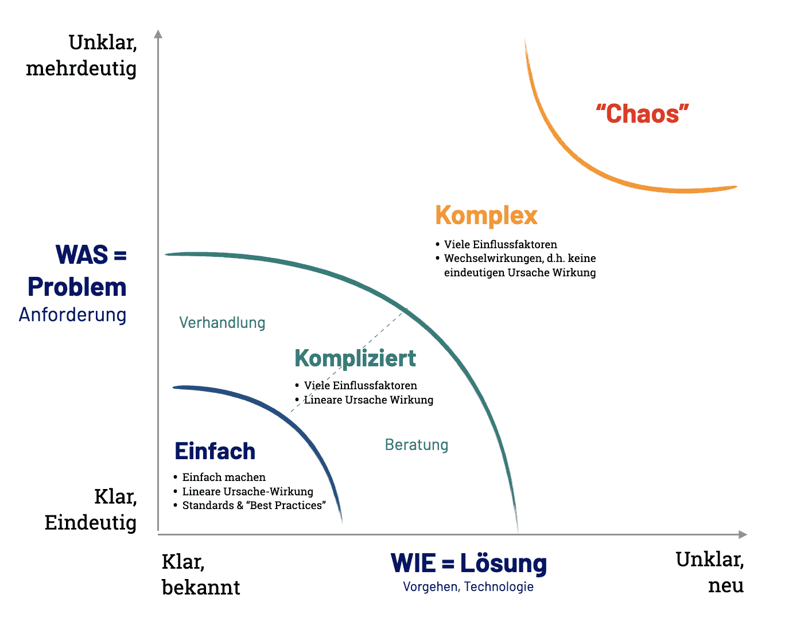
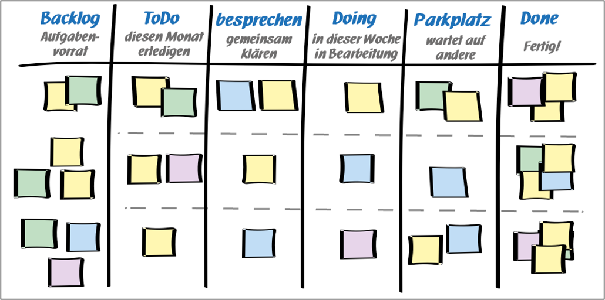

class: center, middle

## [Software Engineering](../../praesentationen.html)

#### Kapitel 11

# Softwaredevelopment Lifecycle

Danny Meihöfer - Bjarne Zaremba

---
# Inhalt
***

1. Was ist der Softwaredevelopment Lifecycle?
2. Klassische (sequentielle) Modelle
3. Agile Modelle
4. Evolutionäre Modelle
5. Vor- und Nachteile
6. Fragen?

---

class: center, middle

# Was ist der Softwaredevelopment Lifecycle?

Die Softwareentwicklung ist ein iterativer Prozess der aus mehreren Phasen besteht

Erstellung -> Wartung

---

## Phasen im Softwarelebenszyklus

Das Leben einer Software besteht aus mehreren Phasen

Dazu gehört neben den Entwicklungsphasen auch die Wartung 

---

class: center, middle

# Klassische (sequentielle) Modelle

Die Phasen werden sequentiell (linear) durchlaufen

vorhersehbarer Ablauf

Jede Phase hat spezifische Ziele auf denen die nächste Phase aufbaut

- Wasserfallmodell
- V-Modell

---

## Wasserfallmodell

Phasenablauf ist linear

Fest definierte Phasen

Phasen sind abgeschlossen

Wann sollte man dieses Modell nutzen?

---

## V-Modell

Ähnelt dem Wasserfallmodell

Jede Phase hat eine zugehörige Testphase

Das Modell beschreibt die Phasen und deren Verknüpfungen

Phasen werden in relation zur Detailtiefe und zum Zeitpunkt der Durchführung gesetzt

Wann ist dieses Modell besser als das Wasserfallmodell?

---

class: center, middle

# Agile Modelle

Agile Modelle sind iterativ

Das heißt:

- Phasen werden mehrmals durchlaufen
- Phasen werden nicht komplett abgeschlossen
- Phasen können sich überlappen

---

## PDCA-Zyklus

4 sich wiederholende Phasen

Entwickelt um 1930 von Walter A. Shewhart für die Qualitätsverbesserung

---

## OODA-Loop

Die OODA-Loop ähnelt dem PDCA-Zyklus

Agilität > "Rohe Kraft"

Entwickelt von John Boyd

Hier wird schnelle Entscheidungsfindung und schnelle Umsetzung angestrebt

- Schnell, flexibel und effektiv
- Auf Änderungen in der Umgebung reagieren

---

## OODA-Loop Vor- und Nachteile

Vorteile:

- Schnell und Agil
- Flexibel
- Entscheidungsfindung wird beschleunigt
- Berücksichtigung von Unsicherheit

Nachteile:

- Vereinfachung der Realität
- Risiko Dinge zu übersehen
- Nicht auf alles anwendbar
- Mangel an Details

Die OODA-Loop ist ein gutes Werkzeug um Entscheidungen zu treffen

---

## Stacey-Matrix

Die Stacey-Matrix ist ein Modell zur Einordnung von Problemen

Entwickelt von Ralph Douglas Stacey

Ein Problem wird in 4 Kategorien eingeteilt

- Das hängt davon ab wie klar das Problem ist und wie klar die Lösung ist
- Klares Problem = Klares Ziel
- Klare Lösung = Klares Vorgehen

---

## Stacey-Matrix Vor- und Nachteile

Vorteile von der Stacey-Matrix:

- Einfach zu verstehen
- Anpassungsfähig
- Kann mit anderen Modellen kombiniert werden

Nachteile von der Stacey-Matrix:

- Subjektiv
- Kann zu ungenauen Ergebnissen führen
- Mögliche Vereinfachung
- Begrenzte Aussagekraft

Die Stacey Matrix ist ein gutes Werkzeug um Probleme zu analysieren

- Sie kann immer genutzt werden 

---

## 4 Werte und 12 Prinzipien

Agiles Projektmanagement basiert auf 4 Werten und 12 Prinzipien

---

## Anti-Patterns

Anti-Patterns sind Muster die zu Problemen führen

- The Blob
- The Golden Hammer
- Continuous Obsolescence
- Lava Flow
- Ambiguous Viewpoint
- Functional Decomposition
- Poltergeists
- Boat Anchor
- Dead End
- Spaghetti Code
- Input Kludge
- Walking through a Minefield
- Cut-and-Paste Programming
- Mushroom Management

Im folgenden werden ein paar der Anti-Patterns genauer erläutert

---

## Anti-Patterns

**The Blob**

- Ein Objekt das alles macht
- Zu viele Verantwortlichkeiten
- Single Responsibility Principle verletzt

**Continuous Obsolescence**

- Verschiedene Versionen von Software
- Entwickler arbeiten an verschiedenen Versionen
- Keine einheitliche Version
- Man kommt nicht hinterher

**Spaghetti Code**

- Unübersichtlicher Code
- Keine Struktur
- Schlechter Code kann nicht weiterentwickelt werden

---

## XP

XP = Extreme Programming

Agiles Vorgehensmodell

- Das **Ziel:** Schnelle Entwicklungszyklen für schnelle und hochwertige Software

Es gibt bestimmte Vorgehensweisen die eingehalten werden müssen

- Dazu gehören auch Werte wie: Einfachheit, Kommunikation, Feedback, Mut

---

## XP - Vor- und Nachteile

Vorteile | Nachteile
--- | ---
Stable System | Unclear Estimates
Clear Code | Time waste
Fast MVP | Bad documentation
No overtime | Pair programming takes time
High visibility | Collocated teams only
Team collaboration | Stressful
Customer satisfaction | Code over design

Wann sollte man XP nutzen?

- Projekte mit sich häufig ändernden Anforderungen
- Anforderungen sind nicht klar definiert
- Schnelle Ergebnisse sind gefragt
- Kundenbeteiligung ist möglich
- Kleine bis mittlere Teams

---

## Scrum

Scrum beduetet etwas wie "Gedränge"

SDLC wird in Sprints unterteilt

- Sprints dauern 1-4 Wochen
- Jeder Sprint hat ein "kleines" Ziel
- Jeder Sprint wird mit einem Review abgeschlossen
- Nach einem Sprint ist das Teilprodukt funktionsfähig

Bestimmte Rollen müssen besetzt werden

- Product Owner, Scrum Master, Team, Stakeholder

Typische Vorgehensweisen:

- Daily Scrum, Sprint Planning, Sprint Review, Sprint Retrospective

---

## Scrum - Vor- und Nachteile

Vorteile | Nachteile
--- | ---
Flexibilität | Komplexität
Kundenorientierung | Erfordert viel Management
Transparenz | Begrenzte Vorhersehbarkeit
Kontinuierliche Verbesserung | Teile des Teams müssen ständig verfügbar sein
Risikomanagment | Nicht immer geeignet

Wann sollte man Scrum nutzen?

- Projekte mit sich häufig ändernden Anforderungen
- Wenn der Ablauf nicht fest bestimmt ist
- Komplexe Probleme lassen sich mit Scrum gut splitten
- Wenn einzelne Teams mehr oder weniger unabhängig arbeiten können

Scrum wurde zwar für kleine Teams entwickelt

- Es kann aber auch für große Teams genutzt werden

---

## Kanban

Kanban ist ein visuelles System zur Steuerung von Arbeit

Auf dem Kanban-Board werden die Aufgaben in Spalten eingeteilt

- To Do, In Progress, Done

Das Hilft bei der steuerung des Workflows

Kanban kann mit den meisten anderen Methoden kombiniert werden

---

class: center, middle

# Evolutionäre Modelle

Evolutionäre Modelle sind auch iterativ

- Sie sind aber nicht so stark strukturiert wie agile Modelle
- Oft werden Produkte in mehreren Versionen entwickelt

---

## Prototyping

Beim Prototyping werden Prototypen entwickelt

- Prototypen sind Modelle die bestimmte Eigenschaften des Endprodukts besitzen
- Prototypen können schnell entwickelt werden
- Prototypen können schnell angepasst werden

Prototypen sind kein Ersatz für das Endprodukt

Oft werden verschiedene Prototypen entwickelt

- Diese werden bewertet und dann je nach Ergebnis weiterentwickelt

---

## Prototyping

Vorteile:

- Frühzeitiges Feedback
- Besseres Verständnis der Anforderungen
- Schnelle identifizierung von Problemen
- Unterstützung bei Designentscheidungen

Nachteile:

- Zeit- und Kostenintensiv
- Risiko von Missverständnissen
- Veralterung des Prototypen
- Fehlerhafte Interpretation des Prototypen vom Kunden

Prototyping ist praktisch wenn Anforderungen nicht ganz klar sind

- Selbst der Kunde ist sich nicht sicher was er will
- Designfragen sind noch nicht geklärt

Prototyping fördert die Kommunikation zwischen Entwicklern und Kunden

---

class: center, middle

# Fragen?

---

# Lernfragen

1. Was ist der Softwaredevelopment Lifecycle?
2. Welche Phasen gibt es im Softwaredevelopment Lifecycle?
3. Was sind klassische (sequentielle) Modelle?
4. Was sind agile Modelle?
5. Was sind evolutionäre Modelle?
6. Was sind die Vor- und Nachteile von klassischen (sequentiellen) Modellen?
7. Was sind die Vor- und Nachteile von agilen Modellen?
8. Was ist Scrum?
9. Was ist Kanban?
10. Was ist das Wasserfallmodell?
11. Wie kann man Probleme mit der Stacey-Matrix analysieren?
12. Wie kann man mit der OODA-Loop Entscheidungen treffen?

---

# Quellen
***

- https://karrierebibel.de/wp-content/uploads/2018/06/PDCA-Zyklus-Demingkreis-Definition-Beispiele-Pflege-Vor-Nachteile-Tipps.jpeg

- https://www.peterjohann-consulting.de/v-modell/

- https://projekte-leicht-gemacht.de/blog/projektmanagement/klassisch/wasserfallmodell/

- https://www.wrike.com/de/blog/die-4-werte-und-12-prinzipien-des-agilen-projektmanagements/

- https://premieragile.com/life-cycle-of-extreme-programming/

- https://sourcemaking.com/antipatterns/software-development-antipatterns

- https://www.altexsoft.com/blog/extreme-programming-values-principles-and-practices/

---

# Quellen 2

- https://www.pm-partners.com.au/the-agile-journey-a-scrum-overview/

- https://der-prozessmanager.de/aktuell/wissensdatenbank/pdca-zyklus