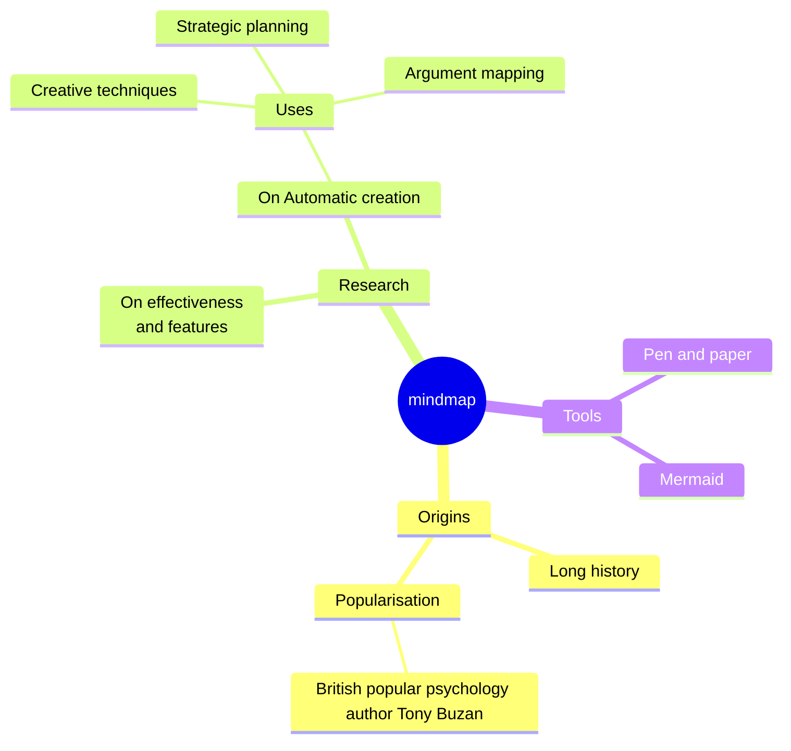
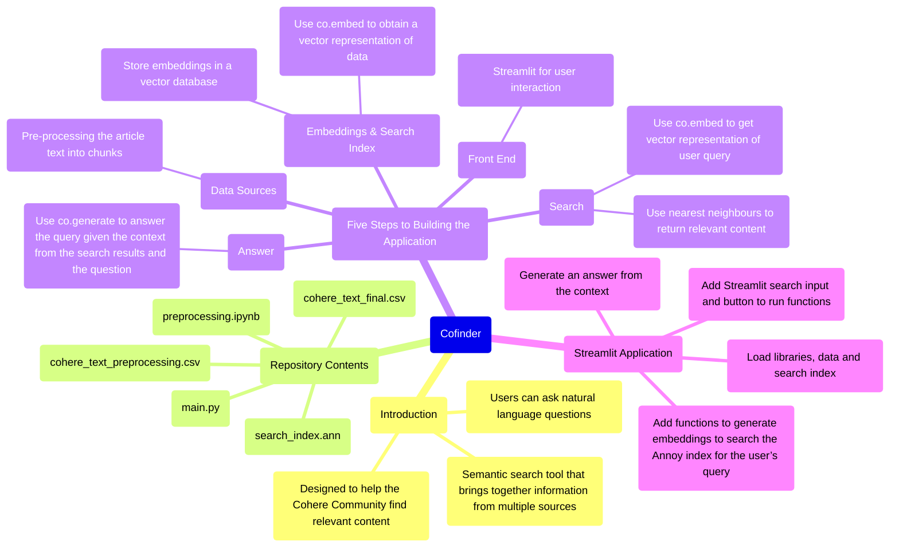
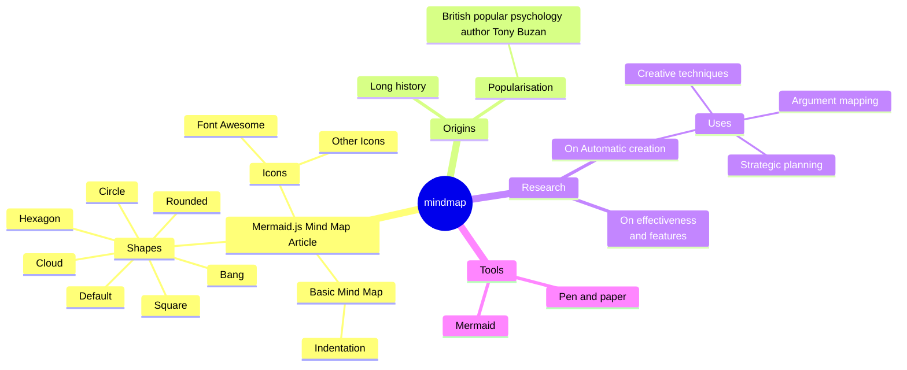

## Kapitelüberschrift

**Autor:** Max Mustermann

Folgende Mindmaps zeigen die Inhalte des Kapitels 2.

## Themengebiet

Mindmap:

```mermaid
mindmap
  root((mindmap))
    Origins
      Long history
      Popularisation
        British popular psychology author Tony Buzan
    Research
      On effectiveness<br/>and features
      On Automatic creation
        Uses
            Creative techniques
            Strategic planning
            Argument mapping
    Tools
      Pen and paper
      Mermaid
```

Mindmap:

```mermaid
mindmap
  root(Cofinder)  
    (Introduction)  
      (Designed to help the Cohere Community find relevant content)  
      (Users can ask natural language questions)  
      (Semantic search tool that brings together information from multiple sources)  
    (Repository Contents)  
      (cohere_text_preprocessing.csv)  
      (preprocessing.ipynb)  
      (main.py)  
      (cohere_text_final.csv)  
      (search_index.ann)  
    (Five Steps to Building the Application)  
      (Data Sources)  
        (Pre-processing the article text into chunks)  
      (Embeddings & Search Index)  
        (Use co.embed to obtain a vector representation of data)  
        (Store embeddings in a vector database)  
      (Front End)  
        (Streamlit for user interaction)  
      (Search)  
        (Use co.embed to get vector representation of user query)  
        (Use nearest neighbours to return relevant content)  
      (Answer)  
        (Use co.generate to answer the query given the context from the search results and the question)  
    (Streamlit Application)  
      (Load libraries, data and search index)  
      (Add functions to generate embeddings to search the Annoy index for the user’s query)  
      (Generate an answer from the context)  
      (Add Streamlit search input and button to run functions)
```

Mindmap:

```mermaid
mindmap
  root((mindmap))
      Mermaid.js Mind Map Article
        Basic Mind Map
            Indentation
        Shapes
            Default
            Square
            Rounded
            Circle
            Bang
            Cloud
            Hexagon            
        Icons
            Font Awesome
            Other Icons
    Origins
      Long history
      Popularisation
        British popular psychology author Tony Buzan
    Research
      On effectiveness<br/>and features
      On Automatic creation
        Uses
            Creative techniques
            Strategic planning
            Argument mapping
    Tools
      Pen and paper
      Mermaid
```

