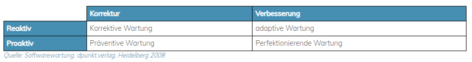
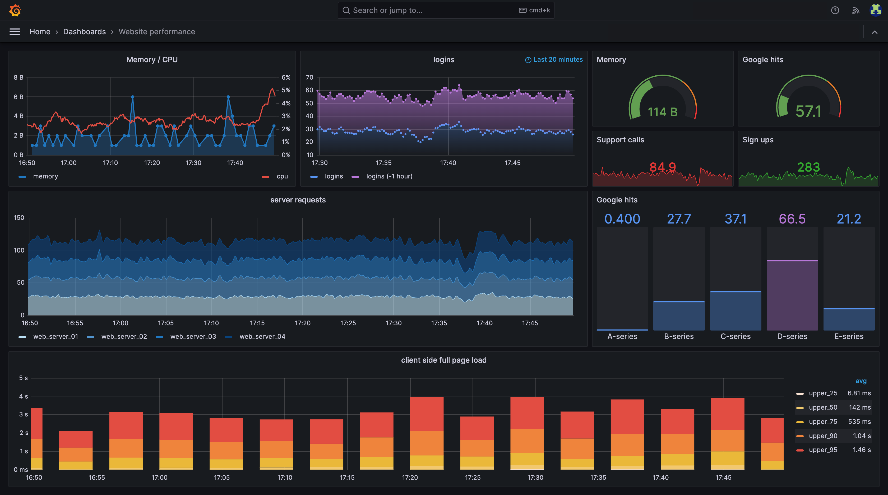
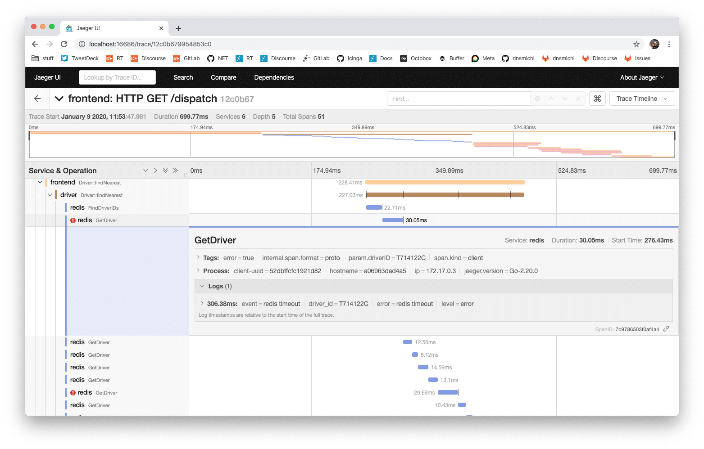

class: center, middle

## [Software Engineering](../../praesentationen.html)

#### Kapitel 12

# Softwarewartung

Bjarne Zaremba - Danny Meihöfer

---
# Inhalt
***

1. Definition von Softwarewartung
1. Evolution von Software
1. Sanierung von Software
1. Software-System-Management
1. Technische Schulden
1. Technical-Debt-Management

---

## Softwarewartung

**Definition:**

- Prozess der Pflege und Aktualisierung von Softwareanwendungen nach Bereitstellung dieser
- Leistungsfähigkeit, Sicherheit und Funktionalität der Software wird weiterhin sichergestellt
- Tätigkeiten: Fehler beheben, Software verbessern, neue Funktionen hinzufügen, …

---

**Legacy-Code:**

- veralteter Quellcode
- schwer verständlich
- Code, der nicht dem aktuellen Standard entspricht, dennoch wichtig für die Anwendung ist

**Merkmale von Legacy-Code:**

- Veraltete Technologien → auf alten Programmiersprachen, Frameworks oder Bibliotheken basierend
- Mangelnde Dokumentation → Keine ausführliche Dokumentation vorhanden
- Schwer verständlicher Code → Code ist oft sehr komplex (von aktuellen Entwicklern schwierig zu verstehen)
- Fehlende Testabdeckung → Tests sind nicht ausreichend implementiert → Sicherheitsrisiko

---
class: center, middle
## Evolution von Software

---

### Ursachen für Änderungen an der Software

- Fehlerbehebungen
- Änderungen der Anforderungen
- Technologische Weiterentwicklung
- Leistungsverbesserung
- Sicherheitsaktualisierungen
- Regulatorische Anforderungen
- Umgebungsänderungen
- Verbesserung der Benutzererfahrung (UX)

---

### Arten von Änderungen an Software

**4 Haupttypen von Softwarewartung:**

1. Korrektive Wartung
    - Behebung von Fehlern, die nach Bereitstellung der Software auftreten
    - Fehler schränken die Funktionalität der Software ein
2. Präventive Wartung
    - Behebung von Problemen (latenten Fehlern), die in der Zukunft ein Problem sein können → zum jeweiligen Zeitpunkt aber nicht
3. Perfektionierende Wartung
    - Verbesserung der Softwareleistung
    - Hinzufügen von kleinen neuen Funktionen
    - entfernen von alten, ineffektiven Funktionen
    - Performanceoptimierungen und Strukturverbesserungen (Refactoring, Reengineering)
4. Adaptive Wartung
    - Anpassung der Software an veränderte Umgebungen, andere Plattformen oder externe Schnittstellen

---



Abb.1: Arten der Softwarewartung

---

## Sanierung von Software

### Bad Code Smells

- Doppelter Code (Duplicated Code) → Wiederholung von Codeblöcken → führen zu Wartbarkeitsproblemen

```python
def calculate_area_of_square(side_length):
    return side_length * side_length

def calculate_area_of_rectangle(length, width):
    return length * width
```

- Lange Methoden (Long Method) → Methoden sind schwierig zu verstehen und zu testen

```python
def complex_calculation(x, y, z, a, b, c):
    # Lange Methode mit vielen Berechnungen
    result = x * y + z / a - b * c
    return result
```
---

- Große Klassen (Large Class) → Klassen, die zu viele Verantwortlichkeiten, Methoden und Eigenschaften haben

```python
class LargeClass:
    def method1(self):
        # ...

    def method2(self):
        # ...

    # ... (viele weitere Methoden)
```

- Unsinnige Namen (Meaningless Names) → Namen, die die Funktion der Methode nicht beschreiben

```python
def xyz(a, b):
    return a + b

result = xyz(3, 4)
```

- Unbenutzter Code (Dead Code)

```python
def unused_function():
    print("Dieser Code wird nie aufgerufen.")

# Rest des Programms ohne Verweis auf unused_function
```

---

### Anti-Patterns

- Big Ball of Mud → Unstrukturierter Code ohne klare Architektur, der schwer zu verstehen ist

```python
# Unstrukturierter Code ohne klare Architektur
# ...

if condition:
    # Unzusammenhängende Logik
    # ...

for item in collection:
    # Weitere Code-Segmente ohne klare Struktur
    # ...
```
---
- Spaghetti Code → Verwirrter und unlesbarer Code (viele Verzweigungen, fehlende Struktur)

```python
def spaghetti_code(x):
    if x > 0:
        print("Positive Zahl")
        if x % 2 == 0:
            print("Gerade Zahl")
        else:
            print("Ungerade Zahl")
    else:
        print("Negative oder Null")
```

- Golden Hammer → Übermäßiger Einsatz eines vermeintlich universellen Ansatzes für alle Probleme, unabhängig von der Passung

```python
def universal_solution():
    # Übermäßige Verwendung eines allgemeinen Ansatzes
    # für verschiedene Problemstellungen
    # ...

# Anstatt spezifische Lösungen zu implementieren
```
---
- Copy-Paste-Programming → Unkritische Wiederholung von Code ohne sorgfältige Abstraktion, was zu Redundanzen und Ineffizienzen führen kann

```python
def calculate_area_of_square(side_length):
    return side_length * side_length

def calculate_area_of_rectangle(length, width):
    return length * width

# Copy-Paste-Programmierung anstelle von Abstraktion
```

---
class: center, middle
## Software-System-Management

---

### Logging vs. Monitoring vs. Observability

**Logging:**

- Systematisches Auszeichnen von Ereignissen, Status und Fehlermeldungen zur Laufzeit eines Programms
- wird in Dateien oder Datenbanken gespeichert

```python
import logging

logging.basicConfig(filename='app.log', level=logging.INFO)
logging.info('Anwendung gestartet...')
```
---
**Monitoring:**

- Kontinuierliche Überwachung von Ressourcen, Leistung und Aktivitäten eines Systems in Echtzeit
- Probleme und Unregelmäßigkeiten können früh erkannt werden
- CPU, Speicher, Netzwerk

Beispiel (Prometheus in Kubernetes):

```yaml
apiVersion: monitoring.coreos.com/v1
kind: ServiceMonitor
metadata:
  name: example-app-monitor
  labels:
    release: monitoring
spec:
  selector:
    matchLabels:
      app: example-app
  endpoints:
  - port: web
    path: /metrics
```
---
**Observability:**

- geht über Logging und Monitoring hinaus
- Fähigkeit, den internen Zustand eines Systems basierend auf externen Beobachtungen zu verstehen
- ganzheitlicher Einblick
- Metriken, Protokolle, Traces

Beispiel (Jaeger Tracing in Microservices):

```yaml
services:
  - name: example-service
    ports:
      - 8080:8080
    environment:
      - JAEGER_AGENT_HOST=jaeger-agent
      - JAEGER_AGENT_PORT=6831
```

---

### Observability-Konzepte

**Metrics:**

- quantitative Messwerte, die Informationen über die Leistung eines Systems liefern
- häufig numerische Werte oder aggregierte Daten über einen bestimmten Zeitraum
- Beispiel: In einem Webanwendungs-Server können Metriken die Anzahl der HTTP-Anfragen pro Sekunde, die durchschnittliche Antwortzeit pro Anfrage und die Auslastung der CPU sein.
    
    → Entwickler können Effizient der Anwendung überwachen 
    
---
**Logs (Protokolle):**

- erfassen ereignisbasierte Informationen über Aktivitäten in einem System
- wichtige Ereignisse, Fehlerzustände und Warnungen sollen aufgezeichnet werden
- helfen bei der Fehlersuche und der Analyse von Problemen
- Beispiel: Ein Webserver kann Protokolle generieren, die jede empfangene HTTP-Anfrage, den zugehörigen Statuscode und eventuelle Fehlerinformationen aufzeichnen.
    
    → Entwickler können potenzielle Fehlerquellen identifizieren
    
---
**Traces (Spuren):**

- ermöglichen die Verfolgung der Ausführung eines Vorganges durch ein verteiltes System hinweg
- zeigen, wie Ressourcen zwischen verschiedenen Komponenten eines verteilten Systems genutzt werden
- häufig in Microservice-Architekturen eingesetzt
- Beispiel: In einer Microservices-Architektur kann eine Anfrage durch verschiedene Dienste hindurch verfolgt werden, wobei jeder Dienst seine eigenen Spuren hinterlässt.
    
    → Entwickler können Engpässe in der Verarbeitung der Anfrage identifizieren
    

---

### Werkzeuge

**Prometheus:**

- Open-Source-System für das Monitoring von IT-Systemen
- sammelt Metriken über ein Pull-Modell von Bibliotheken
- speichert Metriken in einer Zeitreihendatenbank

---

**Grafana:**

- Open-Source-Platform für das Monitoring und Visualisieren von Zeitreihendaten
- Erstellung von Dashboards, Diagrammen und Warnungen
- Integration mit Prometheus untertstützt



Abb.2: Beispiel eines Grafana-Dashboards

---

**Jaeger:**

- Open-Source-Werkzeug für das Tracing von Anwendungen in verteilten Systemen
- Verfolgung von Ausführungspfaden über mehrere Dienste hinweg
- Web-Benutzeroberfläche



Abb.3: Beispieldashboard Jaeger

---
class: center, middle
## Technische Schulden

---

### Definition

- “metaphorische Schulden” die entstehen, wenn kurzfristige Lösungen und Kompromisse eingeführt werden, um Zeit zu sparen
- es entstehen langfristige “Schulden” für langfristige Codequalität und Wartbarkeit
- Technische Schulden = Summe der Entscheidungen, die zu späteren Zeitpunkt verbessert oder korrigiert werden müssen
---
### Ursachen und Entstehung

- Zeitdruck → Entwickler stehen unter Zeitdruck und greifen auf schnellere Lösungen zurück
- Mangelnde Ressourcen → Zu wenig Personal oder Budget können zu Kompromissen führen
- Unklare Anforderungen → Unklare Anforderungen führen zu Entscheidungen, die später überarbeitet werden müssen
- Fehlende Planung→ Fehlende Architekturüberlegungen führen zu schnellen Entscheidungen
---
### Risiken und Folgen

- Verlangsamte Entwicklung → Entwickler müssen im Nachhinein mehr Zeit für Wartung und Überarbeitung des Codes aufwenden
- Erhöhte Fehleranfälligkeit → Unzureichend getesteter oder schlecht strukturierter Code birgt ein höheres Risiko von Fehlern und Softwarefehlern
- Schwierige Skalierbarkeit → Bei undurchsichtiger Codebasis ist ein Skalieren der Anwendung nur schwer möglich
- Schwierige Zusammenarbeit → Der Code kann für Entwickler schwer zu verstehen sein, was die Zusammenarbeit erschwert und die Einarbeitung neuer Teammitglieder erschwert

---

### Arten von technischen Schulden

**Architectural Debt:**

- veralteter oder unzureichende Architekturentscheidungen
- müssen im Nachgang korrigiert werden → Verschwendung von Ressourcen

**Documentation Debts:**

- fehlende, ungenaue oder veraltete Dokumentation
- beeinträchtigt die Wartbarkeit → Verschwendung von Ressourcen durch längeres Einlesen in den Code

**Implementation Debts:**

- Kompromisse bei der Implementierung
- z.B. nicht optimale Algorithmen

**Testing Debt:**

- Unzureichende Testabdeckung
- keine Regressionstest
- ineffektive Teststrategien

---
class: center, middle
## Technical-Debt-Management

---

### Umgang mit technischen Schulden

**Operativer Umgang:**

- Automatisierung → Wiederkehrende Aufgaben können Automatisiert werden (Vermeidung von Fehlern)
- Inkrementelle Verbesserungen → Verbesserung/Beseitigung sollte schrittweise geplant werden
- Priorisierung → Wichtigere Beseitigungen sollen schneller gemacht werden
- Refactoring → Refactoring verbessert den Code

**Konzeptioneller Umgang:**

- Entwicklungsrichtlinien → minimieren die Entstehung neuer technischer Schulden
- Schulungen → bewährte Praktiken fördern, Verständnis für hochqualitativen Code verbessern
- Code Reviews → mehrere Entwickler gewährleisten die Codequalität

---

### Erkennung von technischen Schulden

**Metriken:**

- Code Coverage → Anteil des Codes, der durch Tests abgedeckt wird
- Code Complexity → misst Komplexität des Codes mithilfe von zyklomatischer Metriken
- Bugs und Fehlermeldungen → Anzahl der gemeldeten Fehler und deren Schweregrad
- Duplicated Code → Anteil des duplizierten Codes

**Werkzeuge:**

SonarQube:

- Code-Analysewerkzeug, dass eine Vielzahl von Metriken und Statistiken über Code liefert
- identifiziert Code-Smells, Duplikate, Code Coverage, Bugs und Security Issues

---
class: center, middle

# Fragen?

---

# Lernfragen


1. Was versteht man unter Softwarewartung und welche Ziele werden damit verfolgt?
1. Welche Merkmale kennzeichnen Legacy-Code, und warum ist er für Entwickler eine Herausforderung?
1. Welche Arten von Änderungen an Software gibt es, und wie unterscheiden sie sich?
1. Was sind die Bad Code Smells, und warum sind sie für die Wartbarkeit von Software problematisch?
1. Erkläre die Begriffe Logging, Monitoring und Observability im Kontext des Software-System-Managements.
1. Welche Konzepte gehören zur Observability, und warum gehen sie über Logging und Monitoring hinaus?
1. Nenne einige Werkzeuge im Bereich des Software-System-Managements und beschreibe ihre Funktionen.
1. Was ist Technische Schulden, und welche Risiken und Folgen können durch sie entstehen?
1. Welche Arten von technischen Schulden gibt es, und wie beeinflussen sie die Codequalität?
1. Wie kann man technische Schulden erkennen, und welche Werkzeuge stehen dafür zur Verfügung?

---
# Quellen
***

- [https://softwarewartung.net/definition.html](https://softwarewartung.net/definition.html) [letzte Einsicht: 14.12.23]
- [https://t2informatik.de/wissen-kompakt/legacy-code](https://t2informatik.de/wissen-kompakt/legacy-code) [letzte Einsicht: 14.12.23]
- [https://blog.codacy.com/code-smells-and-anti-patterns](https://blog.codacy.com/code-smells-and-anti-patterns) [letzte Einsicht: 14.12.23]
- [https://swc-public.pages.rwth-aachen.de/smells/code-smells/](https://swc-public.pages.rwth-aachen.de/smells/code-smells/) [letzte Einsicht: 14.12.23]
- Codebeispiele wurden mit ChatGPT-3.5 erstellt: [https://chat.openai.com/](https://chat.openai.com/) [letzte Einsicht: 14.12.23]
- [https://rvprasad.medium.com/logging-monitoring-and-observability-219c043b5c81](https://rvprasad.medium.com/logging-monitoring-and-observability-219c043b5c81) [letzte Einsicht: 14.12.23]
- [https://thenewstack.io/observability-working-with-metrics-logs-and-traces/](https://thenewstack.io/observability-working-with-metrics-logs-and-traces/) [letzte Einsicht: 14.12.23]
- [https://prometheus.io/](https://prometheus.io/) [letzte Einsicht: 14.12.23]
- [https://de.wikipedia.org/wiki/Prometheus_(Software)](https://de.wikipedia.org/wiki/Prometheus_(Software)) [letzte Einsicht: 14.12.23]
- [https://grafana.com/](https://grafana.com/) [letzte Einsicht: 14.12.23]
- [https://www.redhat.com/de/topics/data-services/what-is-grafana](https://www.redhat.com/de/topics/data-services/what-is-grafana) [letzte Einsicht: 14.12.23]
- [https://www.jaegertracing.io/](https://www.jaegertracing.io/) [letzte Einsicht: 14.12.23]

---
# Quellen
***
- [https://aws.amazon.com/de/what-is/jaeger/](https://aws.amazon.com/de/what-is/jaeger/) [letzte Einsicht: 14.12.23]
- [https://t2informatik.de/wissen-kompakt/technische-schulden/](https://t2informatik.de/wissen-kompakt/technische-schulden/) [letzte Einsicht: 15.12.23]
- [https://www.computerwoche.de/a/was-sind-technische-schulden,3551965](https://www.computerwoche.de/a/was-sind-technische-schulden,3551965) [letzte Einsicht: 15.12.23]
- [https://brainhub.eu/library/how-to-deal-with-technical-debt](https://brainhub.eu/library/how-to-deal-with-technical-debt) [letzte Einsicht: 15.12.23]
- [https://www.cio.com/article/472768/5-tips-for-tackling-technical-debt.html](https://www.cio.com/article/472768/5-tips-for-tackling-technical-debt.html) [letzte Einsicht: 15.12.23]
- [https://mindnow.io/de/blog/technische-schulden](https://mindnow.io/de/blog/technische-schulden) [letzte Einsicht: 15.12.23]
- [https://entwickler.de/programmierung/der-umgang-mit-technischen-schulden](https://entwickler.de/programmierung/der-umgang-mit-technischen-schulden) [letzte Einsicht: 15.12.23]
- [https://www.sonarsource.com/products/sonarqube/](https://www.sonarsource.com/products/sonarqube/) [letzte Einsicht: 15.12.23]
- [https://de.wikipedia.org/wiki/SonarQube](https://de.wikipedia.org/wiki/SonarQube) [letzte Einsicht: 15.12.23]

---

# Abbildungen
***

Abb.1: [https://softwarewartung.net/definition.html](https://softwarewartung.net/definition.html) [letzte Einsicht: 14.12.23]

Abb.2: [https://grafana.com/oss/grafana/](https://grafana.com/oss/grafana/) [letzte Einsicht: 14.12.23]

Abb.3: [https://www.netways.de/blog/2020/01/09/from-monitoring-to-observability-distributed-tracing-with-jaeger/](https://www.netways.de/blog/2020/01/09/from-monitoring-to-observability-distributed-tracing-with-jaeger/) [letzte Einsicht: 14.12.23]
